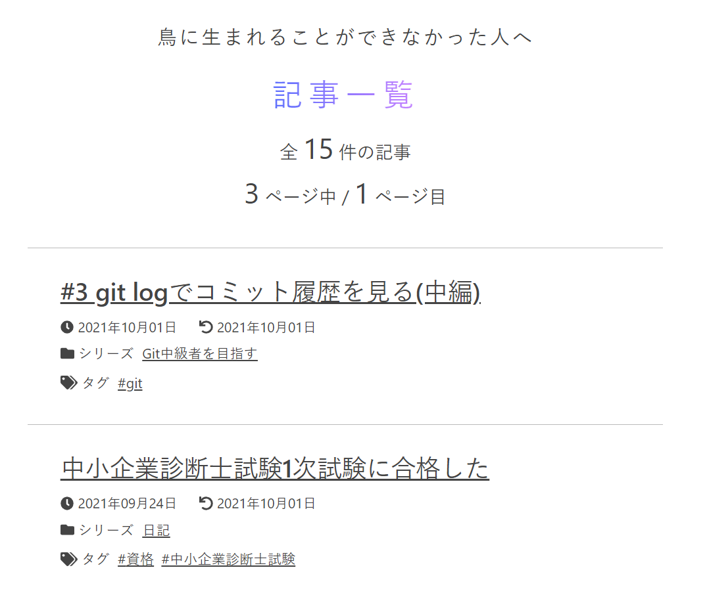

<!-- AUTO-GENERATED-CONTENT:START (STARTER) -->
<p align="center">
  <a href="https://www.gatsbyjs.com">
    
  </a>
</p>
<h1 align="center">
  Gatsbyでブログを作成しました
</h1>

<p align="center">
  <a href="https://blog/toriwatari.work/page/1/">
    
  </a>
</p>

## 🌐 WebSite

 [Webサイト](https://blog.toriwatari.work/page/1/)

## ⚙️ 構成要素

- 🐬 Gatsby v3
- 🐋 Markdown file
- 🐠 TypeScript
- 🦐 SCSS
- 🐟 CSS Modules
- 🐡 Headless UI
- 🦞 AWS Amplify

# 🚀 Start creating your own blog

This repository is for my blog, but it can also be a template for your original blog!

Blog Articles will be prepared as markdown files. Gatsby will generate static files based on them.

## ⚙️ Recommended environment

- Node.js v14.0.0~
- yarn 1.22.0~

## 💪 Clone this project

At first, clone this repository locally.

```bash
$ git clone https://github.com/kento-yoshidu/GatsbyBlog.git <your directory name>
```

## Start development server

Go to the created directory and start the development server.

```bash
$ npx gatsby develop
```

The above command should bring up the server. Access `localhost:8000`.


Clone this 

```shell
$ npx 
