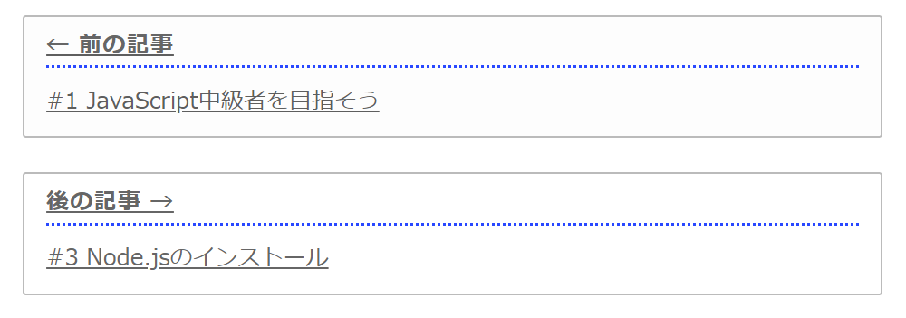
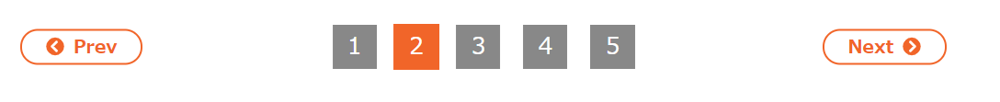
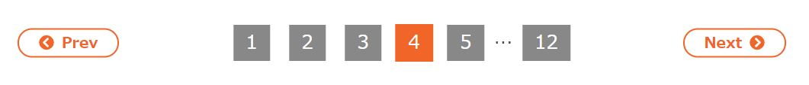
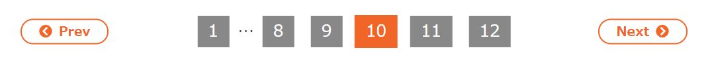

# Gatsbyでブログを作り直しました

情報をアウトプットできる場所が欲しいなと前から思っており、Qiitaやはてなブログの利用も考えていましたが、「もっと気楽にやりたい」「自分メモ的なものも置きたい」「スタイルは自分で自由に変えたい」などと言い訳ばかりして全然進んでいませんでした。

しかし情報を仕入れているうちに、[Gatsby](https://www.gatsbyjs.com/)という静的サイトジェネレーターを知り、「これは面白そうだ（楽できそうだ（面倒くさくなさそうだ））」と思い一念発起、重い腰をあげることにしました。静的サイトジェネレーターには数多くの選択肢がありましたが、「JavaScriptで書けるものがいい」「新しい技術の習得も兼ねたい」ということで、結局Gatsbyを採用しました。

他にも色々な静的サイトジェネレーターを使ってWebサイトを作ってますので、それに関しての記事は[こちら](https://blog.toriwatari.work/Jamstack/01/)をご覧ください。

実は以前にもGatsbyでブログを作成していましたが、新しいバージョンであるGatsby Version3がリリースされたこと（そうこうしているうちに、Version4が出ましたが😰）、TypeScript対応が出来ていなかったことなどがあり、一から作り直すことにしました。

このページでは、当ブログの機能やこだわりポイントを書きなぐっています。「Gatsbyってどんなことができるの❓」「使ってみたいけど何か難しそう😞」など、Gatsbyでのブログ作成を考えている方の参考になれば幸いです。

<aside>

ネットを見てると「Gatsby」「Gtasby.js」「GatsbyJS」とか色々な言い方がされてますが、どれが正しいんでしょうか。[公式サイト](https://www.gatsbyjs.com/)を見る限りシンプルに「Gatsby」と表記されてますので、このブログでもそれに従うことにしています。

</aside>

## Point1 マークダウンでの記事作成

記事は全てマークダウンファイルで用意しています。

当初はヘッドレスCMSであるmicroCMSやContentfulを導入し記事コンテンツを管理していましたが、マークダウンの方が気軽に記事を書けるので切り替えました。

なにより、ローカルで好きな時にさくっと作業できるというのがいいですね。会社で仕事中にも記事書けますし。

### プラグインを使用してより充実した記事に

マークダウン用にたくさんのGatsbyプラグインが用意されています。

技術ブログでは必須のコードブロックとシンタックスハイライトですが、`gatsby-remark-prismjs`というプラグインを使用し、簡単に実現できます。行番号の表示や特定行のハイライト、ファイル名の表示も当然可能です。

```typescript{2}:title=script.ts
// 関数を定義
function func(id: number): void {
  console.log(id)
}

func(1)
```

## Point2 コンテンツの取得はGraphQLで

こだわりポイントというかGatsbyがそういう造りになっているのですが、Gatsbyでは**GraphQL**というクエリー言語を使用してコンテンツを取得し、サイトを構築（ビルド）します。

例えばこのページのヘッダに、サイト名である「鳥に生まれることができなかった人へ」という文字を表示させていますが、これはmarkdownやJSXファイルに「鳥に生まれる～」とべた書きしているのではなく、`gatsby-config.js`というファイルに以下のような形でサイト名を記述し、ビルド時にGraphQLがこれを取得、表示させてくれています。

```javascript{3}:title=gatsby-config.js
module.exports = {
  siteMetadata: {
    title: `鳥に生まれることができなかった人へ`,
    siteUrl: `https://blog.toriwatari.work/`,
    author: {
      name: `Kento Yoshizu`,
    },
    description: `IT技術ブログとその他趣味`,

    ...
```

以下が`gatsby-config.js`で定義したサイト名を取得するgraphqlクエリーです。サイト名が`site`に格納されます。

```javascript:title=header.js
const { site } = useStaticQuery(
  graphql`
    query {
      site {
        siteMetadata {
          title
        }
      }
    }
  `
)
```

これを以下のような感じで`site`から取り出します。

```jsx:title=header.js
<header>
  <h1>
    {site.siteMetadata.title}
  </h1>
</header>
```

Gatsbyを選んだそもそもの理由が「クエリー言語にGraphQLを採用しているから」というのもありましたし、結果的にいい勉強になったと思っています。

## Point3 TypeScriptで書ける

GatsbyはReactベースですので、TypeScriptとの相性がとてもいいです。このブログもまだ完ぺきではありませんが、ほとんどをTypeScript化しています。

## Point4 シリーズ機能とタグ機能

それぞれの記事にシリーズとタグを付与し、必要に応じて収集し利用しています。

たとえば、[こちら](/series/)にアクセスすると、シリーズ一覧と各シリーズの記事件数が表示されます。

これももちろん、僕が一つ一つ手で書いてるのではなく、GraphQLを使用しコンテンツを取得、Gatsbyが自動でページを生成してます。

マークダウンファイルの先頭に以下のようにyaml風味な形式（frontmatterと呼ばれています）で、記事が属するシリーズやタグを記述します。

```markdown:title=例：このページのfrontmatter
---
title: "Gatsbyでブログを始めました"
postdate: "2021-07-24"
updatedate: "2021-11-19"
seriesName: "日記"
seriesSlug: "Diary"
description: "静的サイトジェネレータのGatsbyを使用してブログを立ち上げました。"
tags: ["日記", "Gatsby"]
---
```

`gatsby-node.ts`を使用し、ビルド時に「GraphQLでマークダウンファイルの情報（frontmatter）を取得、それらを同じシリーズの記事ごとに集約、それらをリスト化したページを作成」、というようなことをやってくれています。

また、[こちら](/series/HelloWeb/page/1/)のページでは「初めてのHTML & CSS」というシリーズの記事一覧をリストアップしています。

これもGraphQLを使用し、「同じシリーズの記事一覧を取得、記事数だけループで表示させる」ということをやっています。

## Point5 「前後の記事へ」機能

記事の下の方までいくと前後の記事へのリンクがあります。

これはGraphQLで「同じシリーズの記事を投稿日付順に取得、このページの記事の前後のリンクを作成する」ということをやっています。



## Point6 ページネーション機能

1ページに何十件も何百件も記事がリストアップされると困りますよね。当ブログでは1ページ当たり6件の記事を表示させる、と決めてページネーション機能を付与しました。



GraphQLで「全ての記事の個数をカウント、6で割ってその数だけページを生成」します。後はページの数だけリンクを表示させてあげたり、前後のページへ移動するprev、nextボタンを設置します。

例えば、１～４ページにいるときは、6ページ移行を省略して最後のページのリンクを表示。



逆に後ろの方のページにいる時は、最初のページと最後から５ページ分のリンクを表示。



そのどちらでもない、真ん中あたりにいる時は最初と最後のページと、現在のページの周辺のリンクを表示します。


## Point7 PWA対応

PWAに対応しています。

「対応」といってもGatsbyのプラグインをいくつかインストールし、configファイルにPWAの設定を記述するだけです。あまりにもあっさりできるため、ちょっと物足りない感はありますが。

## Point8 デプロイはAWS Amplifyで

当初はNetlifyというホスティングサービスを利用しサイトを公開していましたが、せっかくなのでAWS Amplifyに移行しました。

## Point9 キーワード検索システム

2022年1月に、サイト内検索システムを実装しました。右上の虫眼鏡マークのアイコンをクリックし、テキストボックスに任意の文字列を入力することでキーワードによる記事の検索を行えます。

機能実装のために各マークダウンのfrontmatterに`keywords`という項目を追加しました。それらをJSONファイルに書き出し検索を行います。詳しくは[こちら](/Diary/04/)の記事をご覧ください。

## Point10 ダークモード

2022年3月、いわゆるダークモードに対応させました。右上の太陽／月のアイコンをクリックすると、light／darkが切り替わります。

この機能の実装には`gatsby-plugin-dark-mode`を利用しました。以下のように`ThemeToggler`コンポーネントをインポートして利用します。`toggleTheme`を実行することでbody要素に`light`クラスか`dark`クラスを付与します。

```tsx:title=toggle.tsx
import { ThemeToggler } from 'gatsby-plugin-dark-mode'

export const ToggleButton = () => (
  <ThemeToggler>
    {({ theme, toggleTheme }) => {

      // darkモードがどうかを保持
      const isDark = theme === 'dark'

      const icon = isDark ? (
        <FontAwesomeIcon icon={faMoon} />
      ) : (
        <FontAwesomeIcon icon={faSun} />
      )

      return (
        <div
          // モードを反転させる
          onClick={() => toggleTheme(isDark ? 'light' : 'dark')}
        >
          { icon }
        </div>

      )
    }}
  </ThemeToggler>
)
```

CSS側ではCSS カスタムコンポーンネント（いわゆるCSS変数というやつ）を利用し、body要素に`dark`クラスが付与されている時、いない時のスタイルを切り替えます。

```css
body {
  --bg-color: #fff;
  --text-color: #444;

  background-color: var(--bg-color);
  color: var(--text-color);
}

body.dark {
  --bg-color: #15141a;
  --text-color: #fbfbfe;
}
```

## これから

まだまだGatsbyを使いこなすという域には達せていませんが、個人的にはまぁまぁ満足いく仕上がりになっているので、このブログをいじり倒すのはこれくらいにしようかと思っています（完璧を追い求めるといつまで経っても終わりませんし）。

このブログには問い合わせフォームがないので、AWS lambda＋AWS SES辺りで実装しようかと思っています。優先度は低いですが。
