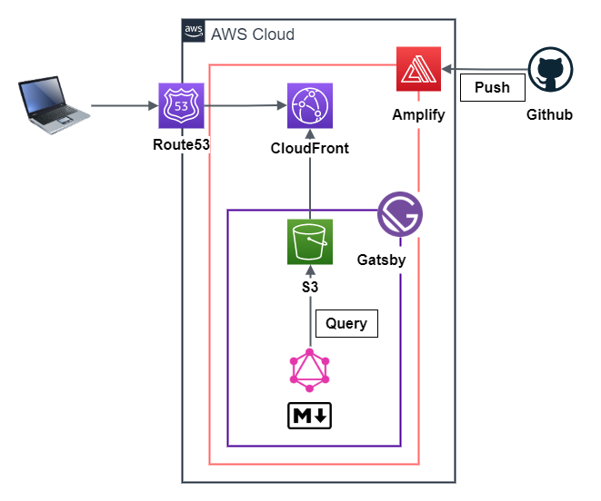

# Gatsbyでブログを始めました

情報をアウトプットできる場所が欲しいなと前から思っており、Qiitaやはてなブログの利用も考えていましたが、「もっと気楽にやりたい」「自分メモ的なものも置きたい」「スタイルは自分で自由に変えたい」などと言い訳ばかりして全然進んでいませんでした。

しかし情報を仕入れているうちに、[Gatsby](https://www.gatsbyjs.com/)という静的サイトジェネレータを知り、「これは面白そうだ（楽できそうだ（面倒くさくなさそうだ））」と思い一念発起、重い腰をあげることにしました。静的サイトジェネレータには数多くの選択肢がありましたが、「JavaScriptでかけるものがいい」「新しい技術の習得も兼ねたい」ということで、結局Gatsbyを採用しました。

他にも色々な静的サイトジェネレータを使ってWebサイトを作ってますので、それに関しての記事は[こちら](https://blog.toriwatari.work/Jamstack/01/)をご覧ください。

このページでは、当ブログの機能やこだわりポイントを書きなぐっています。「Gatsbyってどんなことができるの❓」「使ってみたいけど何か難しそう…:confused:」など、Gatsbyでのブログ作成を考えている方の参考になれば幸いです。

## Point1 マークダウンでの記事作成

記事は全てマークダウンファイルで用意しています。

当初はヘッドレスCMSであるmicroCMSやContentfulを導入し記事コンテンツを管理していましたが、マークダウンの方が気軽に記事を書けるので切り替えました。

なにより、ローカルで好きな時にさくっと作業できるというのがいいですね。会社で仕事中にも記事書けますし。

### プラグインを使用してより充実した記事に

マークダウン用にたくさんのGatsbyプラグインが用意されています。

技術ブログでは必須のコードブロックとシンタックスハイライトですが、`gatsby-remark-prismjs`というプラグインを使用し、簡単に実現できます。行番号の表示や特定行のハイライト、ファイル名の表示も当然可能です。

```typescript{2}:title=script.ts
// 関数を定義
function func(id: number): void {
  console.log(id)
}

func(1)
```

また、`gatsby-remark-emoji`プラグインを使用すれば絵文字を使用できます:stuck_out_tongue_closed_eyes:。

## Point2 コンテンツの取得はGraphQLで

こだわりポイントというかGatsbyがそういう造りになっているのですが、Gatsbyでは**GraphQL**というクエリ言語を使用してコンテンツを取得、サイトを構築（ビルド）します。

例えばこのページのヘッダに、サイト名である「鳥に生まれることができなかった人へ」という文字を表示させていますが、これはmarkdownやJSXファイルに「鳥に生まれる～」とべた書きしているのではなく、`gatsby-config.js`というファイルに以下のような形でサイト名を記述し、ビルド時にGraphQLがこれを取得、表示させてくれています。

```javascript{3}:title=gatsby-config.js
module.exports = {
  siteMetadata: {
    title: `鳥に生まれることができなかった人へ`,
    siteUrl: `https://blog.toriwatari.work/`,
    author: {
      name: `Kento Yoshizu`,
    },
    description: `IT技術ブログとその他趣味`,

    ...
```

以下が`gatsby-config.js`で定義したサイト名を取得するgraphqlクエリです。サイト名が変数siteに格納されます。

```javascript:title=header.js
const { site } = useStaticQuery(
  graphql`
    query {
      site {
        siteMetadata {
          title
        }
      }
    }
  `
)
```

これを以下のような感じで`site`から取り出します。

```jsx:title=header.js
<header>
  <h1>
    {site.siteMetadata.title}
  </h1>
</header>
```

Gatsbyを選んだそもそもの理由が「クエリ言語にGraphQLを採用しているから」というのもありましたし、結果的にいい勉強になったと思っています。

## Point3 シリーズ機能とタグ機能

それぞれの記事にシリーズとタグを付与し、必要に応じて収集し利用しています。

たとえば、[こちら](https://blog.toriwatari.work/series/)にアクセスすると、当ブログのシリーズ一覧と各シリーズの記事件数が表示されます。

これももちろん、僕が一つ一つ手で書いてるのではなく、GraphQLを使用しコンテンツを取得、Gatsbyが自動でページを生成してます。

マークダウンファイルの先頭に以下のようにyaml風味な形式（frontmatterと呼ばれています）で、記事が属するシリーズやタグを記述します。

```markdown:title=例：このページのfrontmatter
---
title: "Gatsbyでブログを始めました"
postdate: "2021-03-04"
updatedate: "2021-07-02"
seriesName: "日記"
seriesSlug: "Diary"
description: "静的サイトジェネレータのGatsbyを使用してブログを立ち上げました。"
tags: ["日記", "Gatsby", "SSG"]
---
```

`gatsby-node.js`を使用し、ビルド時に「GraphQLでマークダウンファイルの情報（frontmatter）を取得、それらを同じシリーズの記事ごとに集約、それらをリスト化したページを作成」、というようなことをやってくれています。

また、[こちら](https://blog.toriwatari.work/series/JavaScriptAdvance/page/1/)のページでは「JavaScript中級者を目指す」というシリーズの記事一覧をリストアップしています。

これもGraphQLを使用し、「同じシリーズの記事一覧を取得、記事数だけループで表示させる」ということをやっています。

## Point4 「前後の記事へ」機能

記事の下の方までいくと前後の記事へのリンクがあります。

これはGraphQLで「同じシリーズの記事を投稿日付順に取得、このページの記事の前後のリンクを作成する」ということをやっています。


## Point5 ページネーション機能

1ページに何十件も何百件も記事がリストアップされると困りますよね。当ブログでは1ページ当たり6件の記事を表示させる、と決めてページネーション機能を付与しました。


GraphQLで「全ての記事の個数をカウント、6で割ってその数だけページを生成」します。後はページの数だけリンクを表示させてあげたり、前後のページへ移動するprev、nextボタンを設置します。

例えば、１～４ページにいるときは、6ページ移行を省略して最後のページのリンクを表示。


逆に後ろの方のページにいる時は、最初のページと最後から５ページ分のリンクを表示。


そのどちらでもない、真ん中あたりにいる時は最初と最後のページと、現在のページの周辺のリンクを表示します。


## Point6 PWA対応

PWAに対応しています。

「対応」といってもGatsbyのプラグインをいくつかインストールし、configファイルにPWAの設定を記述するだけです。あまりにもあっさりできるため、ちょっと物足りない感はありますが。

## Point7 デプロイはAWS Amplifyで

当初はNetlifyというホスティングサービスを利用しサイトを公開していましたが、せっかくなのでAWS Amplifyに移行しました。

特に難しいことはしていませんが、以下が構成図です。




## 余談

ネットを見てると「Gatsby」「Gtasby.js」「GatsbyJS」とか色々ないい方されてますが、どれが正しいんでしょうか。[公式サイト](https://www.gatsbyjs.com/)を見る限りシンプルに「Gatsby」と表記されてますので、このブログでもそれに従うことにしています。

## これから

- TypeScript対応
- Gatsby3へのバージョンアップ
- CircleCIでのテスト

しかし、1から作り直した方がいいような、、、


