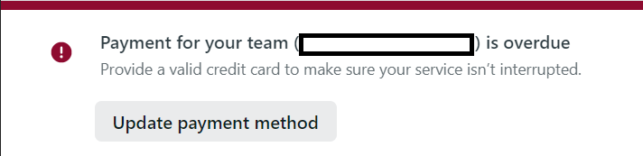
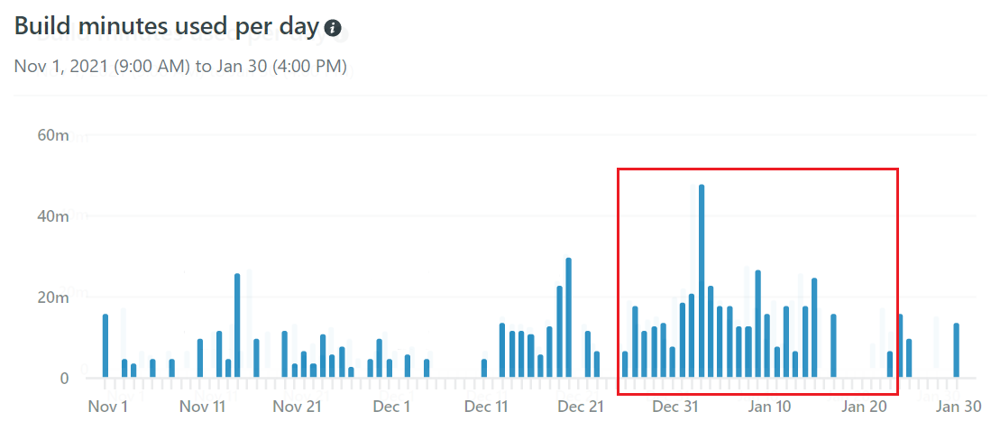

# Netlifyから請求が来ていた

当ブログはホスティングサービスである[Netlify](https://www.netlify.com/)を利用しています。

デプロイは[AWS Amplify](https://aws.amazon.com/jp/amplify/)で行っているんですが、Netlifyと連携することでmainブランチにプルリクエストした時に自動でbuildが走りデプロイが上手くいくかを確認できるので、ある種テストの代わりに使用しています。

<aside>

Circle CIとかとの連携が面倒でNetlifyを使用させてもらってます。なんというか、贅沢？な使い方です。

</aside>

そんな使い方をしているので入っているプランはStarterプランです。各プランは[こちら](https://www.netlify.com/pricing/)から確認できます。

無料で使える代わりにビルド時間は1月に300分までなど制限が敷かれています。

このブログは更新頻度が少ないので、ずっとビルド時間は100～150分ほどでした。まさか300分を超えることはないだろうと考えていたのが間違っていた、そして$7の請求が来たというのが今回の話です。

## Netlifyから通知が来る

ある日、久しぶりにNetlifyにログインしてみました。最近はビルドがこけた時くらいしか訪問していなかったので久しぶりだったわけです。すると、コンソール画面の上部にこんなメッセージが表示されていました。

そして、『Update payment method』をクリックするとクレジットカードの登録画面に遷移しました。

慌ててNetlifyからのメールを確認すると（メールも普段真剣に見ていない😅）、以下のような内容のメールが届いていました。

> The billing cycle for your subscriptions has ended. Your sites will be suspended after 25 days. To process your payment and keep your sites up and running, please provide a valid credit card for <筆者のアカウント名> team immediately.  ビルド時間を超過しました。このままでは25日にあなたのサイトは停止します。サイトを稼働させ続けるために、クレジットカード情報を登録してください。

さらにさかのぼってメールを確認すると、以下のような内容のメールも届いていました。

> Based on your usage so far this month, we’ve billed you for an additional Build Minutes usage package on account <筆者のアカウント名> team. This means you can now:  Use an additional 500 build minutes in this billing cycle  これまでの使用量に基づいて、追加のビルド時間の料金を請求しました。この請求で追加のビルド時間500分が利用できます。

といった内容です。

さらにメールをさかのぼると、ビルド時間が300分の90%に達した段階でこんなメールが届いていました。

> Your build minutes usage on your team (<筆者のアカウント名>) has reached 90% of the current allowance in your billing cycle from December 24 to January 24.  If build minutes usage goes over the allowance before the end of the billing cycle, we’ll add an extra build minutes pack for $7, increasing your allowance by 500 minutes for the current billing cycle. You can also increase your total build minutes allowance by upgrading your team to a higher plan.  12月24日から1月24日までの請求サイクルで現在の許容量の90％に達しました。  ビルド時間が請求サイクルの終了前に許容量を超えた場合、7ドルのビルド分パックが追加され、現在の請求サイクルの許容量が500分増加します。

といった内容です。300分のビルド時間を超えると自動でビルド時間500分が追加され、$7が請求されるようです。

## ビルド時間を確認する

まずはNetlifyでビルド時間を確認してみます。過去のビルド時間を正確に知る方法が分からなかったんですが、以下のように直近のビルド時間が乗っているグラフがあったので、これを見ながら手で計算してみました。赤枠で囲っているところが今回請求の対象になっていた期間ですね。

結果は**412分**ということで見事に上限時間をオーバーしていました。

心配だったのは下手にサイトを改変して、1回あたりのビルド時間が伸びていないかということでしたが、時間は2~3分とこれまでとほとんど変わっていなかったので、プルリクエストやサイトデプロイの回数が多かったのだろうと結論付けました。

そういえば年末年始は暇だったのでサイトの機能追加やリファクタリングを小まめに行っていました。きっとその所為です。

## これからどうする？

取り急ぎクレジットカードの登録を済ませました。そうすると数分後に支払い完了のメールが来たので一安心です。

<aside>

このまま無視し続けたらどうなるんだろう？利用停止になるだけ？

</aside>

$7払えば500分多く使えるというのはお得な気がするんですが、金額的に勿体ないというのが率直な気持ちです。

このブログのようにテスト代わりに使うのはやめるにしても、他のいくつかのサイトも運用しているのでできれば継続利用したいところです。ビルド時間を短くするにはいくつか方法があると思うので、後日記事にしたいと思います。

## 参考

[Netlifyに7ドル支払った話（GitHub ActionsでNetlifyにデプロイする](https://blog.70-10.net/2020/05/31/github-actions-deploy-netlify/)