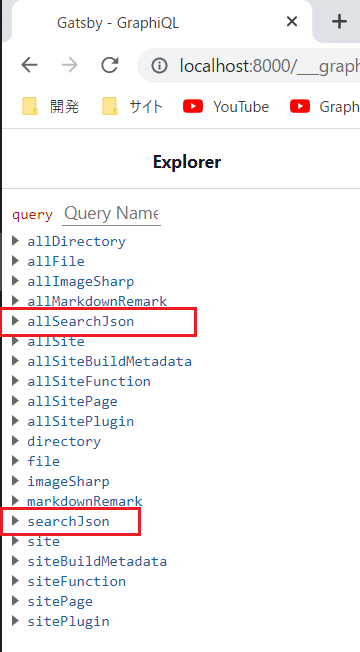
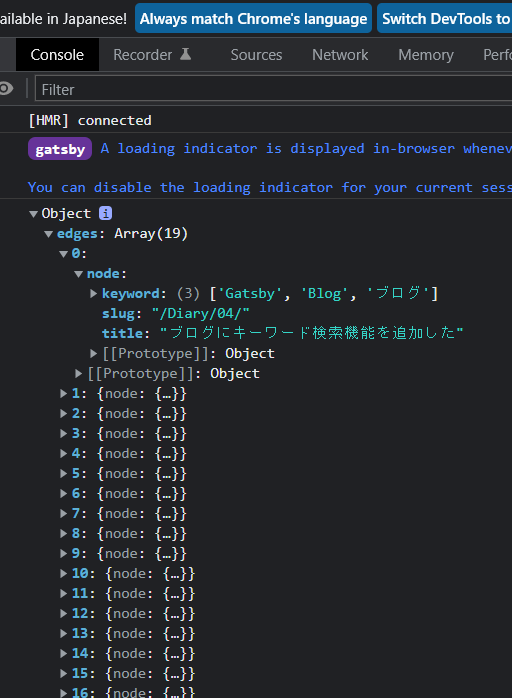
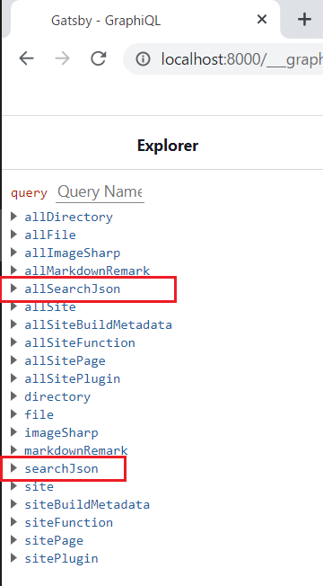
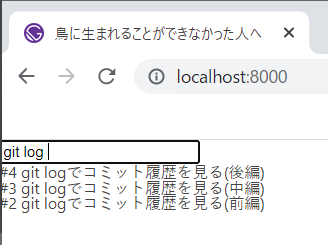
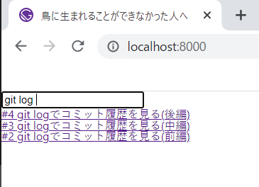

# ブログにキーワード検索機能を追加しました

タイトルのまんまです。右上にある虫眼鏡ボタンをクリックすればテキストボックスが現れ、キーワードによる記事の絞り込み検索ができます。

絞り込み検索はインクリメンタルサーチとも呼ばれ、ページ遷移を伴うことなく段階的に記事を絞り込んでいきます。

「g」と入力した場合（10件）。



「git」と入力した場合（4件）。



「git log」と入力した場合（3件）。


このブログは既にシリーズ検索とタグ検索の機能を持っておりこれ以上の検索機能は不要かと思ったのですが、年末年始が非常に暇だったこともあり実装しました。

今回はこの検索機能について、そしてその実装方法を解説します。

## JSONファイルから検索する

さて、静的サイトでの検索機能といえば[algolia](https://www.algolia.com/)が真っ先に思い浮かびますね。私も利用しようと思って色々調べてみたのですが、

- 🤔 algoliaに関する知識が全くない
- 🤔 料金がかかるかもしれない 
- 🤔 Saasなどの外部サービスを利用するのは大げさ
- 🤔 全文検索は必要ない

などの理由から導入はしないことにしました。今回は、Gatsbyのビルドプロセス時に各記事のfrontmatterからJSONファイルを作成し、コンポーネントからJSONファイルを検索する、という至極シンプルな方法をとることにしました。

## frontmatterにkeywordsを追加する

次に、検索対象をどうしようかと考えました。ぱっと思いつくのは

- 🔍 記事のタイトル
- 🔍 シリーズ名
- 🔍 タグ
- 🔍 description
- 🔍 記事本文（全文検索）

くらいですが、全てを対象にするとロジックが複雑になるうえJSONファイルも肥大化するのでやめました。記事本文もJSONファイルの肥大化、そしてそこまで必要ないという理由で却下。シリーズ名、タグ名による検索もほぼ同じ機能が既にあるので却下。タイトルやdescriptionは検索対象としては情報量が不足するということで却下。

いくつかの要素を組み合わせようかとも思いましたが、グタグタ考えるくらいならfrontmatterに新しい項目を追加してしまおうということで、「keywords」という項目を追加しました。キーワードとなる単語を配列に格納していきます。

追加する言葉は「タグよりも粒度の細かい言葉」にしました。タグにするほどではないけど本文に何回か出現する言葉ですね。タグと本文の中間くらいのイメージです。

また、「Blog」「ブログ」などの日本語/英語のゆれ、「SSG」「Static Site Generator」などの略す/略さないというゆれはタグ検索では実現しにくいです。機能を追加する利点、モチベーションになると思い、面倒臭いですが細かに記述していきます。

```yaml
---
# 例えばこんな感じ
keywords: ["Gatsby", "Blog", "ブログ", "SSG", "Static Site Generator"]
---
```

## 要件定義

ここで、簡単に要件定義をしておきます。

- ✔️ 入力した文字列を「キーワード」として持っている記事を検索し、その記事へのリンクをリストアップする
- ✔️ キーワードは、各記事のfrontmatterとして定義する
- ✔️ 半角スペースを用いて複数の単語を入力可能にする
- ✔️ 複数の文字列が入力された場合はAND検索を行う（AAA BBBと入力されれば、その両方を持っている記事をリストアップする）
- ✔️ 英語、日本語を入力対象とする
- ✔️ アルファベットはケース・インセンシティブにする（検索時に大文字を内部的に小文字に変換して比較を行う）
- ✔️ ページ遷移なしの絞り込み検索を行う

これらを元に機能を実装していきます。

## ビルド時にJSONファイルを書き出す

各記事に`keywords`を用意したら、JSONファイルを書き出す機能を実装します。Gatsbyのビルドプロセス時にJSONファイルを生成するので、編集するのは`gatsby-node.js`ですね。

まずは、全ての記事の`frontmatter`の`keywords`項目を取得するGraphQLクエリーを追加します。

```typescript:title=gatsby-node.js
const createPages = async ({ graphql, actions, reporter }) => {

  const queryResult = await graphql(
    `
      ...略
      {
        # 全ての記事を取得(検索用)
        allArticlesForSearching: allMarkdownRemark(
          sort: {fields: frontmatter___postdate, order: DESC}
        ) {
          edges {
            node {
              fields {
                slug
              }
              frontmatter {
                keywords
                title
              }
            }
          }
        }
      }
    `
```

JSONファイルの書き出しは以下のように行います。ファイルの保存先はルート直下の`static`、ファイル名は`keywordSearch.json`にしました。

```typescript:title=gatsby-node.js
  const keywords = queryResult.data.allArticlesForSearching.edges.map(({node}) => {
    return {
      slug: node.fields.slug,
      title: node.frontmatter.title,
      keywords: node.frontmatter.keywords,
    }
  })

  fs.writeFileSync('./static/keywordSearch.json', JSON.stringify(keywords, null, 2))
```

ここで`gatsby develop`すると、`static/keywordSearch.json`が生成されます。また、その内容は以下のようになっているはずです。

```json:title=/static/keywordSearch.json
[
  {
    "slug": "/Others/01/",
    "title": "プロキシ環境でKali Linuxを使う",
    "keywords": [
      "Kali Linux",
      "WSL2",
      "Proxy",
      "プロキシ",
      "apt",
      "wget",
      "curl"
    ]
  },
  //...略
]
```

## gatsby-transformer-jsonをインストールする

JSONファイルを生成できたので、次はこれをコンポーネントから取得します。Gatsbyには`gatsby-transformer-json`というパッケージが用意されており、これを使うことでGraphQLクエリーでJSONファイルを取得できます。早速インストールしましょう。

なお、`gatsby-transformer-json`は、2022年1月現在`^4.4.0`が最新なようですが、Gatsby v3を使用している環境だと「warn Plugin gatsby-transformer-json is not compatible with your gatsby version 3.12.1 - It requires gatsby@^4.0.0-next」みたいなエラーが出るはずです。

Gatsby v4を使用しているのであれば問題ありませんが、Gatsby v3を使用中の方は`gatsby-transformer-json@^3.0.0`をインストールしましょう。

```shell
$ yarn add gatsby-transformer-json@^3.0.0
```

インストールできたら、まずは`gatsby-config.js`のプラグインの部分に追記します。

```javascript:title=gatsby-config.js
module.exports = {
  plugins: [
    `gatsby-transformer-json`,
    // ...略
  ]    
```

また、`static`の中にあるファイルを扱うわけですから、`gatsby-source-filesystem`において`static`への設定をしている必要があります。設定が出来ていない場合は以下のように追記します。

```javascript
  // 追記
  {
    resolve: `gatsby-source-filesystem`,
    options: {
      // フォルダーを指定
      path: `static`,
      // 任意の名前を付ける
      name: `keywordSearch`,
    },
  },
```

ここで再度`gatsby develop`を行い、`localhost:8000/___graphql`にアクセスし、GraphiQLでGraphqlクエリーを発行し、JSONファイルを取得できるかテストしてみましょう。

JSONファイルを取得するクエリーの名前ですが、保存しているJSONファイルのファイル名が踏襲されます。今回は`keywordSearch.json`という名前でJSONファイルが存在しているので、`allKeywordSearchJson`ないし`keywordSearchJson`というクエリーが用意されているはずです。



GraphQLクエリーは以下のように投げます。取得するフィールドですが、肝心の`keywords`と、検索でヒットした記事へのリンクを作成するために`slug`と`title`も必要です。

```graphql
query MyQuery {
  allKeywordSearchJson {
    edges {
      node {
        keywords
        slug
        title
      }
    }
  }
}

```

クエリーを実行して右側のペインにエラーなく結果が表示されればOKです。以下は筆者の環境でのクエリーの結果です。

```javascript:title=Graphqlクエリーの結果
{
  "data": {
    "allKeywordSearchJson": {
      "edges": [
        {
          "node": {
            "keywords": [
              "Kali Linux",
              "WSL2",
              "Proxy",
              "プロキシー",
              "apt",
              "wget",
              "curl"
            ],
            "slug": "/Others/01/",
            "title": "プロキシ環境でKali Linuxを使う"
          }
        },
        // ...以下、同様に続く
      ]
    }
  },
}
```

## コンポーネントを作成する

ここまでくれば目的の大半は達成したも同然です。記事を検索するコンポーネントを作成しましょう。`src/components/keywordSearch.jsx`を用意します。まずは以下のように記述しておきます。

```jsx:title=src/components/keywordSearch.jsx
import React from "react"

export const KeywordSearch = () => {
  return (
    <p>This is a search component</p>
  )
}
```

次に、GraphQLクエリーを記述します。コンポーネントからクエリーを投げるわけですから`useStaticQuery`を利用します。`useStaticQuery`と`graphql`をインポートし、以下のように記述します。適当な所に`console.log(allKeywordSearchJson)`を仕込み、結果を確認できるようにしておきます。

```jsx:title=src/components/KeywordSearch.jsx
import React from "react"
import {useStaticQuery, graphql} from "gatsby"

export const KeywordSearch = () => {
  const {allKeywordSearchJson} = useStaticQuery(
    graphql`
      {
        allKeywordSearchJson {
          edges {
            node {
              keywords
              slug
              title
            }
          }
        }
      }
    `
  )

  console.log(allKeywordSearchJson)

  return (
    <p>This is a search component</p>
  )
}
```

ファイルができたら、適宜`src/components/layout.jsx`などにコンポーネントを追記します。

```jsx:title=src/components/layout.jsx
import React, { ReactNode } from "react"

import { KeywordSearch } from "./keywordSearch"

const Layout = ({children}) => (
  <>
    <KeywordSrarch />

    {children}
  </>
)

export default Layout
```

`gatsby develop`でローカルサーバーを起動し、ページにアクセスしコンソールで結果を確認します。


---

今回、UIの作成には`useState`と`useEffect`を使用します。まずは`useState`で入力された文字列を保持するStateと、条件によって絞り込まれた記事すべてを保持するStateを用意します。

ついでに入力フォームも書いておきましょう。

```jsx:title=src/components/KeyWordSearch.jsx
import React, {useState, useEffect} from "react"
import { useStaticQuery, graphql } from "gatsby"

export const KeywordSearch = () => {
  // フォームに入力された文字列を保持するState
  const [inputtedWords, setInputtedWords] = useState("")

  // 条件によって絞り込まれた記事を保持するState
  const [filteredPosts, setFilteredPosts] = useState(null)

  const { allKeywordSearchJson } = useStaticQuery(
    graphql`
      {
        allKeywordSearchJson(skip: 3) {
          edges {
            node {
              keywords
              slug
              title
            }
          }
        }
      }
    `
  )

  return (
    <input type="text" />
  )
}
```

今回はインクリメンタルサーチですから、入力ボックスに1文字入力されるたびにGraphQLクエリーの結果が入っている`allSearchJson`オブジェクトを走査して、結果を書き換える必要があります。

まずはinput要素に`onChange`属性を定義し、入力された文字列を`setInputtedKeywords`に渡すようにします。

```jsx:title=src/components/KeywordSearch.jsx
  return (
    <input
      type="text"
      // 入力された文字列でinputtedKeywordsを更新する
      onChange={(e) => setInputtedWords(e.target.value)}
    />
  )
```

続けて、`useEffect`を定義し、第二引数に`inputtedWords`を渡します。これで入力フォームに1文字書き込まれるたびに`useEffect`が実行される状態になりました。`useEffect`には`console.log(inputtedWords)`などと記述し、フォームに1文字入力されるたびにコンソール出力されることを確認してください。

```jsx:title=src/components/KeywordSearch.jsx
export const KeywordSearch = () => {
  //...略

  // フォームに文字列が入力されるたびに実行される
  useEffect(() => {
    console.log(inputtedWords)

    // ここにinputtedWordsの中身を使ってJSONファイルを走査し、
    // filteredPostsを書き換える処理を書く

  }, [inputtedWords])
```


それでは`useEffect`の処理を記述します。

今回、アルファベットの検索はケース・インセンシティブに実装するので、入力された文字列を全て小文字に変換する必要があります。

以下のように、入力された文字列を全て小文字に変換し`lowerCaseWords`といった変数に**配列として**保管します。

複数の文字が入力された場合にAND検索を行う必要があるため、取り回しがしやすいように配列にしています。

```jsx:title=src/components/KeywordSearch.jsx
useEffect(() => {
  // 入力されたキーワードを小文字に変換する
  const lowerCaseWords = inputtedWords
    .trim()
    .toLocaleLowerCase()
    .match(/[^\s]+/g)

  console.log(lowerCaseWords)
}, [inputtedWords])
```

以下の画像は、`Hello World`と入力した時のコンソール出力の様子です。アルファベットが小文字に変換され、単語ごとに配列に格納されていることがわかります。


---

```jsx:title=src/components/keywordSearch.jsx
// ヒットした記事がここに格納される
const searchedResult = // 検索処理を書く
```

肝心のヒットするかどうかを判定する部分ですが、私は以下のように書きました。

```jsx:title=src/components/keywordSearch.jsx
// ヒットした記事がここに格納される
const searchedResult = allKeywordSearchJson.edges.filter(({node}) => {
  return lowerCaseWords?.every((word) => {
    return node?.keywords?.toString().toLocaleLowerCase().includes(word)
  })
})

// 結果確認用
console.log(lowerCaseWords, searchedResult)
```

これで1文字打つたびに検索が行われ、結果がコンソール出力されます。


この`searchedResult`を、検索結果を保持するstateである`filteredPosts`に代入します。

```jsx:title=src/components/keywordSearch.jsx
  // 絞り込まれた記事一覧で更新する
  setFilteredPosts(searchedResult.length ? searchedResult : null)
```

最後に、ヒットした記事一覧を表示する部分を書けば完成です。ここでは`ul`要素と`li`要素、`a要素`を使用することにします。

ひとまず出力結果を確認したいので、以下のように書いてみましょう。

```jsx:title=src/components/keywordSearch.jsx
  return (
    <>
      <input
        type="text"
        onChange={(e) => setInputtedWords(e.target.value)}
      />

      <ul>
        {filteredPosts && filteredPosts.map((post) => {
          return (
            <li>
              {post.node.title}
            </li>
          )
        })}
      </ul>
    </>
  )
```



正しく記事リストが出力されればOKです。

後は`Link`をインポートして、

```jsx:title=src/components/keywordSearch.jsx
import React, { useState, useEffect } from "react"
import { useStaticQuery, graphql, Link } from "gatsby"

// ...略
```

`slug`を使ってパスを記述するように書き換えます。

```jsx:title=src/components/keywordSearch.jsx
  return (
    <>
      <input
        type="text"
        onChange={(e) => setInputtedWords(e.target.value)}
      />

      <ul>
        {filteredPosts && filteredPosts.map((post) => {
          return (
            <li style={{"fontSize": "140%"}}>
              <Link
                to={post.node.slug}
                key={post.node.slug}
              >
                {post.node.title}
              </Link>
            </li>
          )
        })}
      </ul>
    </>
  )
```

ちゃんとリンクが表示され、機能することを確認します。



これで基本機能は完成です。UIも何もあったもんじゃないですが、これをベースにカスタマイズしていけば実用的な検索機能として使えるはずです。

`src/components/keywordSearch.jsx`のコード全体を置いておきます。

```jsx:title=src/components/keywordSearch.jsx
import React, { useState, useEffect } from "react"
import { useStaticQuery, graphql, Link } from "gatsby"

export const KeywordSearch = () => {
  // フォームに入力された文字列を保持するState
  const [inputtedWords, setInputtedWords] = useState("")

  // 条件によって絞り込まれた記事を保持するState
  const [filteredPosts, setFilteredPosts] = useState(null)

  // フォームに文字列が入力されるたびに実行される
  useEffect(() => {
    // 入力されたキーワードを小文字に変換する
    const lowerCaseWords = inputtedWords
      .trim()
      .toLocaleLowerCase()
      .match(/[^\s]+/g)
    
    // ヒットした記事がここに格納される
    const searchedResult = allKeywordSearchJson.edges.filter(({node}) => {
      return lowerCaseWords?.every((word) => {
        return node?.keywords?.toString().toLocaleLowerCase().includes(word)
      })
    })

    // 絞り込まれた記事一覧で更新する
    setFilteredPosts(searchedResult.length ? searchedResult : null)
  }, [inputtedWords])

  const { allKeywordSearchJson } = useStaticQuery(
    graphql`
      {
        allKeywordSearchJson(skip: 3) {
          edges {
            node {
              keywords
              slug
              title
            }
          }
        }
      }
    `
  )

  return (
    <>
      <input
        type="text"
        onChange={(e) => setInputtedWords(e.target.value)}
      />

      <ul>
        {filteredPosts && filteredPosts.map((post) => {
          return (
            <li style={{"fontSize": "140%"}}>
              <Link
                to={post.node.slug}
                key={post.node.slug}
              >
                {post.node.title}
              </Link>
            </li>
          )
        })}
      </ul>
    </>
  )
}
```

## マークダウンの編集で`gatsby develop`が死ぬ

ある時から、`gatsby develop`中にマークダウンを編集するとプロセスが死ぬようになりました。

```shell
info changed file at C:\github\GatsbyBlog\static\keywordSearch.json
success extract queries from components - 0.108s
success write out requires - 0.002s
success Writing page-data.json files to public directory - 0.000s - 0/44
119144.33/s

 ERROR

Panicking because nodes appear to be being changed every time we run queries.
This would cause the site to recompile infinitely.
Check custom resolvers to see if they are unconditionally creating or mutating
nodes on every query.
This may happen if they create nodes with a field that is different every time,
such as a timestamp or unique id.
```

前述のとおり、`gatsby-node.js`でマークダウンファイルを基にJSONファイルを生成しているわけですが、マークダウンファイルの更新をきっかけにホットリロードが走り、JSONファイルの生成が無限ループしてしまっているようです。当初はこんなこと起きなかったと思うんですが、いつからかこうなってしまいました😭（血涙）。

ただ、本番環境で起きるエラーではなくそこまでクリティカルな問題ではなかったことが救いです。

環境変数`process.env.NODE_ENV`を利用すれば、Gatsbyがどのモードで実行されているかを取り出せます。`gatsby develop`なら`development`、`gatsby build`なら`production`が格納されます。

今回は`gatsby-node.js`を以下のように書き換え、本番環境時（`gatsby build`が実行された時）のみJSONファイルの生成を行うようにしました。

```javascript:title=gatsby-node.js
  // 本番環境のみJSONファイルの生成を行う
  if(process.env.NODE_ENV === 'production') {
    const keywords = queryResult.data.allArticlesForSearching.edges.map(({node}) => {
      return {
        slug: node.fields.slug,
        title: node.frontmatter.title,
        keywords: node.frontmatter.keywords,
      }
    })

    fs.writeFileSync('./static/keywordSearch.json', JSON.stringify(keywords, null , 2))
  }
```

ローカルで`gatsby develop`している時にはfrontmatterの`keywords`を書き換える頻度は多くないですし、書き換えたとしても一度`gatsby build`すればJSONファイルを最新にできます。

デプロイする時には`gatsby build`が行われますので、本番環境ではJSONファイルはちゃんと最新になっています。


