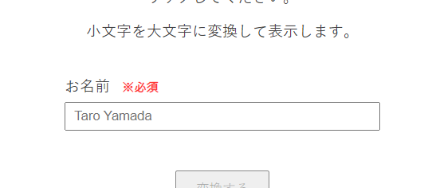
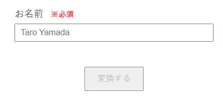
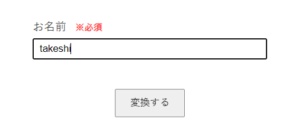
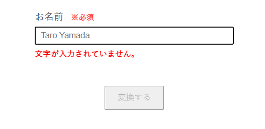
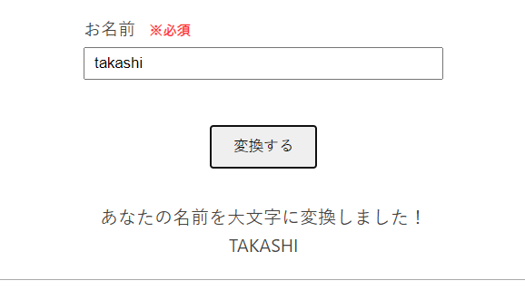

# My Formsというサイトを作成しました

このブログには最低月一回は更新するという隠れ努力目標があるのですが、ここ最近は記事をアップできていません。一応記事を作成している努力はしていて、例えばRustの所有権についての記事を書いているのですが、アップできるような精度ではないのでまだ下書きの状態です。

今回は苦し紛れの近況報告的な記事です。

My Formsというサイトを作成しました。ダミーのフォームを沢山作成し、リストアップしているサイトです。

[My Forms](https://myforms.toriwatari.work/)（[GitHub](https://github.com/kento-yoshidu/MyForms)）

多分今年の2月くらいに一旦サイトは完成したんですが、肝心のフォームは一つしか作れていませんでした。そこで、GWを利用してフォームをいくつか追加したり、デザインを整えたりしていました。

今回はこのサイトについての簡単な説明をします。

## 目的

大きな目的としては、**UI/UX**や**アクセシビリティ**に関する力を底上げすることです。フロントエンドの技術に触れている風を装っておきながら、これらについては見てみないふりをしていたのでちゃんと勉強することにしました。

なぜフォームを題材にしたかといえば、HTMLにおいて、恐らく作成するのが一番難しい要素がフォームであるからです。フォームを自由自在に操ることができれば、大抵のUIの作成においても合格点をとることができると予測しました。

そしてもっと細かく言うと、フォームの作成を通じて以下の要素についてレベルアップできると考えています。

- ✔ UI/UX
- ✔ HTML
- ✔ Webアクセシビリティ(WAI-ARIA)
- ✔ React Hooksや各種ライブラリーの使い方
- ✔ テストコードの書き方(React Testing Library)
- ✔ 支援技術の使い方(NVDAなど)

特に力を入れているのがテストコードの作成です（テストコードは[こちら](https://github.com/kento-yoshidu/MyForms/tree/main/__tests__）で確認できます)。各フォームにおいて、考えられる全てのケース（ユーザー操作）に対してテストケースを作成しています。プルリクエストを投げた時にGitHub Actionsが走り、テストが通るかをチェックします。テストについては後述します。

また、WAI-ARIAについても勉強を始めました。WAI-ARIAは勉強しないとダメだけど後回しにしがち（自分だけ？）だと思うんですが、フォームの作成には特に絡んでくる要素であり、強制的に勉強することになります。

## テスト

文字数を稼ぐため、実際にどのようなテストコードを書いているかを述べたいと思います。

[Form2](https://myforms.toriwatari.work/form2)を題材にします。名前変換フォームと関している通り、テキストボックスに入力した小文字のアルファベットを大文字にして表示するというものです。

### フォームの特徴

まず、Form2の仕様についてざっと説明します。Form2のテーマは「**必須項目を埋めていない時、どのようにしてそれをユーザーに伝えるか**」です。

入力する項目は「お名前」ひとつだけです。この項目は入力が必須ですので ※ 必須 と記述し、入力を促しています。

また、必須項目を入力するまではボタンは押せない状態（disabled）になっています。これはこれで良いUIなのかという問題はありますが、Form2のテーマを実現するため今回はそういう手段をとった、ということです。

名前が入力されれば送信ボタンはクリック可能な状態になります。なお、どのような文字（日本語や記号など）でも入力可能な状態になっています。本来は正規表現にかけるべきところですが、今回のテーマとは直接関係ないので省いています（ただ、スペースのみ、という入力は弾いています）。

さて、例では`takashi`という文字を入力しましたが、これを削除してみます。すると赤い文字でエラーメッセージが表示され、ボタンがまたdisabledになります。フォームが送信できない状態になったことに対して、エラーメッセージで理由を伝えています。

このエラーメッセージは、`onChange`を使用しテキストボックスの文字数をカウントして表示/非表示を切り替えています。ただ、初回レンダリング時にいきなりエラーメッセージが表示されるとよろしくないので、それを避ける工夫をしています。

なんやかんやでフォームの送信に成功すると、小文字のアルファベットが大文字に置き換わった文字列が表示されます。

以上がForm2の仕様です。

### テストケース

このフォームについて、テストコードはどのように書けばいいでしょうか。まず、以下の3つに大きく分類することにしました。

1. 初回レンダリング時に正しい状態になっているか
2. フォームに名前を記入/削除した時、各要素が正しい状態に変化するか
3. フォームを送信することで、正しい結果が得られるか

ここからそれぞれのケースについて細分化します。1つ目の「**初回レンダリング時に正しい状態になっているか**」ですが、以下のように考えました。

- 1-1 初回レンダリング時に送信ボタンがdisabledになっているか
- 1-2 初回レンダリング時にエラーメッセージが表示されていないか
- 1-3 初回レンダリング時に変換結果が表示されるエリアに何も表示されていないか

2つ目の「**フォームに名前を記入/削除した時、各要素が正しい状態に変化するか**」については、

- 2-1 フォームに名前を入力した時に送信ボタンのdisabledが解除されるか
- 2-2 フォームに名前を入力し削除した時にエラーメッセージが表示されるか
- 2-3 フォームに名前を入力し削除した時に送信ボタンがdisabledになるか

という風にしました。このような挙動を実現させるのが、フォームを作成する中で一番難しいところです。ユーザー操作に合わせてstateの値が狙い通りに変化するか、テストを通じてチェックします。

最後、「**フォームを送信することで、正しい結果が得られるか**」については、

- 3-1 フォームを送信した時に大文字に変換された名前が表示されるか

という風にしました。

## 参考にしている本

最近は、Webフロントエンドにおける実践的で発展的な内容の本が充実しており、本を読むのがとても楽しいです。今回のサイトを作成するにあたり参考にしている本を紹介します。

### [Webアプリケーションアクセシビリティ ――今日から始める現場からの改善](https://gihyo.jp/book/2023/978-4-297-13366-5)

アクセシビリティを題材ど真ん中にした本は少なく、こういった書籍が発売されたことがとても嬉しいです。まだ前半しか読めていませんが、WAI-ARIAやアクセシビリティの考え方について、あいまいだった自分の知識が拡充されていくのが分かります。

単なる知識の羅列ではなく、例えば「良くない例」を挙げその問題点を明確にしていき、最終的には具体的な改善策を提示しているなど、とても実践的な内容になっています。

### [フロントエンド開発のためのテスト入門 今からでも知っておきたい自動テスト戦略の必須知識](https://www.shoeisha.co.jp/book/detail/9784798178639)

Testing Library、Storybook、Playwrightを用いて、フロントエンドの自動テストをどのように考え実行していくかを示している本です。フロントエンドのテストは「何となくやっている感」が強かったですが、やはり1冊の本にまとまっていると体系的に学習出来ていいですね。

### [HTML解体新書](https://www.borndigital.co.jp/book/25999.html)

本のテーマはHTMLですが、HTMLとはもはや切っても切り離せない「セマンティクス」「アクセシビリティ」「WAI-ARIA」といった要素について詳しく記載されています。端から端まで暗記して理解するような本ではありませんが、辞書的に利用することが多いです。

## 最後に

フォームの中で「これはおかしい」「もっとこうすれば良い」といった所があれば是非issueを作成してもらえれば嬉しいです。もちろんフォークしてプルリクエストを投げてもらえるならなお嬉しいです。

更新履歴

<ul class="history-list">
  <li>2023年5月11日 : 見出しを修正。その他誤字脱字を修正。</li>

