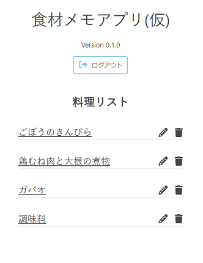
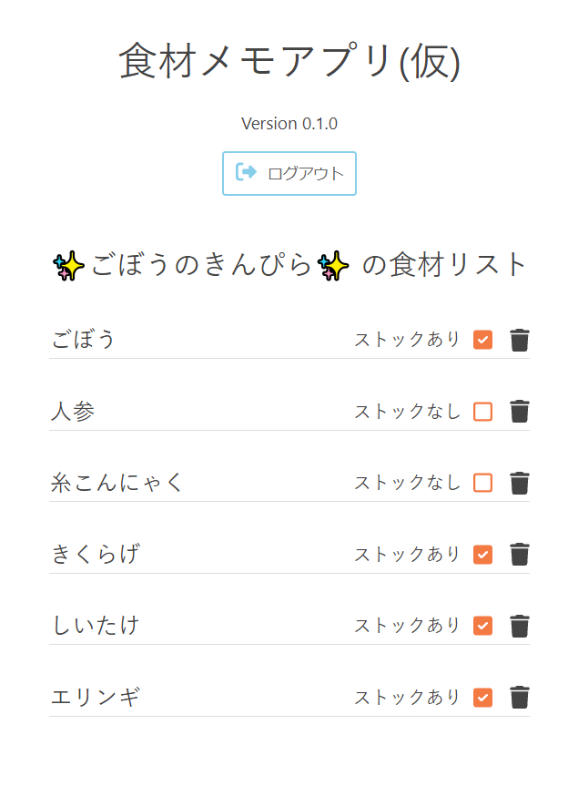
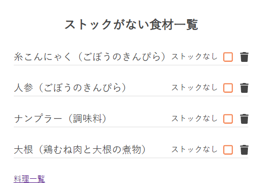

# スーパーに着いた途端、何を買ったらいいか思い出せなくなる

最近は料理男子を目指すべく、日夜自炊に励んでいます。会社には食堂があるのでその気になれば朝昼晩をそこで済ませることもできるのですが、1食300～500円ほどかかるのと、揚げ物が多かったり好きなものを食べられない時があるということで極力自炊するようにしています。

土日に以下の料理を作り、冷蔵庫で保管するか、ジップロックに入れて冷凍庫で凍らせるかしています。

- 🍴 ごぼうのきんぴら（冷蔵保存）
- 🍴 鶏むね肉ときゅうりの塩にんにく炒め（冷凍保存）
- 🍴 ガパオ（ガパオライスのライスの上に乗ってるやつ = ガパオ）（冷凍保存）
- 🍴 鶏もも肉とごぼうと大根の煮物（冷蔵保存）

特にごぼうのきんぴらはお勧めです。美味しくて腹持ちもいいし、冷蔵でも1週間くらいならもちます。

最近はきんぴらとガパオをジップロックに入れて会社に持って行ってます。食堂の小ご飯が50円、味噌汁が30円なので、1食80円できんぴら＋ガパオライス＋味噌汁が楽しめます。

で、大体土曜の朝に西友などに行って必要な食材を買い込むわけですが、スーパーに入った途端、何を買ったらいいか思い出せなくなるわけです（で、家に帰ってから「乾燥きくらげないやん」ってなる）。

ちょうどバックエンドも勉強しないとダメだと思っていた所で、これはいい題材が見つかったと思い、Goで簡単なアプリケーションを作成することにしました。なお、Goはほっとんど触ったことがありませんでした。

## 食材メモアプリ（仮）

~まだバージョンは0.1.0ですが、一応本番デプロイしていてWebサイトはこちらです。~

~食材メモアプリ(仮)~

~しかし、私はサービス名を考える力が全然ないですね。みんなどうやってカッコイイ名前を考えてるんでしょう。センスの問題？~

サイトは閉鎖しました(2023/12/29)。何というか、UIというかデザインが絶望的に悪くて、更新するモチベーションがなくなりました。やっぱりデザインって大事ですね。

## 機能

言ってしまえばTodoアプリの進化版です。ユーザー登録を済ませたら、任意の料理を追加します。

そして料理ごとに食材を追加します。食材はそれぞれストックがあるかないかのフラグを持っています。

買い物に出かける前に冷蔵庫をチェックし、ストックがなければチェックを外します。そしてスーパーで食材をかごに入れたらチェックをONにします。

料理ごとにストックがあるかないかをスーパーで確認するのは手間なので、ストックがない食材一覧を確認できるページもあります。どの料理に登録されている食材なのかも表示しています。

ここでのストックのフラグのON/OFFの切り替えも当然有効です。

<aside>

料理の食材もいいですが、上記のように調味料を登録しても便利です。

</aside>

<aside>

ナンプラーも使ってます。本格的でしょ？

</aside>

## サイトの構成

まず、アプリケーション作成に当たり、ほとんどの部分をUdemyの以下の講座を参考にしました。

[Echo/Go + Reactで始めるモダンWebアプリケーション開発 | Udemy](https://www.udemy.com/course/echo-go-react-restapi/)

バックエンドはGoでフレームワークはEcho、ORMはgormを用い、クリーンアーキテクチャーで構築します。フロントエンドはReact、React Query、Zustandという構成です。

後から知りましたが、どうやらgormがGo言語のORMの人気トップみたいですね。

[GoのORMの人気ランキングを年ごとにまとめてみた](https://zenn.dev/ryoneko/articles/4c1267d7d0e0ca)

今年のお盆休みから作成を始めました。Udemyの講座を10日くらい（つまりお盆休み全部）かけてやりこみ、その後1か月くらいでサイトを作成しました。

なお、Udemyのこの講座は結構難しかったです。私はGo言語はほとんど知らない、フロントエンドはまぁまぁ分かる、という状態で挑みました。バックエンドの部分はすんなり理解でき、逆にフロントエンドは理解に苦しみました。フロントエンドは前述したようにReact Query、Zustandなどのライブラリーを利用しているのに加え、バックエンドとの連携、ログイン認証（CSRF対策付き）、エラーハンドリングなど様々な要素が飛び交い、途中で何をしているのか理解できなくなりました。

2回講座をリピートし、何となくわかった段階で発展形としてオリジナルアプリの作成に着手しました。で、かかった時間がトータル1ヵ月半くらいです。ただし、クリーンアーキテクチャーに関しては未だによく分かっていません。

## 感想戦

### Goを使ってみてどうだった?

触る前は「エラーハンドリングがよく分からない、あまり好きじゃない」だったのが、現在は「基本レベルのことは大体わかった気がする、あまり好きじゃない」になりました。

Echoというフレームワークはシンプルで少しドキュメントを読めば自分でも使えそうだという気がします。ただ、gormがよく分かっていません。任意のカラムの値を取得することができず悪戦苦闘しています（そもそもドキュメントをちゃんと読んでいないからですが、余り読む気がしない、、、）。

これからGoを使っていくか？と聞かれたら使うと思います。「Goはシンプルで簡単」と言われますが、例えばRustとかと比べると（良くも悪くも）機能は少なくシンプルですし、意味不明な仕様も少ない（無いとは言ってない）ので、ちょっと不便な所は感じつつ、迷うことなくコードを書けると感じました。何より「好きだから使う、好きじゃないから使わない（勉強しない）」というのは止めたいですね。

<aside>

Rustもそうですが、classもなければtry-catch構文もないのは今風の言語っぽくていいですね。

</aside>

### 推し料理は?

これは間違いなく**ごぼうのきんぴら**です。最初は以下の動画を参考にきんぴらを作成しました。

[絶対に誰かに教えたくなる、きんぴらごぼうの最高の作り方と驚愕の食べ方【至高のきんぴら】 - YouTube](https://www.youtube.com/watch?v=HwGslCAQZZY)

そこからアレンジと称して、食物繊維が摂れる食材をぶち込みまくっています（しいたけ、エリンギ、しめじ、マジックマッシュルーム、きくらげ、糸コンニャク、緑豆春雨、ブロッコリーなど気分に応じて）。

せっかくなので私のオリジナルきんぴらの作り方を紹介しましょう。

1. 常温の水に乾燥きくらげを入れ、15分ほどつけて戻しておく
2. 緑豆春雨を2,3分ほど茹でて戻しておく
3. ごぼう、人参を細切りする
4. しいたけ、エリンギ、しめじ、マジックマッシュルーム、糸こんにゃくなどを好みのサイズに切る
5. フライパンでごま油を強火で温め、用意した食材を全て投入する
6. 塩、砂糖を加え軽く炒める
7. 酒、みりんを加え、柔らかくなるまで炒める
8. 中火にし、白だし、醤油を加えて味付けする
9. 鷹の爪、金ゴマを加えて軽く炒める

以上。材料費で言うと1週間分で1,000円くらいだと思います。

私は体質なのか血糖値が上がりやすいみたいなので、毎食、前菜としてごぼうのきんぴらを必ず食べています。

ごぼうには食物繊維がたくさん含まれています。健康（血糖値や腸内環境）が気になるならごぼうを食べましょう。ごぼうしかありません。ごぼうはあなたを救います。ごぼうを信じてください。

### 最近野菜高いんだけど?

まず冷凍食品を活用しましょう。安いです。当然保存にも向いているため、私は冷凍のブロッコリーやネギを購入し始めて食材をダメにすることがなくなりました。旬な時期の野菜を冷凍していることから、冷凍野菜の方が栄養がある説もあります。

[冷凍野菜の栄養価、実は高かった！？](https://www.picard-frozen.jp/Page/column001.aspx)

加えて、価格が安い、代替となる食材を見つけましょう。例えばパプリカの代わりにピーマン、しいたけの代わりにエリンギ、鶏もも肉の代わりに鶏むね肉、たけのこの代わりにヤングコーン、といった具合です。

そして、ごぼうを活用しましょう。ごぼうはとても安いです。私はごぼうを相当量消費していますが、月額3,000円ほどです。一般単身ピープルだと1,000円超えるくらいでしょう。ごぼう中心で料理を考えるといいです。

### 次に作りたい料理は?

チンジャオロースです。

## 参考

[お肉の簡単つくりおきおかず。鶏肉と大根のコクうま煮 | つくりおき食堂<](https://mariegohan.com/5433)

[【作り置き筋肉飯】１食たったの100円⁉︎コスパ最強なのにウマすぎる本格ガパオライス弁当　10食分！【脂肪を落とす食事】 - YouTube](https://www.youtube.com/watch?v=tjT0rI2tuA8)

[【LIFEHACK】「絶対に摂るべき　最強に若返るクスリ」を世界一分かりやすく要約してみた - YouTube](https://www.youtube.com/watch?v=SyRamUgMCS4)
