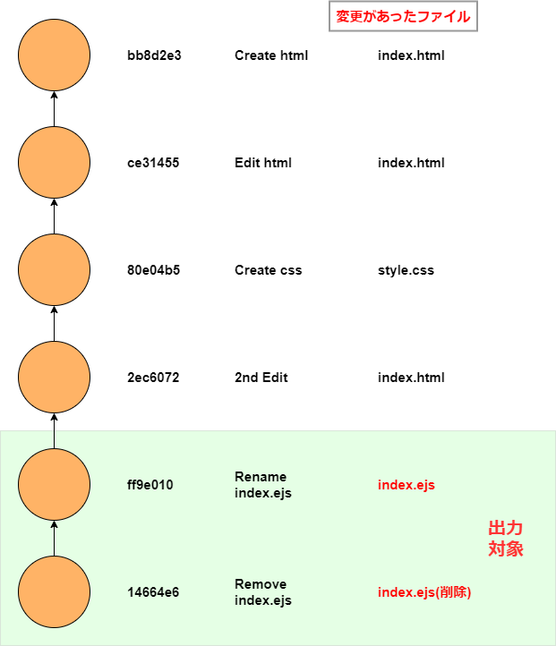
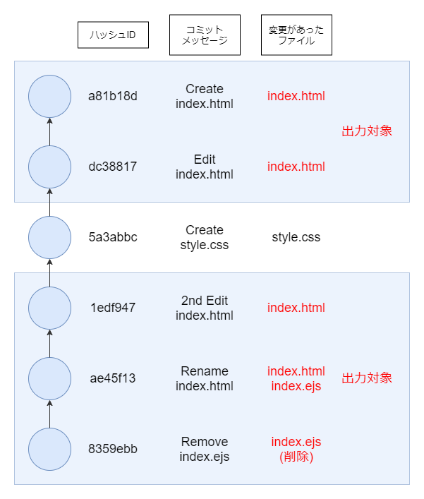

# git logのオプション（中編）

前回の記事でも中々の数の`git log`のオプションを紹介しましたが、まだまだ続きます。

前回はコミットについて「どういった内容を出力するか」を選択するようなオプションを紹介しました。対して今回は、「どのコミットを出力するか」という、コミットを絞るようなオプションを紹介します。例えば、「2020年のコミットだけを出力する」「`index.html`を変更したコミットだけを出力する」といった具合です。

## リポジトリーの再現

前回作成したリポジトリーを引き続き使用します。以下の内容を実行することで、リポジトリーを再現することができます。

<details>
<summary>スクリプトを見る</summary>

```shell
  # index.htmlを作成 
  touch index.html
  git add .
  git commit -m "Create index.html"

  # index.htmlを編集
  echo -e "aaa\nbbb\nccc" >> index.html
  git add .
  git commit -m "Edit index.html"

  # style.cssを作成
  touch style.css
  git add .
  git commit -m "Create style.css"

  # index.htmlを編集
  echo -e "aaaaaa\nbbb" > index.html
  git add .
  git commit -m "2nd Edit index.html"

  # index.htmlをejsファイルに変更
  git mv index.html index.ejs
  git commit -m "Rename index.html"

  # index.ejsを削除
  git rm index.ejs
  git commit -m "Remove index.ejs"
```
</details>

## `-n <number>`でコミット数を絞る

`-n`オプションで、出力させるコミット数を指定することができます。例えば`-n 1`なら1コミット、`-n 10`なら10コミット出力されます。もしくは、`-10`のように`-`に続けて数値を打っても構いません。

```console
$ git log -n 2 --oneline
8359ebb (HEAD -> master, style.css) Remove index.ejs
ae45f13 Rename index.html
```

とりあえず直近のコミットを確認したい時に`git log`と打って何百とコミットが出力されるとうっとうしいので、私はエイリアスで最初からコミット数上限を10に指定しています。

```shell
[alias]
  # コミット数をデフォルトで10に制限
  lol = log --all --graph --oneline -10
```

なお、10よりもさらに多くのコミットを確認したい場合は、コマンド実行時に`git lol -n 30`などと指定すればその数だけコミットが出力されます。

## `--grep`でコミットメッセージで検索する

`--grep=任意の文字`とすることで、コミットメッセージによってコミットを検索することができます。以下の例だと、コミットメッセージに`Rename`が含まれているコミットが出力されます。

```shell
$ git log --oneline --grep=Rename

cb039c3 (HEAD -> main) Rename index.html
```

なお、`--grep`のみで検索するとcase sensitive、つまり、アルファベットの大文字小文字が区別されます。例えば`--grep=rename`とすると出力されません。

```shell
$ git log --oneline --grep=rename
```

この場合、`-i`（`--regexp-ignore-case`のショートハンド）を付与すると、大文字小文字区別なく出力されます。

```shell
$ git log --oneline -i --grep=Rename

ae45f13 Rename index.html
```

また、検索する文字列には正規表現が使用できます。

```shell
# 先頭がEのコミットメッセージのみ出力
$ git log --grep=^E --oneline

dc38817 Edit index.html
```

`--grep`の結果を反転させる、つまり、`Rename`を含むコミットメッセージを**除く**には、`--invert-grep`を付与します。

```shell
$ git log --grep=Rename --invert-grep --oneline

8359ebb (HEAD -> master, style.css) Remove index.ejs
1edf947 2nd Edit index.html
5a3abbc Create style.css
dc38817 Edit index.html
a81b18d Create index.html
```

### ORとAND

`--grep`を複数使用した場合、**OR**でコミットメッセージが検索されます。以下の例だと、`Rename`もしくは`Create`が含まれているコミットが出力されます。

```shell
$ git log --oneline --grep="Rename" --grep="Create"

ae45f13 Rename index.html
5a3abbc Create style.css
a81b18d Create index.html
```

これを**AND**にしたい場合、`--all-match`を付与します。以下の例だと、`Create`と`html`が**両方含まれている**コミットが出力されます。

```shell
$ git log --oneline --all-match --grep="Create" --grep="html"

a81b18d Create index.html
```

## `-- <path>`で特定のファイルの履歴を確認する

任意のファイルに変更があったコミットのみ出力する場合には、`-- [path]`と記述します。`--stat`や`-p`と組み合わせることも可能です。

```shell:title=console
# index.ejsのみ
$ git log --oneline -- index.ejs

8359ebb (HEAD -> master, style.css) Remove index.ejs

ae45f13 Rename index.html

# style.cssのみ
$ git log --oneline -- style.css

4aefdf3 Create style.css
```

なお、パスの前に`--`を付与していますが、これは`git log`に「渡しているのはファイル名だよ」と伝える意味を持っています。

### あれ？index.htmlが引っかからないけど

今回の例では、`index.html`から`index.ejs`にファイル名を変更しています。`-- index.ejs`で検索しても、`index.html`が対象のコミットは出力されません。



今回のように、既にワーキングツリーに存在していないファイルのコミットも検索したい場合は、`--follow`オプションを付けてください。リネーム前の`index.html`も検索対象になります。

なお、引数の順番は注意が必要です。`--follow -- ファイル名`としなければ旧ファイルが検索されませんでした（git version 2.22.0）。

```shell:title=console
$ git log --oneline --follow -- index.ejs

d7e6535 (HEAD -> main) Delete index.ejs

cb039c3 Rename index.html

360e27d 2nd Edit index.html

be1bf08 Edit index.html

fd4955b Create index.html
```



### パスの前に`--`を付けるのはどんな時？

ファイルやパスを記述してコミット履歴を絞るには`--`を付与すると説明しましたが、実は`--`はつけなくても、多くの場合はちゃんと動作します。つけなくてはいけない場合について、いくつか検証してみます。

現在、`index.ejs`は削除されていますが、ここで`--`をつけずに`index.ejs`を指定するとエラーになってしまいます。

```shell
# -- なしで実行
$ git log --oneline index.ejs

fatal: ambiguous argument 'index.ejs': unknown revision or path not in the working tree.
Use '--' to separate paths from revisions, like this:
'git <command> [<revision>...] -- [<file>...]'
```

`ambiguous argument`、つまり「曖昧な引数」というメッセージが出力され、ご丁寧に「ファイル名の前に`--`をつけてね」というアドバイスまでくれています。どうやら、削除やリネームを行って、ワーキングツリーに存在しなくなったファイルを検索する場合には`--`が必要らしいです。

ワーキングツリーに存在している`style.css`であれば`--`なしでも検索できます。

```shell
$ git log --oneline style.css

4aefdf3 Create style.css
```

次に、ファイル名と同じブランチが切られている場合について検証します。

今、ワーキングツリーには`style.css`がありますから、`style.css`という名前のブランチを切ります。特にコミットはしなくてOKです。

```shell:title=console
$  git checkout -b style.css
```

ここで`--`を渡さないで`git log`を実行すると

```shell:title=console

$ git checkout main

$ git log --stat --oneline develop

fatal: ambiguous argument 'develop': both revision and filename
Use '--' to separate paths from revisions, like this:
'git <command> [<revision>...] -- [<file>...]'
```

またしても`ambiguous argument`、「曖昧な引数」のため致命的なエラーが発生しています。「`style.css`ファイルもあるし`style.css`ブランチもあるけど、どっちのこと言ってるの？」と言われています。

`-- style.css`とすることでエラーなく出力されることも確認しておきます。

```shell:title=console
$ git log --oneline -- style.css

4aefdf3 Create style.css
```

まとめると、

- 🤔 基本的には`--`なしでもファイルでコミットを絞れる
- 🤔 ただし、ワーキングツリーにないファイルで絞る場合には`--`を付与する
- 🤔 ファイル名とブランチ名が被っている場合にも`--`を付与する

と考えていいと思います。

なお、私は常に`--`を付与している派です。

## `--diff-filter`で変更内容でコミットを絞る

`--diff-filter`オプションを付けることで、「ファイルが削除されたコミットだけ」「リネームされたコミットだけ」という風にコミットを出力することができます。

`--diff-filter=D`という風に指定してみます。`D`は`Deleted`のことです。つまり、ファイルが削除されたコミットのみが出力されます。

```shell
$ git log --oneline --diff-filter=D

d7e6535 (HEAD -> main) Delete index.ejs
```

`D`以外にも、以下のような値が渡せます。

|値|コミットの内容|
|---|---|
|A(Added)|追加|
|M(Modify)|変更|
|R(Renamed)|リネーム|
|C(Copied)|ファイルコピー|
|T(Type?)|タイプが変更（シンボリックリンクへの変更など）|

```shell
# ファイルを新しく追加したコミットのみ
$ git log --oneline --diff-filter=A
4aefdf3 Create style.css
fd4955b Create index.html

# ファイルの内容を変更したコミットのみ
$ git log --oneline --diff-filter=M
360e27d 2nd Edit index.html
be1bf08 Edit index.html

# ファイルをリネームしたコミットのみ
$ git log --oneline --diff-filter=R
ae45f13 Rename index.html

# ファイルをコピーしたコミットのみ（今回の例では該当なし）
$ git log --oneline --diff-filter=C
```

そして、値を小文字にすることで意味を反転させることができます。つまり、`--diff-filter=d`とすると、削除があったコミット**以外**が出力されます。

```shell
$ git log --oneline --diff-filter=d

ae45f13 Rename index.html

1edf947 2nd Edit index.html

5a3abbc Create style.css

dc38817 Edit index.html

a81b18d Create index.html
```

## `--since`と`--until`で日付で絞る

以下のようなコミット履歴があるとします。2017年から2020年まで、各年の1月1日にコミットを行っており、計4回のコミット履歴があります。

```shell:title=console
$ git log --format=fuller

commit 13a83c31fc4558b811ae2c0dbb373a60d2359c77 (HEAD -> main)
Author:     toriwatari <toriwatari@toriwatari.com>
Date: Fri Jan 10 00:00:00 2020 +0900

    2020 commit

commit 0fb21bf1e009cd3edb4036bc167db0cb93c1c98b
Author:     toriwatari <toriwatari@toriwatari.com>
Date: Tue Jan 1 00:00:00 2019 +0900

    2019 commit

commit 41ece2df6ad958e89ae9ba91e08d82c3d476ec9d
Author:     toriwatari <toriwatari@toriwatari.com>
Date: Mon Jan 1 00:00:00 2018 +0900

    2018 commit

commit d4657a563990338265ed5af1ff90f8e971546560
Author:     toriwatari <toriwatari@toriwatari.com>
Date: Sun Jan 1 00:00:00 2017 +0900

    2017 commit
```

`--sinse="<date>"`とすることで任意の日付以降にコミットされたコミットのみ出力できます。以下の例だと、2018年1月1日以降を表します。

```shell
$ git log --since="2018-01-01:00:00:00" --oneline
13a83c3 (HEAD -> main) 2020 commit
0fb21bf 2019 commit
41ece2d 2018 commit
```

日付のフォーマットですが色々なものに対応しているようです。

```shell:title=console
# YYYY-MM-DD
$ git log --since="2018-01-01"

# YYYY/MM/DD
$ git log --since="2018/01/01"

# YYYY MM DD
$ git log --since="2018 01 01"

# DD/MM/YYYY
$ git log --since="01/01/2018"

# UNIXタイムスタンプ
$ git log --since="1514732400"

# 10週間前
$ git log --since="10 week age"

# 先月
$ git log --since="last month"
```

なお、フォーマットの一部のみ指定した場合の動作ですが、指定していない箇所は現在の日時で補完されるようです。
以下の例では、YYYYに当たる`2019`のみ指定していますが動作します。ただ、2019年1月1日のコミットは表示されません。予想ですが、実行した日付の3月3日とその時間で絞り込みされることになると想像しました。

```shell:title=console
$ git log --since="2019" # YYYYのみ
commit 13a83c31fc4558b811ae2c0dbb373a60d2359c77 (HEAD -> main)
Author: toriwatari <toriwatari@toriwatari.com>
Date:   Fri Jan 10 00:00:00 2020 +0900

    2020 commit

 # 今日は2020/03/03なので、
 # --since="2019/03/03(+その時の時間)"とみなされる?
```

検証したところ上記のようになっていると推察したのですが自信はありません。

`--until`は`--since`の逆、任意の日付以前にコミットされたコミットのみ出力します。

```shell:title=console
$ git log --until="2018-01-01:00:00:00" --oneline

# 2018年1月1日以前
41ece2d 2018 commit
d4657a5 2017 commit
```

また、`--since`と`--until`を組み合わせることで「〇〇日以降、〇〇日以前」という風に日時を絞り込めます。

```shell:title=console
$ git log --since="2017-06-30" --until="2018-06-29" --oneline

41ece2d 2018 commit
```

## `--relative-date`で日付を相対表示する

通常、コミットの日時情報はYYYY-MM-DDといった風に絶対表示されますが、`--relative-date`オプションを渡すことで「〇か月前」「〇時間前」といった現在の日時に対する相対的な形式で出力することが可能です。

```shell:title=console
$ git log --relative-date --abbrev-commit

commit 1527aea (HEAD -> main)
Author: toriwatari <toriwatari@toriwatari.com>
Date:   3 minutes ago  # 3分前

    4th-commit

commit 0acb905
Author: toriwatari <toriwatari@toriwatari.com>
Date:   6 days ago     # 6日前

    3rd commit

commit 77e12e9
Author: toriwatari <toriwatari@toriwatari.com>
Date:   5 months ago   # 5か月前

    2nd commit
```

## `--merge`と`--no-merge`でマージ関係

`--merges`でマージコミットのみ、`--no-merges`でマージコミットを除外してログを出力します。

```shell:title=console
$ git log --graph --all --oneline

*   ba08362 (HEAD -> develop, main) Merge branch 'develop'
|\
| * fa906d1 dev commit
* | be5f689 main commit
|/
* 4f4d558 initial commit

# マージコミットのみ
$ git log --merges --oneline
ba08362 (HEAD -> develop, main) Merge branch 'develop'

# マージコミットを除外
$ git log --no-merges --oneline

be5f689 main commit
fa906d1 dev commit
4f4d558 initial commit
```

## `--Author`と`--Committer`

これはそのまま、`--author="〇〇"`、`--committer="〇〇"`の形で記述できます。

```shell:title=console
$ git log --author="alien"

commit 9061b6e9231fac0baf0b8967773e26b66517e6ca
Author: alien <alien@andromeda.space> # Author
Date:   Fri Mar 6 16:25:04 2020 +0900

    私は宇宙人だ

# Committerを確認する場合は、fullerオプションを付けてください。
$ git log --committer="toriwatari" --format="fuller"

commit c85203de19d282266cdcfe73f800a66a49486e66 (HEAD -> main)
Author:     toriwatari <toriwatari@toriwatari.com>
AuthorDate: Fri Mar 6 16:27:08 2020 +0900
Commit:     toriwatari <toriwatari@toriwatari.com> # Committer
CommitDate: Fri Mar 6 16:27:08 2020 +0900

    create index.html
```

## コミット履歴の作り直し

さて、ここからは別のリポジトリを使って解説します。以下のコマンドを順に実行すれば、リポジトリを再現できます。

まずは`script.js`を作成、以下の内容を記述します。

```javascript
const func = (str)=> {
  console.log(str);
};

let message = "Hello World";

func(message);
```

この`script.js`をコミットします。

```shell
$ git add .

$ git comm-t -m "func関数を作成";
```

次に、`message`変数の宣言文を、`let`から`const`に変更します。

```javascript
...(略)

const message = "Hello World";

...(略)
```

これもコミットします。

```shell
$ git add .

$ git commit -m "letからconstに変更"
```

## `-S`で特定の文字列の変更で絞る

`-S`オプションの後に任意の文字列を渡すことで、ファイルの中身を参照し、任意の文字列が**記述された／削除された**コミットに絞って出力させることができます。`--grep`オプションはコミットメッセージの検索でした。`-S`オプションはファイルの中身を見るという違いがあります。

例えば`git log -S message`とすると、「`message`って変数名っていつ記述されたんだっけ？」を調べることができます。

```shell
$ git log --oneline -S message

b7a09d0 (HEAD -> master) func関数を作成
```

この`-S`オプションは、変更内容を確認する`-p`（前回勉強しましたね）と一緒に渡すと、具体的にどんな変更があったかを確認できるのでより効果的です。

```shell
$ git log --oneline -S message -p

fa964e3 func関数を作成
diff --git a/script.js b/script.js
new file mode 100644
index 0000000..ea8a27a
--- /dev/null
+++ b/script.js
@@ -0,0 +1,7 @@
+const func = (str) => {
+    console.log(str);
+};
+
+let message = "Hello World";
+
+func(message);
\ No newline at end of file
```

続けて、`message`を削除してみましょう。

```javascript
// この行を削除してください。
const message = "Hello World";
```

コミットします。

```console

$ git add .

$ git commit -m "変数を削除"
```

下記の通り、`message`が削除されたコミットも出力されています。

```shell
$ git log --oneline -S message

83130f1 (HEAD -> master) 変数を削除
fa964e3 func関数を作成

$ git log --oneline -S message -p

83130f1 (HEAD -> master) 変数を削除
diff --git a/script.js b/script.js
index aa50b5e..30ca481 100644
--- a/script.js
+++ b/script.js
@@ -2,6 +2,4 @@ const func = (str) => {
     console.log(str);
 };

-const message = "Hello World";

 func(message);
\ No newline at end of file

fa964e3 func関数を作成
diff --git a/script.js b/script.js
new file mode 100644
index 0000000..ea8a27a
--- /dev/null
+++ b/script.js
@@ -0,0 +1,7 @@
+const func = (str) => {
+    console.log(str);
+};
+
+let message = "Hello World";
+
+func(message);
\ No newline at end of file
```

## `-G`というオプションもある

実は、`-S`と似た`-G`というオプションもあります。このオプションもファイルの中身を確認してコミットを絞ります。

例えば、`git log --oneline -G let`としてみましょう。`let`が追加された最初のコミット、`let`から`const`に変更された2番目のコミットが出力されます。

```shell
$ git log --oneline -G let

fc8313a letからconstに変更
fa964e3 func関数を作成
```

では、`git log --oneline -G message`としてみましょう。3行出力されます。`git log --oneline -S message`とすると2行出力されますので、2番目のコミットが余分に出力されていることが分かります。この違いは何でしょうか。

```shell
$ git log --oneline -G message

83130f1 (HEAD -> master) 変数を削除
fc8313a letからconstに変更
fa964e3 func関数を作成

# -Sだと2番目のコミットは出力されない
$ git log --oneline -S message

83130f1 (HEAD -> master) 変数を削除
fa964e3 func関数を作成
```

2つのオプションの特徴をより厳密に言語化します。`-S`は任意の文字列が**追加/削除**されたコミットを出力します（前述しています）。

2番目のコミットは`let`から`const`に宣言文が変わりましたが、`message`という文字列に変化はありませんね。そのため出力対象外です。

対して`-G`オプションは、**変更行の中に**任意のメッセージが含まれているコミットを出力します。2番目のコミットは（何度も書きますが）`let`から`const`に宣言文が代わり、Gitはこの1行を**変更行**だと見做します。そして、その行の中に`message`という文字列があるため、`-G`を付けるとこのコミットが出力されます。

`message`という文字列自体の追加／削除を検知するのではなく、変更行の中に`message`があるかどうかで判断します。

---

## まとめ

|オプション名|出力|
|---|---|
|-n|出力数を絞る|
|--|ファイルパスで絞る|
|--diff-filter|変更内容で絞る|
|--since, --until|特定の日付以降または以前で絞る|
|--relative-date|日付を相対表示する|
|--merge,--no-merge|でマージ関係|
|--author、--committer|Author、Committerで絞る|
|-S|ファイルの内容で絞る|

それにしても、オプションはかなりの種類がありますね。前編と中編で結構な数のオプションを紹介しましたが、これでも全体の一部に過ぎません。

[リファレンス](https://git-scm.com/docs/git-log)を見ると**鬼のような数**のオプションが載っているのですが、上手く動かなかったりそもそも意味が分からないような物もありました（私の理解度の問題かもしれませんが）。自分で理解して説明できる気がしなかったので、この辺りで終了します。

といいつつ、まだ後編が残っていますのでぜひ読んでみてください。

## 参考

- [git-log Documentation](https://git-scm.com/docs/git-log)

- [Git - コミット履歴の閲覧](https://git-scm.com/book/ja/v2/Git-%E3%81%AE%E5%9F%BA%E6%9C%AC-%E3%82%B3%E3%83%9F%E3%83%83%E3%83%88%E5%B1%A5%E6%AD%B4%E3%81%AE%E9%96%B2%E8%A6%A7)

- [git の履歴を柔軟に検索する | Solutionware開発ブログ](https://solutionware.jp/blog/2021/01/29/git-%E3%81%AE%E5%B1%A5%E6%AD%B4%E3%82%92%E6%9F%94%E8%BB%9F%E3%81%AB%E6%A4%9C%E7%B4%A2%E3%81%99%E3%82%8B/)

- [Gitで過去に削除したファイルを検索、復元させる方法](https://rcmdnk.com/blog/2017/10/01/computer-git/)

- [SO](https://stackoverflow.com/questions/6058879/what-do-the-git-pairing-broken-and-unknown-statuses-mean-and-when-do-they-o)

- [git diffの全オプション一覧 - Qiita](https://qiita.com/rana_kualu/items/09d2dd379019b8ef0335)

- [Git で変更内容にある文字列が含まれているコミットを検索する (git log -G/-S) | まくまくGitノート](https://maku77.github.io/git/log/pickaxe.html)

- [gitでrename&modifyしたファイルのログを追跡できるようにしたい場合](https://qiita.com/yukimura1227/items/fbb076db61a2e43a32e3)