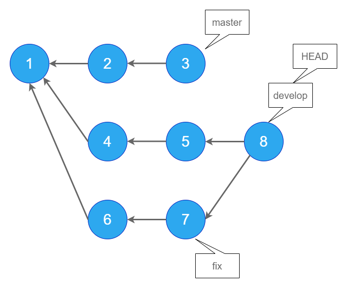
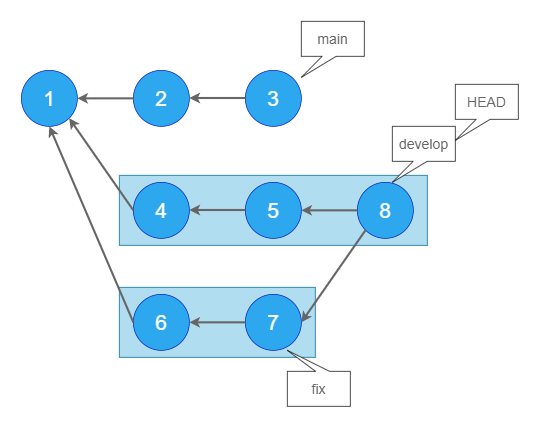
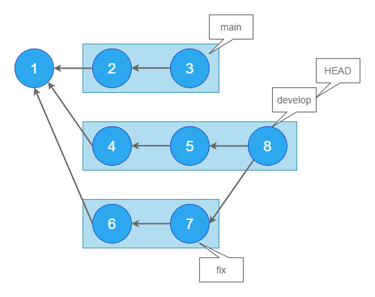

# より詳しいオプションを

前回はgit logの基本的なオプションを紹介しましたが、今回はもっと掘り下げてより高度なオプションを紹介したいと思います。

前回までは、いわば、ある一つのブランチの中で完結するようなオプションを紹介しました。

複数のブランチが切られている時（というかそれが当たり前ですが）、git logと打ってどの範囲のログが出力されるか、正確にわかっていますか？ 「あのブランチだけのログが見たいのに、何故か違うブランチのログも出力される。。。」といったことはありませんか？「雰囲気でHEAD~とか打ってるけど詳しい意味は分かってない。。。」といったことはありませんか？

たまーに出てくるチルダ(~)やキャレット(^)ですが、どのような意味を持っているかわかっていますか？

私もわかっていなかったので改めて確認したいと思います。

## その前に参考記事

この記事を読むためには、ブランチとHEADという概念をある程度わかっている必要があります。「ブランチって何？」「HEADって何？」を確認しておきたい方は以下の良記事を読むことをお勧めします。

[GitのHEADとは何者なのか](https://qiita.com/ymzkjpx/items/00ff664da60c37458aaa)

## 2つのブランチを対象にログを出力する

このセクションではダブルドット構文（`..`）とトリプルドット構文（`...`）の使用方法を説明します。

<aside>

ダブルドット構文とトリプルドット構文という言葉は公式リファレンスの日本語版ページから引用してます。

[こちら](https://git-scm.com/book/ja/v2/Git-%E3%81%AE%E3%81%95%E3%81%BE%E3%81%96%E3%81%BE%E3%81%AA%E3%83%84%E3%83%BC%E3%83%AB-%E3%83%AA%E3%83%93%E3%82%B8%E3%83%A7%E3%83%B3%E3%81%AE%E9%81%B8%E6%8A%9E)

</aside>

これらの構文は2つの引数（便宜上、引数と呼びます）をとります。

`..`は、どちらか一方からのみ辿れるコミットを出力します。結果は引数の渡し順によって変わります。

`...`は、どちらか一方から辿れるコミットを出力します。こちらは引数の渡し順によって変わりません。

また、どちらも、2つのブランチ間で重複しているコミットを除く動きをします。

前提として、リポジトリは以下の状態であるとします。



main、develop、fixという3つのブランチがあります。8はdevelopにfixをマージしたマージコミットです。現在HEADはdevelopを指しています。

まずはgit log ブランチ名と入力したときの出力を確認しておきます。

## git log main

mainブランチである3から矢印で辿れる、3,2,1が対象です。


## git log develop (git log HEAD)

developブランチである8から辿れる、8,7,6,5,4,1が対象です。


## git log fix

fixブランチである7から辿れる、7,6,1が対象です。


## git log develop..main

では、`..`の動作を確認します。

言語化するとしたら「developになくて、mainにだけあるもの」 でしょうか 。3,2が出力されます。

mainから3,2,1が辿れますが、1はdevelopからも辿れるので対象外です。


## git log main..develop

上記の逆です。読み方は「mainになくて、developにだけあるもの」。

developから8,7,6,5,4,1が辿れますが、1はmainからも辿れるので対象外です。



### git log main..fix

読み方は「mainになくて、fixにだけあるもの」。

fixから7,6,1が辿れますが、1はmainからも辿れるので対象外です。


### git log fix..develop

読み方は「fixになくて、developにあるもの」。

developから8,7,6,5,4,1が辿れますが、7,6,1はfixからも辿れるので対象外です。


### git log develop..fix

読み方は「developになくて、fixにだけあるもの」。

fixから7,6,1が辿れますが、これらは全てdevelopからも辿れるのでコミットは出力されません。


### git log main...develop (git log develop...main)

ここからは`...`の使用方法です。

`...`は、**どちらか一方からだけ辿れるもの**を出力します。どちらからも辿れるものは対象外です。

上記のコマンドで言うと、読み方は「mainかdevelopのどちらか一方にあるもの」です。

1はmainからもdevelopからも辿れるので対象外です。



なお、...を使用する場合、どのような順番でブランチを指定しても結果は同じです。

### git log develop...fix (git log fix...develop)

読み方は「developとfixのどちらか一方にあるもの」です。

7,6,1はdevelopからもfixからも辿れるので対象外です。


## --left-onlyと--right-onlyを使用する

### --left-rightを使用する

以上、`..`と`...`の動作を図示しましたが、実際にコンソール上でgit logした時、わかりやすい出力になっているとは言えないと思います。

$ 例

## チルダとキャレット

### git log develop~

チルダを付与することで親のコミットを取得できます。

この場合、git log develop~はgit log 5と同義と言えます。


### git log develop~~ (git log develop~2)

チルダを複数つけることで、更に親を辿っていくことができます。また、~~は~2に置き換えることができます。


### git log develop^


## git logではないけれど

以上、git logに関係するオプションを紹介しましたが、git logではないもののコミットログに関係するコマンドをいくつか紹介したいと思います。

### git shortlogでユーザごとのコミット履歴を取得する

`git shortlog`で各コミットをコミットを行ったユーザごとに分類して表示します。 以下の例だと、alien👽さんが1コミット、potsunenさんが5コミット行ったことが分かります。コミット数でマウントをとりたいときに便利です。

```shell
$ git shortlog

alien (1):
      edit style.scss

potsunen (5):
      initial commit
      first commit
      second commit
      third commit
      create style.scss
```

## 感想

日本語って難しい。。。

