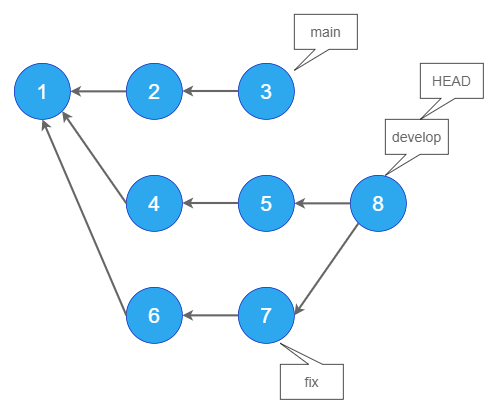
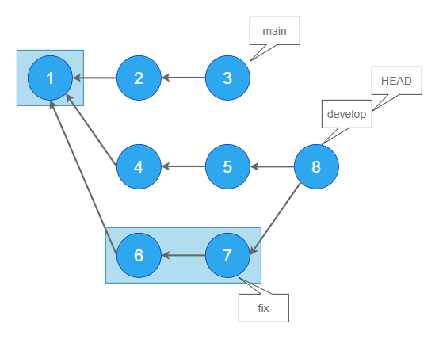
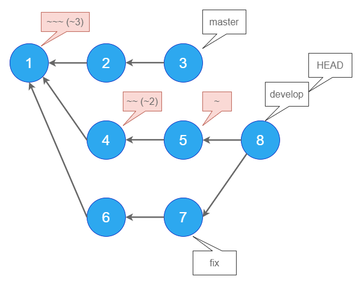
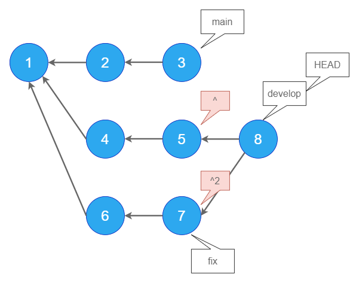
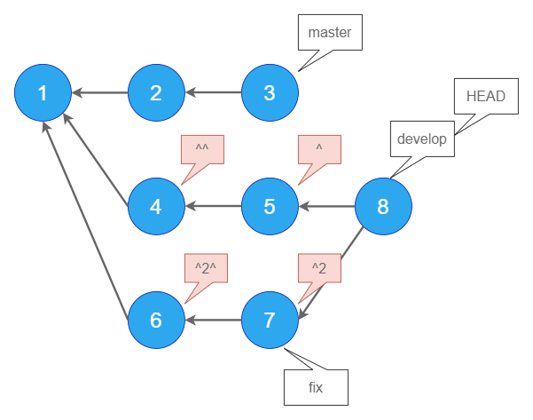
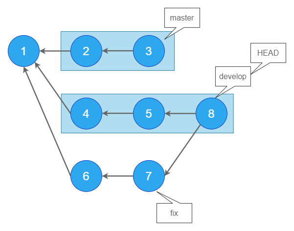
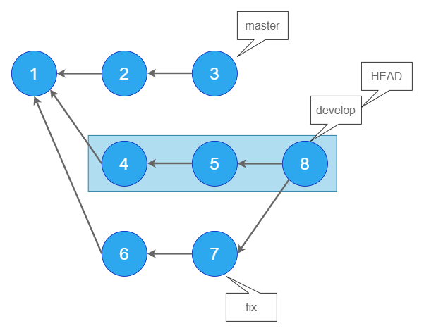

# git logのオプション（後編）

今回も`git log`のオプションについての紹介ですが、前編中編とは少し趣旨が違います。

これまでは、いわば、ある一つのブランチの中で完結するようなオプションを紹介しました。 複数のブランチが切られている時（というかそれが当たり前ですが）、`git log`と打ってどの範囲のログが出力されるか、正確に分かっていますか？ 「あのブランチだけのログが見たいのに、何故か違うブランチのログも出力される。。。」といったことはありませんか？「雰囲気で`HEAD~`とか打ってるけど詳しい意味は分かってない。。。」といったことはありませんか？ たまーに出てくるチルダ(~)やキャレット(^)ですが、どのような意味を持っているか分かっていますか？

私もわかっていなかったので改めて確認したいと思います。

## 2つのブランチを対象にログを出力する

まずは、ダブルドット構文(`..`)とトリプルドット構文(`...`)の使用方法を説明します。

<aside>

ダブルドット構文とトリプルドット構文という言葉は公式リファレンスの[日本語版ページ](https://git-scm.com/book/ja/v2/Git-%E3%81%AE%E3%81%95%E3%81%BE%E3%81%96%E3%81%BE%E3%81%AA%E3%83%84%E3%83%BC%E3%83%AB-%E3%83%AA%E3%83%93%E3%82%B8%E3%83%A7%E3%83%B3%E3%81%AE%E9%81%B8%E6%8A%9E)から引用してます。

</aside>

これらの構文は2つの引数（便宜上、引数と呼びます）をとります。`ブランチA..ブランチB`といった形ですね。

`..`は、どちらか一方から**のみ**辿れるコミットを出力します。結果は引数の渡し順によって変わります。`...`は、どちらか一方から辿れるコミットを出力します。こちらは引数の渡し順によって変わりません。

また、どちらも、2つのブランチ間で**重複しているコミットを除く**動きをします。

---

前提として、リポジトリは以下の状態であるとします。



`master`、`develop`、`fix`という3つのブランチがあります。

青い丸の中の数字はコミットのハッシュIDです。`8`は`develop`に`fix`をマージしたマージコミットです。現在`HEAD`は`develop`を指しています。

このリポジトリを再現するには、以下のスクリプトを実行してください。

<details>
<summary>スクリプトを見る</summary>

```shell
git init

# masterブランチで作業
git commit -m "1" --allow-empty
git commit -m "2" --allow-empty
git commit -m "3" --allow-empty

# developブランチを作成
git checkout -b develop HEAD~~

# developブランチで作業
git commit -m "4" --allow-empty
git commit -m "5" --allow-empty

# fixブランチを作成
git checkout -b fix HEAD~~

# fixブランチで作業
git commit -m "6" --allow-empty
git commit -m "7" --allow-empty

# developブランチに移動
git checkout develop

# fixブランチをマージ
git merge --no-ff fix -m "8"

```

</details>

まずは、`git log ブランチ名`といった風に、単体でブランチ名を入力した場合の出力を確認しておきます。

### git log master

`master`である`3`から矢印で辿れる、`3,2,1`が対象です。


### git log develop(HEAD)

`develop`である`8`から辿れる、`8,7,6,5,4,1`が対象です。


現在`HEAD`は`develop`を指していることから、`git log HEAD`としても同じです。

### git log fix

`fix`である`7`から辿れる、`7,6,1`が対象です。



### git log develop..master

では、`..`の動作を確認します。

言語化するとしたら「`develop`になくて、`master`にだけあるもの」 です 。`3,2`が出力されます。

`master`から`3,2,1`が辿れますが、`1`は`develop`からも辿れるので対象外です。


`master`から辿れる`3,2,1`から、`develop`からも辿れて重複している`1`が除かれているのが分かると思います。冒頭で「2つのブランチ間で重複しているコミットを除く動きをします。」と説明したのはこのことです。

### git log master..develop

上記の逆です。読み方は「`master`になくて、`develop`にだけあるもの」です。

`develop`から`8,7,6,5,4,1`が辿れますが、`1`は`master`からも辿ることができ、重複しているので対象外です。


## git log master..fix

読み方は「`master`になくて、`fix`にだけあるもの」です。

`fix`から`7,6,1`が辿れますが、`1`は`master`からも辿れるので対象外です。


### git log fix..develop

読み方は「`fix`になくて、`develop`にだけあるもの」です。

`develop`から`8,7,6,5,4,1`が辿れますが、`7,6,1`はfixからも辿れることができ、重複しているので対象外です。


### git log develop..fix

読み方は「`develop`になくて、`fix`にだけあるもの」です。

`fix`から`7,6,1`が辿れますが、これらは全て`develop`からも辿れることができ、重複しているのでコミットは出力されません。


### リモートリポジトリとの差分を確認できる

これまで示した例のように、ローカルでブランチ間の差分を見るのにも使用できますが、リモートリポジトリー（GitHubなど）との差分を見るのにこのコマンドは役に立ちます。

例えば`git log origin/featureAAA..featureAAA`とすると、リモートになくてローカルにあるコミットだけを出力できます。つまり、どのコミットを`push`すべきかという事が分かります。

### git log master...develop (git log develop...master)

ここからは`...`の使用方法です。

`...`は、**どちらか一方から辿れるもの**を出力します。どちらからも辿れるもの（つまり重複しているもの）は対象外です。

上記のコマンドでいうと、読み方は「`master`か`develop`のどちらか一方にあるもの」です。`1`は`master`からも`develop`からも辿ることができ、重複しているので対象外です。


なお、`...`を使用する場合、どのような順番でブランチを指定しても結果は同じです。

### git log develop...fix (git log fix...develop)

読み方は「`develop`と`fix`のどちらか一方にあるもの」です。`7,6,1`は`develop`からも`fix`からも辿れることができ、重複しているので対象外です。


## チルダとキャッレット

チルダ`~`とキャレット`^`はgitの中でも理解しにくいものの一つです。私も何となく分からないので何となく放置していました。

あと、ググラビリティも低いですね。

### `~`で親のコミットを表す

チルダを付与することで、**ひとつ親のコミット**を表すことができます。この場合、`git log develop~`は`git log 5`と同義と言え、`5,4,1`が出力されます。


同様に、`~~`、`~~~`といった風に`~`を連ねればその分だけ親をさかのぼることができます。また、`~~`は`~2`、`~~~`は`~3`と表すこともできます。



### `^`で親を選択する

キャレット`^`は**複数の親がある場合**（マージコミットなど）に有効です。`git log develop^`とすることで**ひとつめの親**である`5`を指すことになります。同様に、`develop^2`とすると、ふたつ目の親である`7`を指すことになります。



`git log develop^2`とすると、2つ目の親である`7`を指すことになり、`7,6,1`が出力されます。

しかし、`develop^^`と`develop^2`は同義ではありません。`develop^^`は、`develop^`の`^`という風に「一つ目の親の一つ目の親」という意味になります。

`develop^2^`は「2つめの親の一つ目の親」であり、`develop^2~`と同義です。



複雑ではないコミット履歴をこうやって図示しているから分かりやすいものの、これをコマンドラインでやろうと思うと直感的に理解しにくいと思います。この辺りはGUIツールの出番ですね。`^`と`~`は`git log`以外にも色んなところで出てくるので、これらの持つ意味さえ覚えておけばOKです。

## `--not`でブランチを除外する

`--not ブランチ名`とすることで、そのブランチから辿れるコミットを除くことができます。

`..`や`...`と同じオプションにも見えますが、これらは引数を2つしかとることができません。しかし`--not`なら、例えば、`git log master develop --not fix`とすることで、「`master`と`develop`から辿れるコミットから、`fix`からも辿れるコミットは除外する」といった風に、3つ以上のブランチ名を記述することができます。



また、`--not ブランチA ブランチB`といった風に、2つ以上のブランチを除外することもできます。下図は`git log develop --not master fix`のイメージです。



これもややこしいですね。頭の中でこういったイメージを持ちながらコミットを辿るのは限界があります。GUIツールを頼りましょう。

また、ブランチ名の前にキャレット`^`をつけることで、`--not`と同じく、ブランチを除外することができます。`git log develop ^master ^fix`といった具合です。このように、`^`はブランチ名の前につけるか後ろに付けるかで全く意味が変わってきます。

---

## 参考

[[git] チルダ(~)とキャレット(^)の違い | Tech控え帳](https://www.chihayafuru.jp/tech/index.php/archives/2535)

[Git の HEAD^ と HEAD~ の違い - yu8mada](https://yu8mada.com/2018/05/30/the-difference-between-head-caret-and-head-tilde-in-git/)

[git の歴史の辿り方 &middot; けんごのお屋敷](http://tkengo.github.io/blog/2014/02/10/how-to-track-git-history/)

[[Git] blameコマンドで特定の行がいつ変更されたのか調べて、バグの混入を見つける - YoheiM .NET](https://www.yoheim.net/blog.php?q=20160709)
