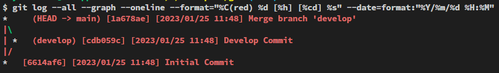
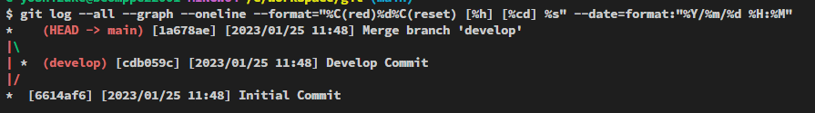
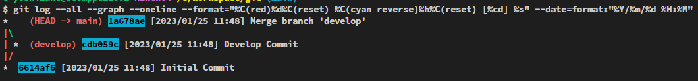

# うわっ、git logの結果、簡単すぎ...？

`git log`のオプションを紹介した時、`git log --oneline --all --graph`という例を挙げました。

```bash
$ git log --all --graph --oneline
*   1a678ae (HEAD -> main) Merge branch 'develop'
|\
| * cdb059c (develop) Develop Commit
|/
* 6614af6 Initial Commit
```

しかしコミットの日時情報すらなく、ちょっと簡素的すぎるかもと思います。そこで今回は、`git log`の結果を**任意の形式にカスタマイズして**出力する方法をお伝えします。

## --pretty=formatでカスタマイズできる

まずは以下のコマンドを入力してみてください。`--all`と`--graph`を付けているので、全てのブランチのコミット情報がグラフ形式で出力されるのは変わりません。`--format="%d %h"`としているところがポイントです。

```bash
$ git log --all --graph --oneline --format="%h"
*   1a678ae
|\
| * cdb059c
|/
* 6614af6
```

何となーくお分かりかもしれませんが、`%h`はハッシュIDの短縮版を表します。次は半角スペースを空けながら`%d %h %s`と入力してみます。

```shell
$ git log --all --graph --oneline --format="%d %h %s"
*    (HEAD -> main) 1a678ae Merge branch 'develop'
|\
| *  (develop) cdb059c Develop Commit
|/
*  6614af6 Initial Commit
```

`%d`はブランチやタグを表し、`%s`はコミットメッセージを表します。そう！`--pretty="format:"%〇%〇"`の形式で、出力内容を自由にフォーマットすることができるのです。

|記号|内容|
|---|---|
|%H|ハッシュID|
|%h|ハッシュID(短縮版)|
|%P|親のハッシュID|
|%p|親のハッシュID(短縮版)|
|%T|ツリーのハッシュID|
|%t|ツリーのハッシュID(短縮版)|
|%s|コミットメッセージ|
|%an|Authorの名前|
|%ad|Author Date|
|%cn|committerの名前|
|%cd|Committer Date|
|%d|ブランチやタグ|

また、`[]`や`-`といった記号も自由に記述できます。 `%h`を"[]"で囲うとこうなります。

```shell
$ git log --all --graph --oneline --format="%d [%h] %s"
*    (HEAD -> main) [1a678ae] Merge branch 'develop'
|\
| *  (develop) [cdb059c] Develop Commit
|/
*  [6614af6] Initial Commit
```

ちょっと特殊な文字で、タブも入力できます。

|記号 |内容 |
|---|---|
|%x09|水平タブ|

**x09**は「水平タブ」のASCIIコードです。文字コードを直接入力することができるようですね（`0x09`ではなく、`x09`と入力しないと駄目なようです。）。

```shell
$ git log --all --graph --oneline --format="%x09 %d [%h] %s"
*         (HEAD -> main) [1a678ae] Merge branch 'develop'
|\
| *       (develop) [cdb059c] Develop Commit
|/
*         [6614af6] Initial Commit
```

なに？色が消えて白黒になった？大丈夫です。色を付ける方法もちゃんと後でお伝えします。

## 日付を表示させる

とりあえずブランチ、ハッシュID、コミットメッセージは表示させましたが、日付も表示させたいですね。

日付のフォーマットは`--date`で行います。まずはコミット日時を表す`%cd`を`--format=""`の中に追記します。

```shell
$ git log --all --graph --oneline --format="%x09 %d [%h] [%cd] %s"
*         (HEAD -> main) [1a678ae] [Wed Jan 25 11:48:27 2023 +0900] Merge branch 'develop'
|\
| *       (develop) [cdb059c] [Wed Jan 25 11:47:26 2023 +0900] Develop Commit
|/
*         [6614af6] [Wed Jan 25 11:46:26 2023 +0900] Initial Commit
```

うーん読みにくいですね。というわけで、`--date=short`を追記してみます。`--date`は出力される日付のフォーマットを決定するオプションです。場所はどこでも構いません。私は末尾に記述しました。

```shell
$ git log --all --graph --oneline --format="%x09 %d [%h] [%cd] %s" --date=sh
ort
*         (HEAD -> main) [1a678ae] [2023-01-25] Merge branch 'develop'
|\
| *       (develop) [cdb059c] [2023-01-25] Develop Commit
|/
*         [6614af6] [2023-01-25] Initial Commit
```

指定できるオプションは以下のようなものがあります。

|オプション|出力|
|:---------|----|
|local|ローカルタイムゾーン|
|iso|ISO 8601フォーマット|
|rfc|rfc 2822フォーマット|
|short|YYYY-MM-DD|
|realative|相対時間|

中でも`realative`は使う機会があるかもしれません。現時点を基準に`3days ago`などと表示してくれます。

```bash
$ git log --all --graph --oneline --format="%x09 %d [%h] [%cd] %s" --date=re
lative
*         (HEAD -> main) [1a678ae] [2 minutes ago] Merge branch 'develop'
|\
| *       (develop) [cdb059c] [3 minutes ago] Develop Commit
|/
*         [6614af6] [4 minutes ago] Initial Commit
```

### `--date=format`でカスタマイズする

もっと細かに日付のフォーマットを加工したいなら、`--date=format:"○○"`という形で指定します。

Gitのリファレンスを探してもオプションに関する記述を見つけられなかったですが、恐らく以下のようなオプションがあると思われます。

|オプション|出力|出力例|
|:---------|----|----|
|%Y|年|2023|
|%y|年（短縮）|23|
|%m|月|11|
|%d|日|11|
|%H|時|17|
|%M|分|42|
|%S|秒|01|

例えば`--date=format:"%Y/%m%d-%H%M"`とすると、以下のように出力されます（段々長くなってきて疲れてきましたね）。

```bash
$ git log --all --graph --oneline --format="%x09 %d [%h] [%cd] %s" --date=format:"%Y/%m/%d %H:%M"
*         (HEAD -> main) [1a678ae] [2023/01/25 11:48] Merge branch 'develop'|\
| *       (develop) [cdb059c] [2023/01/25 11:47] Develop Commit
|/
*         [6614af6] [2023/01/25 11:46] Initial Commit
```

## 結果に色を付ける

では最後に、出力結果に色を付けたいと思います。現在は以下の画像のように真っ白だと思いますが、


やっぱり適宜色がついていた方が可読性が高いですよね。

色の指定は`--format`の中に`%C(色)`という風に記述します。まずは`--format="%C(auto)"`と指定してみます。

```bash
$ git log --all --graph --oneline --format="%C(auto) %x09 %d [%h] [%cd] %s"
--date=format:"%Y/%m/%d %H:%M"
*         (HEAD -> main) [1a678ae] [2023/01/25 11:48] Merge branch 'develop'
|\
| *       (develop) [cdb059c] [2023/01/25 11:48] Develop Commit
|/
*         [6614af6] [2023/01/25 11:48] Initial Commit
```

恐らく以下の画像の様な配色になっていると思います。


`%C(auto)`とすることで、Gitが自動的にいい感じに色を付けてくれます。

### 自分で色を決めたい

なに？自分で色を決めたいんですか？ちょっと大変ですができます。

例えば、文字を赤くしたいなら、`--format`の最初に`%C(red)`と記述します。

```bash
$ git log --all --graph --oneline --format="%C(red) %d [%h] [%cd] %s" --date=format:"%Y/%m/%d %H:%M"
*     (HEAD -> main) [1a678ae] [2023/01/25 11:48] Merge branch 'develop'
|\
| *   (develop) [cdb059c] [2023/01/25 11:48] Develop Commit
|/
*   [6614af6] [2023/01/25 11:48] Initial Commit
```

そうすると以下の通り、出力全体が赤くなります。色は`black`、`green`、`yellow`、`blue`、`magenta`、`cyan`, `white`などの色にも対応していますし、`%C(#003399)`という風に指定することもできます。



また、`%C(reset)`とすれば、色の変更の適用をそこでストップできます。例えば`%C(red) %d %C(reset)`とすれば、ブランチ名だけが赤く表示され、それ以降は白い文字になります。

```bash
$ git log --all --graph --oneline --format="%C(red)%d%C(reset) [%h] [%cd] %s" --date=format:"%Y/%m/%d %H:%M"
*    (HEAD -> main) [1a678ae] [2023/01/25 11:48] Merge branch 'develop'
|\
| *  (develop) [cdb059c] [2023/01/25 11:48] Develop Commit
|/
*  [6614af6] [2023/01/25 11:48] Initial Commit
```



さらに、`%C(色 reverse)`とすることで、背景を塗りつぶすことができます。以下の例では、ハッシュ値の背景をシアンに塗りつぶしています。

```bash
$ git log --all --graph --oneline --format="%C(red)%d%C(reset) %C(cyan reverse)%h%C(reset) [%cd] %s" --date=format:"%Y/%m/%d %H:%M"
*    (HEAD -> main) 1a678ae [2023/01/25 11:48] Merge branch 'develop'
|\
| *  (develop) cdb059c [2023/01/25 11:48] Develop Commit
|/
*  6614af6 [2023/01/25 11:48] Initial Commit
```



## 最後はエイリアスを設定しよう

以上が主なカスタマイズ方法ですので、皆さん心行くまでカスタマイズを楽しんでください（私は数時間で飽きました。その後泣きながらこの記事を書いていました）。世界に一つだけのカスタマイズが完成したら、すぐに呼び出せるようにエイリアスを作成しましょう。

`git config --edit --global`で設定ファイルが呼び出せるので、以下のように入力すればOKです。

```bash
[alias]
        lol = log --all --graph --format='%C(red)%d%C(reset) %C(cyan reverse)%h%C(reset) [%cd] %s' --date=format:'%Y/%m/%d %H:%M'
```

---

今回まで長らく続いてきた`git log`に関する解説はひとまず終了です。次は恐らく`git rebase`あたりの記事になると思います。

## 参考

[Git - pretty-formats Documentation](https://git-scm.com/docs/pretty-formats)

[git logのフォーマットを指定する](https://qiita.com/harukasan/items/9149542584385e8dea75)

[git log を見やすくする](https://qiita.com/takasianpride/items/842a785af610025a2030)

[git log の表示とか色をがんばる - Qiita](https://qiita.com/qurage/items/daa67763e5a0090af06a)

[gitconfig の基本を理解する - Qiita](https://qiita.com/shionit/items/fb4a1a30538f8d335b35)

[[Git]これだけ押さえる！gitconfigの基本 - Qiita](https://qiita.com/kawasaki_dev/items/41afaafe477b877b5b73)
