# 最初の一歩

講座第2回目ですが、今回は

- ⚡️ HTMLの解説
- ⚡️ HTMLファイルを作成する
- ⚡️ 文章をページに表示させる

上記3つを行います。

当ブログのモットーは**最小構成 & スモールステップ**です。やることは**極限までシンプル**に、そして**目標は小さく設定**し、一つずつクリアしていけばHTMLとCSSの学習は難しくありません。


## HTMLとCSS

こんな辺境のブログにまで来ている人なら、恐らくHTMLとCSSという単語くらいは聞いたことがあると思います。「ホームページを作るプログラミング言語」みたいな認識はあるのではないでしょうか。

では果たして、HTMLとCSSとはいったい何を行うものなのでしょうか。2つセットで語られることが多いような気がしますが、いったいどんな意味を持つのでしょうか。

HTMLは**HyperText Markup Language**のことで、Webページの**文書構造**を表すための言語です。「文書構造」という言葉が分かりにくいかもしれませんが、「どのような文章が書かれているか、どのような画像が使われているか」を記述したものです。

CSSは**Cascading Style Sheets**のことで、Webページを**装飾**するための言語です。文字の大きさや画面の背景色をカスタマイズするのはCSSの仕事です。

私のポートフォリオサイトを例にHTMLとCSSの違いを説明します。以下は私のポートフォリオサイトのキャプチャーです。

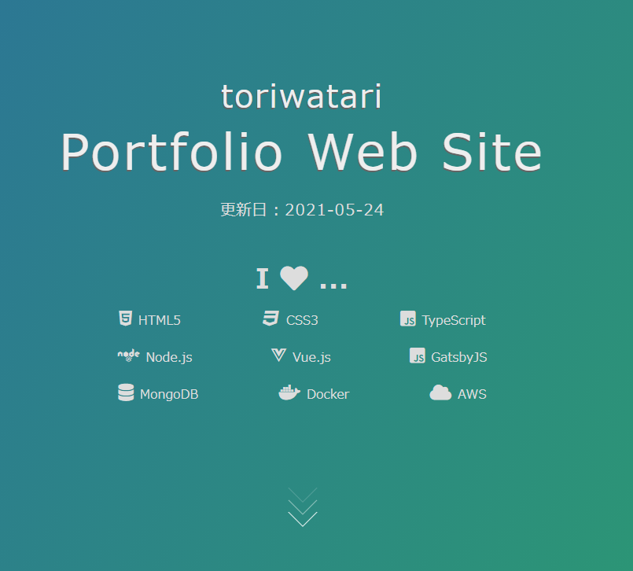

このWebサイトはhtmlファイルとcssファイルを組み合わせて作成しています。cssファイルを削除し、**htmlファイルだけ**の状態にすると以下のように変化します。

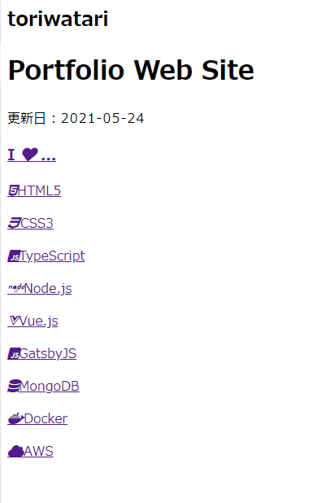

緑色の背景や文字の配置位置などがなくなり、不愛想なただの文字の羅列になりました。

前述したようにHTMLは**文書構造**を表すための言語です。上記のポートフォリオサイトの例で言うと、「**ページのタイトル**はtoriwatari Portfolio Web Siteです」「**ページの更新日付**は2021年4月10日です」といった内容を読者やWebブラウザーに伝えています。

そしてそのHTMLをデザインするのがCSSの仕事です。HTMLはWebページの土台であり骨組みです。HTMLなくしてCSSはありません。

このようにHTMLとCSSは明確に役割が分かれています。「HTMLは文書構造、CSSは文書構造をデザイン」と憶えておきましょう。

## htmlファイルを作成する

それではhtmlファイルを作成し、好きな文字をWebページに表示させてみましょう。

まずは作業フォルダーを作成します。任意の場所に「workspace」という名前のフォルダーを作成、その中に「HTML&CSS」フォルダーを作成します。このフォルダーの中で作業を行うことにしましょう。

HTML&CSSフォルダーの中に`index.html`ファイルを作成します。ファイル名の`index`は変更可能ですが、慣習的に`index`が用いられていますのでそう命名することをお勧めします。拡張子である`html`は変更不可です。

現在のフォルダー構成は以下の通りになっています。

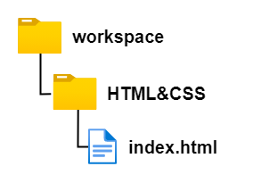

---

VSCodeをお使いの方に向けて、VSCodeでの`index.html`ファイルを作成する手順を記述しておきます。

VSCodeを立ち上げ、`ファイル(F)`を開き、`フォルダーを開く`を選択します。

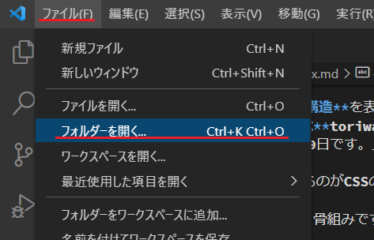

そして先ほど作成した`HTML&CSS`フォルダーを選択し、`フォルダーの選択`をクリックします。

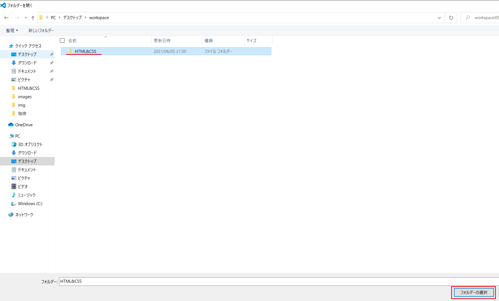

これでVSCodeでフォルダーを開くことができました。

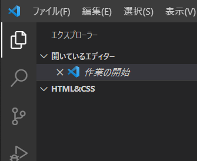

さらに、`HTML&CSS`フォルダーの少し下で右クリックし、`新しいファイル`をクリックします。

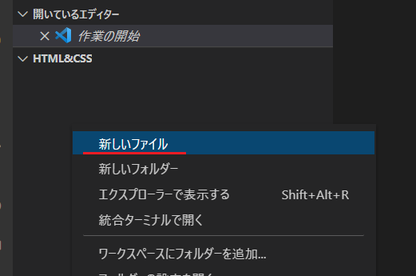

続けて`index.html`と打ち込めばhtmlファイルの出来上がりです。

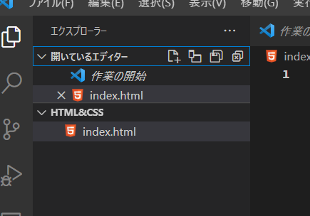

## htmlファイルに内容を書きこむ

では、htmlファイルの内容を編集していきます。VSCodeをお使いの方は、1行目に半角の`!`を入力してください。すると以下のようなポップアップが表示されると思います。

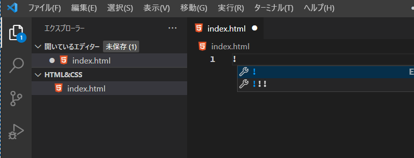

続けてTabキーを押下すると、HTMLのひな型が自動的に作成されます。便利です。

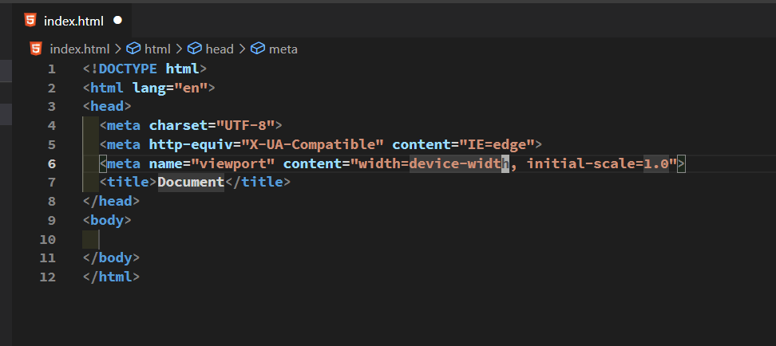

上手く動かない、VSCodeを使用していないという方は、以下のコードをコピーして張り付けてください。

```html:title=index.html
<!DOCTYPE html>
<html lang="ja">
<head>
  <meta charset="UTF-8">
  <meta name="viewport" content="width=device-width, initial-scale=1.0">
  <title>Document</title>
</head>
<body>
  
</body>
</html>
```

続けて、9行目、`<body>`と`</body>`の間の行にページに表示させたい文字列を記述します。こういう時は「Hello World」と入力すると相場は決まっていますのでそうしてみましょう。

```html{9}:title=index.html
<!DOCTYPE html>
<html lang="ja">
<head>
  <meta charset="UTF-8">
  <meta name="viewport" content="width=device-width, initial-scale=1.0">
  <title>Document</title>
</head>
<body>
  Hello World  
</body>
</html>
```

入力が完了したらファイルを上書き保存します。

VSCodeをお使いの方は、画面上部の、ファイル名が書いてあるタブに注目してください。変更が加えられたが未保存である場合は「●」が表示され、そのことを教えてくれます。

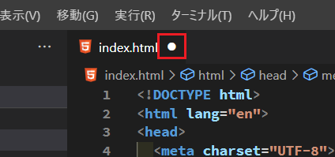

上書き保存するためには、`ファイル(F)`を開き、`保存`を選択します。これでhtmlファイルが更新されます。

また、`保存`の右側に`Ctrl+S`と書いてありますね。これはキーボードショートカットのことで、「`コントロール`キーを押しながら`s`を押すことで上書き保存できる」ということを教えてくれています。

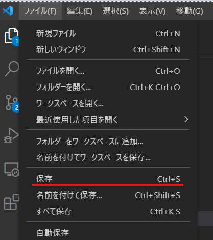

いずれにせよ、ファイルの上書き保存を行い、再度タブに注目すると、「●」が「×」に変化しています。こうやって上書き保存がされたかどうかを確認することができます。

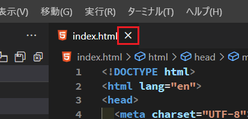

これでhtmlファイルが完成です。完成したhtmlファイルをダブルクリックして実行してください（この時、メモ帳が開いてしまう方はこの下にある段落を確認してください）。

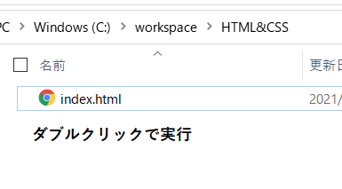

もしくはVSCodeの**Live Server**プラグインをインストールしている方は、右下の`Go Live`をクリックしてください。

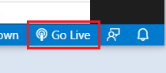

ブラウザーが立ち上がれば、入力した任意の文字列が表示されていることが確認できるはずです。

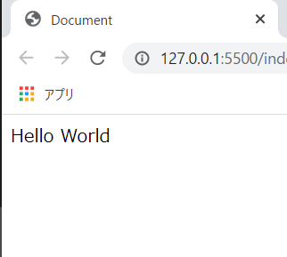

おめでとうございます🎉🎉🎉。これも立派なWebページだと言えるでしょう。Webサーバーなど用意しなくても、最低限htmlファイルとブラウザーがあればこうやってページを表示させることが可能です。

### メモ帳が開いてしまう方へ

`index.html`をダブルクリックした時、Windowsのメモ帳が開いてしまう方がいるかもしれません。その時は以下の手順で既定のアプリケーションを変更します。

`index.html`で右クリックし、`プログラムから開く(H)`にカーソルを合わせ、さらに`別のプログラムを選択(C)`をクリックします。

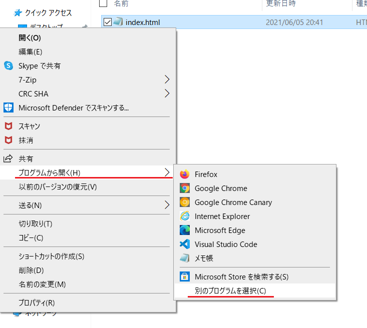

以下のような画面が現れますので、「その他のオプション」から「Google Chrome」を探し選択します。この時、「常にこのアプリを使って.htmlファイルを開く」にもチェックを入れておきます。続けて「OK」をクリックします。

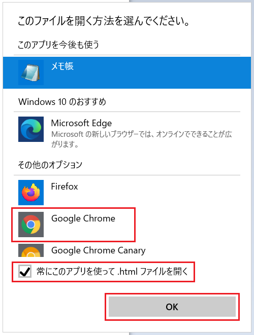

そうすると無事Chromeでhtmlファイルを開けたと思います。また、再度htmlファイルを見ると、左側にあるアイコンがChromeのアイコンに変わっているはずです。

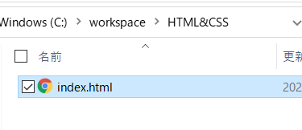

「htmlファイルはデフォルトでGoogle Chromeを使って開く」という設定を行いました（これまではメモ帳がデフォルトでした）ので、これ以降はダブルクリックするだけでhtmlファイルがChromeで開けます。

## もう少しhtmlファイルをいじる

続けて、`index.html`の中身を確認しながら、もう少し内容を編集したいと思います。

htmlファイルに**要素**をいくつか追加します。要素についての詳しいことは後述しますが、見出しを表すh1要素と、段落を表すp要素を2つ追加します。具体的には以下のように記述します。

```html{3-5}:title=index.html
...(略)
<body>
  <h1>Hello World</h1>
  <p>こんにちは、いい天気ですね。</p>
  <p>今日はご飯でもおごりますよ。</p>
</body>
</html>
```

後述する**タグ**と呼ばれる`<h1>`や`<p>`などは全て**半角**で記述してください。タグに囲まれている「Hello World」や「こんにちは、～」などは自由です。半角で書いても全角で書いてもOKです。

記述ができたらブラウザーをリロードします。すると以下のような表示に変わっているはずです。編集した3行が画面に加わっていることがわかります。

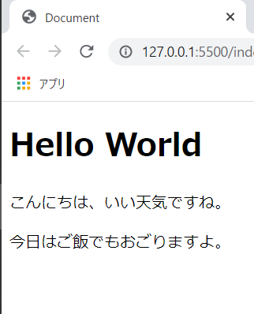

### 文字コードについて

ここで文字コードについて補足しておきます。

実はhtmlファイルを保存する際、**文字コード**なるものを指定する必要があります。Webページを作成する時には、文字コードは**UTF-8**を指定します。もし、`index.html`をブラウザーで開き、日本語部分が文字化けしているようなら文字コードがUTF-8になっていない可能性があります。以下の手順を踏んで確認してみてください。

<aside>

`index.html`の文字コードがUTF-8に設定されていないと、以下のように文字化けすることがあります（文字コードが**Shift-JIS**になっている場合の画面）。

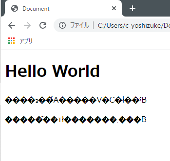

最近のWindowsは自動的にUTF-8が選択されますし、ほとんどの方は問題なく日本語が表示されていると思います。問題のない方はこの手順は飛ばして、次の「タグと要素」まで進んでください。

</aside>

VSCodeをお使いの方は、画面右下にファイルの文字コードが表示されている部分があります。ここをクリックしてください（カーソルを合わせると、「エンコードの選択」と表示されると思います）。

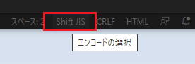

すると、画面上部にポップアップが表示されますので、「エンコード付きで保存」を選択します。

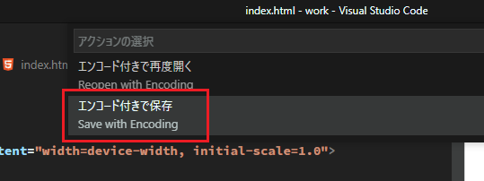

さらに、利用できる文字コード一覧が表示されるので、UTF-8を選択します。

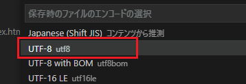

これで`index.html`の文字コードが`UTF-8`に変更されました。再度画面右下を確認すると、`UTF-8`と表示されているはずです。

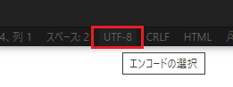

そして、ページを再読み込みすると、文字化けせず正常に表示されているはずです。

### タグと要素

さて、文字コードから話を戻します。改めてhtmlコードを見てみると、`<h1>`や`<p>`など、`<`と`>`で囲われた文字列が沢山あります。しかしこれらは画面には表示されていません。

これを**タグ**といいます。`<h1>`ならh1タグ、`<p>`ならpタグなんて呼んだりします。

そしてもう一つ、`</h1>`や`</p>`など、文字の前に`/`がついたものもあります。これもタグです。

先に紹介した`<h1>`や`<p>`を**開始タグ**、`/`がついている`</h1>`や`</p>`を**終了タグ**といいます。そして、これら2つで表示させたい内容を囲みます。これらひとまとまりが前述した**要素**です。

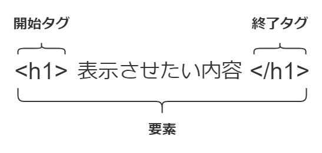

HTMLは基本的に開始タグ、内容、終了タグの3点セットで構築していきます。

ではここで、**要素**とは一体何か、どんな役割を持っているのかを考えたいと思います。

htmlファイルをよく見てみると、2行目と最終行で`<html>`と`</html>`が使われていることが分かります。

```html{2,13}:title=index.html
<!DOCTYPE html>
<html lang="ja">
<head>
  <meta charset="UTF-8">
  <meta name="viewport" content="width=device-width, initial-scale=1.0">
  <title>Document</title>
</head>
<body>
  <h1>Hello World</h1>
  <p>こんにちは、いい天気ですね。</p>
  <p>今日はご飯でもおごりますよ。</p>
</body>
</html>
```

これは、「2行目から最終行まで、**htmlファイルの内容**を記述しています」ということをブラウザーに伝えているのです。そしてこれを**html要素**といいます。

さらに`<head>`と`</head>`の組み合わせもあります。これを**head要素**といいます。これは「ここからここまで、**Webページの情報**を記述しています」ということを伝えています。

`<body>`と`</body>`でしたら**body要素**です。「**ブラウザに表示される内容**を記述しています」という意味です。ページに表示させたい文章や画像は、このbody要素内に入れる必要があります。確かに、body要素に記述されていないもの、例えばhead要素の中身はブラウザーには描画されていませんよね。

そして、head要素とbody要素がhtml要素の中に入っていることが分かりますか？このように要素は入れ子にすることができるのです。

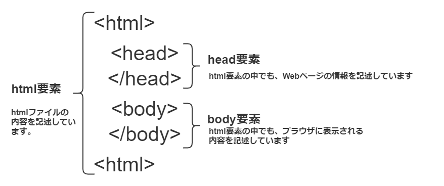

以下同様に、**h1要素**は文書の見出しを表します（Headlineのhです）。**p要素**は段落を表します（Paragraphのpです）。

要素は、**ここからここまでは〇〇の意味を持った塊です**とブラウザーに伝えるためのものです。そして、複数の要素を組み合わせたり入れ子にしたりして**文書構造**を構築していくのです。

HTMLには**100以上のタグ**が用意されていて、そのほとんどが独自の**意味**を持っています。そして私たちがhtmlファイルを作成する際は、「この文章はどんな意味を持つんだろう？どのタグを使って要素を作ればいいんだろう？」という風に考える必要があります。

### 親要素と子要素、孫要素

これまで要素についての解説をしてきましたが、ここで要素同士の関係についての考え方を解説します。

先ほど「要素を入れ子にできる」と解説しました。`index.html`ではhtml要素の中にhead要素とbody要素が入っていますね。これはhtml要素が2つの要素を**包括**していると言えます。

この時、html要素を**親要素**、head要素とbody要素を**子要素**と言います。

正確には、どの要素の立場から考えるかによって変わってくるので、「html要素から見たとき、head要素とbody要素が子要素」、「head要素とbody要素から見たとき、html要素が親要素」となります。

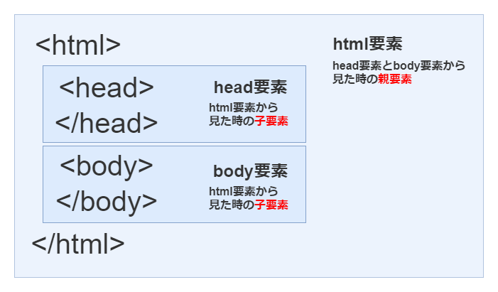

また、body要素にはh1要素とp要素がありましたね。body要素から見ればh1要素とp要素は子要素であり、h1要素とp要素から見ればbody要素は親要素です。

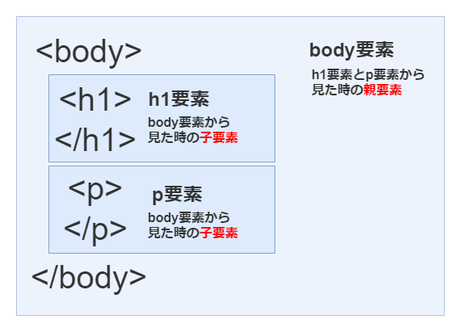

さらに、html要素から見たh1要素とp要素は**孫要素**と言えます（html要素から見るとbody要素が子要素で、その子要素であるh1要素とp要素は孫要素にあたる）。また、h1要素とp要素から見たhtml要素も**親要素**と言えます（祖父母要素とは言わないみたいですね😅）。

これらは言葉も平易で感覚的に理解でき難しい考え方ではないと思います。この要素の親子関係はCSSを考える際重要になってきます。

### HTMLは意味を持った構造でなければならない

この記事のハンズオンは以上で終わりです。お疲れ様でした。

記事の最後に、**文書構造**の意味をもう少し考えてみたいと思います。手を動かす必要はないので、「ふーん」とか言いながら流し読みしてください。

CSSを勉強すればわかりますが、どんなタグ・要素を使おうがCSSを駆使すれば綺麗なWebサイトを作成することは可能です。

<aside>

前述した通り、HTMLとCSSは文書構造とデザインに役割が明確に分離されているため、どんなタグ・要素を羅列しようがcssでのスタイリングに影響を及ぼさない。

</aside>

実際、2000年代前半は**テーブルレイアウト**なるものがHTMLコーティングの主流だったようです。HTMLには**table要素**という表を表現するための要素、そしてtableタグが存在しており、このtableタグを中心にWebサイトを構築していくのです。

実際にテーブルレイアウトというものがどんなものなのかを説明します。まずは、table要素を正しく現代風に使用した例を見てみます。

下記コードを参照ください。table要素がテーブル全体を表します。thタグというのが「table header」の略でテーブルの見出しを表し、tdタグは「table data」の略で内容を表します。

**見出し**を表すth要素で「No」「Name」を用意し、**データ**を表すtd要素で人のナンバーと名前を表示させています。タグの持つ意味に沿ってテーブルを組んでいるのが分かると思います。

```html
<body>
<table border="1">
  <tr>
    <th>No</th>   <!--見出し-->
    <th>name</th> <!--見出し-->
  </tr>
  <tr>
    <td>1</td>        <!--データ-->
    <td>田中 太郎</td> <!--データ-->
  </tr>
  <tr>
    <td>2</td>        <!--データ-->
    <td>山田 次郎</td>  <!--データ-->
  </tr>
  <tr>
    <td>3</td>        <!--データ-->
    <td>鈴木 三郎</td>  <!--データ-->
  </tr>
</table>
</body>
```

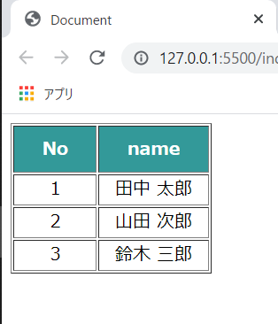

<aside>

上記画像のテーブルはCSSでスタイリングしています。htmlコードをコピーしてもこの通りにはなりません。

</aside>

テーブルレイアウトは、これらのタグを使用して**Webサイト全体**をレイアウトする手法です。

```html
<table border="0" cellspacing="0" cellpadding="0" width="960">
  <tr>
    <td colspan="2" width="100%" height="50" valign="top">
      <font size=+10>toriwatariのホームページへようこそ!</font>
    </td>
  </tr>
  <tr>
    <td width="200" align="center" valign="top">
      <br>
      <br>
      <br>
      <font color="blue">サイドバー</font><br>
      サイドバー<br>
      サイドバー<br>
      <br>
      <br>
      <br>
    </td>

    <td width="560" valign="top">
      <br>
      <br>
      <br>
      メインコンテンツ<br>
      メインコンテンツ<br>
      メインコンテンツ<br>
    </td>
  </tr>
  <tr>
    <td colspan="2" height="100" bgcolor="#aaaaaa">
      フッター
    </td>
  </tr>
</table>
```


<aside>

白状すると、このhtmlファイルはネット上で拾ったものを加工したものです。私も実際にテーブルレイアウトを書いたことはありません。

</aside>

テーブルレイアウトでは、**テーブルではないにも関わらず**tableタグなどを使用してWebサイト全体をレイアウトしていたのです。

まだHTMLのタグに意味を持たせるという考えがなく、それに伴いHTMLのタグも種類が少なかったこと、また、CSSの機能も今ほど充実しておらずtable要素を利用するのが一番レイアウトしやすかった、などという背景があったのだと思います（この辺りも私の推察です）。

また、上記のテーブルレイアウトではCSSは用いていません。タグの中に書いている「width="〇〇"」「color="〇〇"」などと言った**属性**でデザインを行うこともありました。これはつまりHTMLとCSSの役割が分離されていないという事になります。

しかし現代のHTMLには、これまで述べてきたような「タグに意味を持たせる」という考え方があります。この考え方を**セマンティックHTML**などと言ったりします。

### 結局、文書構造って？

話を戻しますが、「文書構造」とは、あるhtmlファイルが**どのような意味を持った文章の集まりで構成されているか**を示すものです。そして、適切なタグを組み合わせてhtmlファイルを作成することが文書構造をより良くすることに繋がると言えます。

## 次はCSSでデザイン

今回の記事はここで終わりです。サンプルでhtmlファイルを作成しただけですが、HTMLとCSSの役割の分離、加えて文書構造の意味について説明していると意外と長くなってしまいました。

次はCSSを使用してWebページをスタイリングしていきたいと思います。今回作成した`index.html`を引き続き利用しますので、削除せず残しておいてください。

<details style="margin-top: 60px" class="history">
<summary>更新履歴</summary>

<ul class="history-list">
  <li>2022年7月29日 : 誤字脱字を修正。</li>
</details>

## 参考

[HTML を始めよう | MDN](https://developer.mozilla.org/ja/docs/Learn/HTML/Introduction_to_HTML/Getting_started)

[ドキュメントと Web サイトの構造 | MDN](https://developer.mozilla.org/ja/docs/Learn/HTML/Introduction_to_HTML/Document_and_website_structure)

[Semantics (セマンティクス) | MDN](https://developer.mozilla.org/ja/docs/Glossary/Semantics)

[モダンなHTMLの書き方 〜Semantic が止まらない〜 | Atlas Developers Blog](https://devlog.atlas.jp/2017/10/30/1662)

[文書構造要素を使ってHTMLを記述する方法｜さきちんWEB](https://sakichin.com/chapter01/chapter01_step04_01.html)

[Progateが教えてくれない、マークアップの考え方｜にゃんこ@マークアップの人｜note](https://note.com/ake_nyanko/n/n9dcf4e0ee0e5)

[若い世代が知らない2000年代のHTMLコーディングの地獄 - ICS MEDIA](https://ics.media/entry/17960/)

[ホームページのレイアウトはテーブルではなくCSSを使う理由 | 大阪のホームページ制作会社YCOM](https://y-com.info/contents/?p=388)

[HTML5のセマンティック要素は本当にSEO に効果があるの？](https://uxseo.jp/media/article/9/)