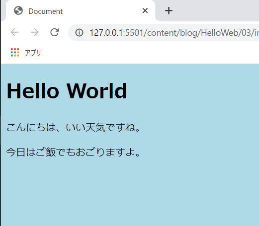

# CSSでスタイリングする

[#2](/HelloWeb/02/)の講座では、簡単なhtmlファイルの作成を行いました。今回はCSSを使ってhtmlファイルをスタイリングしたいと思います。

CSSは**Cascading Style Sheets**（カスケーディング・スタイル・シート）の略であり、Webページ（≒HTML）を装飾・スタイリングするための**スタイルシート言語**です。

Cascadingの意味を調べてみると「連続したもの」「数珠繋ぎになったもの」との説明があります。CSSにおいてCascadingがどういった意味を持つかは後から説明します。まずはCSSを触ってみましょう。

## CSSファイルを作成する

ではさっそくハンズオンを始めたいと思います。

まずは前回作成した`index.html`と同じ階層に`style.css`を作成してください。`style`の部分は変更可能です。慣習的に`style`が用いられていることが多いです。ただ、拡張子である`.css`は変更不可です。また、cssファイルもhtmlファイルと同様に文字コード`UTF-8`を選択してください。

現在、フォルダー構成は以下のようになっています。


まずは、再度`index.html`を開き、head要素内に以下のように**link要素**を追加します。

```html{6}:title=index.html
<!DOCTYPE html>
<html lang="ja">
<head>
  <meta charset="UTF-8">
  <meta name="viewport" content="width=device-width, initial-scale=1.0">
  <link href="./style.css" rel="stylesheet">
  <title>Document</title>
</head>
<body>
  <h1>Hello World</h1>
  <p>こんにちは、いい天気ですね。</p>
  <p>今日はご飯でもおごりますよ。</p>
</body>
</html>
```

link要素は**外部リソース**（今回のようなcssファイル）を指定して取り込むための要素です。`href=〇〇`という形で、読み込ませたいファイルの**パス**を記述します。パスとは、ファイルが置いてある場所のことです。今回はhtmlファイルと同じ場所にcssファイルを置いているので`./style.css`とします（パスの指定方法は別途詳しく説明します）。

その後ろに`rel="stylesheet"`と記述していますが、これは**読み込ませたいファイルの役割**を指定するものです（`rel`はrelationshipの略）。cssファイルを読み込ませているので`stylesheet`と記述します。この一文はcssファイルを読み込ませる時の定型文みたいなものです。意味を理解して覚えておきましょう。

以上を追記したら`index.html`ファイルを上書き保存します。

### 背景色を変更する

では、いよいよcssファイルの編集に取り掛かります。まずは背景色を青色に変更してみましょう。

`style.css`に以下のように記述してください。

```css:title=style.css
@charset "UTF-8";

body {
  background-color: lightblue;
}
```

記述出来たらcssファイルを上書き保存します。そしてhtmlページを開くと以下のように、画面全体が薄い青色に変化しているはずです。



これでcssファイルを作成し、htmlファイルに読み込ませ、Webページをスタイリングすることに成功しました🎉🎉🎉。

もし、上手くいかない（ページの背景色が変わらない）場合には、もう一度ここまでの手順を見直し、正確に記述できているかを確認してください。

失敗の原因には様々なことが考えられますが、その一つ一つの内容を詳しく記述するには余白が足りません。簡単なチェックリストを用意しましたので上から順番に見ていってください。

 - ✅ 目的の`index.html`をブラウザーに表示しているか？（間違って違うhtmlファイルを表示させていないか？）
 - ✅ `style.css`を編集した後、`index.html`を再読み込みしたか？
 - ✅ `index.html`と同じフォルダに`style.css`を作成したか？
 - ✅ `index.html`のhead属性にlink属性を追記したか？
 - ✅ `index.html`のlink属性の`href="./style.css"`は正しいか？
 - ✅ `index.html`のlink属性の`rel="stylesheet"`は正しいか？
 - ✅ `style.css`の内容は正しいか？

白状すると、私も「CSSが適用されないムキー👿」となることが半年に一回くらいあります。しかし、**PCやブラウザーのバグ**という可能性はほとんどないので、こちら側で何かケアレスミスしているはずです。注意深く確認しましょう。

### 文字のスタイルを色々変更してみる

細かいことは後回しにして、文字の色や大きさについても変更してみます。`style.css`に以下を追記してください。

```css:title=style.css
(略)

h1 {
  color: green;
}

p {
  color: red;
  font-size: 10px;
}
```

何をしてるかは何となく分かると思いますが、ページをリロードすると以下のように変化しているはずです。


## CSSの書き方

では、`style.css`の中身を見ながら、CSSの書き方を説明します。

まず1行目には文字コードを指定します。「このファイルの文字コードはUTF-8で書かれています」ということを宣言するための一文です。

```css:title=style.css
@charset "UTF-8";
```

`style.css`はUTF-8で保存しましたので、同様にUTF-8を指定します。この一文は必ず**cssファイルの先頭**に記述する必要があります。

### セレクター

CSSは「どの要素のどの見た目をどんな風に表示する」という風に指定して記述していきます。この中で「どの要素」を表すのが**セレクター**と呼ばれている部分です。具体的には、`body`、`h1`、`p`が当てはまります。

「どの要素をセレクトするか」、だからセレクターです。覚えやすいですね。

セレクターを記述したら、波括弧`{}`を記述します。`{`と`}`の間に、次に紹介するプロパティと値を記述します。

```css:title="style.css
body {
  /* body要素のスタイルを指定 */
}

h1 {
  /* h1要素のスタイルを指定 */
}

p {
  /* p要素のスタイルを指定 */
}
```

### プロパティ

次に、指定した要素の「どの見た目」に該当する**プロパティ**を記述します。

body要素では`background-color`プロパティを記述しています。これは**背景色**を指定するプロパティです。

h1要素では`color`プロパティを記述しています。これは**文字の色**を指定するプロパティです。

p要素では`font-size`プロパティを記述しています。これは**文字の大きさ**を指定するプロパティです。

そして、プロパティの後ろにはコロン`:`を記述します。このコロンの後ろに**値**を記述します。

```css:title=style.css
body {
  /* 背景色を指定 */
  background-color:
}

h1 {
  /* 文字の色を指定 */
  color:
}

p {
  /* 文字の色を指定 */
  color:

  /* 文字の大きさを指定 */
  font-size: 
}
```

プロパティには非常に多くの種類があり、全てを覚えるのは不可能です。と言っても、上記例から分かる通り、プロパティの名前はとても説明的で直感的に分かりやすいため、代表的なものはそんなに苦労せずに覚えられるでしょう。

### 値

最後に、具体的にどのようにスタイリングするかの**値**を記述します。値にどのような「値」を入れられるかはプロパティごとに違います。これも地道に覚えていくしかありません。

`background-color`と`color`には色を指定する値が入ります。色の指定には様々な方法がありますが、ここはとりあえず直感的に分かりやすい`lightblue`や`green`、`red`などとしています。

<aside>

どのような色を指定できるかは、以下のサイトを参考にしてください。

[WEB色見本 原色大辞典 - HTMLカラーコード](https://www.colordic.org/)

</aside>

`font-size`には文字の大きさを指定する数字が値として入ります。大きさにも様々な指定方法がありますが、ここではpx（ピクセル）という単位を使って指定します。

そして値の後ろにはセミコロン`;`を記述し、値を記述したことを明示します。

```css:title=style.css
/* body要素の背景色を明るい青色にする */
body {
  background-color: lightblue;
}

/* h1要素の文字を緑色にする */
h1 {
  color: green;
}

/* p要素の文字を赤色にし、文字の大きさを10ピクセルにする */
p {
  color: red;
  font-size: 10px;
}
```

以上がCSSの`セレクター`、`プロパティ`、`値`の説明です。この三つの単語はこれからもバシバシ出てくるので、思い出せるようにしておいてください。


## HTML、CSSの超基本は以上

さて、[前回](/HelloWeb/01/)と今回にわたってHTMLとCSSがどんなものであるかを説明してきました。

これからHTMLとCSSについての細かい部分を学習していきますが、これまでに紹介した「htmlファイルに要素を記述、cssファイルで要素を指定してスタイリングする」という根本的な部分は変わりません。

次からはしばらくCSSはお休みして、HTMLの基礎を学習していきたいと思います。

## 参考

[CSS の基本 | MDN](https://developer.mozilla.org/ja/docs/Learn/Getting_started_with_the_web/CSS_basics)

[@charset | MDN](https://developer.mozilla.org/ja/docs/Web/CSS/@charset)

[リンク種別 | MDN](https://developer.mozilla.org/ja/docs/Web/HTML/Link_types)

[&lt;link&gt;: 外部リソースへのリンク要素 | MDN](https://developer.mozilla.org/ja/docs/Web/HTML/Element/link)
