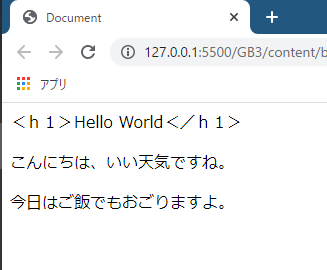
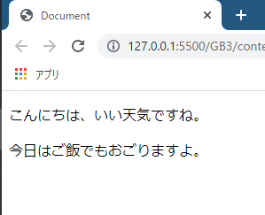
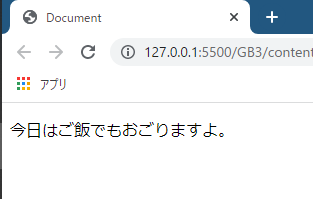
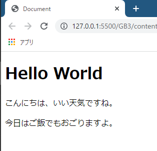
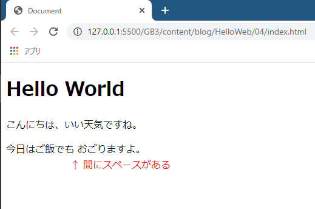
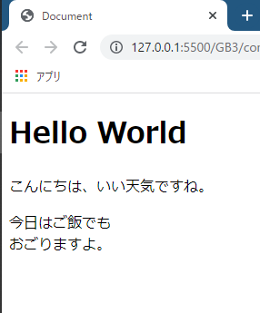

# HTMLの文法を覚えよう

これまでHTMLとCSSに関してざっとハンズオンを行ってきましたが、ちゃんとした文法を説明してませんでした。まずはここで、HTMLの基本的な書き方や記述ルールを覚えましょう。

引き続き`index.html`を使用します。内容は以下のようになっていると思います。

ただ、今回からしばらくはCSSは登場しないので、6行目のlink要素は削除してOKです。また、5行目のビューポートに関するmeta要素も不要なので削除してOKです。

```html{6}:title=index.html
<!DOCTYPE html>
<html lang="ja">
<head>
  <meta charset="UTF-8">
  <meta name="viewport" content="width=device-width, initial-scale=1.0"> <!-- 削除してOK -->
  <link href="./style.css" rel="stylesheet"> <!-- 削除してOK -->
  <title>Document</title>
</head>
<body>
  <h1>Hello World</h1>
  <p>こんにちは、いい天気ですね。</p>
  <p>今日はご飯でもおごりますよ。</p>
</body>
</html>
```

## タグは半角で記述する

タグは必ず半角で記述する必要があります。`<`も`>`も、それらに囲まれたタグ名にあたる文字も全て半角です。全角で記述すると**ただの文字**とみなされ、そのまま画面に表示されてしまいます。

以下、h1要素の開始タグと終了タグを全角に書き換えた様子です。

```html
<body>
  ＜ｈ１＞Hello World＜／ｈ１＞
  <p>こんにちは、いい天気ですね。</p>
  <p>今日はご飯でもおごりますよ。</p>
</body>
```



## コメントアウト

HTMLはファイルの中に**コメント**を残すことができます。コメントはブラウザー上には表示されません。

実際にコメントを書いてみましょう。`<!--コメントにしたい内容-->`とすることでコメントを残すことができます。`<!--`がコメントの開始、`-->`がコメントの終了を意味します。

なお、プログラムのコードをコメント化し、一時的に無効にすることを**コメントアウト**などと言ったりもします。

```html
<body>
  <!--<h1>Hello World</h1>-->
  <p>こんにちは、いい天気ですね。</p>
  <p>今日はご飯でもおごりますよ。</p>
</body>
```

さて、ブラウザーで表示を確認してみましょう。コメントアウトしたh1要素が表示されていないことがわかります。



また、以下のようにして複数行をコメントアウトすることもできます。

```html
<body>
  <!--
  <h1>Hello World</h1>
  <p>こんにちは、いい天気ですね。</p>
  -->
  <p>今日はご飯でもおごりますよ。</p>
</body>
```



### どんな場面でコメントを残す？

コメントは様々な場面で役に立ちます。

どんな風にコメントを残しても構いません。チームに入っているならチームのルールに従うべきですが、個人で勉強しているうちはメモ書きみたいなものでいいので、自由にコメントを残しておきましょう。

ちょっと単純で極端な例ですが、以下のようなコメントを残してもいいでしょう。

```html:title=sample.html
<body>
  <!-- 本文始まり -->
  <h1>ブログタイトル</h1>

    <!-- 自己紹介始まり -->
    <h2>自己紹介をします。</h2>
    <p>私の名前は～</p>
    ...略、30行ほど
    <!-- 自己紹介終わり -->

    <!-- 今年の目標始まり -->
    <h2>2021年の目標</h2>
    <p>今年の目標は～</p>
    ...略、30行ほど
    <!-- 今年の目標終わり -->

  <!-- 本文終わり -->
</body>
```

行数が少ないうちはいいですが、何百行にもなると文書構造が把握しにくくなります。1ページに収まりきらなくて何度もスクロールすることになりますから。そこで、章ごとや節ごとなど、ある程度のブロックに分けてその始まりと終わりを書いておくと、後から地味に役に立ちます。

また、以下のように一時的なメモ書きや付箋代わりに使ってもいいでしょう。

```html:title=sample.html
<!-- ★ここ、他にいい表現があるのでは？★ -->
<p>その姿はまるでジプシーのようです。</p>
```

他には、とりあえず文章を残しておきたいときにも有効です。「いい文章が浮かんだからこの部分は書き換えよう。でも一応、今の文章も残しておきたい…」ということは往々にしてあると思います。そんな時はコメントアウトしてしまえば画面上には表示されないけど、htmlファイル上に残して後から見返すことができます。

コードを整理したり目印を残すようなコメントは、チームの他のメンバーや将来の自分に対しても役に立ちます。必要だと感じたら面倒くさがらずに適宜コメントを残すようにしておきましょう。

## 改行とタブは反映されない

HTMLにおいては、要素間で改行したり、タブやスペースでタグをずらしてもブラウザーでの表示には影響しません。以下のHTMLを記述しブラウザーで表示させてみてください。

```html:title=sample.html
<body>
<p>1</p>
<p>2</p>

	<p>3</p>
</body>
```

`2`と`3`の間に空白行がありますね。また、`3`の左側にはタブでスペースが空いています。しかし、これらは実際の表示には反映されていないことが分かります。



「要素と要素の間を空けたい」「少し右にずらしたい」これらは全てCSSの仕事ですので、そちらに任せましょう（以前にも説明した、役割の分離です）。

しかし、ページの表示に影響しないという事は、マークアップする側の都合で自由に改行したりタブでスペースを空けてもいいという事です。文書構造を分かりやすくするため、適宜改行やタブを使用することをお勧めします。

```html:title=sample.html
<body>
  <h1>ページタイトル</h1> <!-- 階層構造を意識してタブで右にずらす -->

    <h2>見出し1</h2> <!-- 見づらいと思ったらブロック間で改行して区切ってもいい -->
    <p>本文～</p>

    <h2>見出し2</h2>
    <p>本文～</p>

</body>
```

以下のように、開始タグの後ろや終了タグの前で改行してもOKです。こうすることですっきり見えやすくなる状況も後々出てくると思います。

```html:title=sample.html
  <h1>
    Hello World
  </h1>

  <p>
    こんにちは
  </p>
```

しかし、タグにはさまれた内容の中は改行するべきではありません。ページでの表示は改行されないうえ、恐らく半角スペースが入ると思います。

```html
  <h1>Hello World</h1>
  <p>こんにちは、いい天気ですね。</p>
  <p>今日はご飯でも
    おごりますよ。</p>
```



改行には**br要素**を使用します。詳しくは後の記事で説明しますが、以下のように使用します。どのような動作をするか、一度検証してみてください。

```html
  <h1>Hello World</h1>
  <p>こんにちは、いい天気ですね。</p>
  <p>今日はご飯でも<br>おごりますよ。</p>
```



## まとめ

今回はHTMLの最低限の文法を学習しました。これだけ覚えておけばバリバリHTMLを書いていけます。

## 参考

[すぐわかる！HTMLでスペースや空白を入れる正しい方法 | webliker](https://webliker.info/03847/)


