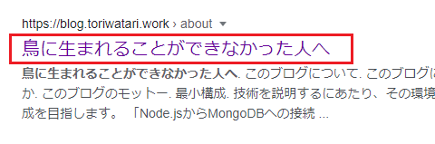

# DOCTYPE宣言とhead要素

[前回](/HelloWeb/04/)までで、HTMLとCSSについて基本中の基本を学習しました。

早速目標成果物を目指しコーディングをしていきたい所ですが、、、まだもうしばらくはHTMLをメインに学習を進めていきます。

今回はHTMLの大枠であるhtml要素、head要素について学習します。

前提として、`index.html`は以下のようになっているはずです。

```html{6}:title=index.html
<!DOCTYPE html>
<html lang="ja">
<head>
  <meta charset="UTF-8">
  <meta name="viewport" content="width=device-width, initial-scale=1.0">
  <title>Document</title>
</head>
<body>
  <h1>Hello World</h1>
  <p>こんにちは、いい天気ですね。</p>
  <p>今日はご飯でもおごりますよ。</p>
</body>
</html>
```

## DOCTYPE宣言

では、`index.html`を上から順番にみていきます。

ファイルの先頭行には`<!DOCTYPE html>`という記述があります。これは**DOCTYPE（ドキュメントタイプ）宣言**と呼ばれるもので、その文書が**最新のhtmlで記述された文書である**ということをブラウザーに伝える役割をもっています。

DOCTYPE宣言はHTMLにおけるタグや要素ではありませんが、現代のHTMLマークアップでは必須の定型文のようなものです。忘れずに記述するようにします。

```html:title=index.html
<!DOCTYPE html>
```

<aside>

先ほど、

> ～ その文書が**最新のhtmlで記述された文書である**ということがブラウザーに伝わります。

という記述をしました。<br>

恐らくインターネット上を見ると「`<!DOCTYPE html>`とすることで、そのファイルが**HTML5**であることをブラウザーに伝える」という説明が多いと思います。しかし、2021年1月29日に、[W3Cによる「HTML5」が廃止されました](https://html.spec.whatwg.org/review-drafts/2020-01/)。それにより、WHATWGの[HTML Living standard](https://html.spec.whatwg.org/)がHTMLの唯一の仕様となりました。<br>

つまり、**HTML5**という仕様がなくなったわけです。この辺りを鑑み、**最新のHTML**という表現にしています（WHATWGによるHTMLは`5`→`6`→`7`みたいに数字によるバージョニングはされない）。また、当ブログでもHTML5という単語は使用せず、**HTML**という表現に統一したいと思います。

</aside>

## html要素

続けて`<html>`と`</html>`でhtml要素を構成します。こうすることで、「htmlに関することが書かれています」ということがブラウザーに伝わります。

```html:title=index.html
<!DOCTYPE html>
<html lang="ja">

...略

</html>
```

ところで、html開始タグを見て見ると`lang="ja"`と書かれてありますが、これは一体何でしょうか？

### 属性

ここで新しい言葉の登場です。開始タグの中には**属性**を付与し、その要素に**情報を付加**できます。属性の書き方は以下の通りです。

```html
<要素名 属性="属性値">
```

html要素には**lang属性**を付与し、html要素内の**文章の言語**を指定するのが一般的です。

lang属性（languageのlangです）は文字通り、記述されている文章の言語を情報として付与する属性です。属性値として`ja`を指定していますが、これは「日本語」という意味です。つまり、「html要素内（≒このWebページ）は、日本語の文章で構成されています」と宣言していることになります。

属性はlang属性以外にも無数にあり、様々な情報を要素に付加できます。属性に関しても地道に少しづつ憶えていきましょう。

## head要素とbody要素

html要素の中にはhead要素とbody要素を記述します。

[\#2](/HelloWeb/02/)の記事でも説明しましたが、head要素はWebページの情報、body要素はブラウザーに表示させる文章を記述します。


html要素にはhead要素とbody要素が必須です。また、順番もhead要素→body要素の順で記述しなけばなりません。

さらに、html要素の直下に入れられるのはこの2つの要素だけです。他の要素を入れることはできないことを覚えておいてください。

```html:title=index.html
<!DOCTYPE html>
<html lang="ja">
<head>
  ...略
</head>
<body>
  ...略
</body>
</html>
```

## head要素にはWebページの情報を記述する

続けて、html要素の子要素としてhead要素を記述します。

```html:title=index.html
<!DOCTYPE html>
<html lang="ja">
<head>
  <meta charset="UTF-8">
  <meta name="viewport" content="width=device-width, initial-scale=1.0">
  <title>Document</title>
</head>
...略
</html>
```

head要素には**Webページの情報**（画面には表示されない情報）を記述します。これらの情報は主にブラウザーや検索エンジンが利用します。

cssファイルの取り込みも`head属性`の中で`link属性`を使用して行っていますね。これは「スタイルシートを取り込んでcssを適用させて」とブラウザーに指示する役割を持っていると言えます。

head要素には以下のような情報を記述できます（一例です）。

- 🖊️️️ 文字コード
- 🖊️ ページのタイトル
- 🖊️️️ CSSやJavaScriptファイルの読み込み
- 🖊️️ ページの説明文
- 🖊️️ ページの著者

どれもブラウザーや検索エンジンが利用する情報で、ユーザーの目には直接触れない情報です（後ほど紹介しますが、ページのタイトルだけは例外です）。

head要素に記述できる情報はとても多くこの講座では扱いきれませんので、以下、meta要素とtitle要素のみに絞って説明します。

## meta要素

それでは、head要素の中身を上から順番に見ていきたいと思います。最初は`<meta>`が2つ並んでいるのがわかります。

```html:title=index.html
<meta charset="UTF-8">
<meta name="viewport" content="width=device-width, initial-scale=1.0">
```

meta要素とは、文字通り**ページのメタ情報**を記述するためのものです。「メタ情報」と言っていますが、要するにWebページに関する何らかの情報です。

meta要素は様々な属性を付与することによって初めて意味を持ちます。例によって属性にも沢山の種類がありますが、ここでは記述が必須である**charset属性**のみを紹介します。

### charset属性

charset属性はそのページで使用されている**文字コード**を指定します。htmlファイルはUTF-8で作成しましたね。ですのでmeta属性には`charset="UTF-8"`と記述します。これでブラウザーに「このファイルはUTF-8で書かれている」と伝えることができます。このcharset属性による文字コードとhtmlファイルの文字コードが違っていると文字化けの原因になります。

```html:title=index.html
<head>
  <meta charset="UTF-8">
  ...略
</head>
```

もう一つ、
```html:title=index.html
<meta name="viewport" content="width=device-width, initial-scale=1.0">
```

というのもありますね。これは**ビューポート**と呼ばれる、ブラウザーの表示領域の大きさを設定する属性です。この記述はレスポンシブデザイン（一つのhtmlファイルやcssファイルでPCとモバイル機器の両方に対応させる技術）のためのmeta要素です。

この要素もある種の定型文となっているので紹介しました。今回の講座ではレスポンシブ対応は行いませんので忘れていただいても構いません。

## 空要素

さて、これまで紹介してきた要素は`<開始タグ>内容<終了タグ>`という風に2つのタグで内容を囲っていましたね。しかしmeta要素はそういった形にはなっていません。`<meta 属性>`だけですね。

HTMLでは、「どの要素がどのような要素を子要素に持てるか」そして「子要素や内容を持てない要素」が明確に定義されています。meta要素は後者の「子要素や内容を持てない要素」に当てはまります。これを**空要素**と呼びます。

空要素には終了タグは存在していません。タグを1つ書くだけで完結したり、タグの中に属性を書くことで要素として機能します。

[MDN](https://developer.mozilla.org/ja/docs/Glossary/Empty_element)では、

> 空要素 とは HTML、SVG、MathML における 要素 のうち、子ノード (子要素およびテキストノード) を持つことができないものを指します。

と紹介されています。

空要素で有名なのは、meta要素の他には画像を表示させるimg要素、改行を表すbr要素あたりでしょうか。これらも後ほど紹介しますので、**空要素**という単語だけ頭の片隅に置いてもらえればOKです。

## title要素

meta要素の説明が終わりましたので、次はtitle要素の説明を行います。

```html:title=index.html
  <title>Document</title>
```

**title要素**は、その名の通りページのタイトルを表します。head要素の中の要素は基本的にユーザーの目には触れませんが、このtitle要素は例外です。

`index.html`をブラウザーに読み込ませると、タグの所にページタイトルとしてtitle属性として記述した「Document」が表示されています。


また、ページをブックマークした時にも、title属性の内容が利用されます。以下の画像はChromeのブックマークバーに表示された時のものです。


さらに、ページをインターネット上に公開した時、検索結果の表示にも利用されています。以下の画像は、このブログをGoogle検索した時の検索結果の様子です。



では、title属性の内容を書き換えてみましょう。「head属性についての解説」としてみましょうか。

```html:title=index.html
  <title>head属性についての解説</title>
```

上書き保存したらブラウザーをリロードしてください。ブラウザーのタブのサイト名の部分が更新されているはずです。


title要素はhead要素内に**必ず一つだけ入れる必要があります**。そしてページタイトルは、ページ本文以外ではもっともユーザーの目に触れるものだと言えます。そのページの内容を正確に、でもシンプルに簡潔に設定することが必要です。

## まとめ

今回学習した内容は以下の通りです。

|要素・タグ名|役割|
|---|---|
|DOCTYPE宣言|HTMLのバージョンを宣言する|
|html|HTML文書であることを表す|
|head|Webページの情報を記述する|
|body|Webページのコンテンツを記述する|
|meta|Webページのメタ情報を記述する|
|title|Webページのタイトルを記述する|

主にhead要素について解説しました。中でも、

- head要素とbody要素の役割の違い
- title要素の役割

の2点だけ押さえておけばOKです。

<details style="margin-top: 60px" class="history">
<summary>更新履歴</summary>

<ul class="history-list">
  <li>2022年7月29日 : 誤字脱字を修正。</li>
</ul>
</details>

## 参考

[Doctype | MDN](https://developer.mozilla.org/ja/docs/Glossary/Doctype)

[&lt;html&gt;: HTML 文書 / ルート要素 | MDN](https://developer.mozilla.org/ja/docs/Web/HTML/Element/html)

[lang | MDN](https://developer.mozilla.org/ja/docs/Web/HTML/Global_attributes/lang)

[head には何が入る? HTML のメタデータ | MDN](https://developer.mozilla.org/ja/docs/Learn/HTML/Introduction_to_HTML/The_head_metadata_in_HTML)

[&lt;meta&gt;: 文書レベルメタデータ要素 | MDN](https://developer.mozilla.org/ja/docs/Web/HTML/Element/meta)

[&lt;title&gt;: 文書題名要素 | MDN](https://developer.mozilla.org/ja/docs/Web/HTML/Element/title)

[13 The HTML syntax | HTML Standard](https://html.spec.whatwg.org/multipage/syntax.html#the-doctype)

[HTML Standard](https://html.spec.whatwg.org/)

[HTML Standard Review Draft January 2020](https://html.spec.whatwg.org/review-drafts/2020-01/)

[HTMLの言語指定  は必要？不要？ lang属性をGoogleは無視](https://schole-otium.com/blog/programming/html/lang-attribute-necessary/)

[lang 属性にGoogle「言語指定にlangは使うな」／公式発言](https://seopack.jp/seoblog/20161111-use-hreflang/)
