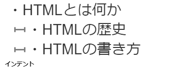
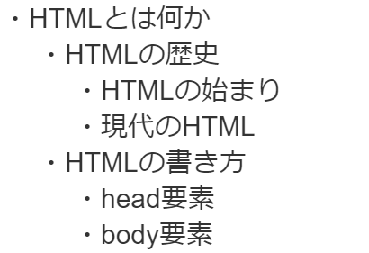
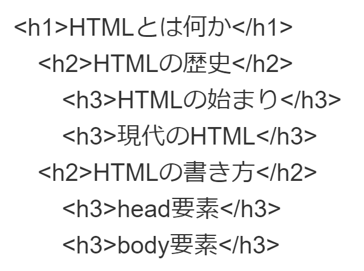
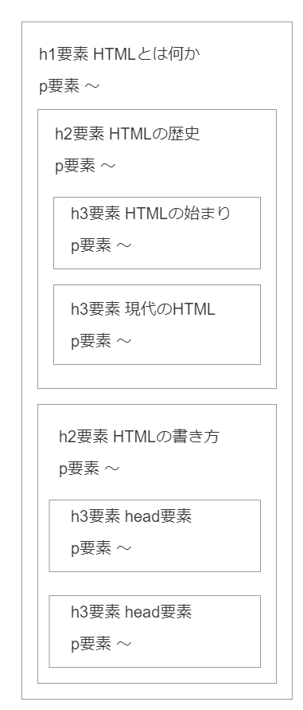
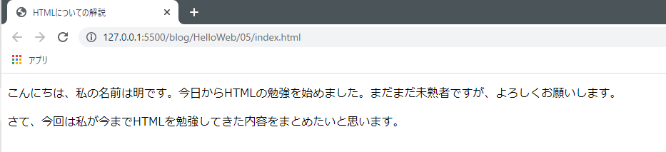
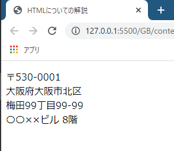

# 見出しや文章を作る要素

今回は、見出しや文章（段落）を作るh要素やp要素について解説します。これらはbody要素の中に記述して使用します。

head要素がWebページの情報を表すのに対し、body要素はページに表示されるコンテンツを表します。このページの文章も画像も全てbody要素内に記述されています。

body要素自体は難しいものではありません。bodyタグを用意して、その中に文章や画像に適した要素を入れていけばページに表示されます。しかし、body要素に入れる要素には様々な種類が存在しており、それらを正しく使用してマークアップするのは中々難しいです。

<aside>

body要素の中で使用できるタグ・要素は100以上の数が存在していますが、常用するのは20種類ほどだと思います。さらに仕様変更に伴い新しい要素が追加されたり廃止されたりします。

タグ・要素はマークアップしていけば自然と覚えらえますので、暗記する必要はありません。「こんな役割の要素があるんだなー」くらいで記憶に留めておいて、必要になった時に詳細をインターネットで調べるくらいでちょうどいいです。

</aside>

## 見出しを表すh要素

まずは見出しを表すh要素の解説です。`h`は`heading（見出し）`のhです。

「見出し」が何であるか、何となくわかりそうな気もしますがウィキペディアで調べてみました。

>見出し（みだし、英語: headline）とは、新聞を始めとする様々な記事、文章において内容の要点を非常に短い言葉にまとめ、本文より大きな字で章（英: chapter、チャプターとも）や節（英: section、セクションとも）の最初に置かれる言葉。

参考 : [見出し - Wikipedia](https://ja.wikipedia.org/wiki/%E8%A6%8B%E5%87%BA%E3%81%97#:~:text=%E8%A6%8B%E5%87%BA%E3%81%97%EF%BC%88%E3%81%BF%E3%81%A0%E3%81%97%E3%80%81%E8%8B%B1%E8%AA%9E%3A%20headline,%E6%9C%80%E5%88%9D%E3%81%AB%E7%BD%AE%E3%81%8B%E3%82%8C%E3%82%8B%E8%A8%80%E8%91%89%E3%80%82)

「後に続く内容を**要約した**短い文章」と言えます。このページでいうと、上記の「見出しや文章を作る要素」「見出しを表すh要素」がh要素に当たります。

また、h要素は`h1`、`h2`、`h3`...といったように数字を付けたタグを用いて記述します。タグは`h1`から`h6`まで存在します。また、これらをそれぞれh1要素、h2要素...と呼びます。

これらの数字は見出しの**重要度**を表し、`1`が一番重要で数値が大きくなるほど重要度は下がっていきます。

### ページの構成を考える

早速サンプルページをマークアップしてみたいところですが、もう少しだけ準備をしましょう。今回のサンプルページ全体の**構造**を考えたいと思います。

作成するページは「HTMLとは何か」というテーマのブログ記事にします。架空の内容ですがページの構成を想像しながら構造を考え、**見出し一覧**を作っていきたいと思います。

まず、記事のテーマが「HTMLとは何か」ですので、これはページ全体を表すとても大きなテーマであり見出しにできそうです。以下のように見出しをメモ書きしておきます。


さて、「HTMLとは何か」という大きなテーマを細分化して小さなテーマにしてみたいと思います。「HTMLの歴史」「HTMLの書き方」の2つでどうでしょう。これらも見出しにできそうですね。メモ書きしておきましょう。

この2つのテーマは先ほどの「HTMLとは何か」を細分化したものです。これはHTMLのタグにおける**親要素と子要素の関係**に似ていますね。h要素を考えるうえでも、こういった階層構造を考える意識は大切です。

この2つの見出しは、言わば子要素のようなものなので、少し右側にずらして**インデント**をつけておきます。こうすることで各要素の階層関係や親子関係が分かりやすくなります。



続けて、これらの見出しもさらに細分化していきましょう。「HTMLの歴史」は「HTMLの始まり」「現在のHTML」に、「HTMLの書き方」は「head要素」「body要素」に細分化します。



### h要素にあてはめる

続いて、この見出しをh要素にあてはめてみます。

前述した通り、階層が浅い見出しはより重要な見出しであると考えられ、数字の小さいhタグを使用すべきです。逆に階層が深くなるほど重要度は下がっていきますので、数字の大きいhタグを使用します。

具体的には、h1要素から始めて1つずつ数字を上げていくのが正しいマークアップです。h1要素があってh2要素がないのにh3要素を持ってくるのはNGです。先ほどの見出し一覧にマッピングすると以下のようになります。



## h要素でマークアップする

ではいよいよh要素でマークアップしていきます。前回まで記述していた`index.html`のbody要素の内容は削除してください（削除するのが嫌ならコピーを残しておくか、新しくファイルを作成してそちらに記述してください）。

マークアップは以下のようになります。作成した見出し一覧をタグに変換していくだけです。特段難しいことはありませんね。

```html
<!DOCTYPE html>
<html lang="ja">
<head>
  <meta charset="UTF-8">
  <meta name="viewport" content="width=device-width, initial-scale=1.0">
  <link href="style.css" rel="stylesheet">
  <title>HTMLについての解説</title>
</head>
<body>
  <h1>HTMLとは何か</h1>

    <h2>HTMLの歴史</h2>
      <h3>HTMLの始まり</h3>
      <h3>現代のHTML</h3>

    <h2>HTMLの書き方</h2>
      <h3>head要素</h3>
      <h3>body要素</h3>
</body>
</html>
```

<aside>

htmlファイルの中ではインデントを付けても要素をずらしても画面描画には影響しません。また、改行して要素の間を空けるのも同じく影響しません。階層構造を意識して、適宜分かりやすいようにインデントをつけましょう。

</aside>

見出しはそのページの地図みたいなものであり、読者に対しての道しるべにもなります。ただ、見出しの階層が深くなって`h5`、`h6`までいくと深すぎるという印象を受けます。私もこうやってブログをたくさん書いていますが、`h3`までで足りるケースがほとんどです。

完成したらブラウザーでちゃんと表示されるか確認しておきましょう。以下のように表示されるはずです。


## 段落を表すp要素

続いてはp要素です。`p`は`paragraph`の略で、**段落**という意味です。本文を書くには通常、p要素を使用します。

p要素を使用する時は、直近（上に辿って行って一番近い）のh要素の文章に沿った内容であるかを考えながら文章を記述するとGoodです。

```html
<body>
  <h1>HTMLとは何か</h1>
  <p>HTMLについての説明を行います。</p>

    <h2>HTMLの歴史</h2>
    <p>HTMLの歴史について説明します。</p>

      <h3>HTMLの始まり</h3>
      <p>HTMLが誕生したのは～。</p>

      <h3>現代のHTML</h3>
      <p>現在、HTMLは～。</p>

    <h2>HTMLの書き方</h2>
    <p>実際にHTMLを書いてみましょう。</p>

      <h3>head要素</h3>
      <p>head要素とは～。</p>

      <h3>body要素</h3>
      <p>body要素の中には～。</p>
</body>
```

要素の親子階層がそのまま文章の親子関係になります。図に表すと以下のような感じです。**h要素がブロックを作っている**イメージが伝わりますか？



HTMLのマークアップにおいては、このように文章を組み立てて階層構造を構築したりといった、どちらかと言うと**国語的**な考え方が重要だと私は思います。

## 文章を改行するには？

さて、p要素は**段落**を意味する要素であると説明しました。試しに以下のようにp要素を二つ続けて記述してみましょう。

```html
<body>
<p>こんにちは、私の名前は明です。今月からHTMLの勉強を始めました。まだまだ未熟者ですが、よろしくお願いします。</p>
<p>さて、今回は私が今までHTMLを勉強してきた内容をまとめたいと思います。</p>
</body>
```

最初の一文が自己紹介、2行目がこのページの内容を表しており、それぞれが段落として成立していると思います。

これをブラウザーで確認すると、一つ目のp要素の後で改行されていることが分かります。



実は、要素には後ろで勝手に改行されるものと改行されないものがあります。p要素は前者ですね。また、多くの要素は改行が行われます。改行が行われない要素の代表として**a要素**が挙げられます。a要素はこの次のページで紹介します。

<aside>

かつて、HTMLの要素には**ブロック要素**、**インライン要素**という分類の仕方がありました。ブロック要素は改行が行われ、インライン要素は行われません。

p要素はブロック要素、次のページで紹介するa要素はインライン要素に分類されていました。

最新のHTMLではその分類はなくなりましたが、名残として名称が残っており書籍やインターネットの記事でも多く出てきます。この2つの名称、そして改行されるもの、されないものがあることは覚えておいて損はないと思います。

</aside>

では、「～明です。」までで一旦区切り、「今日から～」を新しいp要素にすればいいのでしょうか？以下のようにp要素を3つにする考え方です。これなら確かに改行が行われますね。

```html
<body>
<p>こんにちは、私の名前は明です。</p>
<p>今月からHTMLの勉強を始めました。まだまだ未熟者ですが、よろしくお願いします。</p>
<p>さて、今回は私が今までHTMLを勉強してきた内容をまとめたいと思います。</p>
</body>
```


これはあまり良くない考え方です。p要素はあくまでも**段落**をマークアップするための要素です。ブラウザー表示では副産物的に改行が行われますが、改行を行うための要素ではありません。文章の意味を考えてそれぞれが段落として成立する場合のみp要素として分けるべきです。

極端な話、**HTMLをコーディングしている最中はブラウザーでの表示を確認する必要はありません**。とにかくHTMLの文書構造に集中してマークアップして、完了してからCSSでのデザインに取り掛かるくらいでいいです。その方が文書構造とデザインの役割の分離を行うために有効なやり方だと私は思います。

文章を区切って改行するには、**br要素**を使用します（line breakの略）。br要素は**空要素**であるため、閉じタグは不要です。

```html
<p>こんにちは、私の名前は明です。<br>
<p>今月からHTMLの勉強を始めました。まだまだ未熟者ですが、よろしくお願いします。</p>
<p>さて、今回は私が今までHTMLを勉強してきた内容をまとめたいと思います。</p>
```


個人的に、br要素は結構使い方が難しいと思っています。私はあまり使いません。例えば住所を載せる時なんかは、br要素を使うと区切ることができて読みやすくなるんじゃないかなと思います。

```html
<p> 〒530-0001<br>
    大阪府大阪市北区<br>
    梅田99丁目99-99<br>
    〇〇××ビル 8階
<p>
```



## まとめ

今回のまとめです。以下の要素が登場しました。

- ✅ h要素は見出しを表す。`h1`が一番重要で、数字が大きくなると重要度が下がる
- ✅ p要素は段落を表す
- ✅ br要素で改行を行う

次はa要素を使って、ページ間を移動する**リンク**を作成する方法を学びます。

## 参考

[&lt;h1&gt;–&lt;h6&gt;: HTML の見出し要素 | MDN](https://developer.mozilla.org/ja/docs/Web/HTML/Element/Heading_Elements)

[&lt;br&gt;: 改行要素 | MDN](https://developer.mozilla.org/ja/docs/Web/HTML/Element/br)

[h要素（見出し要素）の効果的な使い方｜ferret](https://ferret-plus.com/curriculums/10430)

[h要素とは | ナイルのマーケティング相談室](https://www.seohacks.net/blog/974/)

[見出しの書き方とWEBにおける見出しタグの付け方を教えます | SEO対策なら株式会社ペコプラ](https://pecopla.net/seo-column/how-to-write-heading)

[【HTML入門】改行は&lt;br&gt;。ただちょっと注意も必要 | Qlio（キュリオ）](https://9lio.com/column/html-elements-br/)
