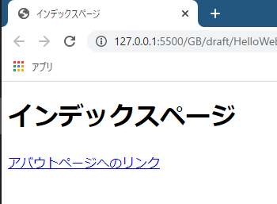
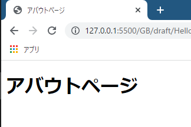
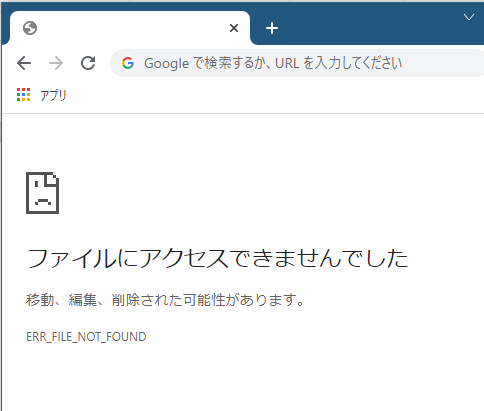
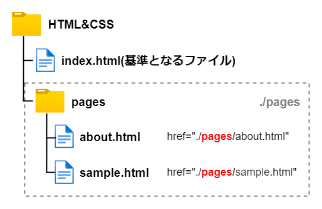
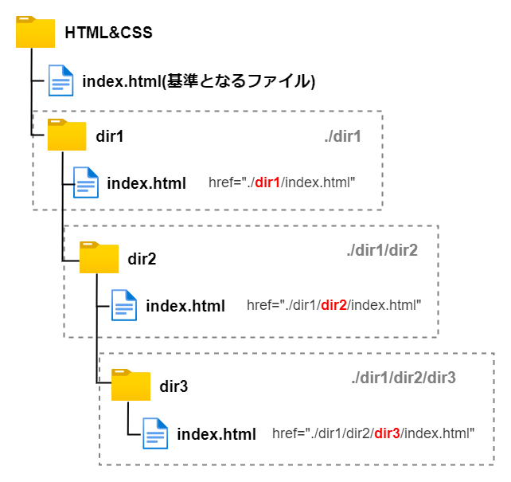
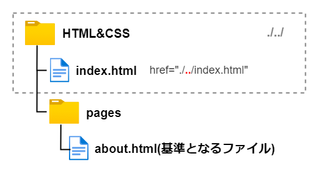
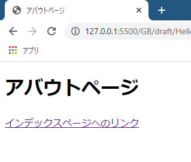
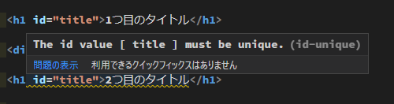
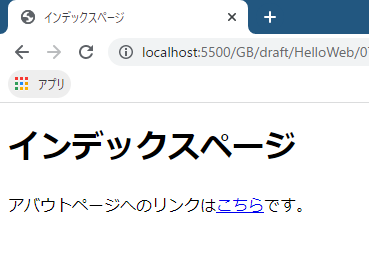

# Webはリンクの集まり

a要素は**ハイパーリンク**（以下、必要に応じて単純に**リンク**と呼びます）を作成する要素です。他のページへ遷移するものや、同じページ内へ遷移するもの（記事の冒頭の目次などによく使用されていますね）、また、ファイルをダウンロードするものなどがリンクにあたりますが、これらは全てa要素を使用して作成します。

## HTMLの由来

HTMLはHyper Text Markup Languageの略称です。このハイパーテキストという言葉についてですが、「ハイパー」とはどういう意味でしょうか。普通のテキストと何が違うのでしょうか。

HTMLが生まれたきっかけは、スイスのとある研究所での研究論文の紐づけのためでした。研究に必要なデータや参考文献を大量に集め、**各情報を行き来できるリンク**があれば便利ではないかと考えられました。そして、リンクを持つ特別な（ハイパーな）テキストを**ハイパーテキスト**と呼び、リンクのことを**ハイパーリンク**と呼ぶようになりました。

> ハイパーテキストは、ほかのテキストへのリンクを含むテキストであり、小説のように単一で線形の流れのものとは対照的なものです。

参考 : [Hypertext (ハイパーテキスト) | MDN](https://developer.mozilla.org/ja/docs/Glossary/Hypertext)

> ハイパーリンクはウェブページやデータ項目をお互いに接続します。

参考 : [Hyperlink (ハイパーリンク) | MDN](https://developer.mozilla.org/ja/docs/Glossary/Hyperlink)

つまり、ハイパーリンクがあるからこそ、ハイパーテキスト（≒HTML）であると言っても過言ではないのです！

インターネットは無数のハイパーテキストの集まりであり、その中にあるハイパーリンクによって相互に接続されています。これまでのページでは文字を羅列してばっかりでしたが、ハイパーリンクを用意してページ間を辿れるようになればいよいよWebサイトらしくなってきます。

## index.htmlとabout.htmlを用意する

今回は2つのHTMLファイル（`index.html`と`about.html`）を用意します。まずは`index.html`ですが、前回までのものを流用してもいいですし、新しく作っても構いません。

続いて、`index.html`と**同じ階層**に`pages`というフォルダーを作成してください。そしてその中に`about.html`を作成します。つまり、下図のようなフォルダー構成になります。


## aタグでリンクを作成する

まずは`index.html`の作成から取り掛かりましょう。`about.html`へのリンクを作成してみます。以下の通りに記述してください。

```html:title=index.html
<!DOCTYPE html>
<html lang="ja">
<head>
  <meta charset="UTF-8">
  <meta name="viewport" content="width=device-width, initial-scale=1.0">
  <title>インデックスページ</title>
</head>
<body>
  <h1>インデックスページ</h1>

  <a href="./pages/about.html">アバウトページへのリンクです。</a>
</body>
</html>
```

Webページを確認すると、アンダーバーが引かれた青い文字のリンクが作成されているはずです。



<aside>

作成されたリンクがどのように装飾され表示されているかは、厳密にはブラウザーによって異なります。

</aside>

リンクをクリックしてみて、`about.html`へアクセスできるかを確認してください。



見事、ページ遷移できればリンクの作成が完了です。もし以下の画面のように、ファイルにアクセスできない旨のエラーメッセージが表示された場合は、



- 🔎 `href`属性の記述が間違っている
- 🔎 `pages`というフォルダー名が間違っている
- 🔎 `about.html`というファイル名が間違っている

のうちのどれかが原因だと思われます。

以下の`href`属性についての説明も読みながら、間違いがないか見直してみてください。

### href属性でリンク先を指定する

では、改めてリンクの作成方法を解説します。

まず、`a`タグでリンクとしたい文字列を囲います。

```html
<a>アバウトページへのリンク</a>
```

リンクを踏んだ時の遷移先は、**`href`属性**で指定します。`href`属性には遷移させたい先の**パス**を記述します。

```html
<a href="./pages/about.html">アバウトページへのリンク</a>
```

パスの記述はcssファイルの読み込みの時にもやりましたね。ここで記述しているパスは**相対パス**と呼ばれるものです。

### 相対パス

相対パスは、**現在の地点から**目的の地点への経路を記述するパスです。「現在の地点」とはa要素を書いているファイル、つまり`index.html`が置かれているフォルダーです。

まずは**カレントディレクトリ**を表す`.`を先頭に付けます。そして、階層を区切る`/`を付けます。

<aside>

**ディレクトリ**は、「フォルダー」のことです。その前に**カレント**がついているので、「カレントディレクトリ」は「現在のフォルダー」という意味になります。

</aside>

図を用いて例を示します。例えば、遷移先のhtmlファイルが同じ階層にあるのであれば、`href="./sample.html"`と記述します。図で表すと以下のようになります。


今回、目的の`about.html`は`pages`フォルダーの中に格納されていますね。`./pages`とすることで`pages`フォルダーの中に下りることができます。



後は、`pages`フォルダーにある、リンクさせたいファイル名を記述すれば相対リンクの完成です。区切りである`/`をつけ、目的のファイルである`about.html`を記述します。


まとめると、

- ✔️ 相対パスは、リンクを記述しているファイルを起点とするパスの記述方式
- ✔️ 現在のフォルダー（カレントディレクトリ）は`.`で表す
- ✔️ `/`でファイルやフォルダーを区切る

となります。

もちろん、もっと深い階層までのパスも記述できます。以下の図は、`index.html`があるフォルダー（`HTML&CSS`）から見て、`dir1`フォルダーの中の`dir2`フォルダーの中の`dir3`フォルダーの中の`index.html`を指定しているイメージ図です。

もし時間があれば、実際にフォルダーやファイルを作ってみて正しくリンクを作れるか練習してみてください。



### 上の階層へは`..`で辿る

続いて、`about.html`にも`index.html`へのリンクを作成し、相互に辿れるようにしましょう。

`about.html`を以下のように編集します。

```html:title=about.html
<!DOCTYPE html>
<html lang="ja">
<head>
  <meta charset="UTF-8">
  <meta name="viewport" content="width=device-width, initial-scale=1.0">
  <title>アバウトページ</title>
</head>
<body>
  <h1>アバウトページ</h1>
  <a href="./../index.html">インデックスページへのリンク</a>
</body>
</html>
```

`href`属性を確認しましょう。まずはカレントディレクトリを表す`./`から始めます。さて、親フォルダーをどうやって表すかですが、`..`を使用します。これだけで親フォルダーを表すことができます。

私たちが普段使っているフォルダーやファイルの仕組みにおいて、**親フォルダーは一つしかない**ため、親フォルダーの名前を明示する必要はありません（この場合のカレントディレクトリにおける親フォルダーは`HTML&CSS`フォルダーだけですよね）。親フォルダーが2個以上存在するような世界線ならば、どのフォルダーを指定するかを記述する必要がありますが、実際には一つしかないため`..`のみで表すことができます。



`about.html`が完成したらアクセスして動作を確認しておきましょう。`index.html`には`about.html`へのリンクがあり、`about.html`には`index.html`があります。相互にリンクがあり、行き来ができる状態になっているはずです。



### カレントディレクトリは省略できる

カレントディレクトリは`.`で表すと説明しましたが、実はこれは省略可能です。

`index.html`のリンクには`./pages/about.html`という`href`属性を定義しましたが、最初の`./`をなくして、`pages/about.html`という記述し差し替えてもOKです。

同じように、`about.html`のリンクも`./../index.html`も、`../index.html`に差し替えることが可能です。

略すか略さないかという所ですが、1人で書いている分には好みでいいと思います。私はいつも略すようにしています。このシリーズではこれ以降、カレントディレクトリを表す`./`は省略するようにしますのでご留意ください。

## ページ内リンクの作成

これまでは別のHTMLファイルへのリンクを作成してきましたが、同じページ内の任意の場所へのリンクを作成することもできます。ブログ記事などでよくありますが、ページの先頭に目次が並んでいてクリックするとその段落までスクロールできる、といったものです。

### `id`属性を記述する

ここからは`index.html`を編集していきます。リンクを作成する前に、まずはリンク先を定義しておきます。リンク先にしたい要素に`id`属性を記述し、**ID**を付与します。このIDに向けたリンクを作成することになります。

IDとなる属性値は任意の文字列で構いません。分かりやすい名前を考えましょう。ここでは`title`という単語にしました。

```html:title=index.html
<body>
  <h1 id="title">タイトル</h1>
</body>
```

次にa要素でリンクを作成します。別ファイルへのリンクの場合は`href`属性に相対パスを記述しましたが、ページ内リンクの場合は遷移先の`id`属性の値の先頭に`#`を付け記述します。

```html:title=index.html
<body>
  <a href="#title">タイトルへのリンク</a>

  <h1 id="title">タイトル</h1>
</body>
```

これでリンク自体は完成ですが、リンクとリンク先要素の間にスペースがないので、クリックしても遷移していることが分からないと思います。以下のようなdiv要素を追加してスペースを確保してください。

```html:title=index.html
<body>
  <a href="#title">タイトルへのリンク</a>

  <div style="margin-bottom: 50vh;"></div>

  <h1 id="title">タイトル</h1>

  <div style="margin-bottom: 100vh;"></div>
</body>
```

a要素をクリックして、h1要素へ遷移することを確認して下さい（スクロールせずパッと一瞬で移動します）。

同じページ内でのリンクは、前述したように目次などでよく使用します。実際にWebページを作る段階で多用しますので憶えておいてください。

### IDは1ページに1つだけ

IDというのは**識別子**のことであり、ある要素を識別、特定するために付与するものです。同じページ内で同じIDを持つ要素が複数存在することは許されません。

`index.html`を少し改変して`title`IDを持つ要素を2つ用意してみます。

```html:title=index.html
<body>
  <a href="#title">タイトルへのリンク</a>

  <div style="margin-bottom: 50vh;"></div>

  <h1 id="title">1つ目のタイトル</h1>

  <div style="margin-bottom: 50vh;"></div>

  <h1 id="title">2つ目のタイトル</h1>

  <div style="margin-bottom: 100vh;"></div>
</body>
```

ここでリンクをクリックすると、恐らく1つ目のh1要素に遷移します。その後何度リンクをクリックしても2つめのh1要素に遷移することはないでしょう。

実際にどのような挙動になるかはブラウザー依存ですが、少なくともマークアップした側の想定通りの動きになることはありません。`id`属性を記述する時は、重複することがないようによく確認しましょう。

なお、VSCodeを使用していれば、下記画像のようにIDが重複していることをポップアップで教えてくれます。



IDは重複しないからこそ、リンク先として機能します。逆に重複してもいい`class`属性をリンク先に指定することはできません。複数あるとどこに遷移すればいいか分かりませんからね。

## p要素の中に書くこともできる

a要素はp要素の中に入れることができます。ネストできるという事ですね。

下記はp要素の中にa要素を入れた例です。p要素の文章の中でa要素だけがリンクになります。

```html
<p>アバウトページへのリンクは<a>こちら</a>です。</p>
```



## 絶対パスって？

実はパスにはいくつか種類があります。相対パスと**絶対パス**です。

絶対パスは**ルート・頂点**から目的のファイルへの経路を記述するというものです。ここで問題なのが、ルート・頂点というのがどこを指すのかが環境によって変わるという事です。

例えばWebサーバー上で動作している環境なら、サーバーアプリケーションで設定されているルートディレクトリがルートになります。

また、今回のようにHTMLファイルをダブルクリックして実行しているならCドライブがルートになります。今回作成した`about.html`への絶対パスは`C:/Users/<ユーザー名>/Desktop/workdpace/HTML&CSS/pages/about.html`というふうになります。これはWindowsでの絶対パスの書き方ですが、MacOSやLinuxOSだと書き方も変わってきます。環境によって変わるというのはこのことで、この講座では絶対パスの説明は行わない予定です。

だ、HTMLやCSSの学習においてはこれまでに学習した相対パスの考え方が分かっていれば十分です。先々サーバースクリプトを書くようになってくれば絶対パスも利用するようになってきます。

絶対パスについてもっと詳しく知りたい方は下記リンクも合わせて参照ください。

[【初心者向け】絶対パスと相対パスの違いについて解説 | サービス | プロエンジニア](https://proengineer.internous.co.jp/content/columnfeature/5229)

## まとめ

- ✅ a要素でリンクを作成する
- ✅ リンク先は`href`属性に記述する
- ✅ 通常、相対パスでリンク先を記述する
- ✅ 相対パスは、**現在の地点**から目的のファイルへの経路を表すもの
- ✅ ページ内リンクを作成するには`id`属性を利用する

次回はHTMLの基本の最後として、画像を表示させるimg要素を学習します。

## 参考

[&lt;a&gt;: アンカー要素 | MDN](https://developer.mozilla.org/ja/docs/Web/HTML/Element/a)

[id | MDN](https://developer.mozilla.org/ja/docs/Web/HTML/Global_attributes/id)

[ウェブ上のリソースの識別 | MDN](https://developer.mozilla.org/ja/docs/Web/HTTP/Basics_of_HTTP/Identifying_resources_on_the_Web#fragment)

[HTMLって何だ -- ごく簡単なHTMLの説明](https://www.kanzaki.com/docs/html/htminfo10.html)

[Webはなんで「ウェブ」なの？ 結局ハイパーテキストって何のこと？【第3回】 | 今さら人に聞けないWebの仕組み | Web担当者Forum](https://webtan.impress.co.jp/e/2019/01/09/31234)

[Webってどういう意味？意外と知らないWebの歴史【インターネット・アカデミー】](https://www.internetacademy.jp/special/history.html)

[第12回インターネット講座](http://www.tufs.ac.jp/ts/personal/yamaguci/inet_lec/lec12/98med12.html)

[絶対パス・相対パスとは？｜パスの見方・書き方](https://www.yamanjo.net/knowledge/file/file_05.html)

[【初心者向け】絶対パスと相対パスの違いについて解説 | サービス | プロエンジニア](https://proengineer.internous.co.jp/content/columnfeature/5229)

[【HTML】ページ内リンクの作り方：記事の途中に飛ばすには？](https://saruwakakun.com/html-css/reference/link_jump)

[HTMLで同じタグに複数のid属性を指定することはできる？ | Qumeruマガジン](https://qumeru.com/magazine/1)
