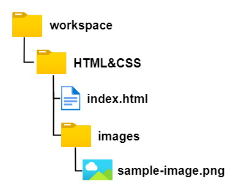
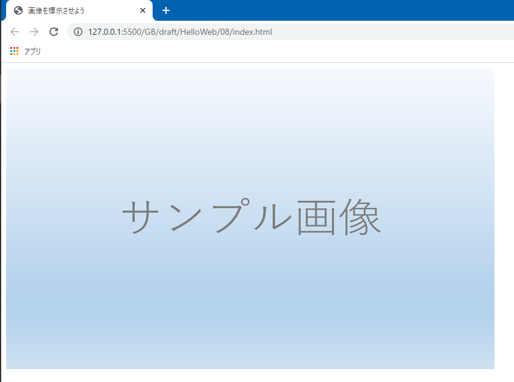
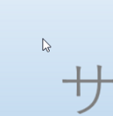
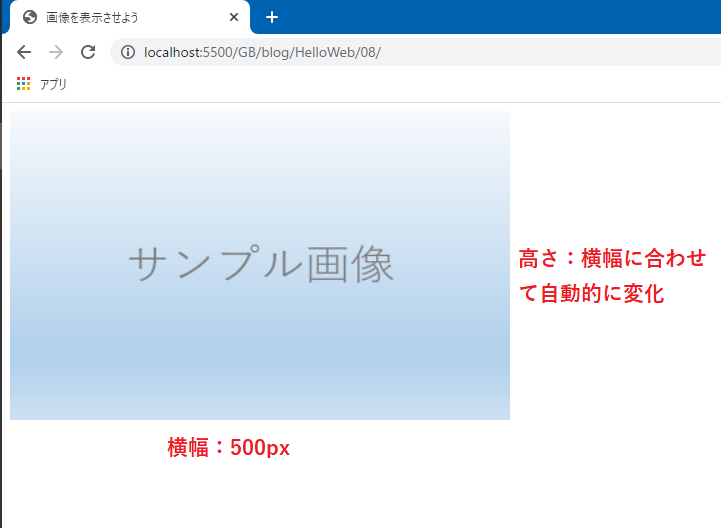
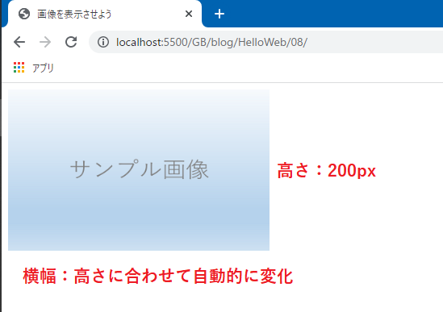
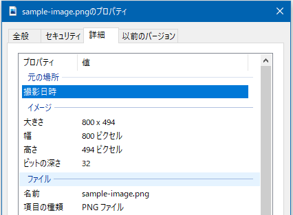

# 画像を表示させよう

今回はWebページに画像を表示させる方法を学びます。画像の表示は意外とややこしく方法はいくつかありますが、今回は**img要素**を使う方法を紹介します。この方法が一番簡単です。

まずは以下のような`index.html`を用意します。

```html:title=index.html
<!DOCTYPE html>
<html lang="ja">
<head>
  <meta charset="UTF-8">
  <meta name="viewport" content="width=device-width, initial-scale=1.0">
  <title>画像を表示させよう</title>
</head>
<body>

</body>
</html>
```

そして同じフォルダーに**images**というフォルダーを作成します。ここに表示させたい画像を保存するようにしましょう。

## 画像を入手

画像が無くては始まりませんから、適当な画像を用意してください。「何でもいいよ」「面倒くさい」という方は、以下の画像を右クリックして、「名前を付けて画像を保存...」を選択し、画像をダウンロードします。先ほど作成した`images`フォルダーに保存しましょう。


<aside>

本当はもっとかっこいい画像を用意出来ればよかったんですが、写真を撮るスキルがないためこんな画像になってしまいました。

</aside>

ファイル名は何でもOKです。恐らく、ダウンロードした画像は`sample-image.png`というファイル名になっていると思いますが、他の名前を付けたいのであれば変更しても当然OKです。ここでは`sample-image.png`であるとして進めます。

念のため現在のフォルダー構成を確認しておきます。



## img要素

画像を表示させるには**img要素**を使用します。「image」のimgですね、わかりやすいです。

また、**src属性**に画像ファイルの保存場所をパスで記述することで指定して、画像ファイルを取り込みます。「source」のsrcですね、わかりやすいです。

パスについては前回学習しました。今回も相対パスを使います。`images`フォルダーの中の`sample-image.png`を表すためには、`src="images/sample-image.png"`と記述します。

そして`img`タグは**空タグ**なので、終了タグは存在しません。

具体的にHTMLコードは以下のようになります。

```html:title=index.html
<body>
  
</body>
```

ここで実際にページを確認してみます。



画像が表示されない場合は、パス（つまりフォルダー名やファイル名）が間違っている可能性が高いです。もう一度チェックしてみてください。

### alt属性

img要素において`src`属性は必須です。画像ファイルの在処を示すものですから当たり前ですね。

必須ではないものの記述することが強く推奨されるのが**alt属性**です。「alternative」のaltです。画像の代わりに使用される、**画像を説明する**端的な文章を入力します。

`alt`属性を記述しても通常は画面上に表示されることはありません。alt属性が活躍する状況として、画像が表示されない場合が挙げられます。

`src`属性の値を変更し、存在しないパスにしてみましょう。`src`属性自体を消してしまってもOKです。そして、`alt`属性を用意し、`サンプル画像`と入力してみましょう。

```html:title=index.html
<body>
  
</body>
```

この状態でアクセスすると、画像を示すアイコンとalt属性に記述した文章が表示されていることが分かります。このようなアイコンと文字、見たことありますよね？


画像が表示されない理由は様々です。`src`属性のパスが間違っていることもそうですし、実際のWebサイトであればネットワークの状況によって画像ファイルの取得が出来なかったり遅れているという状況も当てはまります。ともかく、何かしらトラブルがあった場合に「本当はこんな内容の画像が表示されるんだよ」ということを伝えられるため、`alt`属性は必ず記述するようにしましょう。

<aside>

**スクリーンリーダー**でサイトが読み上げられる際にも、`alt`属性の値が読み上げられます。

</aside>

## 画像をリンクにすることもできる

前回学習した`a`要素と組み合わせ、画像をリンクにすることもできます。`index.html`以外にももう一つhtmlファイルを用意してください。ここでは以前作成した`about.html`を利用します。`index.html`と同じフォルダー内に保存します。

<aside>

リンクが機能するかを確認するだけなので、どのようなhtmlファイルでも構いません。

</aside>

さて思い出してほしいのですが、`<a href="">`と`</a>`に囲まれた中身が実際のリンクになるんでしたね。今回は画像をリンクにするため、`a`要素で`img`要素を囲えばOKです。

```html:title=index.html
<body>
  <a href="about.html">
    
  </a>
</body>
```

再度ページにアクセス、画像をクリックしリンク先のページへ移動できるか確認してください。

リンクにしたところで画像の表示に変化はありません。ただ、画像にマウスポインターを乗せた時の表示には変化があります。ただの画像の時は、ポインターは矢印のまま変化しません。



画像をリンクにした時は、ポインターが手のひらのマークに変化します。


これは画像だからこうなるというわけではなく、文字列をリンクにした場合も同様の変化が起こります。普段インターネットを徘徊されている方ならお馴染みの動作ですね。

## 画像の大きさはどうやって変更するの？

さて、今は画像の大きさのまま画面上に表示されています。「もっと小さく画像を表示させたい」という場合はどうすればいいのでしょうか。そのサイズの画像を用意するのも手ですが、様々なサイズが必要になると際限がなくなります。

画像の表示サイズはHTMLとCSSで柔軟に変化させることができます。この方法は様々あるのですが、ここではHTMLにおいて`img`タグの中で`width`属性や`height`属性を指定する方法を紹介します。

まずは`width`属性を指定してみましょう。`width`は「ウィッズ」「ウィズ」などと発音し（諸説あり）、横幅を意味する単語です。`width`属性に`500`を指定すると、画像の横幅が500pxに変化します。

```html:title=index.html
<body>
  
</body>
```

この時、画像の高さはアスペクト比を保つように変化します。`width`属性で横幅を変化させたからと言って、縦横の比率は変わらないという事ですね。



高さを指定するには`height`属性を指定します。`height`は「ハイト」と発音します。`height`属性に`200`を指定すると、画像の高さが200pxに変換します。これも`width`指定の時と同じく、アスペクト比を保つ形で画像の横幅が自動的に変化します。

```html:title=index.html
<body>
  
</body>
```



### `width`属性と`height`属性は指定しないとだめ？

この2つの属性は必須項目ではありません。また、画像のサイズはCSS側で変化させることが多いです。

しかし、**レイアウトシフト**なるものを防ぐため、これらの属性を指定するのがいいというのが私の考えです。

<aside>

レイアウトシフトとは、画像ファイルが後から読み込まれ、ページのレイアウトがずれる現象です。レイアウトシフトについてこの講座では詳しく説明しませんが、以下のページに分かりやすく記述されているので興味のある方は読んでみてください。
<br><br>
[CLS(Cumulative Layout Shift)とは？対策・改善方法も紹介！ | 模写修行メディア](https://moshashugyo.com/media/layout-shift)

</aside>

具体的な数値ですが、画像ファイルの横幅と高さをそのまま記述するのが良いと考えます。ここで画像の横幅と高さを確認する方法を紹介します。

画像ファイルを右クリックして、『プロパティ』を選択します。『詳細』タブを選択すれば『幅』『高さ』という項目があるので、これを`width`属性、`height`属性に指定すればいいでしょう。



```html:title=index.html
<body>
  
</body>
```

<aside>

画像の取扱いに関してはHTMLとCSS、さらにはブラウザーの機能まで関わってくるので、私も詳細を説明できる自信がありません。ここでは、これら2つの属性を記述するのを**おすすめする**という風にしておきます。

</aside>

## まとめ

- ✅ 画像は`img`要素で表示する
- ✅ `src`属性に画像ファイルのパスを記述する
- ✅ `alt`属性も必須ではないが記述するべき
- ✅ `width`属性、`height`属性も指定するのがおすすめ
- ✅ 画像の大きさはCSSでも変更できる

これまで長らくHTMLを学習してきましたが、次回からはCSSの学習を始めたいと思います。まだまだ紹介するべきHTMLタグが残っていますので、CSSの学習と同時進行という形で進めていきます。

## 参考

[&lt;img&gt;: 画像埋め込み要素 | MDN](https://developer.mozilla.org/ja/docs/Web/HTML/Element/img)

[【初心者向け】HTMLで画像にリンクを付ける方法 | CodeCampus](https://blog.codecamp.jp/programming-html-pic-link)

[HTMLの画像（imgタグ）の使い方・コンプリートガイド](https://code-kitchen.dev/html/img/)

[再確認：画像imgタグにサイズ指定をする事はSEO上重要です](https://lpeg.info/seo/img_width_height.html)

[【2020年夏】imgタグにはwidthとheight属性を書くのがいいらしい  |  Rriver](https://parashuto.com/rriver/development/img-size-attributes-are-back)

[レスポンシブデザインに於けるwidth, height属性について | The other way round](https://vanillaice000.blog.fc2.com/blog-entry-1063.html)

[source要素にwidth/height属性を指定して各画像のアスペクト比の維持とCLSの改善を図る | フロントエンドBlog | ミツエーリンクス](https://www.mitsue.co.jp/knowledge/blog/frontend/202105/31_1512.html)

[画像による Layout Shift が無くなる Web がやって来る - mizdra&#39;s blog](https://www.mizdra.net/entry/2020/05/31/192613)

[A more elegant and easier to use solution · Issue #16 · WICG/intrinsicsize-attribute](https://github.com/WICG/intrinsicsize-attribute/issues/16)