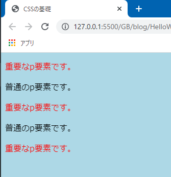
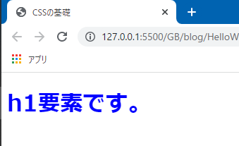

# CSSのセレクターについて

前回まででHTMLの学習がひと段落したので、これからはCSSをメインに学習していきます。

どちらかというと、HTMLと比べてCSSの方が学習すべき項目が多く難しいです。CSSをいっぺんに憶えて理解するのは不可能なので、まずは基礎をざっと学び、その後サンプルWebサイトを作成しながら知識を補完していくことにします。

## まずは復習

CSSについて学習したのは#3の記事でしたから、まずはCSSがどんなものかを思い出しましょう。

文書構造を定義するHTMLに対し、デザインし装飾するのがCSSの役目です。`.css`ファイルを作成し、htmlファイルから読み込むことでWebページがスタイリングされます。

ではハンズオン形式で進めていきます。`index.html`ファイルを用意し、同じ階層に`style.css`を作成します。`index.html`は以下の内容を記述します。

```html:title=index.html
<!DOCTYPE html>
<html lang="ja">
<head>
  <meta charset="UTF-8">
  <meta name="viewport" content="width=device-width, initial-scale=1.0">
  <link href="style.css" rel="stylesheet">
  <title>CSSの基礎</title>
</head>
<body>
  <h1>CSSの基礎</h1>
</body>
</html>
```

6行目にあるように、cssファイルはlink要素を使って読み込みます。`href`属性にファイルのパスを記述し、`rel`属性に取り込むファイルの役割を記述します。cssファイルを取り込むので`rel`属性には`stylesheet`と記述します。

次に`style.css`を編集します。画面の背景色と、h1要素の色を変えてみましょう。

```css:title=style.css
body {
  background-color: lightblue;
}

h1 {
  color: red;
}
```

CSSの記述の仕方も学習しましたね。どの要素を対象にするかを表す**セレクター**、どのスタイルを適用するかを表す**プロパティ**、どのようにスタイリングするかを表す**値**を記述します。


ページにアクセスし、背景が薄い青色に、h1要素が赤色になっていることを確認しておきます。


## 要素セレクター

今回作成したcssファイルではbody要素やh1要素を指定してcssを記述しています。このように、要素名を記述しているセレクターは**要素セレクター**と呼ばれます。`body`も`h1`も、もちろん他に`h2`や`p`、`a`を追加しても、それらも全て要素セレクターです。

p要素の要素セレクターを使って文字を赤く表示させるCSSを書くと、そのページのp要素の文字が全て赤く表示されます。

では、「数個ある`p`の中で、一つの`p`だけ赤くしたい」という場合にはどうすれば良いのでしょうか。これを実現するのが**クラスセレクター**です。

## クラスセレクター

クラスセレクターは、HTML要素に記述された`class`属性に基づいて要素を指定するセレクターです。今回は5つあるp要素のうち、重要な事項を述べているp要素に`class`属性を付与し文字を赤く表示させてみましょう。

まずは`index.html`を修正します。複数のp要素を用意し、その内の一つにだけ`class`属性を記述します。属性の値は「重要な」という意味の`important`とします。

```html:title=index.html
<body>
  <p>普通のp要素です。</p>
  <p>普通のp要素です。</p>
  <p class="important">重要なp要素です。</p>
  <p>普通のp要素です。</p>
  <p>普通のp要素です。</p>
</body>
```

この`important`という言葉自体にHTMLやCSS的な意味はありません。コーディングする私たちが好きな言葉を指定できます。

この時、`important`という値は**クラス名**などと呼ばれ、このp要素は**importantクラス要素**などとも呼ばれます。

次に`style.css`の編集を行います。クラスセレクターは`.クラス名`（クラス名の前にドット）という風に表します。

```css
body {
  background-color: lightblue;
}

.important {
  color: red;
}
```

これで`important`クラスが付与されている要素だけが赤く表示されているはずです。ページを確認してみます。


少し駆け足になったので、どんな風にクラスセレクターでスタイリングすればいいかを確認します。

1. スタイリングしたい要素を特定する（重要な事項を述べているp要素）
2. その要素にどんなクラス名を付与するかを考える（「重要な事項だから`important`」）
3. 要素に`class`属性を付与する（`class="important"`）
4. cssファイルで、クラスセレクター（`.important`）を使用しスタイリングを指定する

また、`important`クラスを複数の要素に適用することもできます。

```html:title=index.html
<body>
  <p class="important">重要なp要素です。</p>
  <p>普通のp要素です。</p>
  <p class="important">重要なp要素です。</p>
  <p>普通のp要素です。</p>
  <p class="important">重要なp要素です。</p>
</body>
```



クラスを指定するというのは、文字通り、名前を付けて要素をクラス分けするようなものです。「重要な要素は`important`クラスに分類します。これらは全て文字を赤くします」「タイトルは`title`クラスに分類します。これらは全て文字を大きくします」といった具合です。

## 要素セレクターとクラスセレクターの併用

実は、要素セレクターとクラスセレクターは併用することができます。例えば、`important`クラスが付与されているh1要素は文字を赤くする、`important`クラスが付与されているp要素は文字を青くする、ということが実現できます。セレクターは`要素名.クラス名`という風に記述します。

<aside>

`要素名`と`.クラス名`の間にスペースは空けません。スペースを空けると意味が変わってきます。

</aside>

```css:title=style.css
h1.important {
  color: red;
}

p.important {
  color: blue;
}
```


h1要素もp要素も同じ`important`クラスが付与されていますが、それぞれ別のスタイルが適用されます。

周りに枠線を表示されられる`border`というプロパティがあります。これを`h1.important`に追加したとします。この時、h1要素に枠線が引かれますが、p要素には影響しません。

```css:title=style.css
h1.important {
  border: 1px solid red;
  color: red;
}

p.important {
  color: blue;
}
```


2つのセレクターを併用した時は、「h1要素**かつ**`important`クラス」「p要素**かつ**`important`クラス」のように、**かつ**という言葉を用いることでイメージしやすいと思います。

### セレクターの詳細度

もう一つ例をあげましょう。`important`クラスの文字を赤くするスタイルと、`important`クラスが付与されているh1要素を青くするスタイルを定義します。HTMLとCSSは以下のようになります。

```html:title=index.html
<body>
  <h1 class="important">h1要素です。</h1>
  <p class="important">p要素です。</p>
</body>
```

```css:title=style.css
.important {
  color: red;
}

h1.important {
  color: blue;
}
```

この時、h1要素とp要素はどのようにスタイリングされるでしょうか？p要素は`.important`に記載されている`color: red;`が適用されそうですね。しかし、h1要素に関しては2つのスタイルが定義されています。

結論から言うと、**詳細度の高い**`h1.important`のスタイルが適用され、h1要素は青い文字で表示されます。


セレクターが、どれだけ詳細にスタイリングする対象（要素）を指定しているかを、**セレクターの詳細度**などと言います。詳細度の低いセレクターよりも、高いセレクターのスタイルが適用されます。

「`important`クラスの文字を赤くします」よりも「h1要素かつ`important`クラスの文字を青くします」の方がスタイリングする要素を詳細に指定していますよね？つまり、後者の方が**CSSセレクターの詳細度が高い**と言えます。

では、以下のような場合はどうでしょう？

```html:title=index.html
<body>
  <h1 class="important">h1要素です。</h1>
</body>
```

```css:title=style.css
h1 {
  color: red;
}

.important {
  color: blue;
}
```

h1要素に対して、要素セレクターとクラスセレクターが定義されています。この時も詳細度によって適用されるスタイルが決定されます。

要素セレクターより**クラスセレクターの方が詳細度が高い**ため、h1要素は青い文字で表示されます。



ここまで3種類のセレクターを学習しましたので、詳細度のおさらいをしておきます。詳細度が高い順に並べると、

1. 要素セレクター＋クラスセレクター（`h1.impotant`）
2. クラスセレクター（`.important`）
3. 要素セレクター（`h1`）

という風になります。

<aside>

詳細度にはちゃんとした計算方法があります。後々、別のページで解説します。

</aside>

## 基本的にクラスセレクターを使う

要素セレクターはあまり使用せず、基本的にクラスセレクターを使っていくというのが現在の主流であるように思えますし、私自身もそうしています。

要素セレクターを使用すると、該当する要素全てにスタイルが一律適用されます。後先考えずにp要素の文字を赤くしてしまうとページ内全てのp要素が赤くなってしまいます。しかし、これを逆に考えると、**ページ全体で適用したいスタイル**を定義するのに向いていると言えます。例えば、p要素の色はデフォルトだと真っ黒です。「ページ全体のp要素の文字を少しだけ薄い色にしたい」という時には要素セレクターを使用してもいいでしょう。

以下のように`color: #444;`とすることで文字色を薄くすることができます。

```html:title=index.html
<body>
  <p>ここに文章を記述します。ここに文章を記述します。</p>
  <p>ここに文章を記述します。ここに文章を記述します。</p>
  <p>ここに文章を記述します。ここに文章を記述します。</p>
</body>
```

```css:title=style.css
p {
  color: #444;
}
```

そして文字を赤くしたい要素が見つかったら、その要素にクラスを指定してクラスセレクターを用いてスタイルを定義すればいいのです（前述している通り、クラスセレクターの方が詳細度が高いのでスタイルは上書きされます）。

```html:title=index.html
<body>
  <p>ここに文章を記述します。ここに文章を記述します。</p>
  <p>ここに文章を記述します。ここに文章を記述します。</p>
  <p class="important">ここは重要な文章です。</p>
</body>
```

```css:title=style.css
p {
  color: #444;
}

.important {
  color: red;
}
```

ページ全体で共通で適用したいスタイルのみ要素セレクターで指定し、個々のスタイリングはクラスセレクターで行う、というのが基本です。先にデフォルトのスタイルを設定し個別に上書きしていく、というイメージでもいいかもしれません。

## ユニバーサルセレクター

最後に、ユニバーサルセレクターを紹介します。ユニバーサルセレクター（`*`）は全ての要素を対象にするセレクターです。詳細度は最も低いです。

ユニバーサルセレクターの使用例として、ブラウザーの**デフォルトCSSをリセット**するというものが挙げられます。

下記画像を見てください。これまでにもh1要素を何度も使ってきましたが、p要素と比べて文字が大きく太く表示されていることに気が付いていると思います。また、h1要素やp要素の間にスペースが空いています。これらがブラウザーのデフォルトCSSです。CSSを指定しなくてもある程度見栄えが良くなるように、CSSが~おせっかい~気を効かせてくれているのです。


しかし、このデフォルトCSSは必ずしもありがたいものであるとは限りません。サイト作成をすすめていく途中で「変な隙間が空いてる」と思ったらデフォルトCSSのせいだった、ということがとても多いです。よって、最初にデフォルトCSSのデザインをリセット（無効化）してしまうという考え方があります。

例えば、ユニバーサルセレクターを使って以下のようにスタイルを定義すれば、全ての要素が持つ隙間が無くなり文字の大きさや太さが統一されます。

```css:title=style.css
* {
  margin: 0;
  padding: 0;
  font-size: 16px;
  font-weight: normal;
}
```


<aside>

実際は**リセットCSS**というものを利用することが多いです。しかし、個人の勉強用のサイトであれば上記のようなリセットの仕方でも問題ありません。

リセットCSSは別ページで導入方法を説明します。

</aside>

## まとめ

- ✅ セレクターには要素、クラス、ユニバーサルなどの種類がある
- ✅ `class="クラス名"`という風にクラス属性を付与する
- ✅ クラスセレクターは`.クラス名`、ユニバーサルセレクターは`*`と記述する
- ✅ 各セレクターには**詳細度**という考え方があり、詳細度が高いセレクターのスタイルが適用される

次回は、主に**子孫セレクター**について学習します。

## 参考

[要素・クラス・ID によるセレクター | MDN](https://developer.mozilla.org/ja/docs/Learn/CSS/Building_blocks/Selectors/Type_Class_and_ID_Selectors)

[要素型セレクター | MDN](https://developer.mozilla.org/ja/docs/Web/CSS/Type_selectors)

[クラスセレクター | MDN](https://developer.mozilla.org/ja/docs/Web/CSS/Class_selectors)

[全称セレクター | MDN](https://developer.mozilla.org/ja/docs/Web/CSS/Universal_selectors)

[Selectors Level 3 | W3C](https://www.w3.org/TR/selectors-3/#specificity)

[[CSS] CSSのuser agent stylesheetとは | SNOW NOTES](https://snownotes.org/understanding-about-user-against-stylesheet-and-reset-css/)
