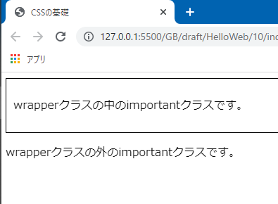
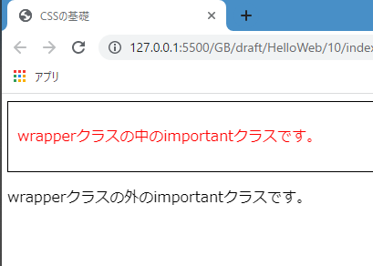
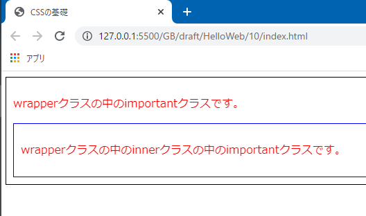
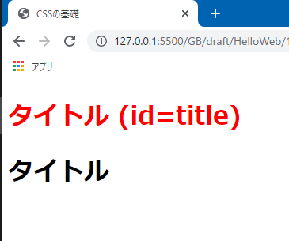

# 子孫セレクターとidセレクター

今回は子孫セレクターとidセレクターを学習します。

子孫セレクターとは、その名の通りある要素の子孫要素を指定するセレクターです。

idセレクターは、特定のIDが付与された要素を指定するセレクターです。

## div要素

まずは新しいHTML要素をひとつ紹介します。div要素です。div要素は**コンテンツを囲うボックス**のようなものを作成します。

div要素に文書構造的な意味はありません。h1要素なら見出し、p要素なら段落、という風に各要素に意味があると説明しましたが、div要素にはそれがありません。

CSSでスタイリングする上でdiv要素はとても重要です。「複数の要素を囲ってひとまとまりにして、CSSを適用させたいな」という場面はかなりありますが、「囲うのにどの要素を使うべきか」や「最適な要素がない」ということで悩むことが多いです。

そんな時はdiv要素の出番です。文書的に意味を持たないからこそ、CSSデザインのために文書構造を気にせず汎用的に使うことができます。

さて、そのdiv要素を使い、複数の子要素を包むボックスを作成します。「包むもの」という意味をこめて`wrapper`（ラッパー）というクラス名を付けます。

次に`wrapper`クラスの中に`important`クラスを付与したp要素を用意します。加えて、`wrapper`クラスの外にも`important`クラスの`p`要素を用意します。

```html:title=index.html
<body>
  <div class="wrapper">
    <p class="important">wrapperクラスの中のimportantクラスです。</p>
  </div>

  <p class="important">wrapperクラスの外のimportantクラスです。</p>
</body>
```

`wrapper`クラスに枠線を引いてみましょう。枠線を引くには`border`プロパティを使用します。`border`プロパティの値は、「`線の太さ、線の種類、線の色`」という風に記述します。以下のように記述することで、1pxの黒い直線が`wrapper`クラスに引かれます。また、`wrapper`クラスの内部に余白を付ける`padding`プロパティもついでに定義しておきましょう。

```css:title=style.css
.wrapper {
  border: 1px solid #000;
  padding: 10px;
}
```

ここでWebページで表示を確認しておきます。黒い枠線のボックスが`wrapper`クラスのdiv要素です。`wrapper`クラスの中と外に`important`クラスがあることが視覚的にも分かりますね。



## 子孫セレクター

子孫セレクターは「`wrapper`クラスの中の`important`クラスにだけ」スタイルを当てるセレクターです。`親要素名 子孫要素名`という風に、半角スペースを空けて要素名やクラス名を記述します。これで`wrapper`クラスの中にある`important`クラスにだけスタイルが適用されます。

```css:title=style.css
.wrapper {
  border: 1px solid #000;
}

.wrapper .important {
  color: red;
}
```

同時に、`wrapper`クラスの外にある`important`クラスにはスタイルが適用されていないことがわかります。



<aside>

「子孫セレクターなんか使わずに違うクラスを用意すればいいんじゃないの？」と思われるかもしれませんが、それはとても素晴らしい考え方だと思います。

**CSS設計**という言葉があるように、同じクラスが点在したりしないようにすることで壊れにくく保守しやすいCSSを書くことができます。しかし、一旦それは置いておき後から勉強するようにしましょう。

</aside>

<aside>

実は、`color`プロパティは**値が継承されるプロパティ**なので、子孫セレクターを使わなくても以下のように書けばスタイルが適用されます。

```css:title=style.css
.wrapper {
  color: red;
}
```

ここでは子孫セレクターの説明を行うという目的のもと、分かりやすい`color`プロパティを題材に挙げました。継承の考え方については次回説明します。

</aside>

### 範囲内の「全ての」要素に適用される

**子孫**セレクターという名前の通り、指定したスタイルは孫要素、ひ孫要素、やしゃご要素...という風にずっと辿って適用されます。以下のHTMLは`wrapper`クラスの中に`inner`クラスを作成し、その中に`important`クラスを用意した例です。

```html:title=index.html
<body>
  <div class="wrapper">
    <p class="important">
      wrapperクラスの中のimportantクラスです。
    </p>
    <div class="inner">
      <p class="important">
        wrapperクラスの中のinnerクラスの中のimportantクラスです。
      </p>
    </div>
  </div>
</body>
```

※`inner`クラスを分かりやすくするため、周りに青い枠線を引きスペースを空けます。

```css:title=style.css
.wrapper {
  border: 1px solid #000;
  padding: 10px;
}

.inner {
  border: 1px solid blue;
  padding: 10px;
}

.wrapper .important {
  color: red;
}
```

ページを確認してみると、`inner`クラスの中の`important`クラスの文字も赤くなっていますね。



このことから、子要素のみならず孫要素にもスタイルが適用されることがわかります。`.wrapper .inner .important`などとセレクターを書く必要がないということですね。

<aside>

子要素のみを指定する、**子セレクター**（`>`）というのもあります。

</aside>

## idセレクター

ではセレクターの勉強の最後に、`id`セレクターについて説明します。その名の通り、`id`属性の値で対象の要素を特定するセレクターです。

`id`属性については#7で勉強しましたね。以下のようなh1要素を用意します。

```html:title=index.html
<body>
  <h1 id="title">タイトル (ID=title)</h1>
  <h1>タイトル</h1>
</body>
```

idセレクターは、`#id名`という風に先頭に`#`を付けて記述します。`#`を付ける点はページ内リンクを作成する時の`href`属性の記述方法と同じですね。

これで`title`IDが付与されている要素だけ文字が赤く表示されます。

```css:title=style.css
#title {
  color: red;
}
```



[#7](/HelloWeb/07/)でも説明した通り、IDはページ内で重複することが許されません。仮にIDが重複した状態でCSS側でidセレクターを使用すると、不具合のもとになります。

また、IDセレクターは唯一の要素を指すことになるという性質上、汎用性が低く、現代のCSSスタイリングではあまり使用されない傾向にあります。この講座でもidセレクターは使用せず、クラスセレクターを使用してスタイリングを進めていきます。

参考 : [CSS で class を使って id を使わない理由 &#8211; カラクリ.jp](http://xn--lcki7of.jp/839/)

## まとめ

- ✅ 子孫セレクターは子孫要素に対するセレクター
- ✅ div要素を使用することで、複数の要素を囲えるボックスを定義できる
- ✅ div要素は文書構造上の意味を持たず、CSSスタイリングをするために自由に使える
- ✅ idセレクターを使用することで、特定のIDが付与されている要素を指定できる
- ✅ idセレクターは`#`を使用する

次回は、CSSの継承という概念について学習します。

## 参考

[子孫結合子 | MDN](https://developer.mozilla.org/ja/docs/Web/CSS/Descendant_combinator)

[Selectors Level 3 - 8.1. Descendant combinator | W3C](https://drafts.csswg.org/selectors-3/#descendant-combinators)

[ID セレクター | MDN](https://developer.mozilla.org/ja/docs/Web/CSS/ID_selectors)

[【CSS】結合子-シンプルセレクタ同士を組み合わせて複雑な指定をする - marronブログ](http://lovee7.blog.fc2.com/blog-entry-28.html)

[CSSについて誰も私に教えてくれなかった大切なこと -プロパティやセレクタがパフォーマンスに与える影響 | コリス](https://coliss.com/articles/build-websites/operation/css/things-nobody-ever-taught-me-about-css.html)

[【CSS】idを使わずにclassだけにする長所と短所 | JavaScriptに関するお知らせ](https://jsnotice.com/posts/2019-05-17/)

[CSSのIDセレクタ使うかどうか問題 [necotech blog]](https://neco.tech/blog/2016/04/06/css-id-selector)