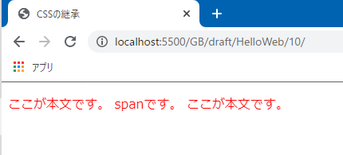
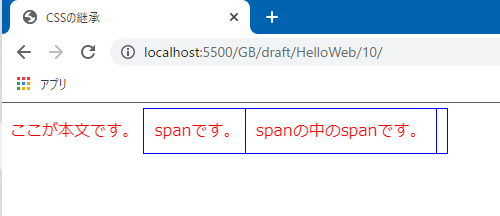
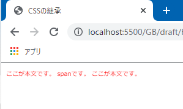
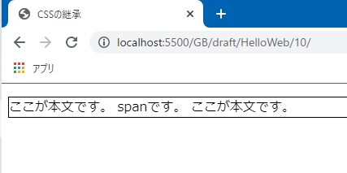
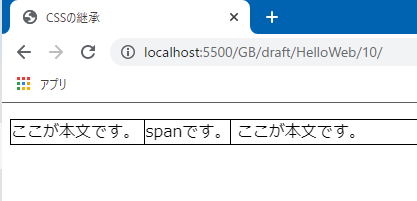
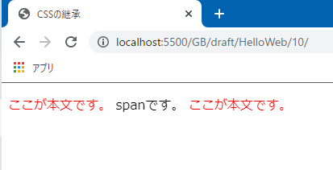

# プロパティの値は子孫要素に「継承」される

以前、CSSは「**Cascading** Style Sheet」の略称だと説明しました。cascadeは**小さな連続する滝**というような意味を持ちます。

> カスケード (英語 cascade) の原義は、<mark>連なった小さな滝である</mark>[1]。建築分野では人工的に作ったものを指す[2]。さらにその派生として連続したもの、<mark>数珠つなぎになったものを意味する</mark>言葉として各分野で用いられる。日本語でのカスケードはこの派生用法が主である。

参考 : [カスケード - Wikipedia](https://ja.wikipedia.org/wiki/%E3%82%AB%E3%82%B9%E3%82%B1%E3%83%BC%E3%83%89)

CSSにおいて「cascading」という言葉は、「親要素のプロパティが子孫要素にも適用される」ということを意味します。

CSSプロパティやHTML要素の親子関係を学んだ今なら、何となく想像が付くと思います。試しに、プロパティが継承している様子を見てみましょう。

```html:title=index.html
<body>
  <p>ここが本文です。 <span>spanです。</span> ここが本文です。</p>
</body>
```

p要素の中に、**span要素**を用意しました。

このspan要素は、前回紹介したdiv要素と同じく、**文書的に意味を持たない要素**を作成できます。div要素は、親要素として子要素を囲うボックスを作成しますが、span要素は**文章の中（例えばp要素）などに記述**して、文字列を囲ったりする役割を持ちます。このdiv要素とspan要素の違いはまた先の方で学習しましょう。

そして、（span要素ではなく）p要素に文字を赤くするスタイルを指定してみます。

```css:title=style.css
p {
  color: red;
}
```

ページを確認すると、span要素の文字まで赤く表示されていることがわかります。これは、p要素に指定した`color`プロパティが、子要素であるspan要素に継承されたためです。



もっと子孫要素を増やしてネストさせてみましょう。以下のHTMLは、pクラスの中にspan要素を用意しさらにその中にspan要素を用意した例です。

```html
<body>
  <p>
    ここが本文です。
    <span>
      spanです。
      <span>
        spanの中のspanです。
      </span>
    </span>
  </p>
</body>
```

※span要素に青い枠線をつけスペースを空けます。

```css
p {
  color: red;
}

/* 枠線をつけスペースを空ける */
span {
  padding: 10px;
  border: 1px solid blue;
}
```

やはり、全てのspan要素にプロパティが継承され、文字が赤く表示されることになります。



このように「親要素のプロパティを子要素が継承し、その子要素もプロパティを継承し、、、（以下略）」という風に、子孫に伝い落ちて伝搬していく様子を、水がいくつもの滝を流れ落ちていく様子に見立ててcascadingと呼んでいるのです。

<aside>

このcascadingという命名はおしゃれですね。プログラミング言語だと「継承」といえば「inheritance」と言ったり、「extends」というキーワードを使って継承したりします。

</aside>

## 継承される／されないプロパティ

実は、全てのプロパティが子孫要素に継承されるというわけではなく、継承されないプロパティというのもあります。というより、（正確なことは把握できていませんが）継承されないプロパティの方が多い印象です。

どのプロパティが継承される／継承されないというのを丸暗記するのは無駄な努力ですから、いくつかの代表的なプロパティを取り上げ、継承されるかされないかを見ていきましょう。

<aside>

そもそもCSSプロパティについて、どのようなものがあるかまだちゃんと説明していませんから、次回以降プロパティを説明する時に継承される／されないも確認しましょう。

</aside>

### 継承される`color` / `font-size`プロパティ

文字の色を変える`color`プロパティ、文字の大きさを変える`font-size`プロパティ（これら2つのプロパティは次回の記事で紹介します。）は、子孫要素に継承されます。



```html
<body>
  <p>ここが本文です。 <span>spanです。</span> ここが本文です。</p>
</body>
```

```css
p {
  color: red;
  font-size: 10px;
}
```

サイト全体で表示される文字（見出しや文章に使われるものなど）ですが、真っ黒よりもほんの少しだけ薄くして灰色にした方が読みやすいと考えています。実際にGoogleの検索結果を見ても、文字は黒に見えて少しだけ薄く表示されています。

参考 : [ブログの文字色は黒じゃダメ！？大手サイトの文字色比較 | イズクル](https://www.iscle.com/web-it/font-color.html)

`color`プロパティが継承されるという性質を利用して、このサイトでは`body`セレクターに`color`プロパティを記述し、文字の色をほんの少し薄くしています。

```css:title=このサイトの例
body {
  color: #444;
}
```

こうすることで、body要素の子孫要素全体にプロパティが伝搬されていきます。さもないと、`h1`、`h2`、`h3`、`p`、、、など、文字の色を変えたい要素に一個一個`color`プロパティを記述していく羽目になります。

**サイト全体に適用したい**スタイリングがあれば、body要素などにプロパティを記述し継承の仕組みを利用するのがいいと思います。

### 継承されない`border`プロパティ

要素の周りに枠線を引く`border`プロパティですが、これは継承されないプロパティです。

```html
<body>
  <p>ここが本文です。 <span>spanです。</span> ここが本文です。</p>
</body>
```

```css:title=style.css
p {
  border: 1px solid black;
}
```

p要素にだけ`border`プロパティを記述しました。このプロパティは子要素に継承されないため、以下のような表示になります。



span要素にも枠線を引きたい場合は、span要素セレクターを用意し`border`プロパティを記述します。

```css:title=style.css
p {
  border: 1px solid black;
}

span {
  border: 1px solid black;
}
```



### `inherit`

上記の例ではspan要素に同じ`border`プロパティを用意しましたが、`inherit`という値を使用することで、**本来は継承されないプロパティを継承する**ことができます。

```css:title=style.css
p {
  border: 1px solid black;
}

span {
  border: inherit;
}
```

`inherit`は使いこなせれば便利かも知れませんが、私はあまり使わない、というか使う場面が少ないです。

継承されたら便利なプロパティは、大体がデフォルトで継承されるようになっています。逆に継承されないプロパティは、そもそも継承したい場面が少ないです。これはCSS側が利便性を考えて継承される／されないを決めてくれたおかげだと思っています。

## 継承されたプロパティは上書きできる

`color`や`font-size`は継承されると説明しましたが、当然継承されたくない場面というのもあるわけです。プロパティを継承させない`initial`という値を使うのも手ですが、プロパティを上書きしてしまうのも手です。

以下の例は、span要素の文字の色を黒に上書きしている例です。

```html:title=index.html
<body>
  <p>ここが本文です。 <span>spanです。</span> ここが本文です。</p>
</body>
```

```css:title=style.css
p {
  color: red;
}

span {
  color: black;
}
```



「継承されたプロパティより、明示的に指定されたプロパティの方が優先される」というのは直感的にもわかりやすいですね。どのスタイルが適用されるかの法則は、前回説明した**詳細度**とも話が絡んでくるので、正確に把握するのは難しいです。ここでは、単純に「継承されたプロパティは上書きできる」と憶えておきましょう。

参考 : [知っておきたいCSS セレクタの優先順位・詳細度・継承 - WEBST8のブログ](https://webst8.com/blog/css-selector-priority/)

## まとめ

- 親要素のプロパティの値が子孫要素に伝搬していくことを継承という
- 値が継承されるプロパティと継承されないプロパティがある
- 値を`inherit`とすることで、継承されないプロパティの値を継承することができる

ここまででCSSの基本的な仕様が分かったと思います。次回からは代表的なプロパティを学習していきます、

## 参考

[カスケードと継承 | MDN](https://developer.mozilla.org/ja/docs/Learn/CSS/Building_blocks/Cascade_and_inheritance)

[&lt;span&gt; | MDN](https://developer.mozilla.org/ja/docs/Web/HTML/Element/span)

[inherit | MDN](https://developer.mozilla.org/ja/docs/Web/CSS/inherit)

[aタグのcolorが親要素から継承されない](https://penpen-dev.com/blog/atagu-color/)

[CSS初学者の最初の壁「スタイルの継承」をしっかり理解する &#8211; WPJ](https://www.webprofessional.jp/css-inheritance-introduction/)

[CSSの継承〜親から子へ受け継がれる意志〜 - Qiita](https://qiita.com/yokoyoko_115/items/d98ba66ab0d166aa7951)

[CSS値の「initial」「inherit」「unset」「revert」の違い - Qiita](https://qiita.com/h-naito/items/3027f92dde68899159c7)

[CSS で指定されたプロパティ値が描画の際に使われる値になるまで](https://zenn.dev/ziphil/articles/807b1b7617d4ab)

[知っていると役に立つ！親要素から値を継承するinheritの便利な使い方 | ビギナーズハイ](https://beginners-high.com/css-inherit/)

[100年後も崩れないCSS勉強会 · 第1回「詳細度」](http://pepabo.github.io/css/specificity/)