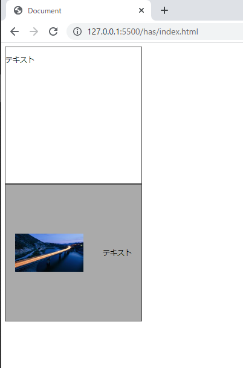
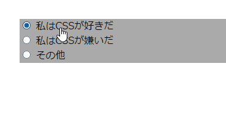
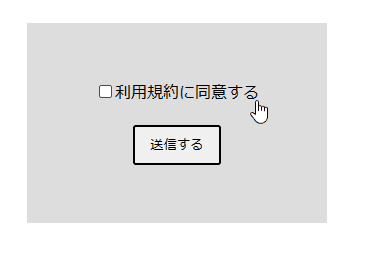

# CSSのhas擬似クラス

今回は、2022年に入り一気にブラウザー対応が進んだ`has`擬似クラスを取り上げます。

`:has()`が何かを一言で説明するのは難しいですが、MDNの説明によると、

> :has() は CSS の擬似クラスで、引数として渡されたセレクターに (指定された要素の :scope の相対で) <mark>該当する要素が一つ以上の要素に一致すること</mark>を表します。

[:has() | MDN](https://developer.mozilla.org/ja/docs/Web/CSS/:has)

とのことです🤔。例えば`.box:has(〇〇〇)`と書いた場合、〇〇〇が存在する時の`.box`のスタイルを決めることができます。

`:has()`の解説で一番多いのが**親子関係**にまつわるものです。当記事でもそれに倣って、`:has()`が親子関係についてどのような効果をもたらすかを取り上げたいと思います。

## 子孫セレクターと逆の働き

要素の親子関係を元にスタイルを決定するセレクターといえば、子孫セレクターが該当します。`div p {}`の様に要素間に半角スペースを空けて記述します。これは「ある親要素を持つ子孫要素のスタイルを指定する」と捉えることができます。以下の例で言うと、「boxクラスを親要素に持つp要素」のみにスタイルを当てています。

```html
<div class="box">
  <p>boxクラスの中のp要素です。</p>
</div>

<p>p要素です。</p>
```

```css
.box {
  width: 150px;
  height: 150px;
  border: 1px solid #444;
}

/* boxクラスの中のp要素のスタイルを定義している */
.box p {
  color: red;
}
```

`:has()`は言わば逆で、「ある子孫要素を持つ親要素」のスタイルを指定することができます。子孫要素の有無で自身のスタイルを変更できるということです。

```html
<div class="box">
  <p>p要素を持つboxクラスです。</p>
</div>

<div class="box">
  boxクラスです。
</div>
```

```css
.box {
  width: 150px;
  height: 150px;
  border: 1px solid #444;
}

/* p要素を子孫要素に持つboxクラスのスタイルを定義 */
.box:has(p) {
  background-color: lightblue;
}
```

子孫セレクターと`:has()`の違いは以下の通りです。

```css
/* 子要素(p)のスタイルを定義している */
.box p {}

/* 親要素(.box)のスタイルを定義している */
.box:has(p) {}
```

このように、子要素の有無によって親要素のスタイル定義を実現する方法は、これまでCSSではありませんでした（JavaScriptを使い、子要素の状態変化を感知して親要素のスタイルを変更する、といった方法で実現していた）。これをCSSネイティブの機能で実現できるのはとても嬉しいですね。

<!--
### `+`や`~`も使える

`:has()`は子孫要素だけではなく、例えば`+`（隣接セレクター）を使うことで、隣接している要素があるかないかでスタイルを定義することができます。

-->

<aside>

各ブラウザーの対応状況ですが、2022年12月現在、実はFirefoxでは未対応です。

[can i use](https://caniuse.com/css-has)

ですので、私はまだ外部に公開しているサイトでは`:has()`を使用していません。Firefoxでもフラグ付きなら機能するようですので、もうすぐ全ての主要ブラウザーで利用可能になると思っています。

</aside>

## boxで使う

ではもうちょっと具体的な活用方法を考えてみます。

画像やテキストを入れるboxクラスを例にします。テキストは必ず存在しますが、画像はある場合もない場合もあります。画像がある場合は`display: flex`で画像とテキストを横並びにします。

まず、`.box`を定義します。`height`と`width`、そして`border`を定義しておきます。

```css:title=style.css
.box {
  width: 300px;
  height: 300px;
  border: 1px solid #444;
}
```

画像がある場合のdiv要素ですが、`.box`と`.box-image`の両方を付与することにしましょう。この時、HTMLとCSSは以下のようになります（分かりやすくするため、`.box-image`の背景は暗くしています）。

```html:title=index.html
<div class="box">
  <p>テキスト</p>
</div>

<div class="box box-image">
  
  <p>テキスト</p>
</div>
```

```css:title=style.css
.box {
  width: 300px;
  height: 300px;
  border: 1px solid #444;
}

.box-image {
  display: flex;
  justify-content: space-around;
  align-items: center;
  background-color: #aaa;
}
```



これでも大きな問題はないのですが、「画像がある場合は、個々のdiv要素に`.box-image`を付与しなければならない」「クラス名を考える手間と思い出す手間がかかる」という辛さがあります。これを`:has()`を使ったスタイリングに置き換えてみます。

```html:title=index.html
<div class="box">
  <p>テキスト</p>
</div>

<!-- box-imageクラスは削除 -->
<div class="box">
  
  <p>テキスト</p>
</div>
```

```css:title=style.css
.box {
  width: 300px;
  height: 300px;
  border: 1px solid #444;
}

.box:has(img) {
  display: flex;
  justify-content: space-around;
  align-items: center;
  background-color: #aaa;
}
```

この通り、HTMLもCSSも若干シンプルになりました。

何より嬉しいのは、人間が考えてHTMLのクラスを追加しなくていい、という点です。「どのように表示させるか」というスタイルに関することに対して、これまでは文書構造を司るHTML側でクラス名を付与することで実現していたわけですが、`:has()`を使用することで仕事の大部分をCSS側に任せることができるようになったと言えます。

<aside>

ここからもいくつかサンプルを掲載しますが、必ずしも`:has()`を使わないと実現できない、というわけではありません。しかし、`:has()`を使うことで、コードがシンプルになり見通しが良くなると考えています。

</aside>

### 指定できるのは子孫要素だけではない

これまでは`:has(子孫要素)`としていましたが、例えば隣接セレクター（`+`）を使うこともできます。

以下の例は、`+`を使い「h2要素に**隣接する**table要素がある時、h2要素の`margin-bottom`を`30px`にする」というCSSです。

```css
/* 基本的にはあまりマージンは空けない */
h2 {
  margin-bottom: 10px;
}

/* h2要素に隣接するtable要素がある場合は30px空ける */
h2:has(+ table) {
  margin-bottom: 30px;
}
```

## フォームで使う

この素晴らしき擬似クラスをフォームでどのように利用できるかを考えてみました。2つのサンプルを紹介して本記事を終わりにしたいと思います。

### ラジオボタンで利用する

ラジオボタンの「その他」が選択された時に、理由を選択するテキストボックスが現れるようにしました。



テキストボックスは`other-field`クラスの中に格納しておき、最初は非表示にしておきます。そして、ラジオボタンを囲っている`radio-wrapper`クラスに対して`:has()`を用いて、子要素のラジオボタンのうち、`value="other"`が選択された時に`other-field`クラスを表示させる、というCSSを書いています。

具体的には以下のコードを参照してください。

<details>
<summary>コードを見る</summary>

```html
<form>
  <!-- 3つのラジオボタンを囲う領域 -->
  <div class="radio-wrapper">
    <label for="like">
      <input
        id="like"
        name="css"
        type="radio"
        value="like"
      />
        私はCSSが好きだ
    </label>

    <label for="dislike">
      <input
        id="dislike"
        name="css"
        type="radio"
        value="dislike"
      />
        私はCSSが嫌いだ
    </label>

    <label for="other">
      <input
        id="other"
        name="css"
        type="radio"
        value="other"
      />
        その他
    </option>
  </div>

  <!-- その他を入力する領域。最初は非表示 -->
  <div class="other-field">
    <label>自由に記入してください。</label>
    <input type="text" />
  </div>
</form>
```

```css
label {
  display: block;
  cursor: pointer;
}

/* 理由を入力する領域。最初は非表示 */
.other-field {
  display: none;
}

.radio-wrapper {
  background-color: #aaa;
}

/* 子要素のラジオボタンのvalueがotherの時、兄弟要素の.other-wrapperを表示する */
.radio-wrapper:has(input[type="radio"][value="other"]:checked) ~ .other-field {
  display: block;
}
```

</details>

### チェックボックスで利用する

「利用規約に同意する」にチェックした時に、フォーム全体を薄い青色に変化させるCSSです。



<details>
<summary>コードを見る</summary>

```html
<form class="form">
  <label>
    <input type="checkbox">利用規約に同意する
  </label>

  <button type="button">送信する</button>
</form>
```

```css
label {
  cursor: pointer;
}

.form {
  margin: 100px;
  display: flex;
  justify-content: center;
  align-items: center;
  flex-direction: column;
  gap: 20px;
  width: 300px;
  height: 200px;
  background-color: #ddd;
  transition: 0.1s;
}

.form:has(input[type="checkbox"]:checked) {
  background-color: rgba(0, 128, 184, 0.2);
}

button {
  padding: 8px 15px;
  border-radius: 3px;
}
```

</details>

---

以上、`:has()`について簡単にまとめてみました。

この`:has()`があればCSSやJavaScriptのコードをかなり減らせそうなので、私がとても待ち望んでいたCSSの新機能です。

## 余談

余談ですが、個人的に一番実現してほしい機能は[css-nesting](https://www.w3.org/TR/css-nesting-1/)ですが、まだWFPDの段階であり、[シンタックスをどうするか議論している](https://github.com/w3c/csswg-drafts/issues/8248)様子を見つけました。あまり情報は追えていませんが、他にもまだまだ課題があるようです。実現はまだ先ですかね。

## 参考

[Selectors Level 4](https://w3c.github.io/csswg-drafts/selectors/#relational)

[The advanced guide to the CSS :has() selector - LogRocket Blog](https://blog.logrocket.com/advanced-guide-css-has-selector/)

[CSS Parent Selector - Ahmad Shadeed](https://ishadeed.com/article/css-has-parent-selector/)

[](https://css-tricks.com/almanac/selectors/h/has/)
