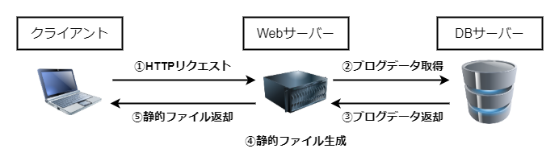
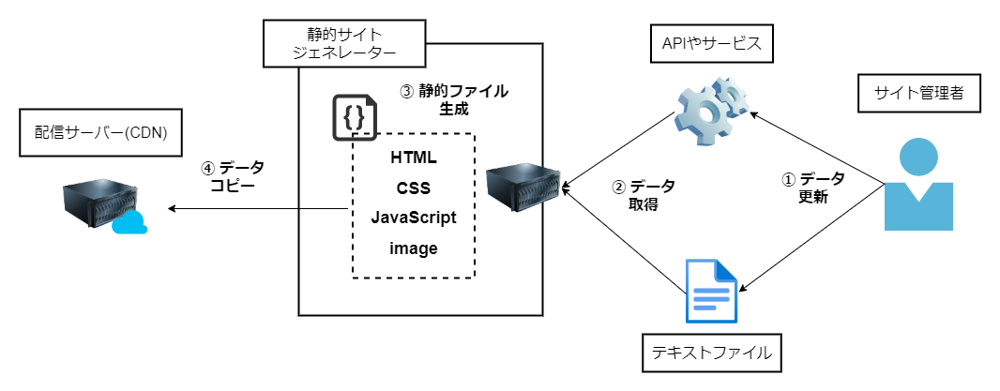
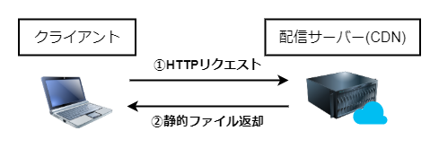
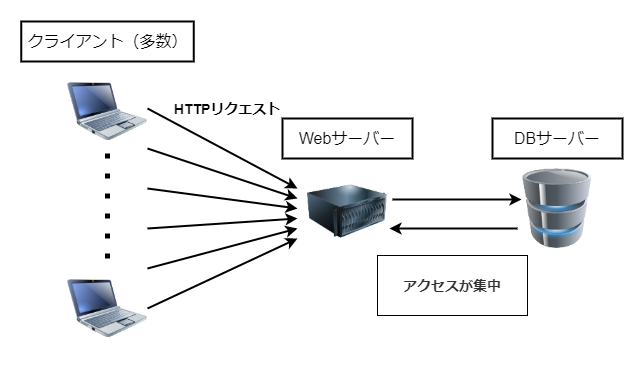
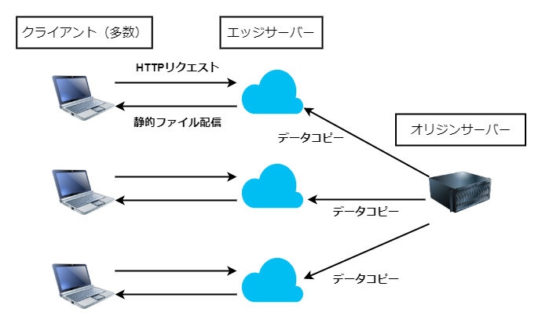

# Jamstackとはいったい何？

今回からは具体的に「Jamstackってなに？」「SSGやHeadlessCMSって？」ということを考えていきたいと思います。

まずこのページではJamstackとは何かについて、私なりの考えを述べたいと思います。

JamstackのWebサイトにはこう書かれています。

> Jamstack is an architecture designed to make the web faster, more secure, and easier to scale. 

参考：[What is the Jamstack? | Jamstack](https://jamstack.org/what-is-jamstack/)

「高速で安全でスケーラブルなWebサイト構築のためのアーキテクチャー」といったところでしょうか。抽象的すぎますね。

私が思うにJamstackとは「APIなどを通じ静的ファイルを事前生成し、CDNなどのホスティングサービスを使って配信するアーキテクチャー」だと考えています。これでも何のこっちゃと思うかもしれませんが、例えば、SSG + HeadlessCMS + CDNを組み合わせたアーキテクチャーを想像してもらえれば、幾分分かりやすいんじゃないかと思います。

## 言葉の由来

Jamstackはもともと「JAMStack」と呼ばれていました。

JAMStackの**JAM**は「JavaScript」「APIs」「MarkUp」の頭文字を取った言葉です。要約すると、「JavaScriptでAPIを叩いて、静的なマークアップファイル（HTML、CSS、JavaScript）を配信するアーキテクチャー」だと言えます。

現在は`JAM`が`Jam`と表記されていますね。語源となったのは上記3つの頭文字ですが、実際のところ、必ずしもこれらの技術を使用しなくてもJamstackなWebサイトは成り立つとされています。

JAMStackのニュアンスだけ残して構成技術は限定しない、というための改名だったんじゃないかと思っています。

似たようなものだとAjaxが挙げられます。Ajaxは当初「AJAX」と表記されていました。「Async JavaScript And XML」の頭文字をとって付けられましたが、実際にはXMLではなくJSONが利用されることが多くなりました。では「AJA**X**」が「AJA**J**」に変わったかというとそうではありません。やっていることは変わらないんだけど、「なにかの頭文字をとったんだな」という風に連想させないように「Ajax」という表記に変わっていきました。

参考 : [Discussion: jamstack word treatment · Issue #279 · jamstack/jamstack.org](https://github.com/jamstack/jamstack.org/issues/279)

## Jamstackのメリット

ここまで述べてきたように、Jamstackという言葉は特定の技術の組み合わせを指すものではなく、もっと抽象的なアーキテクチャの考え方を表すものであると考えています。

そこで、Jamstackがどのようなものか、**従来のWebサイトの構成との違い**を元に考えたいと思います。当サイトと同じようなブログを展開しているWebサイトを題材にします。

<aside>

あくまで一例であり、必ずこのようにしなければJamstackサイトではない！という意味ではありません。

</aside>

### 静的ファイルの事前生成

従来のWebサイトの例として、WebサーバーとDBサーバーを組み合わせた構成を考えます。ブログコンテンツ（記事のタイトルや本文、画像など）はDBサーバーに保存、クライアントからのアクセスがあった時にWebサーバー上でPHPなどがテンプレートを元にHTMLファイルを作成、クライアントに返送するというパターンです（いわゆる**LAMP構成**というやつですね）。

上記にある②～⑤の工程を、**Webサイトへのアクセスがあってから**行います。

また、このようにWebサーバーとDBサーバーをセットにしてWebサイトを構築できるように提供するサービスや仕組みを**CMS**などと言ったりします。あの有名なWordpressがCMSの代表です。

では次にJamstackを考えます。Jamstackなアーキテクチャーでは、処理の流れを大まかに2段階に分けることができます。

まず一つ目が、見出しにもある静的ファイルの**事前**生成です。

Jamstackでは**コンテンツの更新があった時**に、SSGを利用して、コンテンツデータを取得しHTMLやCSSなどの静的ファイルを生成、生成された静的ファイルをCDNの配信サーバーにコピーします（CDNに関しては後ほど説明します）。

いわば、ユーザーへWebサイトを公開する前の準備段階です。

そして、CDNのサーバーへデータコピーが完了したら、ユーザーからのアクセスが可能になります。ここまで来たら、あとは①HTTPリクエストを投げ、②静的ファイルを返す、という単純な流れがあるのみです。

DBサーバーへのアクセスが丸ごとなくなり、レスポンスまでの工程が減少し高速なアクセスが可能であることが分かると思います。

### CDNによる高速なWebサイト表示

JamstackではCDNというサービスを使用して、SSGで出力した静的なファイルを配信します。

CDNとは何でしょうか？ウィキペディアによると、

> コンテンツデリバリネットワークとは、ウェブコンテンツをインターネット経由で配信するために最適化されたネットワークのことである。コンテンツ配信網とも呼ばれる。

・・・とのことです。

これを一言で言うと「データをコピーした配信サーバーを世界中に配置するネットワーク」です。

通常、WebサーバーやDBサーバーは一か所に固まって置かれていて、世界中からのアクセスを一手に引き受けています（冗長化であったりクラウドサービスを利用して分散させることはできますが、限界はありますしCDNの仕組みとは本質的に違います）。

CDNの場合、オリジンサーバー（これまででいうWebサーバー本体）から静的ファイルをコピーしたエッジサーバーを世界中に分散し配置します。

クライアントはWebサイトにアクセスする際、オリジンサーバーではなく物理的に近いエッジサーバーからファイルをダウンロードすることになります。オリジンサーバーに基本的に負荷はかかりません。

また、エッジサーバーの数は、CDNサービスにもよりますが数万台から数十万台とも言われており、「冗長構成」の比ではありません。これが世界中に物理的に分散されているのです。

事前に静的ファイルを生成する静的サイトジェネレーターと、このCDNという仕組みはとても相性がいいです。対して、バックエンドが介在するWebサイトでは「アクセスがあってからDBに処理を投げ、結果を見て静的ファイルを生成」するわけですから、基本的にCDNは利用しにくいです。

当ブログの場合ですと、AWS Amplifyを用いてCDNでの公開を行っています。

### サーバー負荷、管理コストが減る

従来の構成ではアクセスする度に動的にファイルを生成するため、WebサーバーやDBサーバーにどうしても負荷がかかります。アクセスが集中するとサーバーが落ちる可能性もでてきます。それに伴いCPUやメモリ、ディスク容量のリソース監視をずっと行っていく必要があります。

さらに、LinuxなどのサーバーOS、ApacheやPHP、MySQLなどのミドルウェアの管理も必要です。加えてソフトウェアであるCMS自体のアップデートやプラグインの管理も必要であり、どうしても多くのランニングコストがかかります。

Jamstackならばどうでしょう。コンテンツ管理はHeadlessCMSを利用しAPIに集約されるため、DBをもちません。また、CDNを利用しているため自前でWebサーバーを持たなくてよくなります。

アクセスが集中した時にサーバーが落ちる云々はJamstackにも当てはまりますが、サーバーが分散されているCDNの特徴からしてサーバーが落ちることはそうそうないと思います。また、CDNはマネージド型サービスですので、サーバー管理から解放されるという意味でもメリットです。

### 技術選択の幅が広がる

技術面（WebサーバーやSSGなどのツール）とコンテンツ管理（HeadlessCMSなど）が疎結合になっているため、それぞれを分離して考えることができます。

例えばSSGなら「Gatsby、Next.js、Nuxt.js」という選択肢があり、HeadlessCMSも「microCMS、Contentful、graphCMS」という選択肢があり、ホスティング環境も「AWS、Netlify、CloudFlare」などがあり、それぞれ好きな技術を組み合わせてサイトを構築することができます。

## Jamstackを利用するデメリット

さて、何だかいい所ばかりに見えるJamstack構成ですが、デメリットもあり、また、適用するのに向いていないシーンというのも当然あります。

### アーキテクチャーを構築する知識が必要になる

Jamstackサイト構築にはプログラミングなどの知識が必要になり、これが導入への一番の障壁になります。例えば、SSGを使用する際にプログラミングの知識が必要になります。知識というのも「HTMLとCSS、JavaScriptなら勉強しました」くらいでは中々太刀打ちできません。

また、CDNを利用してファイルを配信するのでホスティングに関する知識や、デプロイ時にはHeadlessCMSとの連携も考えなくてはいけません。

対してWordpressなどのCMSならどうでしょう。最低限の状態でスタートさせるのにはプログラミングに関する知識は必要とされません。レンタルサーバーによっては自動的にWordpressの準備まで自動でしてくれるものもありますから、簡単に自分のWebサイトを作成できます。

また、書店に行けばWordpressに関しての入門書もこれでもかというほど豊富にあり、スタートまでのハードルは低いです。対してSSGやJamstackに関する書籍や情報は中々少ない印象です。

### 役割が2つにわかれている

Jamstackは主に、コンテンツを管理するHeadlessCMSと、静的ファイルを生成するSSGから構成されています。これは「コンテンツを作成する役割」と「SSGを駆使する役割」とで求められる知識が違うことを意味します。

「ブログを立ち上げたい。プログラミングに関する知識がないから詳しい人に構築を頼もう」という人がいてJamstack構成のサイト作りが選択肢に上がった時、「分業することができる」と捉えればメリットとなりますが、「ブログを立ち上げたい人だけで完結できない」デメリットがあるとも考えられます。

SSGを使用する側がサイトを構築し、「デザインはこれでいいですか？」「思った通りのページになっていますか？」などすり合わせが必要になります。

その点、CMSサービスはコンテンツ管理からサイト公開まで（サービス利用者から見れば）一枚岩になっていますので、自分一人でサイトを作成、管理していくことが可能です。

これは上記の「プログラミングに関する知識が必要になる」と重複する部分も大きいかもしれません。要するに「専門的な知識が必要になる」ということですね。

### ページ生成に時間がかかる

SSGは「前もって静的ファイルを生成する」という仕様上、ビルドの度に全ての静的ページを生成することになります。100個の記事があるサイトに新しい記事を1個追加した時、101個記事分のビルドが行われるということです。そしてその時間がサイト更新までのタイムラグになります。

現在、このブログはページ総数10ページ位、AWS Amplifyを使用してデプロイしていますが、ビルド時間は2分と少しといったところです。また、AWS Amplifyであればビルド時間に応じて料金が発生しますし、その他のホスティングサービスもプランごとにビルド時間の制限があることが多いのでこの点は要注意です。

そして、更新が頻繁にあるサイトにはJamstackは向きません。1分に1回更新があるサイトとかですね。このブログは週に1~2回の更新ペースですのでJamstack構成にはぴったりです。

しかし、動的サイトには「事前ビルド」という考えはありませんので、コンテンツを更新したらすぐさまアクセス可能です。また、レンタルサーバーを借りてるのであれば料金は固定されてることが多いでしょうから金銭面的にも安心です。

### 動的な機能を持たせにくい

動的にページが変わるサイト、ECサイトだったりログイン機能を持つサイトなども該当しますが、これらの構築はバックエンドを持たないJamstackサイトにとって苦手な分野です。

苦手だけで実現できないわけではないらしいですが（正直に言うとあまり分かってない）、それはバックエンドを持つWordpressなどのCMSや、バックエンドのフレームワークを試用したWebアプリケーションの役割ではないかなぁと私は思います。

この辺りは実際にやってみると考え方が変わるかもしれませんので、近々手を付けてみようと思っています。

## 参考

[What is the Jamstack? | Jamstack](https://jamstack.org/what-is-jamstack/)

[What Is The Jamstack? | Gatsby](https://www.gatsbyjs.com/docs/glossary/jamstack/#gatsby-skip-here)

[Welcome to the Jamstack | What, Why, and How of Jamstack](https://www.netlify.com/jamstack/#main)

[Jamstackとは何か？まずは基本を理解しよう！ | microCMSブログ](https://blog.microcms.io/jamstack-introduction/)

[Jamstackとは？ | 株式会社ピクセルグリッド](https://www.pxgrid.com/jamstack/)

[これだけ読めばOK！ JAMstackのすべてがわかります ｜ monotein](https://monotein.com/blog/what-is-jamstack)

[Jamstack とは？なぜ今 Jamstack なのか？ | Dyno](https://dyno.design/articles/what-is-jamstack/)

[モダンWeb開発「JAMstack」を実践 | ShareCOM](https://sharecom.depart-inc.com/tips/depart-engineering-jamstack/)

[インフラエンジニアが見るJAMStack - NRIネットコム Design and Tech Blog](https://tech.nri-net.com/entry/2021/03/31/115504)

[Jamstackって何なの？何がいいの？ - Qiita](https://qiita.com/ozaki25/items/4075d03278d1fb51cc37)
