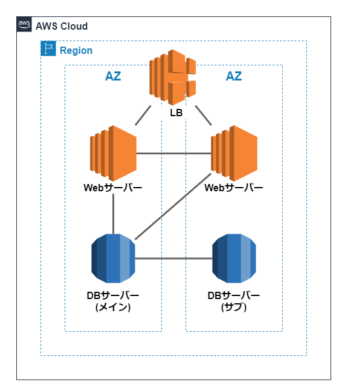
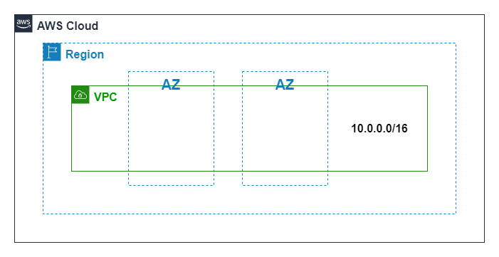
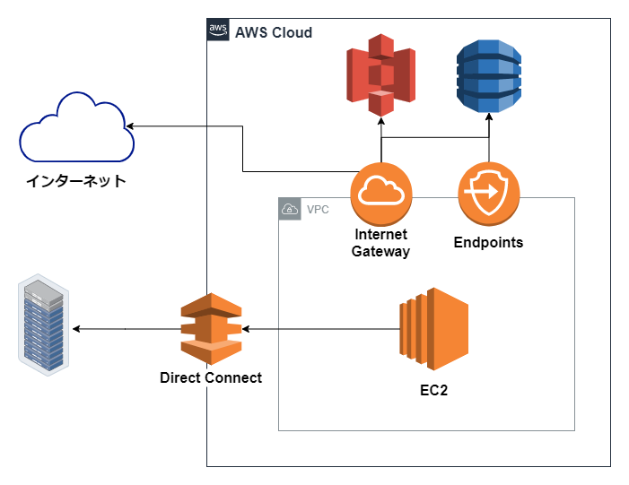

## リージョン

AWSサービスを提供している拠点のこと。世界中の国もしくは地域を指す。世界中に25のリージョンが存在しており、また、日本なら通称東京リージョン、大阪ローカルリージョンがある（共に2021年6月現在）。

ユーザーはリージョンを自由に選んでサービスを利用することができる。日本にいるからアメリカのリージョンは使えない、とかはない。でも地理的に近いところを選んどけばOK。ただ、リージョンによって利用できるサービスやその料金に違いがある。

リージョン間は**分離**されており基本的に1つのリージョン内でサービス運用を考える。

リージョンごとに利用できるサービスやその料金が違う。

### リージョン間連携

- AWS Direct Connect Gateway
- インターリージョンVPC Peering
- Route53でのフェイルオーバー
- 各種サービスのレプリケーションなど

## AZ

アベイラビリティ（availability）ゾーン。リージョンより小さい単位。

リージョンは複数のAZを含む。AZは地理的に分散しており、これにより災害などに強い。

AZ同士は接続されており**通信が可能**な点が先に挙げたリージョンとは違う。AZ同士は数十km離れていると言われているが、高速なネットワークで接続されておりAZ間での通信を高速で行うことができる。

AZの数は81もある（2021年6月現在）。

そしてAZは複数のデータセンターで構成されている。つまり下図のような状態。

## エッジロケーション

いくつかのサービスのエンドポイント。世界中に200以上が点在している。

CloudFront、lambdaエッジ、Route53など。

### マルチAZ

AZは論理的にまたがって利用できる。これをマルチAZ構成という。

以下、AWS入門書などで**クッソ見る**構成。1つのリージョンの中にAZが2つある。それぞれのAZにWebサーバーとDBサーバーを用意する。2つのAZの真ん中にあるのが**ロードバランサー（LB）**。AZを2つ利用することで負荷分散と障害耐性強化が実現している。

## VPC

Amazon Virtual Private Cloudの略。利用者ごとの仮想的なプライベートのネットワーク。VPN内にサブネットを切って論理的に分離する。また、VPCはAZをまたぐことができる。

また、VPCの作成時、IPv4のアドレス範囲をCIDRブロックで指定する。`10.0.0.0/16`など。

VPCがVPC外のリソースと通信するにはVPCエンドポイントを経由する。Internet GatewayやVPN Gateway、AWS Endpointsなど。

### 細かい要件

1リージョンにVPCは5個まで作成可能。

デフォルトのリージョンエンドポイントは**us-east-1**。

## セキュリティグループとネットワークACL

### セキュリティグループ

以下、SG。**EC2インスタンスのアクセス制御**を行う。デフォルトでは**全ての通信が拒否される**ため、自分で穴を開ける必要がある。許可のみを設定（拒否設定はできない）。

ルールはステートフル。つまり、インバウンドを許可すればアウトバウンドも許可される。

### ネットワークACL

SGがEC2インスタンスへのアタッチだったのに対し、ネットワークACLは**サブネット**にアタッチする。デフォルトのでは全ての通信を許可する。自分で作ったときは全て拒否。

一つのネットワークACLは**複数のサブネットに適用可能**。ただし、一つのサブネットには一つのネットワークACLしか関連付けできない。

VPCを作成した際、自動的にネットワークACLが作成される。以下、これをデフォルトのネットワークACLと呼ぶ。

ステートレス。双方向通信したいならインバウンド/アウトバウンドの両方を許可する必要がある。また、アウトバウンドにはエフェラメルポートを許可すること。

## Direct Connect

オンプレミスとの接続は、VPNを使うか専用線接続（Direct Connect）を使うか。

**Direct Connect ロケーション**に自社の機器を設置し、**Direct Connect デバイス**と接続、

## Direct Connect Gateway

リージョン間での通信が可能。

## VPC Peering

VPC間での接続を可能にする。

## VPCエンドポイント

グローバルIPアドレスを持つAWSサービスに対して、VPCからアクセスするための出口。

### インターフェイスエンドポイント

> AWS 所有、または AWS 顧客またはパートナーが所有するサービス宛てのトラフィックのエントリポイントとして機能します。

### ゲートウェイエンドポイント

> ゲートウェイエンドポイントは、AmazonS3 または DynamoDB のいずれかに向かうトラフィックに使用されるルートテーブル内のルートのターゲットであるゲートウェイです。

> Amazon S3 は、ゲートウェイエンドポイントとインターフェイスエンドポイントの両方をサポートしています。

[VPC エンドポイント - Amazon Virtual Private Cloud](https://docs.aws.amazon.com/ja_jp/vpc/latest/privatelink/vpc-endpoints.html)

## Transit Gateway

複数のVPC間を接続。オンプレミスを単一のゲートウェイで接続可能にするサービス。

## VPC Flow Logs

Cloud Watchと連携してログを取得する。

https://aws.amazon.com/jp/about-aws/global-infrastructure/

https://business.ntt-east.co.jp/content/cloudsolution/column-54.html

https://dev.classmethod.jp/articles/vpc-endpoint-gateway-type/

https://blog.serverworks.co.jp/2021/04/05/100639
