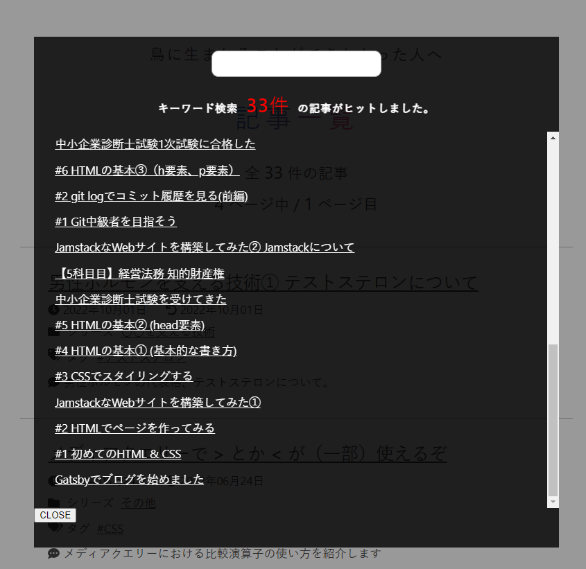
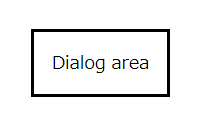
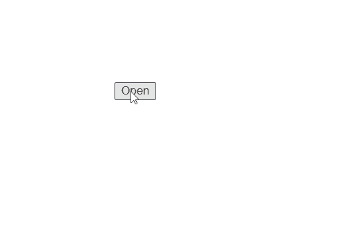
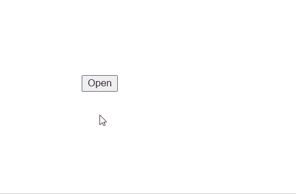
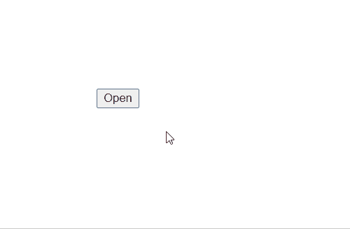

# dialog要素を使用して検索モーダルを実装する

当ブログはキーワード検索機能を実装しているんですが、そのUIがこれまではこーんな


感じだったのですが、「もうちょっとちゃんとした物にしたい」ということで



こうなりました。

前バージョンではdiv要素を使い、表示/非表示の切り替えは`useState`を使用して行っていましたが、dialog要素を用いればもっとシンプルに実装できそうだったので改修を行いました。

※ 以下、この検索機能のことを**検索モーダル**と呼ぶことにします。

今回の記事は、当ブログでどのように検索モーダルを実装したのか、そしてdialog要素について解説します。

<aside>

実装はReact環境を想定していますが、一部、素のJavaScriptでのコード例も記述しています。

</aside>

## dialog要素

今回の話の主役であるdialog要素ですが、[MDN](https://developer.mozilla.org/ja/docs/Web/HTML/Element/dialog)によると、

> HTML の &lt;dialog&gt; 要素は、ダイアログボックスや、消すことができるアラート、インスペクター、サブウィンドウ等のような<mark>対話的コンポーネント</mark>を表します。

とのことです。ユーザーが興味のあるキーワードを入力し、その結果が出力される、ということで、検索モーダルも対話的コンポーネントと言え、dialog要素を使うのにぴったりですね。

### open属性で表示される

dialog要素は設置するだけでは表示されません。dialog要素に`open`属性が付与されている必要があります。

```html:title=app.tsx
<body>
  <dialog open>
    Dialog area
  </dialog>
</body>
```

これで~モーダルっぽくない~モーダルが表示されます。



### `showModal`メソッドを利用する

実際には、モーダルは最初から表示されていることはなく、ユーザー操作によって表示されるようになることがほとんどです。

これを実現するために、dialog要素の`showModal`メソッドを使用します。`showModal`メソッドを使用すればdialog要素に`open`属性を付与することができます。`showModal`メソッドを呼び出すにはJavaScriptの力を利用する必要があります。

では早速実装していきます。Reactを使用しているという前提のもと、dialog要素の取得には`useRef`を使用します。また、各要素にはクラス名を当てておきます（記事の後半でCSSを絡めた解説を行うため）。

```jsx:title=App.tsx
import { useRef } from "react";

const App = () => {
  const ref = useRef<HTMLDialogElement | null>(null);

  return (
    <dialog
      ref={ref}
      className="dialog"
    >
      Dialog area
    </dialog>
  )
}

export default App;
```

続いて、dialog要素の外にbutton要素を設置し、クリック時に`showModal`関数を実行するようにします。

```tsx:title=App.tsx
const App = () => {
  const ref = useRef<HTMLDialogElement | null>(null);

  // showModal関数を追加
  const showModal = () => {};

  return (
    <>
      {/* クリックするとshowModal関数が呼ばれる */}
      <button onClick={showModal}>Open</button>

      <dialog
        ref={ref}
        className="dialog"
      >
        Dialog area
      </dialog>
    </>
  )
}
```

`showModal`関数内では以下のようにして`ref`から`showModal`メソッドを呼び出します。

```tsx
  // showModal関数を追加
  const showModal = () => {
    ref.current?.showModal();
  };
```

これでbutton要素をクリックすればモーダルが表示されるようになりました。



<aside>

素のJavaScriptで実装する場合は以下のようなコードになります。

<details>

<summary>コードを見る</summary>

```html:title=index.html
<body>
  <button id="openButton">Open</button>
  <dialog id="dialog">
      Dialog area
  </dialog> 

  <script src="./script.js"></script>
</body>
```

```js:title=script.js
document.addEventListener("DOMContentLoaded", () => {
  const openButton = document.getElementById("openButton");
  const dialog = document.getElementById("dialog");

  openButton.addEventListener("click", () => {
    dialog.showModal();
  });
});
```
</details>
</aside>

### backdrop疑似要素が付与される

さて、`showModal`メソッドを利用してモーダルを表示させた場合、恐らくモーダル以外の画面全体が薄い灰色になったと思います。これは**backdrop疑似要素**と呼ばれるものです。ブラウザーのデベロッパーツールなどでHTML構造を確認してみましょう。


backdrop疑似要素の効果はモーダル以外を灰色にするだけではなく、最上位レイヤーに置かれ、**その配下の要素を隠しアクセスできなくする**効果も持ちます。

試しに、モーダルを開くために設置したbutton要素をクリックしてみてください。クリックできないようになっているはずです。また、Tabキーを何度か押してカーソルを移動させても、button要素には移動しないようになっています。外部ライブラリーに頼ることなく、HTMLの標準機能を利用するだけでここまでリッチなUIを実現できるのはとても嬉しいですね。

これを`showModal`メソッドを利用せず、素のJavaScriptで（`setAttribute`メソッドなどで）ゴニョゴニョっと`open`属性を付与した場合はどうなるでしょうか。モーダル自体は表示されますが、backdrop疑似要素は付与されずその恩恵を受けることはできません。

### `close`メソッドでモーダルを閉じる

モーダルを閉じたいときは、dialog要素の`close`メソッドを使用します。dialog要素の中に`closeModal`関数を呼び出すbutton要素を追加します。

```tsx:title=App.tsx
const App = () => {
  const ref = useRef<HTMLDialogElement | null>(null)

  const showModal = () => {
    ref.current?.showModal();
  };

  // closeModal関数を追加
  const closeModal = () => {
    ref.current.close();
  };

  return (
    <main>
      {/* クリックするとshowModal関数を呼び出す */}
      <button
        onClick={showModal}
        className="openButton"
      >
        Open
      </button>

      <dialog
        className="dialog"
        ref={ref}
      >
        Dialog area

        {/* クリックするとcloseModal関数を呼び出す */}
        <button
          onClick={closeModal}
          className="closeButton"
        >
          Close
        </button>
      </dialog>
    </main>
  )
}
```

`closeModal`関数は以下のように定義し、`close`メソッドを呼び出します。

```ts:title=App.tsx
// closeModal関数を追加
const closeModal = () => {
  ref?.current?.close();
};
```

これでモーダルを閉じるボタンを実装できました。動作するかどうか確認してみてください。


モーダルが閉じることはもちろん、backdrop疑似要素も消え、後ろに隠れていたbutton要素にもアクセス出来るようになっていることに注目です。


このように、dialog要素の`showModal`メソッドと`close`メソッドを利用するだけで自然なモーダルを構築できることが分かりました。一般的なモーダルの実装に十分な機能を有していると言え、是非とも利用したい要素ですね。

## モーダルを閉じる範囲を拡大する

ここまででCloseボタンを押すことでモーダルを閉じるように実装することはできましたが、モーダル以外の部分（backdrop疑似要素）をクリックした時にもモーダルを閉じれるようにしてみましょう。

ひとまず、dialog要素にも`onClick={closeModal}`を追加してみましょう。

```tsx:title=App.tsx
<dialog
  className="dialog"
  ref={ref}
  // 追加
  onClick={closeModal}
>
  Dialog area

  <button
    onClick={closeModal}
    className="closeButton"
  >
    Close
  </button>
</dialog>
```

しかしこの実装では、モーダル自体をクリックしてもモーダルが閉じてしまいます。



これはよろしくない動作ですね。これを解消するために、以下の記事を参考にしました。

[React/TypeScript】Dialogタグを使ってコンポーネントを作ってみる ver.2022.09](https://zenn.dev/yuki0410/articles/ecbbf4076c51ff)

[Dialog要素の背景をクリックした時のイベントを取得する - Qiita](https://qiita.com/Hiroki_M/items/3ff6d6eefcce99cf0a30)

[React アプリのモーダルを dialog 要素で実装する - 30歳からのプログラミング](https://numb86-tech.hatenablog.com/entry/2020/02/29/183517)

dialog要素の直下にdiv要素を置き、`onClick={stopPropagation}`を付与します。

```tsx:title=App.tsx
<dialog
  className="dialog"
  ref={ref}
  onClick={closeModal}
>
  <div onClick={stopPropagation}>
    Dialog area

    {/* クリックするとcloseModal関数を呼び出す */}
    <button
      onClick={closeModal}
      className="closeButton"
    >
      Close
    </button>
  </div>
</dialog>
```

`stopPropagation`関数は以下のように実装します。

```ts:title=App.tsx
const stopPropagation = (e: React.MouseEvent<HTMLDivElement>) => {
  e.stopPropagation();
};
```

これでクリックイベントの伝搬をdev要素でストップさせ、モーダルをクリックしてもモーダルが閉じないように実装できました。



## CSSでスタイルを調整する

以上でモーダルの基本機能は実装できました。ここからはCSSでスタイルを適用していきます。

### backdrop疑似要素のスタイル

backdrop疑似要素はデフォルトで透過性のある灰色になっていますが（正確にはブラウザー依存）、CSS側でスタイルを変更することができます。例えば、以下のようにすれば薄い青色に変更することができます。

```css:title=App.css
.dialog::backdrop {
  background-color: rgba(0, 0, 255, 0.1);
}
```


### モーダル上でのスクロールがバックグラウンドに伝搬するのを防ぐ

## 参考

https://developer.mozilla.org/ja/docs/Web/CSS/::backdrop
