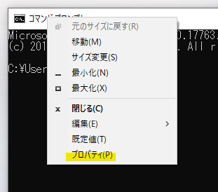

# コマンドプロンプトのフォントを変更する

Windowsのコマンドプロンプトは何だかんだよく使用しますが、いかんせんフォントが読みにくい、、、。読みにくいですよね？

今回は、コマンドプロンプトのフォントをデフォルトのものから変更する方法を紹介します。

## 環境

 - Windows 10 Pro 20H2

## デフォルトはＭＳ ゴシック

まずは現在使用しているフォントを確認しましょう。コマンドプロンプトのウインドウ上部で右クリックし、`プロパティ(P)`を選択します。

続けて`フォント`タグを選択するとフォントの各種情報が設定できます。

そう、デフォルトでは**MS ゴシック**が選択されているのです。

何だか字が掠れてるというかギザギザしてるというか…

「MSゴシックがダサい！」などというつもりはありませんが、コンソールに使用するには適していないんじゃないかというのが主観です。

かといって、他に読みやすいフォントが用意されているわけでもなので、インターネットからフォントをダウンロードし、設定を書き換えたいと思います。

余談ですが、これまでフォントについて勉強しておらず、MSゴシックについて調べてみたところ面白い記事が沢山ありましたので参考として載せておきます。

参考 ： [デザイナーがMS Pゴシックを使わない理由は? エディトリアルデザイナーに聞く | TECH+](https://news.mynavi.jp/article/20150611-mspg/#:~:text=MS%20P%E3%82%B4%E3%82%B7%E3%83%83%E3%82%AF%E3%81%AE%E3%81%B2%E3%82%89%E3%81%8C%E3%81%AA,%E3%82%92%E7%94%9F%E3%81%BF%E3%81%A0%E3%81%97%E3%81%A6%E3%81%97%E3%81%BE%E3%81%84%E3%81%BE%E3%81%99%E3%80%82)

参考 : [「ＭＳ ゴシック」「ＭＳ 明朝」を少しでも見栄え良く｜UNICOLUMN（ユニコラム）](https://unico.ne.jp/unicolumn/585/)

https://faq.nec-lavie.jp/qasearch/1007/app/servlet/relatedqa?QID=005632

https://www.kaizenlab.jp/design/2283/

https://tsutawarudesign.com/yomiyasuku2.html

# 参考

https://news.mynavi.jp/article/20150611-mspg/
