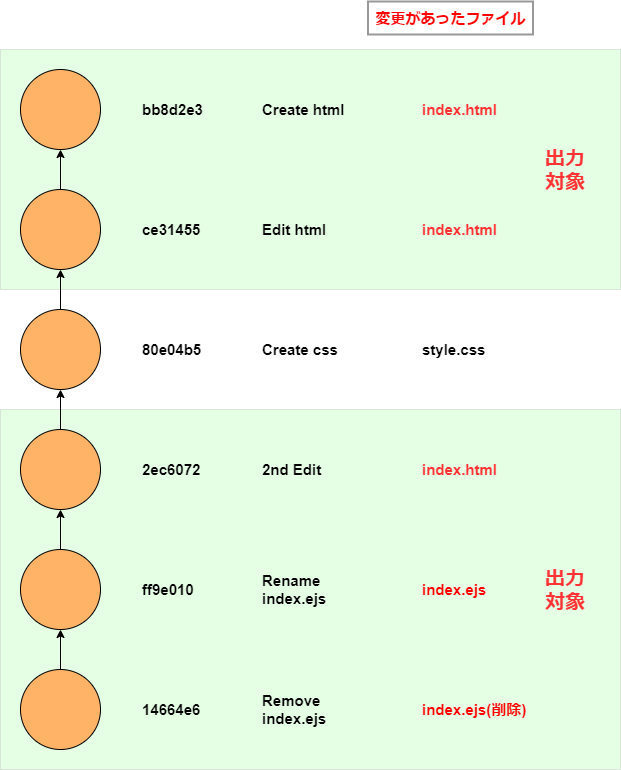

# git logの基本的なオプション

`git log`コマンドを使用することでコミットの履歴を辿ることができます。オプションは数多くありますが、このページでは簡単なものを中心に紹介します。できるだけ例を踏まえて紹介しますので、よければ実際にコマンドを打ち込みながら読んでみてください。

対象はgitの入門書を読み終えた方を想定して書きました。~~自分が全然わかっていなかったこともあり~~ だからと言っては何ですが、記述が冗長になっていたりやたら丁寧だったりするかもしれませんが、ご了承ください。

## `--oneline`で簡易出力する

単純に`git log`を実行した場合、コミットのハッシュID40桁、ブランチが指しているコミット、Authorの名前とメールアドレス、コミット日時、コメント全行が表示されます(「そういえばAuthorって何？」っていう人は本ページ下部の参考を見てください。)。

```shell:title=console
$ git log

commit eee108669ce7c42613e091533de0f6d218e3098c (HEAD -> main)
Author: kento <kento@toriwatari.bird>
Date:   Tue Mar 16 19:57:22 2021 +0900

    main-commit

    mainブランチでのコミット

commit cce92e83d647515732629d0e5ea46cfb908383ca
Author: kento <kento@toriwatari.bird>
Date:   Tue Mar 16 19:56:58 2021 +0900

    Initial Commit
```

`--oneline`を付けた場合、短縮されたハッシュID、ブランチが指しているコミット、そしてコメントの先頭行だけが表示されます。

```shell:title=console
$ git log --oneline

eee1086 (HEAD -> main) main-commit
cce92e8 Initial Commit
```

`--oneline`は`--pretty=oneline --abbrev-commit`を短縮したオプションです。

※abbrev → abbreviated → 省略された の意。

## `--all`と`--graph`で他ブランチも含め、グラフィカルに出力する

developブランチを切っていてmainブランチにいるとします。おおよそこんなイメージです。


ここで単純に`git log`と打つと、mainブランチのログしか表示されません。

```shell:title=console
$ git log --oneline

c5d4783 (HEAD -> main) main-commit
993a413 Initial Commit

※本当はdevelopブランチでのコミットがある。mainブランチにいるから見えない。
```

他のブランチのコミットも含めログを確認するには、`--all`オプションを渡します。

```shell:title=console
$ git log --all --oneline

9a9ba29 (develop) develop-commit # developブランチのコミットも見れる！
eee1086 (HEAD -> main) main-commit
cce92e8 Initial Commit
```

さらに`--graph`オプションを使用すると、アスタリスクや線を使い、グラフィカルにログを表示してくれます。

```shell:title=console
$ git log --all --graph --oneline

* 9a9ba29 (develop) develop-commit
| * eee1086 (HEAD -> main) main-commit
|/
* cce92e8 Initial Commit
```

通常、複数のブランチを切りマージを繰り返していきますので、`--all`と`--graph`の組み合わせは強力です。

私は`git log --oneline --all --graph`のエイリアスを設定しています。

一応、コマンドエイリアスの設定方法を紹介しておきます。`git config --global --edit`を実行すると、テキストエディタが立ち上がりますので、以下のように入力します。

```shell:title=.gitconfig
[alias]
  lol = log --oneline --all --graph
```

`lol`がエイリアスの名前です。一度設定しておけば`git lol`と実行するだけでグラフィカルなログが閲覧できます。

## `-p`で変更内容を確認する

`-p`オプションを渡すことで、コミットごとの**変更内容**を出力することができます。`git log`と`git diff`を組み合わせたものだと考えていいと思います。

以下のコマンドを実行してください。ファイルの作成と内容の変更を行っています。

```shell:title=console
# htmlファイルを作成し、コミットします。
touch index.html
git add .
git commit -m "Create index.html"

# 作成したファイルに3行追記し、コミットします。
echo -e "aaa\nbbb\nccc" >> index.html
git add .
git commit -m "Edit index.html"

# cssファイルを作成し、コミットします。
touch style.css
git add .
git commit -m "Create style.css"
```

`git log -p`とすることで、そのコミットでの変更箇所と内容を確認することができます。`git log -p --oneline`と入力してみます。

```shell:title=console
$ git log -p --oneline

4aefdf3 (HEAD -> main) Create style.css
diff --git a/style.css b/style.css
new file mode 100644
index 0000000..e69de29

be1bf08 Edit index.html
diff --git a/index.html b/index.html
index e69de29..1802a74 100644
--- a/index.html
+++ b/index.html
@@ -0,0 +1,3 @@
+aaa
+bbb
+ccc

fd4955b Create index.html
diff --git a/index.html b/index.html
new file mode 100644
index 0000000..e69de29
```

最初`index.html`を作成したコミット（上記で言うfd4955b）を見てみると、`new file`という記述があり、新しいファイルがコミットされたことを表しています。

```shell:title=console
fd4955b Create index.html
diff --git a/index.html b/index.html
new file mode 100644 # これ
index 0000000..e69de29
```

次のコミットでは空だった`index.html`に3行追記しました。これは追記した行に`＋`を記すことによって表されます。

```shell:title=console
be1bf08 Edit index.html
diff --git a/index.html b/index.html
index e69de29..1802a74 100644
--- a/index.html
+++ b/index.html
@@ -0,0 +1,3 @@
+aaa  # これ！
+bbb  # 同じく
+ccc  # 同じく
```

行を削除した場合や編集した場合は`-`で表現されます。

```shell:title=console
# ファイルを上書きします。
echo -e "aaaaaa\nbbb" > index.html

git add .

git commit -m "2nd Edit index.html"

$ git log -p --oneline -1

360e27d (HEAD -> main) 2nd Edit index.html
diff --git a/index.html b/index.html
index 1802a74..183df72 100644
--- a/index.html
+++ b/index.html
@@ -1,3 +1,2 @@
-aaa
+aaaaaa
 bbb
-ccc
```

1行目の`aaa`は`aaaaaa`に変更されました。これは「`aaa`を削除し`aaaaaa`を追記した」と捉えられます。ですので、`aaa`には`-`、`aaaaaa`には`＋`が付与されます。削除された`ccc`も同じく`-`が付与されます。

次、ファイル名を変更してみます。`rename`と表示されます。

```shell:title=console
# ファイルをindex.ejsに変更
$ git mv index.html index.ejs

$ git commit -m "Rename index.html"

$ git log -p --oneline -1

cb039c3 (HEAD -> main) Rename index.html to index.ejs
diff --git a/index.html b/index.ejs
similarity index 100%
rename from index.html # ～から
rename to index.ejs    # ～へ
```

続いて、`index.ejs`を削除します。`deleted`でファイルが削除されたこと、そして削除されたファイルの内容も教えてくれます。

```shell:title=console
$ git rm index.ejs

$ git commit -m "Remove index.ejs"

$ git log -p --oneline -1

d7e6535 (HEAD -> main) Delete index.ejs
diff --git a/index.ejs b/index.ejs
deleted file mode 100644 # deleted
index 183df72..0000000
--- a/index.ejs
+++ /dev/null
@@ -1,2 +0,0 @@
-aaaaaa
-bbb
```

## `--word-diff`で-pの出力を読みやすくする

`-p`オプションは便利ですが、出力結果が読みにくい気がしませんか？
`2nd commit`では「aaaをaaaaaaに変更」、「cccを削除」という内容でした。`-p`を渡すだけだと、

```shell:title=console
@@ -1,3 +1,2 @@
-aaa
+aaaaaa
 bbb
-ccc
```

というアウトプットですが、`-p`に加えて`--word-diff`を渡すと以下のように変化します。

```shell:title=console
#--grep="2nd"でログの絞り込み
$ git log -p --word-diff --oneline --grep="2nd"

360e27d 2nd Edit index.html
diff --git a/index.html b/index.html
index 1802a74..183df72 100644
--- a/index.html
+++ b/index.html
@@ -1,3 +1,2 @@
[-aaa-]{+aaaaaa+}
bbb
[-ccc-]
```

`aaa`と`aaaaaa`が同じ行で、`[-...-]`と`{+...+}`で表現されています。これにより変更内容が分かりやすくなった…気がしませんか:thinking:?私はあまり使いませんが。

## `--stat`で変更内容を簡易的に確認する

`-p`よりももっとざっくり変更内容を確認したい、という時には`--stat`オプションを渡します。

`-p`は具体的にどう変更されたかを教えてくれますが、`--stat`はどのファイルに変更があったか、そして**変更の要約**を出力します。

```shell:title=console
$ git log --stat --oneline

d7e6535 (HEAD -> main) Delete index.ejs   # ファイル削除
 index.ejs | 2 --                         # 削除されたファイルに2行記載があった
 1 file changed, 2 deletions(-)           # 変更の要約

cb039c3 Rename index.html to index.ejs              # ファイル名変更
 index.html => index.ejs | 0                        # 新旧ファイル名
 1 file changed, 0 insertions(+), 0 deletions(-)

360e27d 2nd Edit index.html
 index.html | 3 +--                                 # 3箇所変更
 1 file changed, 1 insertion(+), 2 deletions(-)

4aefdf3 Create style.css                            # ファイル作成
 style.css | 0                                      # 作成したファイル名
 1 file changed, 0 insertions(+), 0 deletions(-)

be1bf08 Edit index.html
 index.html | 3 +++
 1 file changed, 3 insertions(+)

fd4955b Create index.html
 index.html | 0
 1 file changed, 0 insertions(+), 0 deletions(-)
```

## `--name-status`で`--stat`よりも更に簡易表示する

変更があったファイルと、その変更内容を一文字で表してくれます。

A=Add、M=Modify、R=Rename、D=Deleteです。

```shell:title=console
$ git log --name-status --oneline

d7e6535 (HEAD -> main) Delete index.ejs
D       index.ejs

cb039c3 Rename index.html to index.ejs
R100    index.html      index.ejs

360e27d 2nd Edit index.html
M       index.html

4aefdf3 Create style.css
A       style.css

be1bf08 Edit index.html
M       index.html

fd4955b Create index.html
A       index.html
```

Renameの時に`R100`と表示されていますが、この数字は「変更の前と後で、ファイルの中身がどれくらい一緒か」をパーセンテージで教えてくれています。
今回の例ではファイル名を変更しただけで内容は一切触っていないので、100=「100%一緒だよ」という意味です。

## `--name-only`でファイル名のみ表示する

名前からも分かる通り、変更のあったファイル名のみが表示されます。

```shell:title=console
$ git log --name-only --oneline

d7e6535 (HEAD -> main) Delete index.ejs
index.ejs

cb039c3 Rename index.html to index.ejs
index.ejs

360e27d 2nd Edit index.html
index.html

4aefdf3 Create style.css
style.css

be1bf08 Edit index.html
index.html

fd4955b Create index.html
index.html
```

## `-- <path>`で特定のファイルの履歴を確認する

任意のファイルに変更があったコミットのみ出力する場合には、`-- <ファイル名 もしくは パス>`と記述します。以下の例では`--stat`と組み合わせています。`-p`と組み合わせることも可能です。

```shell:title=console
# index.ejsのみ
d7e6535 (HEAD -> main) Delete index.ejs
 index.ejs | 2 --
 1 file changed, 2 deletions(-)

cb039c3 Rename index.html to index.ejs
 index.ejs | 2 ++
 1 file changed, 2 insertions(+)

# style.cssのみ
$ git log --stat --oneline -- style.css

4aefdf3 Create style.css
 style.css | 0
 1 file changed, 0 insertions(+), 0 deletions(-)
```

なお、パスの前に`--`を付与していますが、これは`git log`に「渡しているのはファイル名だよ」と伝える意味を持っています。~~もし付与しない場合はブランチ名とみなされます。検索したいファイル名と同名のブランチが切られていないなら、`--`は省略できます（ほとんどの場合省略できそうですね）。~~

### あれ？index.htmlが引っかからないけど。。。

今回は途中で`index.html`から`index.ejs`にファイル名を変更しています。`-- index.ejs`で検索しても、`index.html`が対象のコミットは出力されません。


そういう時は`--follow`オプションを付けてください。変更前のindex.htmlも検索してくれます。
なお、引数の順番は注意が必要です。`--follow -- ファイル名`としなければ旧ファイルが検索されませんでした（git version 2.22.0）。

```shell:title=console
$ git log --stat --oneline --follow -- index.ejs

d7e6535 (HEAD -> main) Delete index.ejs
 index.ejs | 2 --
 1 file changed, 2 deletions(-)

cb039c3 Rename index.html to index.ejs
 index.html => index.ejs | 0
 1 file changed, 0 insertions(+), 0 deletions(-)

360e27d 2nd Edit index.html
 index.html | 3 +--
 1 file changed, 1 insertion(+), 2 deletions(-)

be1bf08 Edit index.html
 index.html | 3 +++
 1 file changed, 3 insertions(+)

fd4955b Create index.html
 index.html | 0
 1 file changed, 0 insertions(+), 0 deletions(-)
```



### ファイル名の前に`--`を付けるのはどんな時？

コミット対象になったファイルを指定するには`--`を付与します。私は「ファイル名の前には常に付ける」と考えているのですが、「じゃあ付けなかったらどうなるの？」と思うのが人情です。

いくつか検証してみます。

現在、`index.ejs`は削除されていますが、ここで`--`をつけずにindex.ejsを指定するとエラーになってしまいます。

```
# -- なしで実行
$ git log --stat --oneline index.ejs

fatal: ambiguous argument 'index.ejs': unknown revision or path not in the working tree.
Use '--' to separate paths from revisions, like this:
'git <command> [<revision>...] -- [<file>...]'
```

`ambiguous argument`、つまり「曖昧な引数」というメッセージが出力され、ご丁寧に「ファイル名の前に`--`をつけてね」というアドバイスまでくれています。

(https://rcmdnk.com/blog/2017/10/01/computer-git/)

ワーキングツリーに存在している`style.css`であれば`--`なしでも検索できます。

```
$ git log --stat --oneline style.css
4aefdf3 Create style.css
 style.css | 0
 1 file changed, 0 insertions(+), 0 deletions(-)
```

次に、**ファイル名と同じブランチが切られている場合**について検証します。

今、ワーキングツリーには`style.css`がありますから、`style.css`という名前のブランチを切ります。特にコミットはしなくてOKです。

```shell:title=console
$  git checkout -b style.css
```

ここで`--`を渡さないで

```shell:title=console

$ git checkout main

$ git log --stat --oneline develop

fatal: ambiguous argument 'develop': both revision and filename
Use '--' to separate paths from revisions, like this:
'git <command> [<revision>...] -- [<file>...]'
```

`ambiguous argument`、つまり、「曖昧な引数」のため致命的なエラーが発生しています。「developファイルもあるしdevelopブランチもあるけど、どっちのこと言ってるの？」と言われています。

`-- develop`とすることでエラーなく出力されることも確認しておきます。

```shell:title=console
$ git log --stat --oneline -- develop

960b51a (HEAD -> main) Create develop
 develop | 0
 1 file changed, 0 insertions(+), 0 deletions(-)
```

## `--since`で日付以降のコミット、`--until`で日付以前のコミット

以下のようなコミット履歴があるとします。2017年から2020年まで、各年の1月1日にコミットを行っており、計4回のコミット履歴があります。

```shell:title=console
$ git log --format=fuller

commit 13a83c31fc4558b811ae2c0dbb373a60d2359c77 (HEAD -> main)
Author:     potsunen <potsunen@potsunen.com>
Date: Fri Jan 10 00:00:00 2020 +0900

    2020 commit

commit 0fb21bf1e009cd3edb4036bc167db0cb93c1c98b
Author:     potsunen <potsunen@potsunen.com>
Date: Tue Jan 1 00:00:00 2019 +0900

    2019 commit

commit 41ece2df6ad958e89ae9ba91e08d82c3d476ec9d
Author:     potsunen <potsunen@potsunen.com>
Date: Mon Jan 1 00:00:00 2018 +0900

    2018 commit

commit d4657a563990338265ed5af1ff90f8e971546560
Author:     potsunen <potsunen@potsunen.com>
Date: Sun Jan 1 00:00:00 2017 +0900

    2017 commit
```

`--sinse="<date>"`とすることで任意の日付以降にコミットされたコミットのみ出力できます。以下の例だと、2018年1月1日以降を表します。

```shell
$ git log --since="2018-01-01:00:00:00" --oneline
13a83c3 (HEAD -> main) 2020 commit
0fb21bf 2019 commit
41ece2d 2018 commit
```

日付のフォーマットですが色々なものに対応しているようです。

```shell:title=console
# YYYY-MM-DD
$ git log --since="2018-01-01"

# YYYY/MM/DD
$ git log --since="2018/01/01"

# YYYY MM DD
$ git log --since="2018 01 01"

# DD/MM/YYYY
$ git log --since="01/01/2018"

# UNIXタイムスタンプ
$ git log --since="1514732400"

# 10週間前
$ git log --since="10 week age"

# 先月
$ git log --since="last month"
```

なお、フォーマットの一部のみ指定した場合の動作ですが、指定していない箇所は現在の日時で補完されるようです。
以下の例では、YYYYに当たる`2019`のみ指定していますが動作します。ただ、2019年1月1日のコミットは表示されません。予想ですが、実行した日付の3月3日とその時間で絞り込みされることになると想像しました。

```shell:title=console
$ git log --since="2019" # YYYYのみ
commit 13a83c31fc4558b811ae2c0dbb373a60d2359c77 (HEAD -> main)
Author: potsunen <potsunen@potsunen.com>
Date:   Fri Jan 10 00:00:00 2020 +0900

    2020 commit

 # 今日は2020/03/03なので、
 # --since="2019/03/03(+その時の時間)"とみなされる?
```

検証したところ上記のようになっていると推察したのですが自信はありません。

`--until`は`--since`の逆、任意の日付以前にコミットされたコミットのみ出力します。

```shell:title=console
$ git log --until="2018-01-01:00:00:00" --oneline

# 2018年1月1日以前
41ece2d 2018 commit
d4657a5 2017 commit
```

また、`--since`と`--until`を組み合わせることで「〇〇日以降、〇〇日以前」という風に日時を絞り込めます。

```shell:title=console
$ git log --since="2017-06-30" --until="2018-06-29" --oneline

41ece2d 2018 commit
```

## `--relative-date`で日付を相対表示する

通常、コミットの日時情報はYYYY-MM-DDといった風に絶対表示されますが、`--relative-date`オプションを渡すことで「〇か月前」「〇時間前」といった現在の日時に対する相対的な形式で出力することが可能です。

```shell:title=console
$ git log --relative-date --abbrev-commit

commit 1527aea (HEAD -> main)
Author: potsunen <potsunen@potsunen.com>
Date:   3 minutes ago  # 3分前

    4th-commit

commit 0acb905
Author: potsunen <potsunen@potsunen.com>
Date:   6 days ago     # 6日前

    3rd commit

commit 77e12e9
Author: potsunen <potsunen@potsunen.com>
Date:   5 months ago   # 5か月前

    2nd commit
```

## マージ関係

`--merges`でマージコミットのみ、`--no-merges`でマージコミットを除外してログを出力します。

```shell:title=console
$ git log --graph --all --oneline

*   ba08362 (HEAD -> develop, main) Merge branch 'develop'
|\
| * fa906d1 dev commit
* | be5f689 main commit
|/
* 4f4d558 initial commit

# マージコミットのみ
$ git log --merges --oneline
ba08362 (HEAD -> develop, main) Merge branch 'develop'

# マージコミットを除外
$ git log --no-merges --oneline

be5f689 main commit
fa906d1 dev commit
4f4d558 initial commit
```

## AuthorやCommitterで絞る

これはそのまま、`--author="〇〇"`、`--committer="〇〇"`の形で記述できます。

```shell:title=console
$ git log --author="alien"

commit 9061b6e9231fac0baf0b8967773e26b66517e6ca
Author: alien <alien@andromeda.space> # Author
Date:   Fri Mar 6 16:25:04 2020 +0900

    私は宇宙人だ

# Committerを確認する場合は、fullerオプションを付けてください。
$ git log --committer="potsunen" --format="fuller"

commit c85203de19d282266cdcfe73f800a66a49486e66 (HEAD -> main)
Author:     potsunen <potsunen@potsunen.com>
AuthorDate: Fri Mar 6 16:27:08 2020 +0900
Commit:     potsunen <potsunen@potsunen.com> # Committer
CommitDate: Fri Mar 6 16:27:08 2020 +0900

    create index.html
```

長くなりましたので今回は以上です。次回は後編ということで、

## 参考 AuthorとCommiterの違い

私は

- Author ： 当該ファイルを最初にコミットした人、オリジナルのコードを書いた人
- Commiter ： コミットした人

とイメージしています。

`git commit --amend`でコミットを修正した場合、以下のようになります。

- Author ： 変更されない
- Commiter ： amendしたユーザに変更される

`git log`は多くの場面でAuthorしか出力しませんが、`--pretty=fuller`オプションを渡すことでCommitterも確認することができます。

```shell:title=console
$ git log --pretty=fuller

commit 743c4d51cc9631705894e771e1633d6481f8b61b (HEAD -> main)
Author:     potsunen <potsunen@potsunen.co.jp>   # 作成者
AuthorDate: Fri Feb 28 11:13:02 2020 +0900
Commit:     宇宙人 <utyuujin@Andromeda.space>     # amendした人
CommitDate: Fri Feb 28 11:15:26 2020 +0900

    地球侵略記念amend
```

# 参考

- [Git - コミット履歴の閲覧](https://git-scm.com/book/ja/v2/Git-%E3%81%AE%E5%9F%BA%E6%9C%AC-%E3%82%B3%E3%83%9F%E3%83%83%E3%83%88%E5%B1%A5%E6%AD%B4%E3%81%AE%E9%96%B2%E8%A6%A7)
- [git-log Documentation](https://git-scm.com/docs/git-log)
- [gitでrename&modifyしたファイルのログを追跡できるようにしたい場合](https://qiita.com/yukimura1227/items/fbb076db61a2e43a32e3)
- [git diff --name-status で出る R100 って何？](https://stakiran.hatenablog.com/entry/2019/01/14/072206)
- [Advanced Git log](https://www.atlassian.com/ja/git/tutorials/git-log)
- [Git で変更内容にある文字列が含まれているコミットを検索する (git log -G/-S) | まくまくGitノート](https://maku77.github.io/git/log/pickaxe.html)
