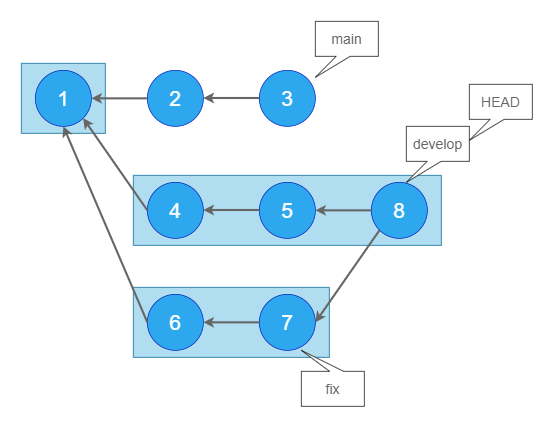
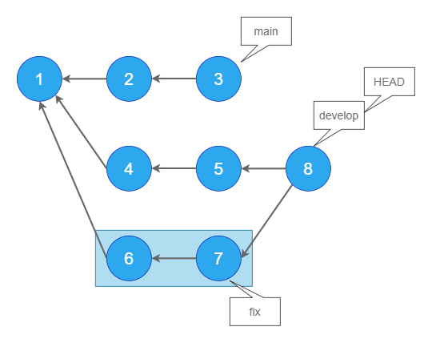

# git logのオプション（後編）

今回も`git log`についてのページですが、前編中編とは少し趣旨が違います。

これまでは、いわば、ある一つのブランチの中で完結するようなオプションを紹介しました。 複数のブランチが切られている時（というかそれが当たり前ですが）、`git log`と打ってどの範囲のログが出力されるか、正確に分かっていますか？ 「あのブランチだけのログが見たいのに、何故か違うブランチのログも出力される。。。」といったことはありませんか？「雰囲気で`HEAD~`とか打ってるけど詳しい意味は分かってない。。。」といったことはありませんか？ たまーに出てくるチルダ(~)やキャレット(^)ですが、どのような意味を持っているか分かっていますか？

私もわかっていなかったので改めて確認したいと思います。

<!--
## その前に参考記事
「ブランチって何？」「HEADって何？」を確認しておきたい方は以下の良記事を読むことをお勧めします。

GitのHEADとは何者なのか
-->

## 2つのブランチを対象にログを出力する

このページではダブルドット構文(`..`)とトリプルドット構文(`...`)の使用方法を説明します。

<aside>

ダブルドット構文とトリプルドット構文という言葉は公式リファレンスの[日本語版ページ](https://git-scm.com/book/ja/v2/Git-%E3%81%AE%E3%81%95%E3%81%BE%E3%81%96%E3%81%BE%E3%81%AA%E3%83%84%E3%83%BC%E3%83%AB-%E3%83%AA%E3%83%93%E3%82%B8%E3%83%A7%E3%83%B3%E3%81%AE%E9%81%B8%E6%8A%9E)から引用してます。

</aside>

これらの構文は2つの引数（便宜上、引数と呼びます）をとります。

`..`は、どちらか一方からのみ辿れるコミットを出力します。結果は引数の渡し順によって変わります。`...`は、どちらか一方から辿れるコミットを出力します。こちらは引数の渡し順によって変わりません。

また、どちらも、2つのブランチ間で重複しているコミットを除く動きをします。

---

前提として、リポジトリは以下の状態であるとします。


このリポジトリを再現するには、以下のスクリプトを実行してください。

<details>
<summary>スクリプトを見る</summary>

```shell
  git init

	# masterブランチで作業
	git commit -m "1" --allow-empty
	git commit -m "2" --allow-empty
	git commit -m "3" --allow-empty

	# developブランチを作成
	git checkout -b develop HEAD~~

	# developブランチで作業
	git commit -m "4" --allow-empty
	git commit -m "5" --allow-empty

	# fixブランチを作成
	git checkout -b fix HEAD~~

	# fixブランチで作業
	git commit -m "6" --allow-empty
	git commit -m "7" --allow-empty

	# developブランチに移動
	git checkout develop

	# fixブランチをマージ
	git merge --no-ff fix -m "8"

```

</details>

`master`、`develop`、`fix`という3つのブランチがあります。

青い丸の中の数字はコミットのハッシュIDです。

`8`は`develop`に`fix`をマージしたマージコミットです。現在`HEAD`は`develop`を指しています。

まずは`git log ブランチ名`と入力したときの出力を確認しておきます。

### git log master

`master`ブランチである`3`から矢印で辿れる、`3,2,1`が対象です。


### git log develop(HEAD)

`develop`ブランチである`8`から辿れる、`8,7,6,5,4,1`が対象です。



現在`HEAD`は`develop`を指していることから、`git log HEAD`としても同じです。

### git log fix

`fix`ブランチである`7`から辿れる、`7,6,1`が対象です。


### git log develop..master

では、`..`の動作を確認します。

言語化するとしたら「`develop`になくて、`master`にだけあるもの」 です 。`3,2`が出力されます。

`master`から`3,2,1`が辿れますが、`1`は`develop`からも辿れるので対象外です。


`master`から辿れる`3,2,1`から、`develop`からも辿れて重複している`1`が除かれているのが分かると思います。冒頭で「2つのブランチ間で重複しているコミットを除く動きをします。」と説明したのはこのことです。

### git log master..develop

上記の逆です。読み方は「`master`になくて、`develop`にだけあるもの」です。

`develop`から`8,7,6,5,4,1`が辿れますが、`1`は`master`からも辿ることができ、重複しているので対象外です。


## git log master..fix

読み方は「`master`になくて、`fix`にだけあるもの」です。

`fix`から`7,6,1`が辿れますが、`1`は`master`からも辿れるので対象外です。



### git log fix..develop

読み方は「`fix`になくて、`develop`にだけあるもの」です。

`develop`から`8,7,6,5,4,1`が辿れますが、`7,6,1`はfixからも辿れることができ、重複しているので対象外です。

### git log develop..fix

読み方は「`develop`になくて、`fix`にだけあるもの」です。

`fix`から`7,6,1`が辿れますが、これらは全て`develop`からも辿れることができ、重複しているのでコミットは出力されません。


### リモートリポジトリとの差分を見るのに使用する

これまで示した例のように、ローカルでブランチ間の差分を見るのにも使用できますが、リモートリポジトリ（GitHubなど）との差分を見るのにこのコマンドは役に立ちます。

例えば`git log origin/featureAAA..featureAAA`とすると、リモートになくてローカルにあるコミットだけを出力できます。つまり、どのコミットを`push`すべきかという事が分かります。

```

```

### git log master...develop (git log develop...master)

ここからは`...`の使用方法です。

`...`は、**どちらか一方から辿れるもの**を出力します。どちらからも辿れるもの（つまり重複しているもの）は対象外です。

上記のコマンドでいうと、読み方は「`master`か`develop`のどちらか一方にあるもの」です。`1`は`master`からも`develop`からも辿ることができ、重複しているので対象外です。


なお、`...`を使用する場合、どのような順番でブランチを指定しても結果は同じです。

### git log develop...fix (git log fix...develop)

読み方は「`develop`と`fix`のどちらか一方にあるもの」です。`7,6,1`は`develop`からも`fix`からも辿れることができ、重複しているので対象外です。


## チルダとキャッレット

チルダ`~`とキャレット`^`はgitの中でも理解しにくいものの一つです。私も何となく分からないので何となく放置していました。

あと、ググラビリティも低いですね。

### git log develop~

チルダを付与することで、**ひとつ親のコミット**を表すことができます。この場合、`git log develop~`は`git log 5`と同義と言え、`5,4,1`が出力されます。


https://github.blog/jp/2021-01-06-commits-are-snapshots-not-diffs/

<!--
--left-onlyと--right-onlyを使用する
--left-rightを使用する
以上、..と...の動作を図示しましたが、実際にコンソール上でgit logした時、わかりやすい出力になっているとは言えないと思います。

$ 例

$ git log master...develop --oneline

278da47 (HEAD -> develop) Merge branch 'fix' into develop
64414ae (fix) fix-commit 2
a7c60fc fix-commit
719f9b0 develop-commit 2
84d64bb develop-commit
ad84558 (master) master-commit 3
c2d1404 master-commit 2
--left-rightオプションを渡すと、
-->
