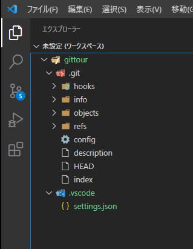
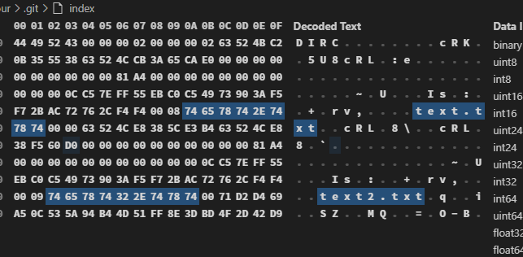
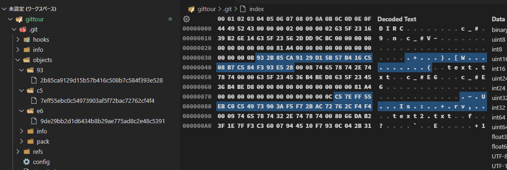

# Gitがいまいち分からないのは、内部構造を知らないからである

煽りみたいな見出しを付けましたが、私の経験談です。一通りのコマンドは使えるようになったんだけど、いまいちピンと来ないというか、もっと仕組み的なことを知りたくなって、本腰を入れて勉強しようと思い立ったタイミングがありました。

ここからは「Git内部構造ツアー」と題し、`.git`フォルダーの中に潜入し、Gitがどのように動作しているかを検証します。この記事を読むことで、もしかしたらGitに関する**誤解**が解消されるかもしれません。

今回の記事では、`git add`した時に`.git/`内部で何が起こるかを検証します。

## VSCodeで`.git/`を表示させる

この記事ではVSCodeを使って各種検証をしようと思いますが、リポジトリーを読み込ませても`.git/`は表示されません。

リポジトリー直下に`.vscode`フォルダーを作成し、その中に`settings.json`を次の内容で作成します。

```json:title=settings.json
{
  "files.exclude": {
    "**/.git": false
  }
}
```

これで`.git/`を表示させることができます。



## 全ては`.git/`内部で完結する

誤解を恐れずに言うと、`git init`した時に現れる`.git/`の中でGitの全てが完結します。管理しているファイルも、コミット履歴も、タグもブランチも、その全てがこの中に保存されています。

いわゆるGitサーバーは存在しません。Gitが**分散型バージョン管理システム**と言われる所以です。

と、聞くとかなり複雑なシステムになっていそうですが、意外とシンプルな造りだったりします。まずは、ざっと`.git/`の中身を確認しましょう。

## `.git/`をざっと眺める

任意のフォルダーの中で`git init`を行い、リポジトリーを作成します。すると`.git/`が作成されますね。まずは代表的なフォルダーやファイルの役割を確認します。

`.git/`配下は以下のような構造になっています。

```bash
.git
  |--config
  |--description
  |--HEAD
  |--hooks/
  |--info/
  |--objects/
  |    |--info/
  |    |--pack/
  |--refs/
       |--heads/
       |--tags/
```

### HEAD

HEADといえば、自分が作業しているコミットを示すポインターですが、`.git/`直下に`HEAD`というファイルとして保存されています。ただ、この`HEAD`自体がコミットを指しているのかといえばそうではなく、`HEAD`はさらに`.git/refs/`を指しています。

```bash
$ cat .git/HEAD 
ref: refs/heads/main
```

### `objects/`

`objects/`には、後述する**Gitオブジェクト**が格納されます。今はリポジトリーをを作成したばかりですので、`objects/`の中にファイルはありません。

### `refs/`


## `git add`によってblobオブジェクトが作成される

おさらいですが、`git init`したばかりの状態では`.git/objects/`は空ですね（正確には、`info`フォルダーと`pack`フォルダーは存在していますが）。

```git
$ ls -l .git/objects/
total 0
drwxr-xr-x 1 c-yoshizuke 1049089 0 11月 11 10:03 info/
drwxr-xr-x 1 c-yoshizuke 1049089 0 11月 11 10:03 pack/
```

リポジトリー直下に`text.txt`を作成します。中身は変更せず空のままで`git add text.txt`します。ここで`.git/objects/`を確認すると、`e6/`というフォルダーが作成され、その中に何やらファイルが格納されていることが分かります。

```shell
$ touch text.txt

$ git add text.txt

$ find .git/objects/ -type f
.git/objects/e6/9de29bb2d1d6434b8b29ae775ad8c2e48c5391
```

新しくできた`e6/9de29bb～(略)`が**blobオブジェクト**です。blobオブジェクトはGitオブジェクトの1種であり、「**ファイルの内容**をSHA-1でハッシュ化した40桁のID」です。ここで注意してほしいのは、`e6`というフォルダーの中に38桁のファイル名のファイルが格納されていますが、このファイルがオブジェクト本体なのではなく、あくまでも40桁のIDがblobオブジェクトである、ということです。

<aside>

正確には、blobオブジェクトIDは、「Gitオブジェクトの種類（今回ならばblob）」、「ファイルサイズ」「ファイルの内容」などをもとに生成されます。ファイルの内容だけをもとに生成されるわけではありません。

</aside>

バイナリーファイルであるため中身は読めませんが、何かしらは記述されている様子ですね。

```shell
$ cat .git/objects/e6/9de29bb2d1d6434b8b29ae775ad8c2e48c5391

(文字化け)
```

続いて`text.txt`に`Hello World!`と入力し、`git add text.txt`でインデックスに登録します（ぜひ、`Hello World!`と一言一句たがわず入力して下さい）。できれば`echo -n "Hello World! > text.txt`という風にコマンドラインから入力して下さい（改行コードの問題を避けるため）。すると、新たなblobオブジェクトが作成されていることがわかります。

```bash
$ find .git/objects/ -type f
.git/objects/c5/7eff55ebc0c54973903af5f72bac72762cf4f4 # new
.git/objects/e6/9de29bb2d1d6434b8b29ae775ad8c2e48c5391
```

blobオブジェクトの内容は、`git cat-file -p {オブジェクトID}`で確認できます。40桁全てを打つ必要はなく、6桁くらい打てばGitがよしなに判断してくれます。

```shell
$ git cat-file -p c57eff
Hello World!
```

`e69de2`は空ファイルのまま`git add`した時のblobオブジェクトです。こちらもコマンドを実行し、何も出力されないことを確認しておきます。

```shell
$ git cat-file -p e69de2
(何も表示されない)
```

### ファイルの内容が同じならば、blobオブジェクトのIDは同じになる。

この記事を読んでいる方も（恐らく）実際にやってみてもらっていると思いますが、皆さんの手元でもblobオブジェクトはこの記事のものと全く同じIDが生成されているはずです。

また、もう一つ実験をしてみます。`text.txt`をコピーし、`text2.txt`と命名します。そのまま中身は変更せずに、`git add text2.txt`でステージングにあげます。

ここでクイズです。この時、blobオブジェクトは新しく生成されるでしょうか？ファイルがもう一個出来たんだから、blobオブジェクトも新しく出来ていそうですよね。

だがしかーし！なんと、新たなblobオブジェクトは生成されないのです。

```shell
$ find .git/objects/ -type f

.git/objects/c5/7eff55ebc0c54973903af5f72bac72762cf4f4
.git/objects/e6/9de29bb2d1d6434b8b29ae775ad8c2e48c5391
```

これはもちろんファイル名が`text3.txt`とかであっても同じことが言えます。あくまでもファイルの中身について、新しいものがステージングにあげられた時にblobオブジェクトが生成されるということですね。

### `hash-object`でIDを出力する

先ほど、ハッシュIDからオブジェクトの内容を出力する`cat-file`コマンドを紹介しましたが、逆にオブジェクトからハッシュIDを出力するには`hash-object`コマンドを使用します。`text.txt`と`text2.txt`からオブジェクトのIDを求めてみます。

```bash
$ git hash-object text.txt
c57eff55ebc0c54973903af5f72bac72762cf4f4

$ git hash-object text2.txt
c57eff55ebc0c54973903af5f72bac72762cf4f4
```

当然ながら同じblobオブジェクトIDが出力されます。

---

以上、これらのことから、blobオブジェクトIDは**ファイルの内容によって**決定されるということが言えそうです。

## index

ひとまず、ファイルの内容は`objects/`の中に40桁のIDに変換されて保存されているらしいという事が分かりました。では、ファイルとの紐づけはどうやっているのでしょうか？

結論から言うと、`.git/index`というファイルがそれを担っています。あるファイルがステージングに上げられると、`index`ファイルにblobオブジェクトIDとファイル名が登録されます。これを今から確認してみましょう。

現在、中身が`Hello World!`になっている`text.txt`と`text2.txt`がステージングに上がっていますので、この2つのファイルが`index`に登録されているはずです。

しかし、`index`は残念ながらバイナリーファイルですので、そのままでは中身を確認できません。ここはhexdumpなどのツールを使ってバイトコードを確認してみましょう。

VSCodeをお使いの方は、拡張機能で「hex editor」と検索し「Hex Editor」をインストールしてください。


インストールが完了したら`index`をVSCodeに読み込ませます。すると恐らく、以下の画像のような表示がでるので、


「開く」をクリックし、画面上部に現れる「Hex Editor」をクリックします。


これでバイトコードを確認できます。


さて、一見しただけでは意味不明ですが、画面右側をよくよく見てみると、「text.txt」、「text2.txt」という文字があることが分かります。どうやらファイル名を保存していることが分かります。



となると、それに対応するファイルの内容も`index`に保存されていそうです。もちろん内容がそのまま保存されているはずもなく、となると保存されているのは、、、blobオブジェクトですね。画面左側を見てみると、`Hello World!`に対応するIDである`c57eff~`を発見できます。


### ls-files

実はインデックスに登録されているファイル（≒`index`の中身）を出力してくれる`ls-files`というコマンドがあります。これでファイルとその内容が出力されることを確認しましょう。

```shell
$ git ls-files --stage
100644 c57eff55ebc0c54973903af5f72bac72762cf4f4 0       text.txt
100644 c57eff55ebc0c54973903af5f72bac72762cf4f4 0       text2.txt
```

ファイル名と、それに対応するblobオブジェクトIDがしっかり出力されていますね。なお、1列目の`100`はファイルの種類、`644`はファイルのパーミッションを表し、3列目の`0`はワーキングツリーの状態を表すもので基本的に`0`になるようです。

<aside>

`index`のフォーマットは[こちら](https://github.com/git/git/blob/v2.12.0/Documentation/technical/index-format.txt)や[こちら](https://engineering.mercari.com/blog/entry/2017-04-06-171430/)に記載されています。深堀したい方はどうぞ。

</aside>

## ファイルを更新する

次に、`text.txt`の内容を更新してみましょう。`echo -n "I love Git." > text.txt`とコマンドラインで実行します（追記ではなく上書きを行います）。そして`git add text.txt`を実行します。新しいblobオブジェクトが出来ているはずなので確認してみます。

```bash
$ find .git/objects/ -type f
.git/objects/93/2b85ca9129d15b57b416c508b7c584f393e528 #new
.git/objects/c5/7eff55ebc0c54973903af5f72bac72762cf4f4
.git/objects/e6/9de29bb2d1d6434b8b29ae775ad8c2e48c5391
```

このように`932b85~`というblobオブジェクトが生成されています。`index`も調べてみましょう。

```bash
$ git ls-files --stage
100644 932b85ca9129d15b57b416c508b7c584f393e528 0       text.txt
100644 c57eff55ebc0c54973903af5f72bac72762cf4f4 0       text2.txt
```

このように、`index`には2つのblobオブジェクトが記録されていますが、`.git/objects/`配下にblobオブジェクトは3つ存在しています。一つ多いblobオブジェクトは、最初に`git add`した時の`e69de2~`です。ただ、この`e69de2~`は今はどこからも参照されておらず、不要なオブジェクトであるはずです。



不要になったblobオブジェクトは、`index`からは消えるものの`.git/objects`には残されるようです。

## danglingオブジェクト

ここまでで`git add`した時の内部動作を紹介するという目的は達成しました。ここから先は番外編であり、私も正確なことは分かっておらず、備忘録的に記述しているだけなので飛ばしていただいて結構です。

さて、先ほど、どこからも参照されていない`e69de2~`が残ったままになっているという話をしました。これについて、Gitがどのような取り扱いをしているのかを調べてみました。結論、それらは**danglingオブジェクト**として取り扱われ、`git gc`（Gitのガベージコレクション）で削除されるようです。

まず準備として、新たにリポジトリーを作成し、空の`text.txt`を作成します。`git add text.txt`でステージングに上げます。

danglingオブジェクトの存在を確認するために、`git fsck`コマンドを使用しましょう。リファレンスによると、

> git-fsck - Verifies the connectivity and validity of the objects in the database

接続性と有効性の検証？まぁよくわかりませんが、もしdanglingオブジェクトがあるのなら、`git fsck`コマンドが教えてくれます。

では、今の状態で`git fsck`コマンドを実行してみましょう。

```git
$ git fsck
Checking object directories: 100% (256/256), done.
notice: HEAD points to an unborn branch (main)
notice: No default references
```

`dangling`の文字は見当たりませんね。続いて、`text.txt`に`Hello World!`を追記し、変更をステージングに上げます。

```bash
$ echo -n "Hello World!" > text.txt 

$ git add text.txt 
```

この時、最初にできた、空の内容を表す`e69de2`は用済みですね（2回目の`git add`でどこからも参照されなくなった）。ここで`git fsck`を実行してみましょう。

```bash
$ git fsck

Checking object directories: 100% (256/256), done.
notice: HEAD points to an unborn branch (main)
notice: No default references
dangling blob e69de29bb2d1d6434b8b29ae775ad8c2e48c5391 # これ
```

**dangling blob**がありました！なんだか嬉しいですね。続けて`text.txt`を`I love Git.`で上書きし、変更をステージングに上げましょう。今度は`Hello World!`を表す`c57eff`がdangling blobとして現れるはずです。

```bash
$ git fsck

Checking object directories: 100% (256/256), done.
notice: HEAD points to an unborn branch (main)
notice: No default references
dangling blob c57eff55ebc0c54973903af5f72bac72762cf4f4 # これ
dangling blob e69de29bb2d1d6434b8b29ae775ad8c2e48c5391
```

現れてくれました！

以上、Gitはどこからも参照されなくなって不要になったオブジェクトをdanglingオブジェクトとして残しておく、ということが分かりました。

### `git gc`

danglingオブジェクトがずっと残り続けるかというとそうではなく、前述したとおり`git gc`によって削除されるようです。`git gc`はGitによって何らかの契機をもとに自動的に実行されますが、手動で実行することも可能です。

さすがにガベージコレクションについては本題から逸れるので今回は割愛しますが、もしかしたらこの後の記事で登場するかもしれません（調べてみるとややこしそうなので、実現するかは微妙）。

## まとめ

以上、`git add`した時の内部動作についてまとめました。

- ✅ `git add`するとblobオブジェクトが作成される
- ✅ blobオブジェクトはファイルの内容をハッシュ化したものである
- ✅ `git add`するとファイル名とそれに対応するblobオブジェクトが`.git/index`に記録される

次の記事では`git commit`した時の動作についてまとめます。

## 参考

[Git - gitrepository-layout Documentation](https://git-scm.com/docs/gitrepository-layout)

[コミットはスナップショットであり差分ではない - GitHubブログ](https://github.blog/jp/2021-01-06-commits-are-snapshots-not-diffs/)

[Git - 配管（Plumbing）と磁器（Porcelain）](https://git-scm.com/book/ja/v2/Git%E3%81%AE%E5%86%85%E5%81%B4-%E9%85%8D%E7%AE%A1%EF%BC%88Plumbing%EF%BC%89%E3%81%A8%E7%A3%81%E5%99%A8%EF%BC%88Porcelain%EF%BC%89)

[Gitのコミットハッシュ値は何を元にどうやって生成されているのか | メルカリエンジニアリング](https://engineering.mercari.com/blog/entry/2016-02-08-173000/)

[Gitのコミットの裏側で起こっていること - LIVESENSE ENGINEER BLOG](https://made.livesense.co.jp/entry/2017/08/22/080000)

[Gitオブジェクトの中身 - Qiita](https://qiita.com/nkshigeru/items/eb2b6f758c2707757738)

[Gitが連想配列記憶装置であることを低レイヤーな操作を通して体感しよう！ - Qiita](https://qiita.com/DQNEO/items/0233a680b0f9471db9ee)

[Gitのステージング領域の正体を探る | メルカリエンジニアリング](https://engineering.mercari.com/blog/entry/2017-04-06-171430/)

[Git の仕組み (1) - こせきの技術日記](https://koseki.hatenablog.com/entry/2014/04/22/inside-git-1#1-2)

[Gitの操作と概念](https://zenn.dev/st43/articles/9f86a107a57aba)

[たぶんもう怖くないGit ~Git内部の仕組み~ - Qiita](https://qiita.com/marchin_1989/items/2ec01553e907f3a9e6bb)

[Gitが連想配列記憶装置であることを低レイヤーな操作を通して体感しよう！ - Qiita](https://qiita.com/DQNEO/items/0233a680b0f9471db9ee)

[Git for Computer Scientists](https://eagain.net/articles/git-for-computer-scientists/)

[[Git]git cat-fileで任意のブランチの任意のファイルを閲覧できるので便利 &middot;  DQNEO日記](http://dqn.sakusakutto.jp/2013/06/git_cat-file.html)

[[git] Gitの内部（ツリーオブジェクト） - YoheiM .NET](https://www.yoheim.net/blog.php?q=20140301)

[見えないチカラ: &#12304;翻訳&#12305;Gitをボトムアップから理解する](http://keijinsonyaban.blogspot.com/2011/05/git.html?Trustwave-Auth=f95c77f48b2c8be2bc93c9d435dbd997d0cfe781Bwl28VCimmwR36JwuQQ8vPdc4p1/mfqYlQHb1dZsrWi/h88orHCjOlHmRAj1BDxH2fPN6pY21V2uzyPaG6SE5uNnEIsOXo+p5T/cb2asIa7vcdmn66IOMFrVhN+aERYtC/SBUqCqSE7eeb6mkr8bkrfJhO7ebf0+QejXJc3MkS+1iV2/SJ1iez1gCDDkbEoW71MmCbidAW2hNvtfh+pon/rkP+hum6FKynD2iwxDZ5GxdoH9EKpyRvsrkDjMPFV3#ct3_1)

[git checkoutを図解する | To Be Decided](https://www.kaitoy.xyz/2016/10/08/git-checkout/)

[Gitはファイルの移動を追跡できない - 永遠に未完成](https://thinca.hatenablog.com/entry/20090217/1234799036)

https://stackoverflow.com/questions/1904860/how-to-remove-unreferenced-blobs-from-my-git-repository
