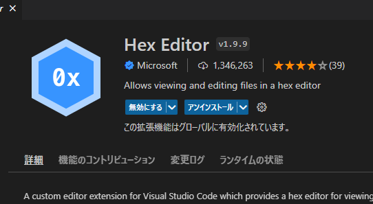

# Gitがいまいち分からないのは、内部構造を知らないからである

煽りみたいな見出しを付けましたが、私の経験談です。一通りのコマンドは使えるようになったんだけど、いまいちピンと来ないというか、もっと仕組み的なことを知りたくなって、本腰を入れて勉強しようと思い立ったタイミングがありました。

ここからは「Git内部構造ツアー」と題し、`.git`フォルダーの中に潜入し、Gitがどのように動作しているかを検証します。この記事を読むことで、もしかしたらGitに関する**誤解**が解消されるかもしれません。

今回の記事では、`git add`した時に`.git/`内部で何が起こるかを検証します。

## VSCodeで`.git/`を表示させる

この記事ではVSCodeを使って各種検証をしようと思いますが、リポジトリーを読み込ませても、`.git/`は表示されません。

リポジトリー直下に`.vscode`フォルダーを作成し、その中に`settings.json`を次の内容で作成します。

```json:title=settings.json
{
  "files.exclude": {
    "**/.git": false
  }
}
```

これで`.git/`の中身を扱うことができます。


## 全ては`.git`内部で完結する

誤解を恐れずに言うと、`git init`した時に現れる`.git`の中だけでGitの全てが完結します。管理しているファイルも、コミット履歴も、タグもブランチも、その全てがこの中に保存されています。

いわゆるGitサーバーは存在しません。Gitが**分散型バージョン管理システム**と言われる所以です。

と、聞くとかなり複雑なシステムになっていそうですが、意外とシンプルな造りだったりします。まずは、ざっと`.git/`の中身を確認しましょう。

## `git add`によってblobオブジェクトが作成される

おさらいですが、`git init`した状態では、`.git/objects/`は空ですね（正確には、`info`フォルダーと`pack`フォルダーは存在していますが）。

```git
$ ls -l .git/objects/
total 0
drwxr-xr-x 1 c-yoshizuke 1049089 0 11月 11 10:03 info/
drwxr-xr-x 1 c-yoshizuke 1049089 0 11月 11 10:03 pack/
```

リポジトリー直下に`text.txt`を作成します。中身は変更せず空のままで`git add text.txt`します。ここで`.git/objects/`を確認すると、`e6/`というフォルダーが作成され、その中に何やらファイルが格納されていることが分かります。

```shell
$ touch text.txt

$ git add text.txt

$ find .git/objects/ -type f
.git/objects/e6/9de29bb2d1d6434b8b29ae775ad8c2e48c5391
```

新しくできた`e6/9de29bb～(略)`が**blobオブジェクト**です。blogオブジェクトはGitオブジェクトの1主であり、「**ファイルの内容**をSHA-1でハッシュ化した40桁のID」です。ここで注意してほしいのは、`e6`というフォルダーの中に38桁のファイル名のファイルが格納されていますが、このファイルが本体なのではなく、あくまでも40桁のIDがblobオブジェクトである、ということです。

<aside>

正確には、blobオブジェクトIDは、「Gitオブジェクトの種類（今回ならばblob）」、「ファイルサイズ」「ファイルの内容」などをもとに生成されます。ファイルの内容だけをもとに生成されるわけではありません。

</aside>

バイナリーファイルであるため中身は読めませんが、何かしらは記述されている様子ですね。

```shell
$ cat .git/objects/e6/9de29bb2d1d6434b8b29ae775ad8c2e48c5391

(文字化け)
```

続けて`text.txt`に`Hello World!`と入力し、`git add .`でインデックスに登録します（ぜひ、**Hello World!**と一言一句たがわず入力して下さい）。できれば`echo -n "Hello World! > text.txt`とコマンドラインから入力してください（改行コードの問題を避けるため）。すると、新たなblobオブジェクトが作成されていることがわかります。

```shell
$ find .git/objects/ -type f
.git/objects/c5/7eff55ebc0c54973903af5f72bac72762cf4f4 # new
.git/objects/e6/9de29bb2d1d6434b8b29ae775ad8c2e48c5391
```

`git add .`は、ファイルをインデックスに登録し、Gitの管理下に置くということを意味します。

blobの内容は、`git cat-file -p {ハッシュID}`で確認できます。40桁全てを打つ必要はなく、6桁くらい打てばGitがよしなに判断してくれます。

```shell
$ git cat-file -p 980a0d
Hello World!
```

`e69`

```shell
$ git cat-file -p e69de29
(何も表示されない)
```

### ファイルの内容が同じならば、blobオブジェクトのIDは同じになる。

（恐らく）呼んでいる方も実際にやってみてもらっていると思いますが、blobオブジェクトは全く同じIDが生成されているはずです。

また、もう一つ実験をしてみます。`text.txt`を個コピーし、`text2.txt`と命名します。そのまま中身は変更せずに、`git add text2.txt`でステージングにあげます。

ここでクイズです。この時、blobオブジェクトは新しく生成されるでしょうか？ファイルがもう一個出来たんだから、blobオブジェクトも新しく出来ていそうですよね。

だがしかーし！なんと新たなblobオブジェクトは生成されないのです。

```console
$ find .git/objects/ -type f

.git/objects/98/0a0d5f19a64b4b30a87d4206aade58726b60e3
.git/objects/e6/9de29bb2d1d6434b8b29ae775ad8c2e48c5391
```

これはもちろんファイル名が`text3.txt`とかであっても同じことが言えます。あくまでもファイルの中身について、新しいものがステージングにあげられた時にblobオブジェクトが生成されるということですね。

### `hash-object`でIDを出力する

先ほど、ハッシュIDからオブジェクトの内容を出力する`cat-file`コマンドを紹介しましたが、逆にオブジェクトからハッシュIDを出力するには`hash-object`コマンドを使用します。`text.txt`と`text2.txt`からオブジェクトのIDを求めてみます。

```bash
$ git hash-object text.txt
c57eff55ebc0c54973903af5f72bac72762cf4f4

$ git hash-object text2.txt
c57eff55ebc0c54973903af5f72bac72762cf4f4
```

当然ながら同じblobオブジェクトIDが出力されます。

以上、これらのことから、blobオブジェクトIDは**ファイルの内容によって**決定されるということが言えそうです。

## index

ひとまず、ファイルの内容は`.git/objects`の中に40桁のIDに変換されて保存されているらしいという事が分かりました。では、ファイル名との紐づけはどうやっているのでしょうか。

結論から言うと、`.git/index`というファイルがそれを担っています。あるファイルがステージングに上げられると、`index`ファイルにblobオブジェクトIDとファイル名が登録されます。これを今から確認してみましょう。

現在、中身が`Hello World!`になっている`text.txt`と`text2.txt`がステージングに上がっていますので、この2つが`index`に登録されているはずです。

しかし、`index`は残念ながらバイナリーファイルですので、そのままでは中身を確認できません。ここはhexdumpなどのツールを使ってバイトコードを確認してみましょう。

VSCodeをお使いの方は、拡張機能で「hex editor」と検索し「Hex Editor」をインストールしてください。



インストールが完了したら`index`をVSCodeに読み込ませます。すると恐らく、以下の画像のような表示がでるので、


「開く」をクリックし、画面上部に現れる「Hex Editor」をクリックします。


これでバイトコードを確認できます。

さて、一見しただけでは意味不明ですが、画面右側をよくよく見てみると、「index.html」、「text.txt」という文字があることが分かります。どうやらファイル名を保存しているみたいです。


ここで`index.html`をステージングから下ろしてみましょう。`git reset index.html`で下ろすことができます。`.git/index`はステージングに上がっているファイルを管理するものですから、ステージングから下ろせば変化があるはずです。

```shell
$ git reset index.html
```

再度ダンプしたファイルを見てみると、、、


ファイル行数が約半分になっており、`index.html`という文字もなくなっています。続けて、`text.txt`もステージングから下ろしてみます。

```console
$ git reset text.txt
```


さらに行数が減りました！32バイトだけ残りました。この32バイトについては[Gitのリポジトリ](https://github.com/git/git/blob/v2.12.0/Documentation/technical/index-format.txt)を参照してください。


indexは**blogオブジェクトのID + ファイル名**から構成されていることがわかります。


> 4-byte signature:
  The signature is { 'D', 'I', 'R', 'C' } (stands for "dircache")

https://github.com/git/git/blob/v2.12.0/Documentation/technical/index-format.txt

## 参考

[Git - gitrepository-layout Documentation](https://git-scm.com/docs/gitrepository-layout)

[](https://github.blog/jp/2021-01-06-commits-are-snapshots-not-diffs/)

[Git - 配管（Plumbing）と磁器（Porcelain）](https://git-scm.com/book/ja/v2/Git%E3%81%AE%E5%86%85%E5%81%B4-%E9%85%8D%E7%AE%A1%EF%BC%88Plumbing%EF%BC%89%E3%81%A8%E7%A3%81%E5%99%A8%EF%BC%88Porcelain%EF%BC%89)

[Gitのコミットハッシュ値は何を元にどうやって生成されているのか | メルカリエンジニアリング](https://engineering.mercari.com/blog/entry/2016-02-08-173000/)

[Gitのコミットの裏側で起こっていること - LIVESENSE ENGINEER BLOG](https://made.livesense.co.jp/entry/2017/08/22/080000)

[Gitオブジェクトの中身 - Qiita](https://qiita.com/nkshigeru/items/eb2b6f758c2707757738)

[Gitが連想配列記憶装置であることを低レイヤーな操作を通して体感しよう！ - Qiita](https://qiita.com/DQNEO/items/0233a680b0f9471db9ee)

[Gitのステージング領域の正体を探る | メルカリエンジニアリング](https://engineering.mercari.com/blog/entry/2017-04-06-171430/)

[Git の仕組み (1) - こせきの技術日記](https://koseki.hatenablog.com/entry/2014/04/22/inside-git-1#1-2)

https://zenn.dev/st43/articles/9f86a107a57aba

[たぶんもう怖くないGit ~Git内部の仕組み~ - Qiita](https://qiita.com/marchin_1989/items/2ec01553e907f3a9e6bb)

https://mrkmyki.com/%E3%80%90%E5%9B%B3%E8%A7%A3%E3%80%91git%E3%81%AE%E3%82%A4%E3%83%B3%E3%83%87%E3%83%83%E3%82%AF%E3%82%B9%E3%81%AE%E8%AA%AC%E6%98%8E%E3%81%BE%E3%81%A8%E3%82%81

https://qiita.com/DQNEO/items/0233a680b0f9471db9ee

[Git for Computer Scientists](https://eagain.net/articles/git-for-computer-scientists/)

https://www.yoheim.net/blog.php?q=20140301

[[Git]git cat-fileで任意のブランチの任意のファイルを閲覧できるので便利 &middot;  DQNEO日記](http://dqn.sakusakutto.jp/2013/06/git_cat-file.html)

[[git] Gitの内部（ツリーオブジェクト） - YoheiM .NET](https://www.yoheim.net/blog.php?q=20140301)

[見えないチカラ: &#12304;翻訳&#12305;Gitをボトムアップから理解する](http://keijinsonyaban.blogspot.com/2011/05/git.html?Trustwave-Auth=f95c77f48b2c8be2bc93c9d435dbd997d0cfe781Bwl28VCimmwR36JwuQQ8vPdc4p1/mfqYlQHb1dZsrWi/h88orHCjOlHmRAj1BDxH2fPN6pY21V2uzyPaG6SE5uNnEIsOXo+p5T/cb2asIa7vcdmn66IOMFrVhN+aERYtC/SBUqCqSE7eeb6mkr8bkrfJhO7ebf0+QejXJc3MkS+1iV2/SJ1iez1gCDDkbEoW71MmCbidAW2hNvtfh+pon/rkP+hum6FKynD2iwxDZ5GxdoH9EKpyRvsrkDjMPFV3#ct3_1)

[git checkoutを図解する | To Be Decided](https://www.kaitoy.xyz/2016/10/08/git-checkout/)

[Gitはファイルの移動を追跡できない - 永遠に未完成](https://thinca.hatenablog.com/entry/20090217/1234799036)