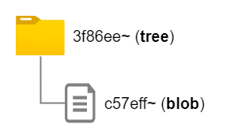

# コミット時の動作を追おう

前回は`git add`した時にblobオブジェクトが出来るということを説明しました。今回は`git commit`時の動作を追いますが、実は前回とそんなに変わらず、`.git/objects/`が話の主役です。

## リポジトリーを作成する

空の`text.txt`を作成します。そして`echo -n "Hello World!" > text.txt`を実行し、`git add text.txt`でステージングに上げます。この時、blobオブジェクト`c57eff~`が作成されます。

```bash
$ find .git/objects/ -type f
.git/objects/c5/7eff55ebc0c54973903af5f72bac72762cf4f4

$ git cat-file -p c57eff
Hello World!
```

また、`index`にも以下の内容が登録されていることが確認できます。

```bash
$ git ls-files --stage
100644 c57eff55ebc0c54973903af5f72bac72762cf4f4 0       text.txt
```

では、いよいよ`git commit`をしてみましょう。

```bash
$ git commit -m "first commit"

...

1 file changed, 1 insertion(+)
 create mode 100644 text.txt
```

まずは`.git/objects`の中身を見てみると、、、

```bash
$ find .git/objects/ -type f
.git/objects/3f/8e66262c7fdcf2537e1adbe0d6d8d9015dcc4c # new
.git/objects/74/7ebf7e12b73a8e2c9a6abed35a91b8287de16e # new
.git/objects/c5/7eff55ebc0c54973903af5f72bac72762cf4f4
```

新しいGitオブジェクトが2つ出来ていることがわかります。

さて、前回の記事でGitオブジェクトにはいくつかの種類があると説明しました。`git cat-file`コマンドにオプション`-t`を渡すことで、Gitオブジェクトの種類を得ることができます。

```bash
$ git cat-file -t 3f8e66
tree

$ git cat-file -t 747ebf
commit

$ git cat-file -t c57eff
blob
```

`c57eff~`はお馴染みのblobオブジェクトですね。新しく出来た`3f8e66~`は**treeオブジェクト**、`747ebf~`は**commitオブジェクト**であると示されています。この2つのオブジェクトが何なのかをこれから説明していきます。

## treeオブジェクト

treeオブジェクトは、ある種フォルダーを表す役割を持つものです。blobオブジェクトはファイルの内容でしたが、treeオブジェクトはフォルダーです。対比すると覚えやすいですね。

さっそく`git cat-file -p`でtreeオブジェクトを解析してみましょう。

```bash
$ git cat-file -p 3f8e66
100644 blob c57eff55ebc0c54973903af5f72bac72762cf4f4    text.txt
```

すると、出力されたのはblobオブジェクトです。つまり、あるコミット時点で、あるフォルダーにどのようなファイルが存在していたかを保存しているのです。



このtreeオブジェクトの中身も簡単に見てみたいと思います。treeオブジェクトは`index`とは違い、Hex Editorで読み込むことは出来ませんので、私はWSLを使用して`hexdump`コマンドでtreeオブジェクトをダンプしました。

```bash
$ git cat-file tree 3f8e66 | hexdump -C

00000000  31 30 30 36 34 34 20 74  65 78 74 2e 74 78 74 00  |100644 text.txt.|
00000010  c5 7e ff 55 eb c0 c5 49  73 90 3a f5 f7 2b ac 72  |.~.U...Is.:..+.r|
00000020  76 2c f4 f4                                       |v,..|
00000024
```

1行目を見ると`100644 text.txt`とあり、ファイルの種類やパーミッション、ファイル名を保存していることが見て取れます。さらに次の行では`c5e7ff~`があり、ファイルに対応するblobオブジェクトIDも記述されていることが分かります。

もう一つファイルを作成してコミットしてみましょう。`text2.txt`を作成し、`echo -n "I love Git." > text2.txt`で内容を記述し、commitします。

```bash
$ touch text2.txt

$ echo -n "I love Git." > text2.txt

$ git add text2.txt

$ git commit -m "second commit"
```

すると新しいtreeオブジェクト`b3ce0d~`ができています。これを`git cat-file -p`すると、

```bash
$ git cat-file -p b3ce
100644 blob c57eff55ebc0c54973903af5f72bac72762cf4f4    text.txt
100644 blob 932b85ca9129d15b57b416c508b7c584f393e528    text2.txt
```

という結果が得られます。

では、フォルダーを作成してその中にファイルを保存、コミットすると、treeオブジェクトはどのようになるのでしょうか。

`mkdir log`でフォルダーを作成し、`touch access.log`を作成、

```
$ git cat-file -p bd889
040000 tree dc5efa7035fa51f1f30fa03b7b14791c4066b795    log
100644 blob c57eff55ebc0c54973903af5f72bac72762cf4f4    text.txt
100644 blob 932b85ca9129d15b57b416c508b7c584f393e528    text2.txt
```

そう、treeオブジェクトの中にtreeオブジェクトが含まれているのです。続けて、`log/`を表す`dc5efa~`を`git cat-file`にかけてみましょう。`access.log`を表すblobオブジェクトが取得できそうですね。

```bash
$ git cat-file -p dc5efa
100644 blob 30d74d258442c7c65512eafab474568dd706c430    access.log
```

目論見通り、blobオブジェクトが出力されました。

これでtreeオブジェクトがフォルダーの役割を持っている、というのはおわかりいただけたと思います。

## commitオブジェクト

> このように最新のコミットは、ひとつ前の親コミットを参照し、そのコミットはまたひとつ前の親コミットを参照し、と言った具合に参照の列を作っています。


## 参考

https://koseki.hatenablog.com/entry/2014/04/22/inside-git-1

https://arbitrary-but-fixed.net/git/julia/2021/03/18/git-tree-sha1-to-commit-sha1.html