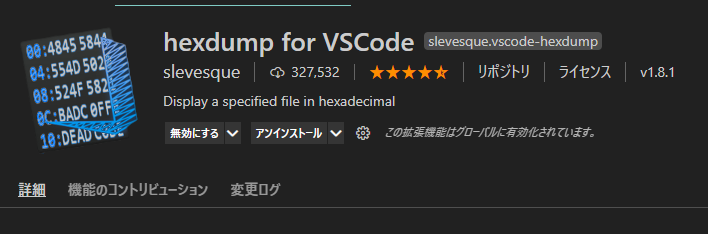
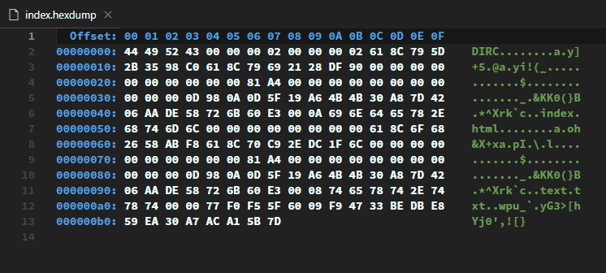
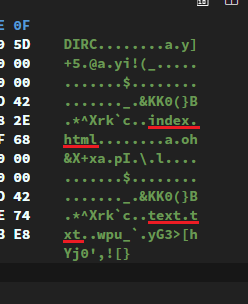

# Gitがいまいち分からないのは、内部構造を知らないからである

煽りみたいなタイトルを付けましたが、私の経験談です。一通りのコマンドは使えるようになったんだけど、いまいちピンと来ないというか、もっと仕組み的なことを知りたくなって、本腰を入れて勉強しようと思い立ったタイミングがありました。

ここからは「Git内部構造ツアー」と題し、`.git`フォルダーの中に潜入し、Gitがどのように動作しているかを検証します。この記事を読むことで、もしかしたらGitに関する**誤解**が解消されるかもしれません。

今回の記事では、`git add`と`git commit`した時に`.git`フォルダー内部で何が起こるかを検証します。

## 全ては`.git`内部で完結する

誤解を恐れずに言うと、`git init`した時に現れる`.git`の中だけでGitの全てが完結します。管理しているファイルも、コミット履歴も、タグもブランチも、その全てがこの中に保存されています。

いわゆるGitサーバーは存在しません。Gitが**分散型バージョン管理システム**と言われる所以です。

と、聞くとかなり複雑なシステムになっていそうですが、意外とシンプルな造りだったりします。まずは、ざっと`.git/`の中身を確認しましょう。

## `git add`によってblobオブジェクトが作成される

`git init`した状態では、`.git/objects`は空（正確には、`info`フォルダーと`pack`フォルダーは存在しているが）。

```git
$ ls -l .git/objects/
total 0
drwxr-xr-x 1 c-yoshizuke 1049089 0 11月 11 10:03 info/
drwxr-xr-x 1 c-yoshizuke 1049089 0 11月 11 10:03 pack/
```

`text.txt`を作成、`git add .`して`.git/objects`を確認する。

```shell
$ touch text.txt

$ git add .

$ find .git/objects/
.git/objects
.git/objects/e6
.git/objects/e6/9de29bb2d1d6434b8b29ae775ad8c2e48c5391
.git/objects/info
.git/objects/pack
```

新しくできた`e6/9de29bb～(略)`が**blobオブジェクト**です。blogオブジェクトは、「**ファイルの内容**をSHA-1でハッシュ化した40桁のID」です。

blogオブジェクトのID40桁のうち、先頭2桁をディレクトリー名とし、残り38桁でバイナリファイルを生成します。

<aside>

のちのち分かりますが、「ファイルの内容」というところが、blogオブジェクトを理解するうえで大事です。

</aside>

バイナリファイルであるため中身は読めませんが、何かしらは記述されている様子ですね。

```shell
$ cat .git/objects/e6/9de29bb2d1d6434b8b29ae775ad8c2e48c5391

(文字化け)
```

`Hello World!`と入力し、`git add .`でステージングに上げます（ぜひ、**Hello World!**一言一句たがわず入力して下さい）。すると、新たなblobファイルが作成されていることがわかります。

```shell
$ find .git/objects/ -type f
.git/objects/98/0a0d5f19a64b4b30a87d4206aade58726b60e3
.git/objects/e6/9de29bb2d1d6434b8b29ae775ad8c2e48c5391
```

blobの内容は、`git cat-file -p {ハッシュID}`で確認できる。40桁全てを打つ必要はなく、6桁くらい打てばGitがよしなにやってくれる。

```shell
$ git cat-file -p 980a0d
Hello World!
```

また、ファイルを書き換えても最初の`e69de29～`は消えていないことに注目。

```shell
$ git cat-file -p e69de29
(何も表示されない)
```

### ファイルの内容が同じならば、blobオブジェクトのIDは同じになる。

（恐らく）呼んでいる方も実際にやってみてもらっていると思うが、全く同じIDが生成されているはずです。

また、もう一つ実験をしてみます。`index.html`というファイルを作成し、`text.txt`と同じ`Hello World!`と入力し、`git add .`でステージングにあげます。

ここでクイズです。この時、blogオブジェクトは新しく生成されているでしょうか？ファイルがもう一個出来たんだから、blobオブジェクトも新しく出来ていそうですよね。しかし、、、

なななんと！blobオブジェクトは生成されないのです。

```console
$ find .git/objects/ -type f

.git/objects/98/0a0d5f19a64b4b30a87d4206aade58726b60e3
.git/objects/e6/9de29bb2d1d6434b8b29ae775ad8c2e48c5391
```

これらのことから、blobオブジェクトのハッシュIDは、**ファイルの内容からのみ**決定されるということが言えそうです。

## インデックス

ひとまず、ファイルの内容は`.git/objects`の中に保存されているらしいという事が分かりました。では、ファイル名との紐づけはどうやっているのでしょうか。

結論から言うと、`.git/index`というファイルがそれを担っています。あるファイルがステージングに上げられると、`.git/index`ファイルにblogオブジェクトIDとファイル名が登録されます。これを今から確認してみましょう。

現在、中身が`Hello World!`になっている`text.txt`と`index.html`がステージングに上がっていますので、この2つが`.git/index`に登録されているはずです。

しかし、`.git/index`は残念ながらバイナリファイルですので、そのままでは中身を確認できません。ここはhexdumpなどのツールを使ってバイトコードを確認してみましょう。

VSCodeをお使いの方は、拡張機能で「hexdump」と検索し、「hexdump for VSCode」をインストールしてください。



インストールが完了したら、`.git/index`をVSCodeに読み込ませましょう。タブで右クリックすると、メニューに「Show Hexdump」があるので選択します。


これでバイトコードを確認できます。



さて、一見しただけでは意味不明ですが、画面右側をよくよく見てみると、「index.html」、「text.txt」という文字があることが分かります。どうやらファイル名を保存しているみたいです。



ここで`index.html`をステージングから下ろしてみましょう。`git reset index.html`で下ろすことができます。`.git/index`はステージングに上がっているファイルを管理するものですから、ステージングから下ろせば変化があるはずです。

```shell
$ git reset index.html
```

再度ダンプしたファイルを見てみると、、、


ファイル行数が約半分になっており、`index.html`という文字もなくなっています。続けて、`text.txt`もステージングから下ろしてみます。

```console
$ git reset text.txt
```


さらに行数が減りました！32バイトだけ残りました。この32バイトについては[Gitのリポジトリ](https://github.com/git/git/blob/v2.12.0/Documentation/technical/index-format.txt)を参照してください。


indexは**blogオブジェクトのID + ファイル名**から構成されていることがわかります。


> 4-byte signature:
  The signature is { 'D', 'I', 'R', 'C' } (stands for "dircache")

https://github.com/git/git/blob/v2.12.0/Documentation/technical/index-format.txt

## 参考

[Git - 配管（Plumbing）と磁器（Porcelain）](https://git-scm.com/book/ja/v2/Git%E3%81%AE%E5%86%85%E5%81%B4-%E9%85%8D%E7%AE%A1%EF%BC%88Plumbing%EF%BC%89%E3%81%A8%E7%A3%81%E5%99%A8%EF%BC%88Porcelain%EF%BC%89)

[Gitのコミットハッシュ値は何を元にどうやって生成されているのか | メルカリエンジニアリング](https://engineering.mercari.com/blog/entry/2016-02-08-173000/)

[Gitのコミットの裏側で起こっていること - LIVESENSE ENGINEER BLOG](https://made.livesense.co.jp/entry/2017/08/22/080000)

[Gitオブジェクトの中身 - Qiita](https://qiita.com/nkshigeru/items/eb2b6f758c2707757738)

[Gitが連想配列記憶装置であることを低レイヤーな操作を通して体感しよう！ - Qiita](https://qiita.com/DQNEO/items/0233a680b0f9471db9ee)

[Gitのステージング領域の正体を探る | メルカリエンジニアリング](https://engineering.mercari.com/blog/entry/2017-04-06-171430/)

[Git の仕組み (1) - こせきの技術日記](https://koseki.hatenablog.com/entry/2014/04/22/inside-git-1#1-2)

https://zenn.dev/st43/articles/9f86a107a57aba

https://mrkmyki.com/%E3%80%90%E5%9B%B3%E8%A7%A3%E3%80%91git%E3%81%AE%E3%82%A4%E3%83%B3%E3%83%87%E3%83%83%E3%82%AF%E3%82%B9%E3%81%AE%E8%AA%AC%E6%98%8E%E3%81%BE%E3%81%A8%E3%82%81

https://qiita.com/DQNEO/items/0233a680b0f9471db9ee
