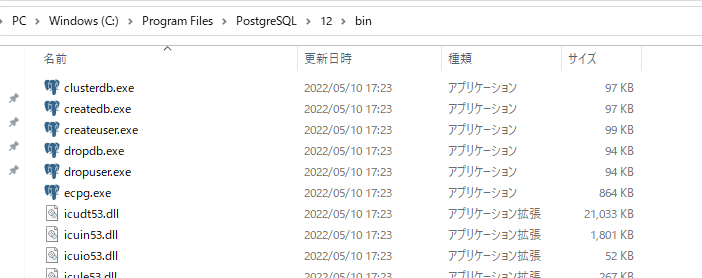

標準ツールの実体は`PostgreSQLのインストールフォルダー/bin`に格納されています。このフォルダーへのパスが通っていれば、OSのコマンドラインから簡単にツールを実行できます。



拡張子が`.exe`となっているのがツールの実体です。

## initdb

データーベースクラスターを作成するコマンド。

`--no-locale`もしくは`-C`でロケールを無効にする。指定しない場合はOSに設定されているロケールが適用されます。

## createdb

createdbコマンドを使って新しいデータベースを作成することができます。

```
# createdb -U myuser testdb
```

特にメッセージは表示されません。`psql -l`でデータベース一覧を確認してみます。

```
# psql -l
                              List of databases
   Name    | Owner  | Encoding |  Collate   |   Ctype    | Access privileges 
-----------+--------+----------+------------+------------+-------------------
 postgres  | postgres | UTF8     | en_US.utf8 | en_US.utf8 |
 template0 | postgres | UTF8     | en_US.utf8 | en_US.utf8 | =c/postgres        +
           |        |          |            |            | postgres=CTc/postgres
 template1 | postgres | UTF8     | en_US.utf8 | en_US.utf8 | =c/postgres        +
           |        |          |            |            | postgres=CTc/postgres
 testdb    | postgres | UTF8     | en_US.utf8 | en_US.utf8 |
(5 rows)
```

`dropdb`コマンドでデータベースを削除することができます。書式は`dropdb [データベース名]`です。

```
# dropdb testdb
```

### createdbのオプション

|オプション|説明|
|---|---|
|-E, --encoding|エンコーディングを指定する|
|-O, --owner|データベースの所有者を指定する|
|-l, --locale|ロケールを指定する|
|-T, --template|テンプレートを指定する|

ロケールを指定する`-l`が大文字のLではないところが嫌らしいですね。何度か手打ちしていれば覚えてしまえますが。

## テンプレートについて

テンプレートを指定しない場合は、`template1`が選択されます。

`template1`のエンコーディングとロケールは変更できません。エンコーディングやロケールを変更してテンプレートを利用したい場合は、`template0`を指定する必要があります。

## createuser

ユーザー（ロール）を作成できます。

`createuser`で作成されるユーザーは**ログインのみが許可された状態**です。それ以外のDBを作ったり、スーパーユーザーにしたり新しいユーザーを作ったりする権限を付与するには、オプションで明示的に付与する必要があります。

|オプション|説明|
|---|---|
|-P, --pwprompt|ログインパスワードを設定する|
|-l, --login|ログイン可能にする（指定しなくてもログイン可能）|
|-s, --superuser|スーパーユーザーとして作成する|
|-d, --createdb|データベースの作成を許可する|
|-r, --createrole|ユーザーの作成を許可する|

`createuser -P testuser`として、ユーザーを作成してみます。`-P`オプションを使用しているため、testuserに設定するパスワードを入力するプロンプトが現れます。

```shell
$ createuser -U postgres -P testuser
新しいロールのためのパスワード: <testuserに設定するパスワード>
もう一度入力してください： <testuserに設定するパスワード>
パスワード: <postgresのパスワード>
```

特に何も表示されなければ作成に成功しています。さっそくログインしてみましょう。この時、`-d postgres`という風に、ログインするデータベースを指定してください。`-d`オプションを省略すると、ログインユーザーである`testuser`という名前のデータベースにログインしようとします。

```
$ psql -U testuser -d postgres
ユーザ testuser のパスワード:
psql (12.11)
"help"でヘルプを表示します。

postgres=>
```
