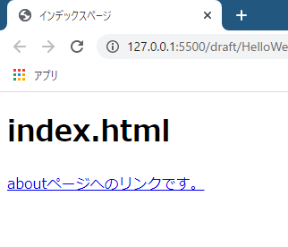
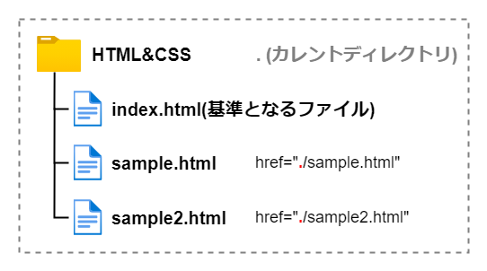

# Webはリンクの集まり

a要素は**ハイパーリンク**（以下、必要に応じて、単純に**リンク**と呼びます）を作成する要素です。他のページへ遷移するものや、同じページ内へ遷移するもの（記事の冒頭の目次などによく使用されていますね）、また、ファイルをダウンロードするものなどがリンクにあたりますが、これらは全てa要素を使用して作成します。

## HTMLの由来

HTMLはHyper Text Markup Languageの略称です。このハイパーテキストという言葉についてですが、「ハイパー」とはどういう意味でしょうか。普通のテキストと何が違うのでしょうか。

HTMLが生まれたきっかけは、スイスのとある研究所での研究論文の紐づけのためでした。研究に必要なデータや参考文献を大量に集め、**各情報を行き来できるリンク**があれば便利ではないかと考えられました。そして、リンクを持つ特別な（ハイパーな）テキストを**ハイパーテキスト**と呼び、リンクのことを**ハイパーリンク**と呼ぶようになりました。

> ハイパーテキストは、ほかのテキストへのリンクを含むテキストであり、小説のように単一で線形の流れのものとは対照的なものです。

参考 : [Hypertext (ハイパーテキスト) | MDN](https://developer.mozilla.org/ja/docs/Glossary/Hypertext)

> ハイパーリンクはウェブページやデータ項目をお互いに接続します。

参考 : [Hyperlink (ハイパーリンク) | MDN](https://developer.mozilla.org/ja/docs/Glossary/Hyperlink)

つまり、ハイパーリンクがあるからこそ、ハイパーテキスト（≒HTML）であると言っても過言ではないのです！

インターネットは無数のハイパーテキストの集まりであり、その中にあるハイパーリンクによって相互に接続されています。これまでの演習では文字を羅列してばっかりでしたが、ハイパーリンクを用意してページ間を辿れるようになればいよいよWebサイトらしくなってきます。

## index.htmlとabout.htmlを用意する

今回は2つのHTMLファイル（`index.html`と`about.html`）を用意します。まずは`index.html`ですが、前回までのものを流用してもいいですし、新しく作っても構いません。

続いて、`index.html`と**同じ階層**に`pages`というフォルダーを作成してください。そしてその中に`about.html`を作成します。つまり、下図のようなフォルダー構成になります。


## aタグでリンクを作成する

まずは`index.html`の作成から取り掛かりましょう。`about.html`へのリンクを作成してみます。以下の通りに記述してください。

```html:title=index.html
<!DOCTYPE html>
<html lang="ja">
<head>
  <meta charset="UTF-8">
  <meta name="viewport" content="width=device-width, initial-scale=1.0">
  <title>インデックスページ</title>
</head>
<body>
  <h1>インデックスページ</h1>

  <a href="./pages/about.html">アバウトページへのリンクです。</a>
</body>
</html>
```

Webページを確認すると、アンダーバーが引かれた青い文字のリンクが作成されているはずです。



<aside>

作成されたリンクがどのように装飾され表示されているかは、厳密にはブラウザーによって異なります。

</aside>

リンクをクリックしてみて、`about.html`へアクセスできるかを確認してください。


見事、ページ遷移できればリンクの作成が完了です。もし以下の画面のように、ファイルにアクセスできない旨のエラーメッセージが表示された場合は、


- `href`属性の記述が間違っている
- `pages`というフォルダー名が間違っている
- `about.html`というファイル名が間違っている

のうちのどれかが原因のエラーだと思われます。

以下の`href`属性についての説明も読みながら、間違いがないか見直してみてください。

### href属性でリンク先を指定する

では、改めてリンクの作成方法を解説します。

まず、aタグでリンクとしたい文字列を囲います。

```html
<a>アバウトページへのリンク</a>
```

リンクを踏んだ時の遷移先は、**`href`属性**で指定します。`href`属性には移動したい先の**パス**を記述します。

```html
<a href="./pages/about.html">アバウトページへのリンク</a>
```

パスの記述はcssファイルの読み込みの時にもやりましたね。ここで記述しているパスは**相対パス**と呼ばれるものです。

### 相対パス

相対パスは、**現在の地点から**目的の地点への行き方を記述するパスです。「現在の地点」とはa要素を書いているファイル、つまり`index.html`が置かれているフォルダーです。

まずは**カレントディレクトリ**を表す`.`を先頭に付けます。そして、階層を区切る`/`を付けます。

<aside>

**ディレクトリ**は、「フォルダー」のことです。その前に**カレント**がついているので、「カレントディレクトリ」は「現在のフォルダー」という意味です。

</aside>

図を用いて例を示します。例えば、リンクを付けたいhtmlファイルが同じ階層にあるのであれば、`href="./sample.html"`と記述します。図で表すと以下のようになります。



今回、目的の`about.html`は`pages`フォルダーの中に格納されていますね。`./pages`とすることで`pages`フォルダーの中に下りることができます。


後は、`pages`フォルダーにある、リンクさせたいファイル名を記述すれば相対リンクの完成です。区切りである`/`をつけ、目的のファイルである`about.html`を記述します。


まとめると、

- 相対パスは、リンクを記述しているファイルを起点とするパスの記述方式
- 現在のフォルダー（カレントディレクトリ）は`.`で表す
- `/`でファイルやフォルダーを区切る

となります。

もちろん、以下のように深い階層までのパスも記述できます。

以下の図は、`index.html`があるフォルダー（`HTML&CSS`）から見て、`dir1`フォルダーの中の`dir2`フォルダーの中の`dir3`フォルダーの中の`index.html`を指定しているイメージ図です。


### 上の階層へは`..`で辿る

続いて、`about.html`にも`index.html`へのリンクを作成し、相互に辿れるようにしましょう。

`about.html`を以下のように編集します。

```html:title=about.html
<!DOCTYPE html>
<html lang="ja">
<head>
  <meta charset="UTF-8">
  <meta name="viewport" content="width=device-width, initial-scale=1.0">
  <title>アバウトページ</title>
</head>
<body>
  <h1>アバウトページ</h1>
  <a href="./../index.html">インデックスページへのリンク</a>
</body>
</html>
```

`href`属性を確認しましょう。まずはカレントディレクトリを表す`./`から始めます。さて、親フォルダーをどうやって表すかですが、`..`を使用します。これだけで親フォルダーに上がることができます。

私たちが普段使っているフォルダーやファイルの仕組みにおいて、**親フォルダーは一つしかない**ため、親フォルダー名を指定する必要はありません（この場合のカレントディレクトリにおける親フォルダーは`HTML&CSS`フォルダーだけですよね）。親フォルダーが2個以上存在するような世界線ならば、どのフォルダーを指定するかを記述する必要がありますが、実際には一つしかないため`..`のみで表すことができます。

また、a要素はp要素の中に入れることができます。次はp要素の中にa要素を入れいている例です。p要素の中でも、a要素だけがリンクになります。`index.html`を再度編集してみて下さい。

```html
<p>アバウトページへのリンクは<a>こちら</a>です。</p>
```

```html
<!DOCTYPE html>
<html lang="ja">
<head>
  <meta charset="UTF-8">
  <meta name="viewport" content="width=device-width, initial-scale=1.0">
  <title>アバウトページ</title>
</head>
<body>
  <h1>アバウトページ</h1>
  <a href="./index.html">aboutページへのリンク</a>
</body>
</html>
```


こちらも、リンクを踏んで`index.html`へ移動できるかをちゃんと確認しておきましょう。

## 参考

[&lt;a&gt;: アンカー要素 | MDN](https://developer.mozilla.org/ja/docs/Web/HTML/Element/a)

[HTMLって何だ -- ごく簡単なHTMLの説明](https://www.kanzaki.com/docs/html/htminfo10.html)

[Webはなんで「ウェブ」なの？ 結局ハイパーテキストって何のこと？【第3回】 | 今さら人に聞けないWebの仕組み | Web担当者Forum](https://webtan.impress.co.jp/e/2019/01/09/31234)

[Webってどういう意味？意外と知らないWebの歴史【インターネット・アカデミー】](https://www.internetacademy.jp/special/history.html)

[第12回インターネット講座](http://www.tufs.ac.jp/ts/personal/yamaguci/inet_lec/lec12/98med12.html

<!-- 空腹 -->
<!-- グレリン -->