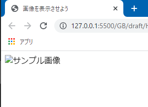

# 画像を表示しよう

今回はWebページに画像を表示させる方法を学びます。画像の表示は意外とややこしく方法はいくつかありますが、今回は**img要素**を使う方法を紹介します。

とりあえずは以下のような`index.html`を用意します。

```html:title=index.html
<!DOCTYPE html>
<html lang="ja">
<head>
  <meta charset="UTF-8">
  <meta name="viewport" content="width=device-width, initial-scale=1.0">
  <title>画像を表示させよう</title>
</head>
<body>

</body>
</html>
```

そして同じフォルダーに**images**というフォルダーを作成します。ここに表示させたい画像を保存するようにしましょう。

## 画像を入手

画像が無くては始まりませんから、適当な画像を用意してください。「何でもいいよ」「面倒くさい」という方は、以下の画像を右クリックして、「名前を付けて画像を保存...」を選択し、画像をダウンロードします。先ほど作成した`images`フォルダーに保存しましょう。


<aside>

本当はもっとかっこいい画像を用意出来ればよかったんですが、写真を撮るスキルがないためこんな画像になってしまいました。

</aside>

ファイル名は何でもOKです。恐らく、ダウンロードした画像は`sample-image.png`となっていると思いますが、他の名前を付けたいのであれば変更しても当然OKです。ここでは`sample-image.png`であるとして進めます。

念のため現在のフォルダー構成を確認しておきます。


## img要素

画像を表示させるには**img要素**を使用します。「image」のimgですね、わかりやすいです。

**src属性**に画像ファイルまでのパスを記述して、画像ファイルを取り込みます。「source」のsrcですね、わかりやすいです。

パスについては前回やりましたね。今回も相対パスを使います。`images`フォルダーの中の`sample-image.png`を表すためには、`src="images/sample-image.png"`と記述します。

そして`img`タグは**空タグ**なので、終了タグは存在しません。

具体的にHTMLコードは以下のようになります。

```html
<body>
  
</body>
```

ここで実際にページを確認してましょう。


画像が表示されない場合は、パス（つまりフォルダー名やファイル名）が間違っている可能性が高いです。もう一度チェックしてみてください。

### alt属性

`img`要素において`src`属性は必須です。画像ファイルの在処を示すものですから当たり前ですね。

必須ではないものの記述することが強く推奨されるのが**alt属性**です。「alternative」のaltです。画像の代わりに使用される、**画像を説明する**端的な文章を入力します。

`alt`属性を記述しても通常は画面上に表示されることはありません。alt属性が活躍する状況として、画像が表示されない場合が挙げられます。

`src`属性の値を変更し、存在しないパスにしてみましょう。`src`属性自体を消してしまってもOKです。そして、`alt`属性を用意し、`サンプル画像`と入力してみましょう。

```html:title=index.html
<body>
  
</body>
```

この状態でアクセスすると、画像を示すアイコンとalt属性に記述した文章が表示されていることが分かります。



画像が表示されない理由は様々です。`src`属性のパスが間違っていることもそうですし、実際のWebサイトであればネットワークの状況によって画像ファイルの取得が出来なかったり遅れているという状況も当てはまります。ともかく、何かしらトラブルがあった場合に「本当はこんな内容の画像が表示されるんだよ」ということを伝えられるため、`alt`属性は必ず記述するようにしましょう。

<aside>

**スクリーンリーダー**でサイトが読み上げられる際にも、`alt`属性の値が読み上げられます。

</aside>

## 画像をリンクにすることもできる

前回学習した`a`要素と組み合わせ、画像をリンクにすることもできます。`index.html`以外にももう一つhtmlファイルを用意してください。ここでは以前作成した`about.html`を利用します。`index.html`と同じフォルダー内に保存します。

<aside>

リンクが機能するかを確認するだけなので、どのようなhtmlファイルでも構いません。

</aside>

さて思い出してほしいのですが、`<a href="">`と`</a>`に囲まれた中身が実際のリンクになるんでしたね。今回は画像をリンクにするため、`a`要素で`img`要素を囲えばOKです。

```html:title=index.html
<body>
  <a href="about.html">
    
  </a>
</body>
```


## 参考

https://developer.mozilla.org/ja/docs/Web/HTML/Element/img

https://blog.codecamp.jp/programming-html-pic-link