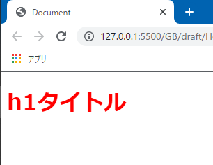
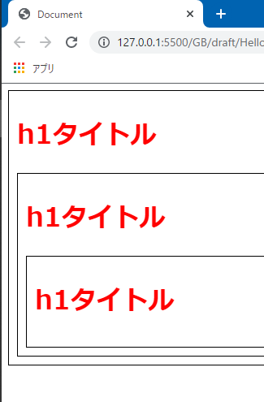
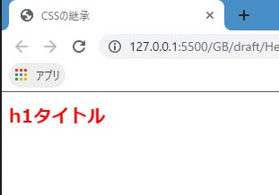
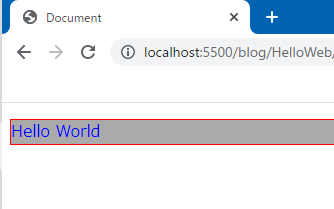
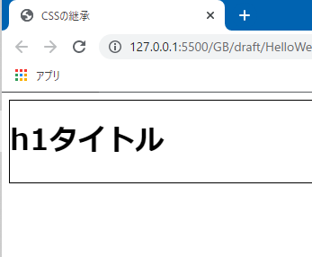

# colorプロパティとfont-sizeプロパティ

これからはいよいよ具体的にCSSプロパティを扱っていきます。今回はテキストの色を変える`color`プロパティと、テキストの大きさを変える`font-size`プロパティを学習します。

<aside>

CSSプロパティについては基本的な内容をざっと説明するに留めます。「こういった使い方もできる」といったテクニック的な事は実際にサイトを作成する段階で順次説明します。

</aside>

## colorプロパティ

まずは`color`プロパティから説明します。値には当然色を記述するわけですが、実は様々な色の表現方法があります。

### キーワードで色を指定する

一番直感的で分かりやすいのは、色を表すキーワードで色を指定することです。キーワードというのは`blue`であったり`grren`であったり`red`といったもので、アルファベットで値を記述します。

```css
h1 {
  color: blue;
}

h2 {
  color: green;
}

h3 {
  color: red;
}
```



キーワードについては、代表的な色はもちろん様々な色に対応するキーワードが用意されています。どのようなキーワードがあるかは[こちら](https://developer.mozilla.org/ja/docs/Web/CSS/color_value#%E8%89%B2%E3%82%AD%E3%83%BC%E3%83%AF%E3%83%BC%E3%83%89)を参照ください。

### 16進数カラーコードで色を指定する

キーワードの他にも、**RGB16進数**で色を指定することができます。16進数、つまり`0`から`9`、そして`a`から`f`の文字を組み合わせて**カラーコード**で色を表現する方法です。キーワードと違い直感的ではありませんが、より細かい色の指定をすることができます。

16進数表記は、例えば`#ff0000`という風に指定します。`#`はカラーコードを使って色を表すという意味を持ちます。続いて6個の文字が並んでいますが、前から2つずつでくくって、それぞれが『赤』『緑』『青』を表します。この例でいうと、`ff`が赤、次の`00`が緑、最後の`00`が青を表します。値が大きいほどその色が強く表示されます。`#ff0000`を指定した場合、文字の色は真っ赤になります。

```css
h1 {
  color: #ff0000;
}
```



わかりにくいですか？そうですか。私も頭で理解してカラーコードを使用していません。

私は良い感じの色を調べたいとき、例えば[こういうページ](https://itsakura.com/html-color-codes)をブックマークしておいて、カラーコードをコピーするようにしています。

キーワードを使用するかカラーコードを使用するかですが、個人でやっているうちは自由ですので好きな方をお使いください。キーワードを使えば分かりやすいですし、カラーコードならより細かい色の調整ができます。どちらかというと「色はカラーコードで記述する」と統一されていることが多いんじゃないかと思います。

<aside>

なお、VS Codeには、htmlファイルやcssファイルに16進数カラーコードを記述するとそれがどんな色なのかを教えてくれる機能があります。



</aside>

こういった色の指定は、`color`プロパティだけでなく他の様々なプロパティにおいても何らかの色を指定する時も登場します。例えば`background-color`であれば背景色を、`border`プロパティであれば枠線の色を、といった具合です。

```css
p {
  /* 文字を緑に */
  color: blue;

  /* 背景をグレーに */
  background-color: #aaa;

  /* 枠線を赤に */
  border: 1px solid red;
}
```




## font-sizeプロパティ

次は文字の大きさを指定する`font-size`プロパティです。大きさを表す単位には様々なものがありますが、今回は`px`（ピクセル）について説明します。

ピクセルは、画面上の最も小さい**点**のことです。例えば16pxなら縦16個分の点、横16個分の点の大きさを表す、というイメージです。

[「px」って何だ？Webの世界の単位を知ろう | ウェブラボ（株）スタッフブログ](https://www.weblab.co.jp/blog/staff/design/8436.html)

`font-size`プロパティは以下のように記述します。特に難しくありませんね。

```css:title=style.css
h1 {
  font-size: 40px;
}

h2 {
  font-size: 30px;
}

h3 {
  font-size: 20px;
}
```



`px`という単位はしばしば**絶対値、絶対単位**などと呼ばれます。これは例えばPCで見た時とスマホで見た時など、他の要素に大きさが左右されないという意味です（ただし、ブラウザーのズーム機能を使うと変化します）。

**相対単位**と呼ばれる単位もあり、これは何らかの基準があり、その基準によって大きさが変わるような単位です。例えば`%`は親要素の`font-size`の大きさを基準にします。下記の例で言うと、`15px`を指定している`div`の子要素である`p`に`font-size: 200%;`を指定しています。この場合、`p`は2倍の30pxで表示されることになります。

```html
<div>
  15pxの文字です。
  <p>200%を指定しています。</p>
</div>
```


## 参考

[color | MDN](https://developer.mozilla.org/ja/docs/Web/CSS/color)

[](https://webukatu.com/wordpress/blog/15327/)

[CSS Color Module Level 4#the-color-property](https://drafts.csswg.org/css-color/#the-color-property)

https://creativememomemo.com/color_code_method/

https://uxmilk.jp/48376
