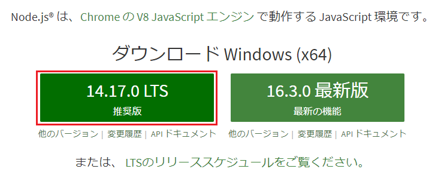
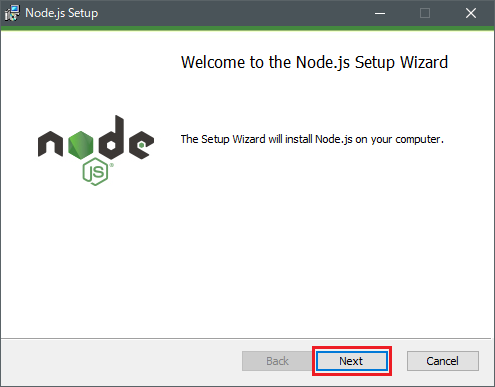
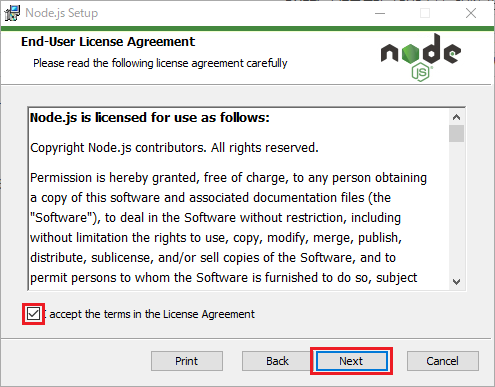
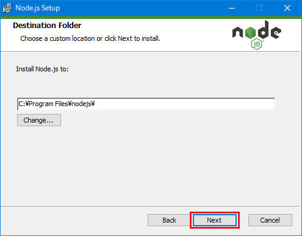
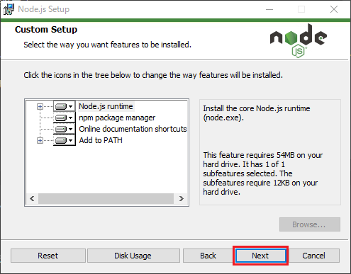
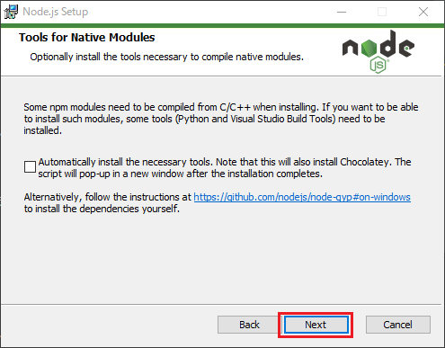
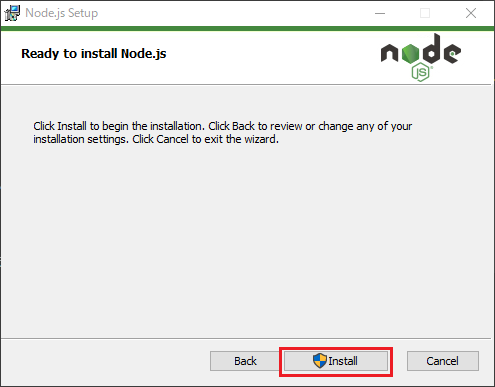
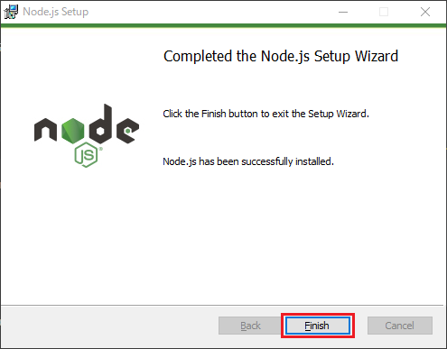

# Node.jsとは

Node.jsについて公式Webサイトを見てみると

> Node.js® は、Chrome の V8 JavaScript エンジン で動作する JavaScript 環境です。

とされています。要するに**JavaScriptの実行環境**であると言えます。

これまではHTMLファイルを作成し、JavaScriptファイルを読み込んでブラウザ上でJavaScriptを実行していました。この時はブラウザがJavaScriptの実行環境であった、と言えます。

Node.jsもブラウザと同じくJavaScriptの実行環境です。Google Chromeの中のJavaScriptの解析と実行をしている**V8**と呼ばれるプログラムを抜き出し、PCやサーバ上で利用できるようにしたイメージです。

Node.jsを利用すれば、コンソールから`node`コマンドでのJavaScriptの実行が可能です。また、**REPL**という対話形式でJavaScriptを実行できるプログラムも利用できます。

また、**npm**というパッケージ管理システムを利用できるようになり、JavaScriptの開発を補助してくれるライブラリやフレームワークをダウンロード、実行できます。

このように、Node.jsには現代のJavaScriptプログラミングに必要なものが揃っていますので、ぜひNode.jsをインストールして使用しましょう。

## バージョン

本講座では以下のバージョンのソフトウェアを使用します。

- Node.js 14.17.0
- npm 6.14.12

## Node.jsをインストールする

ではさっそくインストーラをダウンロードします。

[Node.jsのWebサイト](https://nodejs.org/ja/)にアクセスし、**推奨版**と書かれている部分をクリックします。そうするとダウンロードが始まります。



ダウンロードしたmsiファイルをダブルクリックで実行します。

以下がインストールの画面です。基本的にオプション等は選択しませんので、デフォルトのままNextを押してどんどん進んでいきましょう。









下記の画面では、オプションでネイティブ開発に必要なツール群をインストールするかを選択できます。今回は必要ありませんので、**チェックマークを入れずに**Nextを選択しましょう。



後はinstallをクリックしてしばし待ちましょう。



以下の画面がでれば無事完了です。



続いて、コンソール（コマンドプロンプトなど）を立ち上げ、`node -v`と入力し実行します。`-v`オプションを渡すことでNode.jsのバージョンを確認することができます。

```shell
$ node -v
v14.17.0
```

このようにバージョンが表示されればNode.jsが上手くインストール出来ています。

## JavaScriptを実行する

これまではブラウザ上でJavaScriptを実行していましたが、Node.jsをインストールしたことでこれからはコンソール上でスクリプトを実行できます。

まずは任意のフォルダに`script.js`ファイルを作成し、以下のように記述します。

```javascript:title=script.js
console.log('Hello World');
```

コンソールで`script.js`を保存しているフォルダまで移動し、`node`コマンドで実行します。

```
$ node script.js 
Hello World
```

実行成功です🎊。今回の講座ではこのように、`script.js`にコードを記載、`node`コマンドで実行する、というのを想定して進めます。

## REPLでJavaScriptを実行する

Node.jsには**REPL**と呼ばれる実行モードが備わっており、JavaScriptファイルを作成し`node`コマンドで実行するよりも手軽にコードを検証することができます。

コンソールで`node`とだけ打って実行してください。以下のようなコンソールに切り替わります。

```bash:title=console
$ node
Welcome to Node.js v14.17.0.
Type ".help" for more information.
> 
```

試しに、`"Hello World"`と打ってEnterキーで実行してみましょう（ダブルクオートで囲むのを忘れないでください）。

```javascript:title=REPL
> "Hello World"
'Hello World'
```

console.log(~)と打たなくても値が評価されて出力されました。便利ですね。

もちろん、変数への値の代入、参照も可能です。`str`と実行するだけで値が出力されます。

```javascript:title=REPL
> const str = "test";
undefined
> str
'test'
```

この講座の目的はアプリケーションを作るのではなく言語使用を確認するものなので、どちらでも好きな方法で実行してください。

<aside>
この講座はJavaScriptの入門が目的なのでNode.jsやREPLの解説はしませんが、REPLの使い方でしたらやはりNode.jsの公式ページが詳しいので確認してみてください（日本語ではあまりいいページが見つかりませんでした）。

[REPL | Node.js v14.17.0 Documentation](https://nodejs.org/dist/latest-v14.x/docs/api/repl.html)
</aside>


