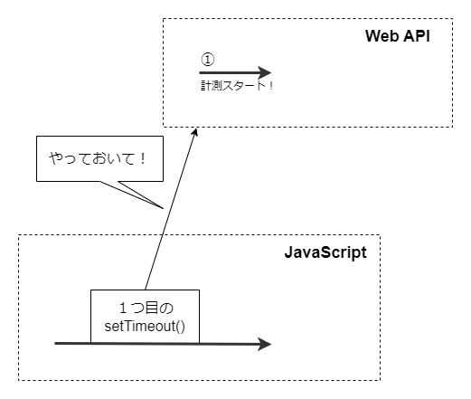

# JavaScriptの非同期処理を学ぶ

JavaScriptの学習者を悩ませる鬼門として**非同期処理**が挙げられます（JavaScriptにおいては最難関の要素だと思っています）。

コールバック、`Promise`、`async/await`を一通り勉強すれば書けないこともないのですが、その裏側の仕組みまで知ろうとするとかなり大変です。普通の入門書ではその辺まで扱っていません。

実際、非同期処理の仕組み、理解はかなり難しく、私自身も「理解できたで！」→「分かってなかったわ、、、」というサイクルを何度も何度も繰り返したのち、「一応分かったわ🙄」という所まで来ました。

そして非同期処理に関しては記述量が膨大なため、「JavaScript中級者を目指す」から飛び出し、「JavaScriptの非同期処理を理解する」というシリーズにまとめることにしました。


今回はコールバック関数、Promise、async/awaitという3つの構文をざっと眺めていきます。

## 上から順番に処理してくれない

同期処理は**コードを順番に処理していきます**。あるコードの実行が開始されれば、その実行が終わるまでは次のコードの処理は始まりません。

以下のコードは同期処理の例です。

```javascript
consoel.log(1);
consoel.log(2);
consoel.log(3);
```

何の変哲もないコードですが、これが同期処理の例です。出力結果は、、、分かりますね？

```console
1
2
3
```

上に書いたものから順番に処理されていきます。

次に非同期処理の例を見てみます。恐らく非同期処理について調べたことのある人なら1000回くらい目撃している例です（見飽きたとか言わないでください）。

```javascript
setTimeout(() => {
  console.log(1)
}, 1000)

setTimeout(() => {
  console.log(2)
}, 1000)

setTimeout(() => {
  console.log(3)
}, 1000)
```

やりたいことは以下の通りです。

1. 1秒後、コンソールに`1`を出力する
2. `1`が出力されてから1秒後、`2`を出力する
3. `2`が出力されてから1秒後、`3`を出力する

ここで`setTimeout()`について簡単におさらいします。

第1引数には、タイマーが完了した後に実行したい関数を渡します。ここでは`console.log(1)`を実行する無名関数を渡しています。そして第2引数で数値（ミリ秒）を渡し、タイマーの時間を設定します。ここでは`1000`を渡しているので、タイマーは1秒という事になります。

で、上記で紹介したコードが実際にどういう動きをするかというと、、、

```javascript
// 約1秒経ってから、1, 2, 3が一気に出力される
1
2
3
```

このように、意図した通りにコンソール出力されません。実行して約1秒後に`1`が出力されるのは狙い通りですが、直後に`2`と`3`が出力されてしまいます。

詳しいことは次回以降に説明しますが、これは`setTimeout()`が**非同期API**であるためです。

JavaScriptでは、時間のかかる処理を自分で処理せず、**Web API**というAPIに投げます（`setTimeout`もWeb APIです）。これはECMAScriptの機能ではなく、JavaScriptの実行環境（ブラウザーなど）が提供する機能です。

今回の例で言うと、プログラムが実行された後、即座に`setTimeout(() => console.log(1), 1000)`が実行されます。そしてこの関数はWeb APIに投げられ、WebAPI側でタイマーがスタートし時間を計測します。



最初の関数をWeb APIに投げた後、即座に`setTimeout(() => console.log(2), 1000)`が実行されます。「時間のかかるやつは他に投げて、先に進むよー」ということです。

## コールバック関数

では狙い通りに出力するようにコードを書き換えてみます。`setTimeout()`の中で`setTimeout()`を呼び出します。いわゆるコールバックというやつですね。「コールバック関数」は、「関数に渡す関数」を指します。

```js
setTimeout(() => {
  console.log(1)

  setTimeout(() => {
    console.log(2)

    setTimeout(() => {
      console.log(3)}
    , 1000)}
  , 1000)}
, 1000);
```

https://qiita.com/nuko-suke/items/5b16ab9de402547c5797

https://www.mitrais.com/news-updates/asynchronous-in-javascript/

https://towardsdev.com/event-loop-in-javascript-672c07618dc9

https://zenn.dev/redpanda/articles/ef719c7e592327
