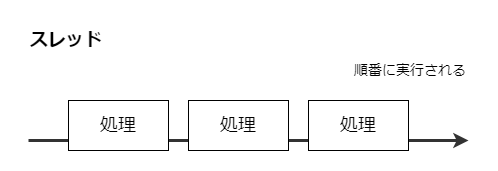

## スレッド

順番に処理されます。

これが複数敷かれているのがマルチスレッドと呼ばれるもので、並列処理が可能です。

JavaScriptの実行環境においてはメインスレッドと呼ばれるものがほとんどの処理を担っており、シングルスレッド環境であると言えます。

では、`setTimeout`などを使用した非同期処理を実行する場合、JavaScriptはどのようにこれを実現しているのでしょうか？まるで別のスレッドが立ち上がり、そこで〇〇秒待機しているように見えます。

実は、別々に処理が行われているという点では間違いありません。setTimeoutを実行する時、JavaScriptは後述する**Web API**にその処理を任せます。

JavaScriptはメインスレッドのみを使用し同期処理を行い、JavaScriptの実行環境が提供するWeb APIと協力し合って非同期処理を実現している、と言えます。

## Web API

例えば、皆さんお馴染みの`console.log`や`setTimeout`は**実行環境のAPIが提供する機能**であり、ECMAScriptでは規定されていません。

API側の仕様を確認してみましょう。Node.jsの`console.log`であれば[こちら](https://nodejs.org/dist/latest-v18.x/docs/api/console.html#consolelogdata-args)、`setTimeout`であれば[こちら](https://nodejs.org/dist/latest-v18.x/docs/api/timers.html#settimeoutcallback-delay-args)で記載されています。

逆に、Promiseや`async/await`はECMAScriptで規定されています。Promiseについては[こちら](https://tc39.es/ecma262/multipage/control-abstraction-objects.html#sec-promise-objects)、asyncについては[こちら](https://tc39.es/ecma262/multipage/ecmascript-language-functions-and-classes.html#sec-async-function-definitions)から確認できます。

[JavaScriptの非同期処理を並列処理と勘違いしていませんか？ - Qiita](https://qiita.com/klme_u6/items/ea155f82cbe44d6f5d88)

つまり、JavaScriptは（単独ではなく）他の機能と一緒になって非同期処理を実現している、と言えます。

# 同期処理

コードの上から順番に実行していく処理方法。コードを見て処理が追いやすいメリットがあるが、ある処理に時間がかかると後続の処理がその分遅れるというデメリットがある。

# 非同期処理

ある処理の完了を待たずに後続の処理を進められる。先述したようなブロックはなくなるが、コードが複雑になる。

同期処理、非同期処理はmainスレッドをストップさせずに別の処理を行えるかどうかという所が違う。

JavaScriptはシングルスレッド（mainスレッド）で処理を行う。シングルスレッドであり、すなわち（後述する）コールスタックも一つしかない。

## スレッド

> スレッドとは、連続して順番に何かしらの処理が実行される流れのことです。

<blockquote>
  JavaScriptを実行するブラウザには、いろんなスレッドがあります。

  - メインスレッド
  - サービスワーカー
  - Webワーカー
</blockquote>

### メインスレッドが文字通りメイン

メイン、というだけあって、メインスレッドがJavaScriptの処理のほとんどを担っています。ユーザーイベントや画面の描画などですね。他にもService workderやWeb workderとかいうややこしい名前のスレッドもあり、そこに処理を投げることもできますが、今は忘れましょう。

そして、このメインスレッドは**一つしか存在しません**。

時間がかかるような処理はAPIに渡します。「APIの方でやっといて。こっち（スレッド）では先に処理を進めとくから」というイメージです。スレッドとWeb APIで**並行処理**ができるわけですね。

「時間のかかる処理をAPIに投げる！終わったらmainスレッドに戻す！」というイメージです。

> JavaScriptはこの問題を非同期関数、同期関数、キュー・タスクによって解決します。

JavaScriptは

- コールスタック
- タスクキュー
- API（Web APIと呼ばれる）
- イベントループ

などといった機能によって処理が行われます。

## コールスタック

関数が積まれます。

## Web API

APIと言えば

`setTimeout()`はWeb APIに処理内容を渡し、コールスタックからポップされます。コールスタックとWeb APIは連動しているわけではない。

> 非同期処理のメリットは、JavaScriptのスレッドでやらなくてもいいジョブを外部にやらせてる間に、スレッドは自分のジョブを進められることです。

> setTimeout()は設定した時間後にコールバック関数を実行するのではなく、正確には設定した時間後にコールバック関数をタスクキューに渡すAPIです。

JavaScriptの実行環境には様々なものがある。例えばブラウザーであれば

- Google Chrome、Microsoft Edge（v8）
- Firefox（SpiderMonkey）
- Safari（JavaScriptCore）

といった具合。また、ブラウザー以外にもJavaScriptの実行環境があり、

- Node.js、Deno（v8）
- Bun（JavaScriptCore）

などが挙げられる。

同期APIと非同期APIがある。

まずは**キュー**というものへの関数の登録が行われます。記述された順番通り、`log(1)`、`setTimeout()`、`log(3)`の順番でキューへの登録が行われます。**先入れ先出方式**をイメージしてください。

まずは`log(1)`が実行され、`1`がコンソール出力されます。続いて`setTimeout()`が実行され、`log(2)`が**タイマーに登録されます**。続いて`log(3)`が実行され、`3`がコンソール出力されます。

そして、`log(2)`がタイマーに登録されてから1秒後に`log(2)`がキューに登録されます。これは登録されてからすぐに実行されますので、`2`がコンソール出力されます。

という流れを経て、`1`→`3`→`2`という、非同期処理を知らなければ意味不明な順番で処理されるのです。

この一連の流れの中で、「タイマーに`log(2)`を渡し、**先に`log(3)`を実行する**」という部分こそが非同期処理であると言えます。

## JavaScriptはシングルスレッド

なぜこんな**非同期処理**なるものが存在してるかというと、JavaScriptが**シングルスレッド**処理を行っているためです。

### スレッドって何？

そもそも**スレッド**とは、「処理が行われる流れ」です。(要修正)一つのスレッドでは、（同時に）一つの処理しか行えません。

シングルスレッドは名前の通り、「スレッド一つだけで処理を行っている」ということです。

下図で言うと右に向かっている矢印がスレッドだと捉えてください。プログラムの実行環境にスレッドは一つしか存在しておらず、`処理A`と`処理B`は**同時に**実行することができません。`処理A`が完了するのを待って`処理B`を処理することになります。

これに対して**マルチスレッド**という処理方式もあります。スレッドが複数存在しており、それぞれのスレッドが別個に処理を行えます。

これだけ見るとマルチスレッドの方が処理速度が速くて良さそうですが、

- 同期処理の難しさ（期待した順番通りに処理を行えるか？）
- スレッドの分だけCPUリソースを消費する

といったデメリットも存在します。なので一概にどちらの処理方式の方が優れている、などと論じれるものではありません。

JavaScriptは並列処理ができないということ。

仕組みとして、キューというものが存在します。そのキューに関数を登録していき、先入れ先出方式で順番に処理されていきます。でも、キューに登録する順番を工夫することで非同期処理を実現できます。

## まとめ

今回の内容を大雑把にまとめると以下のようになります。

- JavaScriptはシングルスレッドで実装されている
- シングルスレッドでも並列っぽく処理できるよう、**イベントループ**を採用している

## 参考

[非同期処理:コールバック/Promise/Async Function | #jsprimer](https://jsprimer.net/basic/async/)

[JavaScriptの同期、非同期、コールバック、プロミス辺りを整理してみる - Qiita](https://qiita.com/YoshikiNakamura/items/732ded26c85a7f771a27)

[【図解】1から学ぶ JavaScript の 非同期処理 - Qiita](https://qiita.com/ryosuketter/items/dd467f827c1b93a74d76)

[Node.jsの非同期I/Oについて調べてみた - Tech Blog - Recruit Engineer](https://engineer.recruit-lifestyle.co.jp/techblog/2019-12-13-node-async-io/)

[JavaScript のスレッド並列実行環境](https://nhiroki.jp/2017/12/10/javascript-parallel-processing)

[15分で理解するJavaScriptのイベントループ - Qiita](https://qiita.com/l1lhu1hu1/items/57dcc7cb867eee951f36)

https://juncleit.com/?p=185

https://speakerdeck.com/task4233/why-can-javasctipt-invoke-asynchronous-in-single-thread?slide=22

http://site.oukasei.com/?p=193

https://aik0aaat.hatenadiary.jp/entry/2021/10/17/224844
