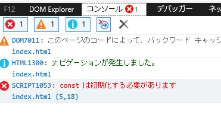

# この構文って使える？

[このページ](https://blog.toriwatari.work/JavaScriptAdvance/02/)でECMAScriptについて説明しました。

ECMAScriptという**仕様**を見てブラウザベンダが**実装**していくわけですが、その実装状況には当然ばらつきがあります。実装する時期も、実装するかもしないかもあくまでベンダ次第という事です。

ここでややこしいのが、単純に「このブラウザのバージョン〇〇はES2020まで対応している」と一概に言えるわけではないということです。

あるブラウザで、「ES2020で追加された〇〇の機能は実装されてるけど、ES2018の××の機能はまだ実装されていない」という風に、部分的に対応しているということがあるのです。

このことを示すある実験をしてみたいと思います。レッツハンズオンです。

## IE11でできること、できないこと

ここで、**レガシーブラウザ代表**としてIE11さんに登場してもらいます（このページではさん付けで呼ばせていただきます）。IE11さんはES2015の構文をどれだけ使えるのでしょうか。

### const、letは部分的に使える

ES2015から登場したものの代表格として、変数宣言時の`let`、`const`キーワードが挙げられます。ES5までは`var`キーワードを使って変数宣言をしていました。

いかにも使用できなさそうな構文ですが、実は使用できます。

以下のようなhtmlファイルを用意し、IEで読み込ませ、コンソール画面を開きます。`const`と`let`を使用し、変数宣言しています。

```html
<!DOCTYPE html>
<script>
  const name = "kento";
  let age = 18;
  console.log(name, age)
</script>
```

すると、ちゃんと変数の中身が出力されました。変数宣言において`const`と`let`は使えるんですねー。


しかし、`for in`ループにおいて`const`を使用するとシンタックスエラーになります。

```html
<!DOCTYPE html>
<script>
  const myObj = {a: 1, b: 2}

  //プロパティを格納するkey変数をconstで宣言
  for (const key in myObj) {
    console.log(key, myObj[key])
  }
</script>
```

`constは初期化する必要がある`と怒られてしまいました。



### class構文は使えない

このことから、IE11さんはES2015の仕様の中で実装してる機能と実装していない機能がある、ということがわかります。

今となってはIE11さんがどこまで対応しているかを考える必要性は低いと思うので検証はこれくらいにしておきますが、他のブラウザでも、程度の差はあれど同じようなことが起こっているのです。

## 使用可能かどうかを確認しよう

もちろんこんなのを1個1個憶えていくわけにはいかないので、Webサイトを見て確認することになります。

まずは[ECMAScript 2016+ compatibility table](https://kangax.github.io/compat-table/es6/)を見てみましょう。このサイトは、各ブラウザがECMAScriptのどの機能を実装しているかを教えてくれるサイトです。

https://kangax.github.io/compat-table/es6/
