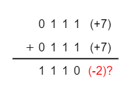
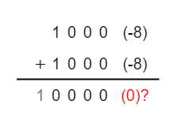

# ２の補数

## 2の補数の求め方

全ビットを反転し、1を足すだけです。

4bitであれば、`-8`から`7`までを表現できます。

|10進数|2の補数での表現|
|---|---|
|

`3`を`-3`に変換するには、`3`の全ビットを反転し、`1`を足すことで求められることを確認してください。

A - Bという引き算を、A + -Bという足し算に変換することで求めることができます。

## いくつか計算してみる

それではとり得る4つのパターンで2の補数を使用した計算をしてみます。

- 最上位ビットの繰り上がりが発生した場合、それを無視する
- 

## 計算できない例

先述した通り、4bitでは2の補数を用いて`-8`から`7`までを表現できるので、計算結果がこの範囲外になるような計算は行えません。このように範囲外の数値が発生することを**オーバーフロー**といいます（聞いたことありますよね）。

### `7 + 7`

7 + 7は14ですね。4bitで表現できる範囲を超えているので、2の補数での計算では求められないことを確認します。

`7`は`0111`です。これを足すと`1110`ですが、4bitの2の補数においては、これは`-2`を表します。

なお、8bitの演算であれば、同然正しい結果を得ることができます。8bitであれば計算結果は`00001110`であり、最上位ビットが`0`であるため、`14`を表します。

### `-8 + -8`

続いて、`-8 + -8`を考えます。答えは`-16`ですが、これもオーバーフローが発生し、正しい計算結果が得られません。

`-8`は`1000`ですね。これを足すと`0000`（繰り上がった`1`は切り捨てるため）ですが、これは文字通り`0`ですのでオーバーフローが発生し正しい結果が得られていないことがわかります。

こちらも8bit演算であれば、当然正しい答えを得ることができます。

まず、`8`を8bitで表すと`00001000`です。これを全ビット反転すると`11110111`であり、これに1を加えると`11111000`です。これが`-8`ですね。

これを足すと答えは`11110000`で`-16`です。念のため、この`11110000`を判定し1を足すと`00010000`になり、`16`であることがわかります。

http://my-web-site.iobb.net/~yuki/2017-06/algorithm/overflow/

