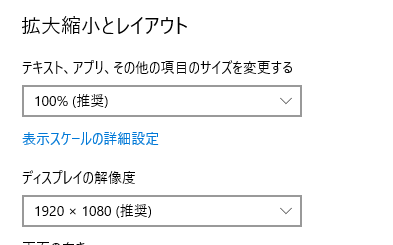
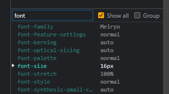
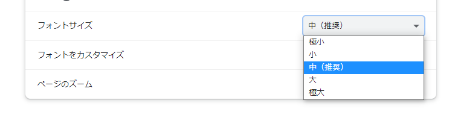

# pxなのかremなのか

いささか語りつくされた感のあるネタですが、世には「font-size、pxを使うかremを使うか問題」があります。この話題について食傷気味の方も多いと思いますが、私は勉強不足のため、そもそもこの議論に参加する資格すらない人間であることが判明しました。

なので今回はこれをテーマに記事を書きました。結論は「どちらかと言うとremを使った方が良さそう」です。

## font-sizeをpxで指定する

一番シンプルで分かりやすい単位です。いわゆる**絶対単位**と呼ばれるものですが、絶対と言いながら大きさが変化することがありますので、念のため確認しておきます。以下のようなCSSを用意して検証しました。

```css:title=style.css
p {
  font-size: 16px;
}
```

1つ目はブラウザーの拡大/縮小機能を利用した時です。Google Chromeなら`Ctrl + +`や`Ctrl + -`で変化する倍率のことですね。`px`を利用していようが、文字の大きさは変化します。

2つ目はWindowsのOSの機能でテキストのサイズや解像度を変更した時です（Macは持ってないので分かりません）。この時も大きさは変化します。



ここまで「文字の大きさが変化する」と述べてきましたが、正確に言うと「ディスプレイに描画される文字の大きさが変化する」という意味です。上記設定を行いブラウザーのデベロッパーツールで確認すると、`font-size`は16pxから変化していないことがわかります。下記画像はブラウザーの倍率を150%に上げた時の`font-size`の値です。



逆に、設定変更が適用されない場合もあります。それが、ブラウザーの持つフォントサイズを変更させる機能を適用した場合です。Google Chromeであれば、右上の点が3つ並んだボタン→「設定」→「デザイン」へ進むと「フォントサイズ」が変更できます。



例えば、視力が弱い人がフォントサイズを「大」と設定しているとしましょう。このサイトを訪れても文字サイズは変化せず、そのまま閲覧を続行するか、`Ctrl + +`でブラウザーの倍率を上げるか、ページから離脱してしまう、などが考えられます（元からOSの設定で倍率を上げている可能性もありますね）。アクセシビリティのことを考えるならば、ここは変化してほしい所です。

## font-sizeをremで指定する

`rem`はルート（html要素）の`font-size`を基準とする相対的な単位です。html要素の`font-size`は`medium`がデフォルトで設定されていて、多くのブラウザーでは16pxが適用されます。例えばp要素で`font-size: 1rem`としたら16pxで描画され、`font-size: 1.5rem`としたら16pxの1.5倍の24pxで描画されます。

```css:title=style.css
html {
  /* 何も記述しない */
}

.text {
  font-size: 1rem; /* 16px */
}

.text2 {
  font-size: 1.5rem; /* 24px */
}
```

`rem`で指定した場合、ブラウザーの拡大/縮小機能やOSの解像度変更の場合はもちろん、**ブラウザーのフォントサイズを変更した場合にも文字は大きくなります**。これが`px`と違うところです。


冒頭で「どちらかと言うとremを使った方が良さそう」と述べましたが、その理由はこれです。まぁ本心では「`px`でも`rem`でもどちらでもいい」と思っているのですが、この、ブラウザーのフォントサイズ変更で文字の大きさが変わる、という1点において「`rem`を使用する」としました。


ただ、文字通り変更されるのは文字だけですので、レイアウトが崩れる原因になるのではという声もよく耳にしました。

例えばこのブログのような、文書メインのサイトであればブラウザーの文字サイズ変更によるレイアウト崩れの影響は少ないでしょう。

しかし、利用者からしてみればレイアウトが崩れようが何だろうが、文字がちゃんと読めるのが最低条件であり、それを優先すべきとは思います。

## 参考

[html { font-size: 62.5%; } は嫌いだ - デフォルトを変更するのは悪手です - Qiita](https://qiita.com/mrd-takahashi/items/8396d84bd2c52ab1cf3e#%E6%9C%80%E5%96%84%E6%89%8B%E3%81%AF%E6%99%82%E3%81%AE%E6%B5%81%E3%82%8C%E3%81%A8%E5%85%B1%E3%81%AB%E6%82%AA%E6%89%8B%E3%81%AB%E8%90%BD%E3%81%A1%E3%82%8B%E4%BA%8B%E3%82%82%E3%81%82%E3%82%8B)

[[CSS] ピクセルは1画素を表していない 実はすべて実寸基準 ptもpxも同じ基準 | Ouka Studio](http://site.oukasei.com/?p=2332)

[&lt;html&gt;のfont-sizeを62.5%と指定するのはどう考えても間違っている - Qiita](https://qiita.com/NagayamaToshiaki/items/77e929d855d052863a85)

[「font-sizeの指定はpxとremどちらを使うべきか？」問題に対する回答](https://zenn.dev/tak_dcxi/articles/26280e7607bcd2)

[闇雲なrem信仰に物申す | CAMP](https://to.camp/lesson?v=syr7IVIVoL7ZIoPVuHps)

[【CSS】pxとremどちらを使うか問題に対して感じたこと | JavaScriptに関するお知らせ](https://jsnotice.com/posts/2020-07-20/)

[CSSの単位px、em、remはどれをどこで使用するのがよいか、ピクセルとアクセシビリティにおける意外な真相 | コリス](https://coliss.com/articles/build-websites/operation/css/about-pixels-and-accessibility.html)

[本当はややこしい px の話](https://zenn.dev/ojk/articles/web-resolution)

[Accessible Font Sizing, Explained | CSS-Tricks - CSS-Tricks](https://css-tricks.com/accessible-font-sizing-explained/)

[How to make your font sizes accessible with CSS](https://whitep4nth3r.com/blog/how-to-make-your-font-sizes-accessible-with-css/)

ハック的に以下のようにルートのサイズを変更する手法もあり、そこそこ広まっているようです。

```css
html {
  font-size: 62.5%;
}
```

かくいう私も、以前は妄信的に`font-size: 62.5%`を指定していましたが、色々考えた結果やめることにしました。
