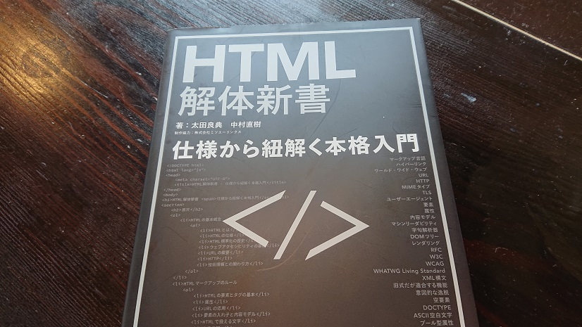

# 「HTMLとか簡単ｗｗｗ」とか言うな👿

HTMLについてはこれまで、

- ・「HTMLｗｗｗ中学生の時に3日でマスターしたわｗｗｗ」
- ・「あーｗHTMLねｗｗｗテキトーにパパッとやっといてよｗｗｗ」
- ・「タグで囲うだけやんｗｗｗ」
- ・「HTMLとかプログラミング言語ですらなくて草」

という声を聞いてきました（幾分誇張しています）。

2022年、そんなことを言う奴らに読ませたい本が2冊出版されました。

世に存在するHTML（とCSS）の本といえば、そのほとんどが「サンプルのWebサイトを作りながらHTMLとCSSを学習する」という構成になっています。

しかしこの本は違います。表紙にもある通り、

HTMLの各要素を仕様に沿って解説する本です。サンプルWebサイトを作るというようなことはこの本ではしません。よって、完全なHTML初心者向けの本ではありません。故に、ある程度しかHTMLを触った経験がない人、セマンティックやアクセシビリティという言葉を知らない人が読んでも、知識の羅列を咀嚼することはできないと感じました。「2冊目に読むといい」と言った紹介文もどこかで見ましたが、2冊目でも難しいかも知れないと個人的には思います。

確かに仕様書というのはなんとも読みにくく、MDNならまだしも、初心者の内からWHATWGの[HTML Living Standard](https://html.spec.whatwg.org/multipage/)を読む人なんていないでしょう。この本はHTML初心者からの脱却の助け、そして仕様書を読めるようになるための足がかりとなると思います。

## 本の構成

### CHAPTER1 HTMLの基本概念

HTMLの基礎知識はもちろん、HTMLの成り立ちやウェブアクセシビリティ、URLやHTTPについてざっとまとめられています。

私が特に好きなのが「HTML標準化の歴史」というパートです。HTMLの誕生から標準化が行われ、現在のHTML Living Standardに一本化されるまでの経緯がまとめられています。私はこういう歴史ものというか、技術ではないけど読み物的なものが好きなのでこの辺りは興味深く読めました。

### HTMLマークアップのルール

マークアップに関して細かいルールまで記載されています。

### CHAPTER3 HTMLの主要な要素

各要素に対しての解説がなされています。この章が一番長いです。

特に、各要素の具体的な使われ方が記載されていたのが助かりました。使い方がイマイチ分からなかった要素に関しても、その謎が解決できるかもしれません。また、「仕様はともかく、実際に使用していけるのか？」という所にも焦点が当てられて、著者なりの意見まで記されていてGoodです。

さらに、「アクセシビリティの注意点」として、デフォルトのARIAロール、スクリーンリーダーにおける想定される扱われ方、などの解説があります。

### 主要な属性とWAI-ARIA

WAI-ARIAについては、60ページほどページを割いてしっかり解説されています。HTMLの参考書でここまでアクセシビリティについて取り上げているのも珍しいのではないでしょうか。

恥ずかしながら私は知らないことだらけでしたので、勉強した内容はまたいつか記事に使用と考えています。

## HTMLを勉強するモチベーション

私は、HTMLというのは現在のWebにおいて土台となるものであり、担当領域がフロントエンドだろうがバックエンドだろうが軽視していいものではないと考えています。そんな中、（Web黎明期やテーブルレイアウトの時代ならいざ知らず）現代のHTMLを「使いこなせる」と言える人がどれだけいるのでしょうか（私はまだまだ言えません）。

Web開発と言えばReact、Vue.jsといった格好よくて高性能なライブラリーやフレームワークが沢山あります。仕事を得るという意味ではこれらの技術を学習するのはとても有意義であることは間違いありませんが、スキルアップという意味では、HTMLやJavaScriptの知識、セマンティックやアクセシビリティ、HTTPやブラウザーの仕組みなど、ベースとなる知識の習得を優先すべきではないかと思います。

私に関して言えば、覚えも悪くプログラミングの適性もないだろうことは薄々感じています。ReactだのGatsbyだのVue.jsだのSvelteだの最新のフレームワークで遊んでいた時期もありましたが、勉強する順番が違ったなと反省している最近です。

HTMLはW3C管轄の時と違い、**常に**更新されています。これだけの仕様を理解し、最新の情報もキャッチアップできれば他のエンジニアとの差別化になる、というのが私がHTMLを勉強するモチベーションです。

## 余談ですが

「HTMLについてちゃんとしたことを学びたい」という方は**HTML5プロフェッショナル認定試験**の受験をお勧めします。

この試験はレベル1とレベル2に分かれており、レベル1でHTMLとCSSに関する問題が出題されます（レベル2ではJavaScriptに関する問題が出題されるようです）。

資格名は「HTML5」と冠していますが、[その有効性はこれからも変わらないでしょう](https://html5exam.jp/measures/column_01.html)。私も勉強しましたのでお勧めです（資格は取っていません）。

## 最後に

CSS解体新書を出してほしい。

## 参考

[書籍「HTML解体新書」、満を持してついに登場 - 弁護士ドットコム株式会社 Creators’ blog](https://creators.bengo4.com/entry/2022/04/04/120000)

[Web Hypertext Application Technology Working Group (WHATWG)](https://whatwg.org/)

[MDN Web Docs](https://developer.mozilla.org/ja/docs/Web)

[whatwg/html: HTML Standard](https://github.com/whatwg/html)
