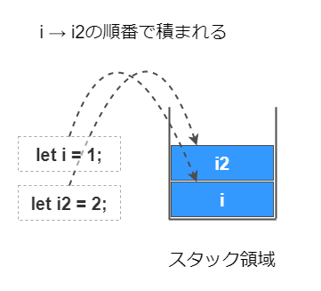
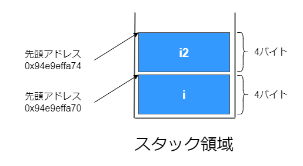
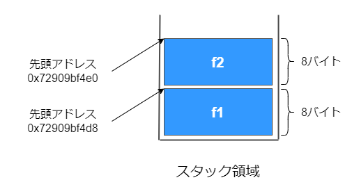
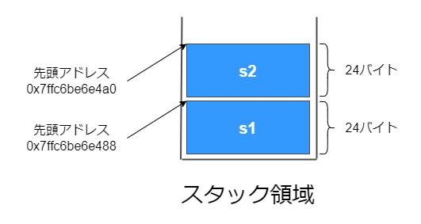
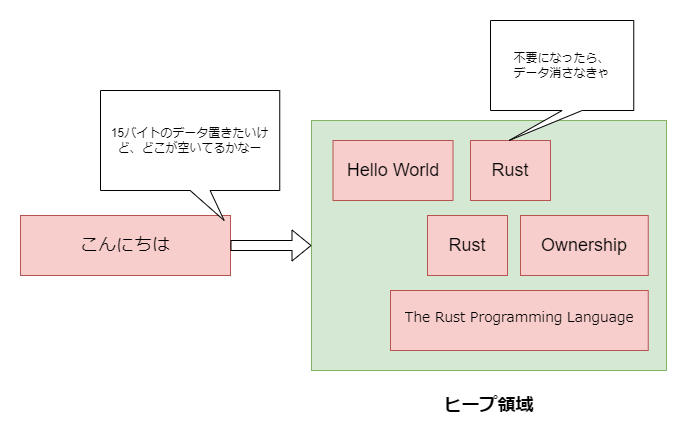
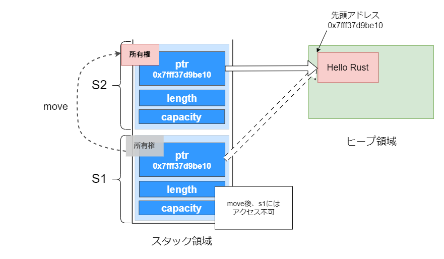

# 所有権なんか知らん

Rustにおける**所有権**とは、**メモリーを安全に管理するため**の機構です。メモリーに保存された値には**所有者**と呼ばれる変数が設定されます。所有者はある一時点において必ず一人（つまり一つの変数）であり、所有者がスコープから外れるなど不要になったら、所有者がメモリー上の値を破棄します。

```rust
{
    // メモリーに「Hello Rust」が格納される
    // 文字列「Hello Rust」の所有者は変数str
    let str = String::from("Hello Rust");
    println!("greeting : {}", str);
}
// 所有者であるstrがスコープを抜けることで、メモリーの「Hello Rust」が破棄される
```

この所有権についてざっと調べてみましたので記事にします。所有権とは直接関係ない所へ話が逸れている箇所が点在しています。また、初学者の学習メモで微妙に分かっていない部分もありますがその辺は悪しからず。

## メモリー

所有権の話には**メモリー**が絡んできますので、まずはそこから学習します。

Rustはメモリーを以下のように大別し利用します。

- ① 静的領域
- ② テキスト領域
- ③ スタック領域
- ④ ヒープ領域

①の静的領域には、グローバル変数や文字列リテラルが格納されます。また、②のテキスト領域には、コンパイル時に生成されたバイナリーコードが格納されます。静的領域とテキスト領域は今回のお話には登場しないので忘れることにします。

③のスタック領域には、関数内のローカル変数など**コンパイル時点で必要なメモリーのサイズが判明する**データが格納されます。スタック領域はいわゆる**後入れ先出し方式**でデータを管理しており、容量は限られているものの高速なアクセスが可能です。このスタック領域も今回のお話ではそんなに登場しません。

そして、残る④の**ヒープ領域**には**コンパイル時に必要なメモリーのサイズが分からない**データが格納されます。例えば`String`や`Vec`などがそれにあたります。

## スタック領域

繰り返しになりますが、スタック領域には**コンパイル時**に必要なメモリー領域のサイズが分かるデータを格納するのに対し、ヒープ領域にはコンパイル時にデータサイズが分からない（言い方をかえれば**実行時に**必要なサイズが分かる）データを格納します。

スタックは**積み上げ**などと訳されますが、以下の画像のような細い箱のイメージです。スタック領域にデータを保存するときは1番上に積み上げます。データを取り出す時は1番上から取り出します。


今回の記事のテーマとは直接関係ありませんが、Rustにおいてスタックにデータが積まれるというのがどのような感じか、試してみたいと思います。

---

Rustでは、データ型によってデータがスタックに積まれるかヒープに格納されるかが決まります。スタックに積まれるデータ型として、今回は数値を表す`i32`と`f64`を例にとります。

`i32`は32bit、つまり4バイトでデータを表現します。以下のように変数に値を束縛すれば、型推論が働き`i`と`i2`は共に`i32`型となります。

```rust
fn main() {
    // 共にi32型
    let i = 1;
    let i2 = 2;
}
```

このコードであれば、まず`i`がスタックに積まれ、次に`i2`がスタックに積まれることになります。



これらの変数が積まれているスタックのアドレスは、以下のようにして出力します。変数名に`&`をつけることでそのデータの先頭アドレスを得ることができます。また、`println!`では`{:p}`とすることでポインターの形で整形し出力することができます。

```rust
fn main() {
    let i = 1;
    let i2 = 2;

    println!("1: 変数iのスタック上のアドレス : {:p}", &i);
    //=> 1: 変数iのスタック上のアドレス : 0x94e9effa70

    println!("2: 変数i2のスタック上のアドレス : {:p}", &i2);
    //=> 2: 変数i2のスタック上のアドレス : 0x94e9effa74
}
```

実際に出力される値は、その時々によって変わることに注意します。さて、アドレスの末尾に注目すると、`i`が`70`、`i2`が`74`となっていて、4バイトのずれがあることが読み取れます。上記のコートで取得できるアドレスは、正確にはデータの先頭アドレスを指しているため、これを図解すると以下のようになっていると考えられます。



続いては`f64`を試します。`f64`は64bit、つまり8バイトでデータを表現します。`i32`の時のようにアドレスを出力すると、アドレスに8バイトのずれがあることが予想されます。

```rust
fn main() {
    // f64と推論される
    let f = 1.0;
    let f2 = 2.0;

    println!("3: 変数fのスタック上のアドレス : {:p}", &f);
    //=> 3: 変数fのスタック上のアドレス : 0x72909bf4d8

    println!("4: 変数f2のスタック上のアドレス : {:p}", &f2);
    //=> 4: 変数fのスタック上のアドレス : 0x72909bf4e0
}
```

今回は`f`の末尾が`d8`、`f2`の末尾が`e0`という結果になりました。16進数なのでちょっと分かりにくいですが、`e0 - d8`を計算すると10進数で`8`になります。

続いて、配列も取り上げます。Rustにおいて配列は変更不可であり、それゆえコンパイル時にデータサイズが決まっており、それゆえ各要素が配列に積まれていきます。

```rust
fn main() {
    let arr = [1, 3, 5];

    for (index, num) in arr.iter().enumerate() {
        println!("配列arrの{}番目の値 {}", index + 1 , num);
        //=> 配列arrの1番目の値 1
        //=> 配列arrの2番目の値 3
        //=> 配列arrの3番目の値 5
    };
}
```

以下のようにして、スタックに積まれているデータのアドレスを得ることができます。

```rust
fn main() {
    // [i32; 3]と推論される
    let arr = [1, 3, 5];

    println!("配列arrの1番目の値のスタックアドレス {:p}", &arr[0]);
    println!("配列arrの2番目の値のスタックアドレス {:p}", &arr[1]);
    println!("配列arrの3番目の値のスタックアドレス {:p}", &arr[2]);
    //=> 配列arrの1番目の値のスタックアドレス 0x8d514ff814
    //=> 配列arrの2番目の値のスタックアドレス 0x8d514ff818
    //=> 配列arrの3番目の値のスタックアドレス 0x8d514ff81c
}
```

配列の各要素は`i32`型と推論され、4バイトで表現されます。私が実行すると、末尾が`14`、`18`、`1c`となりました。それぞれの差は4です。

---

スタックの**後入れ先出し**という性質上、「どこにデータを積むか」「いつどのデータを開放するか」といったことを考える必要はありません。「一番上」を表すアドレスをどこかに保存しておいて、そこに積んでそこから取り出せばよいです。それゆえ高速に処理でき、人間が考えてメモリーを管理する必要はありません。

## ヒープ領域

対するヒープ領域にはスタックの様な順番はありません。以下の図のように、その時々で空いている場所を探しデータを保存し、使い終わったら解放するイメージです。



逆に言うと、どのようなデータがどのようなタイミングでどこに保存されるか、そしていつ解放されるかがスタックのように機械的には分かりません。そのため、何らかの仕組みを使ってこのヒープ領域を管理する必要があります。これはとても難しそうですね。

### C

Cでは、プログラマーがコード上で`malloc`や`free`といった関数を用いてヒープ領域を確保/解放します。

`malloc`は「memory allocation」の略です。allocationは「割り当て」といった意味ですから、言葉通りメモリーの割り当てを行う、という関数ですね。

```c
char *p;
// ポインター変数pにはヒープ領域の先頭アドレスが格納される
p = malloc(20)
```

この「プログラマーが」というところがポイントで、適切にメモリー管理を行えないと**メモリーの多重開放**や**不正領域へのアクセス**など重大なエラーが発生します。「自由には責任が伴う」とは正にこのことですね。

例えば、Androidは大部分がC/C++で書かれていたようですが、**メモリー安全性に関する問題が脆弱性の多くを占めていた**ようです。

参考 : [Rustの採用が進んだ「Android 13」、メモリ破壊バグは減少、脆弱性の深刻度も低下傾向 - 窓の杜](https://forest.watch.impress.co.jp/docs/news/1462573.html)

ちなみにネタバレすると、Rustでは`malloc`や`free`などを用いてヒープ領域を管理することは基本的にできません（unsafeな処理が必要）。

### JavaScript

JavaScriptではガベージコレクション（以下、GC）という言語処理系の機構を用いて、ヒープ領域を管理します。例としてJavaScriptを挙げますが、近代のほとんどのプログラミング言語はGCを用いてヒープ領域を管理していると思われます。

Cのように、人間が明示的にメモリーを確保/解放するという命令を出さなくても、GCがOSと協力してメモリーを管理してくれます。

参考 : [5分で分かるガベージコレクションの仕組み｜ITフリーランスをサポートする【geechs job(ギークスジョブ)】](https://geechs-job.com/tips/details/35)

「じゃあ全部の言語でGCにやらせたらええやん」となりそうですが、

- ・GCが走る分のコストがかかり、アプリケーションの実行速度が落ちたり、停止することさえある
- ・GCが走るタイミングは人間がコントロールできず、効率や速度の面で必ずしも最良とは言えない

といったweak pointがあり、高いレイヤーで動作するアプリケーションでは問題なくとも、レイヤーが低くなるに伴い問題になることが増えていくと思われます。

ちなみにネタバレすると、RustではGCを用いてヒープ領域を管理することはできません。

<aside>

何かとRustと対比されがちな**Go**もGCによってヒープ領域を管理しています。そういう意味ではGoはRustやCの代替になりえないことが分かります。

</aside>

### Rust

先述した通り、Rustは所有権という機構を使い、メモリーリソースの確保と解放を行います。プログラマーは所有権について意識する必要はありますが、ヒープ領域の確保と解放を明示的に行う必要はありません。

## 所有権

では所有権について、コードを書きながら確認していきます。所有権を司る仕組みが処理系内部でどんな風に動いているかは私も勉強できておらず分かりませんが、コードを書きながらその挙動を見ていきましょう。

```rust
fn main() {
    // 1. ヒープ領域に"Hello Rust"が格納される
    // 1. 変数s1が"Hello World"の所有者となる
    let s1 = String::from("Hello Rust");
} // 2. 変数s1がスコープから外れ、ヒープ領域の"Hello Rust"が破棄される
```

文字列を表すString型の例です。値`Hello Rust`が変数`s1`に束縛され、この時`Hello Rust`がヒープ領域に格納されます。同時に、`s1`が`Hello Rust`の所有者となります。

最終的に`s1`がスコープから外れた時点で、所有者である`s1`が責任を持ってヒープ領域の`Hello Rust`を破棄します。この仕組みならデータがずっとヒープ領域に残り続けることはありませんね。

しかも、人間が明示的に「`Hello Rust`を破棄しろ」と命令しているわけではなく、ソースコードの構造によって言語レベルでその処理が行われているところが素敵✨です。

## String型

ではここから所有権について掘り下げてみます。最初に、データがどのようにメモリーに格納されているかを確認してみます。

ヒープ領域にデータが格納されるデータ型として、先ほどと同じく`String`型を取り上げます。その名の通り、文字列を表すデータ型であり、以下のように定義します。

```rust
fn main() {
    let s1 = String::from("Hello World, I am Rustacean!");
    let s2 = String::from("Hello Rust");

    println!("s1の値 {}", s1);
    println!("s2の値 {}", s2);
}
```

さて、この`s1`と`s2`という変数（String構造体）は、ヒープ領域にある実データそのものではなく、実データを指している参照のようなものであり、スタックに積まれています。これも検証して図解してみます。

まずは、以下のようにして`s1`と`s2`のスタック上のアドレスを確認します。

```rust
fn main() {
    let s1 = String::from("Hello World, I am Rustacean!");
    let s2 = String::from("Hello Rust");

    println!("s1のスタックアドレスの値 {:p}", &s1);
    //=> s1のスタックアドレスの値 0x7ffc6be6e488

    println!("s2のスタックアドレスの値 {:p}", &s2);
    //=> s2のスタックアドレスの値 0x7ffc6be6e4a0
}
```

アドレスの末尾、`a0` - `88`をしてみると、10進数で24であり、`s1`、`s2`は24バイトの容量を持っていると思われます。`s1`、`s2`はスタックに積まれているので、図解すると以下のようになります。



この24バイトの正体は何なのでしょうか？

---

結論から言うと、この24バイトは「ヒープ領域にある実データの先頭アドレスを指すポインター（8バイト）」「データ長（8バイト）」「ヒープ領域に確保された領域のサイズ（8バイト）」という内訳になっています。[The Book](https://doc.rust-jp.rs/book-ja/ch04-01-what-is-ownership.html#%E5%A4%89%E6%95%B0%E3%81%A8%E3%83%87%E3%83%BC%E3%82%BF%E3%81%AE%E7%9B%B8%E4%BA%92%E4%BD%9C%E7%94%A8%E6%B3%95-%E3%83%A0%E3%83%BC%E3%83%96)の中では以下のように図示されています。左がスタックに積まれている24バイト、右がヒープ領域にある実データを表現しています。最初の8バイト（`ptr`）がヒープ領域の実データの先頭アドレスを指しているのが分かると思います。

<div style="width: 60%">


</div>

ではこの図をもう少し分かりやすく書き換えてみます。最初の8バイト、つまりヒープ領域にある実データの先頭アドレス指すポインターは以下のように`as_ptr()`を使って表示します。

```rust
fn main() {
    let s1 = String::from("Hello World, I am Rustacean!");
    let s2 = "Hello Rust".to_string();

    println!("s1のスタックアドレスの値 {:p}", &s1);
    //=> s1のスタックアドレスの値 0x7ffc6be6e488

    println!("s1のヒープ領域の実データの先頭アドレス {:p}", &s1.as_ptr());
    //=> s1のスタックアドレスの値 0x7fff37d9be10

    println!("s2のヒープ領域の実データの先頭アドレス {:p}", &s2.as_ptr());
    //=> s2のスタックアドレスの値 0x7fff37d9be60
}
```

これを図示するとこうなります（`s1`のみ図示します）。



続いて、データ長を格納している8バイトは`len()`で取得できます。s1はスペースも入れて28文字、s2はスペースも入れて10文字なので、以下のような出力になります。

```rust
fn main() {
    let s1 = String::from("Hello World, I am Rustacean!");
    let s2 = String::from("Hello Rust");

    println!("s1の実データのデータ長 {}", s1.len());
    //=> s1の実データのデータ長 28

    println!("s2の実データのデータ長{}", s2.len());
    //=> s2の実データのデータ長10
}
```

なお、出力されるのはあくまでデータ長であり、文字数をカウントしているわけではありません。Rustは文字列をUTF-8でエンコードしています。例えば`こんにちは`という文字列なら、1文字3バイトですので`15`が出力されます。

```rust
fn main() {
    println!("こんにちはのデータ長 {}", String::from("こんにちは").len());
    //=> こんにちはのデータ長 15
}
```

最後、ヒープ領域上に確保される領域は`capacity()`で取得できます。

```rust
fn main() {
    let s1 = String::from("Hello World, I am Rustacean!");
    let s2 = String::from("Hello Rust");

    println!("s1のヒープ領域に確保される領域のサイズ {}", s1.capacity());
    //=> s1のヒープ領域に確保される領域のサイズ 28

    println!("s2のヒープ領域に確保される領域のサイズ {}", s2.capacity());
    //=> s2のヒープ領域に確保される領域のサイズ 10
}
```

文字列のバイト数を増やしたりして何度か試しましたが、いずれも`len()`と`capacity()`の値は同じでした。`String`は後から変更可能なので、少し大きめに`capacity()`を持っておくのかも？と素人的に考えていましたが、そうでもないようです。

というわけで、String型は以下のようなデータ構造になっていると思われます。

画像を挿入

## 所有権は移動する

記事の冒頭で「所有者はある一時点において必ず一人（つまり一つの変数）であり」と書きました。ここまでの知識を元に整理すると、「ある値が存在して、それに対応するたった一人の所有者が存在する。その所有者がスコープを抜けるなどしたら値も破棄される。値の破棄し忘れも起きないし、所有者が一人であるためメモリーの二重開放も起きない」という風に考えられ、所有者と値は一蓮托生の運命共同体のように捉えることができます。

しかし、この所有権というものは**他の変数に移動する**ことがあります。この所有権の移動を**move**と呼ぶことにします。

moveはいくつかの場面で起こりますが、以下のようにString型の変数を他の変数に束縛する状況を考えてみます。

```rust
fn main() {
    let s1 = String::from("Hello Rust");

    // moveが起きる
    let s2 = s1;
}
```

所有権の移動、とは文字通りの「移動」であり、コピーされるわけではありません。上記コードはむろん問題なくコンパイルが通ります。ここで、所有権を失った`s1`にアクセスしようとするとコンパイルが失敗します。

```rust
fn main() {
    let s1 = String::from("Hello Rust");

    // moveが起きる
    let s2 = s1;

    println!("🦀❓ s1の値を出力できる?{}", s1);
}
```

コンパイルエラーが起こると、エラーメッセージが出力されます。しかし、Rustのエラーメッセージは感動するほど丁寧です。この丁寧さがなければ、私はとっくにRustを諦めていました。

```rust
    //エラーメッセージ
    error[E0382]: borrow of moved value: `s1`
    --> src/main.rs:7:34
    |
    2 |     let s1 = String::from("Hello Rust");
    |         -- move occurs because `s1` has type `String`, which does not implement the `Copy` trait
    ...
    5 |     let s2 = s1;
    |              -- value moved here
    6 |
    7 |     println!("🦀❓ s1の値を出力できる?{}", s1);
    |                                            ^^ value borrowed here after move
    |
  = note: this error originates in the macro `$crate::format_args_nl` which comes from the expansion of the macro `println` (in Nightly builds, run with -Z macro-backtrace for more info)
    help: consider cloning the value if the performance cost is acceptable
    |
    5 |     let s2 = s1.clone();
    |                ++++++++

    For more information about this error, try `rustc --explain E0382`.
```

`borrow of moved values: s1`という文言がありますが、「`s1`でmoveが起こったからborrow（借用）できないよ」という意味です。borrowという言葉は難しいですが、「所有権を失った変数にはアクセスできない」と捉えることにします。

今は`println!()`に`s1`を渡した所為でエラーが起きていますが、例えば他の変数に束縛するなどでも同様のエラーが発生します。所有権を失った後`s1`にはアクセスできない、と考えることができます。

```rust
fn main() {
    let s1 = String::from("Hello Rust");

    // moveが起きる
    let s2 = s1;
    // これ以降、s1にはアクセスできない

    let s3 = s1;
    // 同様のエラー
}
```

さて、`Hello Rust`という実体の所有権は`s2`に移っています。ですので`s2`には問題なくアクセスできます。

```rust
fn main() {
    let s1 = String::from("Hello Rust");

    // moveが起きる
    let s2 = s1;

    println!("s2の値を出力できる {}", s2);
}
```

このmoveの動作をより理解するため、メモリーアドレスを出力しながら再度動作確認してみます。`s1`に値を束縛した後、`s1.as_ptr`でヒープ領域の`Hello Rust`が保存されているアドレスを出力します。`s2`に所有権が移った後、`s2.as_ptr()`という風に再度実体のアドレスを出力してみます。ともに同じアドレスを吐き出すはずです。

```rust
fn main() {
    let s1 = String::from("Hello Rust");

    println!("s1のas_ptrの値 {:p}", s1.as_ptr());
    //=> s1のas_ptrの値 0x7fff37d9be10

    let s2 = s1;

    println!("s2のas_ptrの値 {:p}", s2.as_ptr());
    //=> s2のas_ptrの値 0x7fff37d9be10
    // s1と同じ
}
```

これは凡そ、以下のようにイメージできます。



そして、`s2`がスコープから抜ける時、所有者が責任を持って`Hello Rust`を破棄します。

---

余談ですが、みんな大好きJavaScriptとRustで動作を比べてみたいと思います。

```js
const obj = {
  id: 1,
  name: "js"
};

const obj2 = obj;

console.log(obj);
//=> { id: 1, name: 'js' }

console.log(obj2);
//=> { id: 1, name: 'js' }
```

上記のRustのコード例と大体同じようなことをしていますが、`obj`も`obj2`もアクセスできますね。つまり、同じオブジェクトを2人が同時に指しているということです。Rust脳🧠で考えると「誰が片づけるの？」となってしまいますが、片づけるのはJavaScriptのGCです（少し上で触れましたね）。

代入、束縛を行う`=`という演算子はとても単純なように見えますが、メモリーレベルまで考えると言語によって結構違いがあることがわかります。

### Copyトレイト

いわゆるスカラー型は、**Copyトレイト**が実装されているため、moveは起こらずデータのコピーが行われます。`i32`を例に挙げて考えると、は先述したとおりスタックに積まれますので以下のようにイメージできます。

<aside>

なお、スタックに積まれるデータにも所有者は設定されます。ただ、スタックのデータ操作は機械的に行われますから、私たち人間レベルからすれば所有権という仕組みを意識することはありません。

</aside>

### copy()

この時、値`kento`の所有権は`func()`の変数`str`に移動します。

```rust
fn func(str: String) {
    println!("{}", str);
}

fn main() {
    let s = String::from("kento");

    func(s); //所有権が移動
}
```

`func()`の呼び出し後、`main()`の中では`s`を扱うことはできません。値に対する所有権を持っていませんからね。

```rust
fn func(str: String) {
    println!("{}", str);
}

fn main() {
    let s = String::from("kento");

    func(s); //所有権が移動

    println!("{}", s);
    /*
      Compiling playground v0.0.1 (/playground)
      error[E0382]: borrow of moved value: `s`
        --> src/main.rs:10:20
        |
        |     let s = String::from("kento");
        |         - move occurs because `s` has type `String`, which does not implement the `Copy` trait |
        |     func(s);
        |          - value moved here
        |
        |     println!("{}", s);
        |                    ^ value borrowed here after move
        |
        = note: this error originates in the macro `$crate::format_args_nl` which comes from the expansion of the macro `println` (in Nightly builds, run with -Z macro-backtrace for more info)

      For more information about this error, try `rustc --explain E0382`.
    */
}
```

## 所有権の移動が発生するケース

- 関数の引数に値を渡す時
- 関数から値を返す時

```rust
fn concat(a: String, b: String) -> String {
    let c = format!("{}, {}", a, b);

    c
}

pub fn main() {
    let s1 = String::from("Hello");
    let s2 = String::from("Rust");
    // s1とs2の所有権は関数concatのaとbに移動する
    let s = concat(s1, s2);

    println!("{}", s1);
    println!("{}", s2);
}
```

Copyトレイトを実装している型は所有権の移動ではなく、値のコピーが行われます。具体的には整数型や浮動小数点型、真偽値型、文字型、要素が全てCopyトレイトを実装しているタプル、など。

## 共有参照

`&`をつけることで、値に対する**共有参照**を表すことができます。

今回の例のように、単純に読みだすだけ（値の変更がない）時には共有参照を使用します。

```rust
fn func(str: &String) {
    println!("func関数のstr = {}", str);
    //=> func関数のstr = kento
}

fn main() {
    let s = String::from("kento");

    func(&s);

    println!("main関数のs = {}", s);
    //=> main関数のs = kento
}
```

`s`と`str`は同じヒープ領域上のデータを参照しています。

```rust
fn func(str: &String) {
    println!("func関数のstrのスタック上のアドレス = {:p}", &str);
    //=> func関数のstrのスタック上のアドレス = 0x7ffd04ab52c0

    println!("func関数のstrの実体の先頭アドレス = {:p}", str.as_ptr());
    //=> func関数のstrの実体の先頭アドレス = 0x5559fc9dc9d0
}

fn main() {
    let s = String::from("kento");

    func(&s);

    println!("main関数のsのスタック上のアドレス = {:p}", &s);
    //=> main関数のsのスタック上のアドレス = 0x7ffd04ab53a0

    println!("main関数のsのアドレス = {:p}", s.as_ptr());
    //=> main関数のsのアドレス = 0x5559fc9dc9d0
}
```

複数作ることができる。

```rust
fn main() {
    let s = String::from("hello");
    let s1 = &s;
    let s2 = &s;
}
```


イミュータブルな参照が作られている状態でミュータブルな参照を利用することはできない。既にどこからか参照されている状態で、値を変更することはできない。

```rust
fn main() {
    let mut s10 = String::from("Hello");
    let r = &s10;
    let m = &mut s10;

    println!("{}, {}", r, m);
    /*
      error[E0502]: cannot borrow `s10` as mutable because it is also borrowed as immutable
        |
        |     let r = &s10;
        |             ---- immutable borrow occurs here
        |     let m = &mut s10;
        |             ^^^^^^^^ mutable borrow occurs here
        |
        |     println!("{}, {}", r, m);
        |                        - immutable borrow later used here
      For more information about this error, try `rustc --explain E0502`.
    */
}
```

## 可変参照

可変参照は値を書き換えたいときに使用します。

`mut`をつけることで、値の書き換えが可能になります。

```rust
fn func(mut str: String) {
    str.push_str("!!!");

    println!("{}", str);
    //=> kento!!!
}

fn main() {
    // mutをつける
    let mut s = String::from("kento");

    func(s);
}
```

ただ、これだとmoveが起こり、`s`は使えなくなります。

```rust
fn func(mut str: String) {
    str.push_str("!!!");

    println!("{}", str);
}

fn main() {
    let mut s = String::from("kento");

    func(s);

    println!("{}", s);
    /*
      error[E0382]: borrow of moved value: `s`
        --> src/main.rs:12:20
        |
        |     let mut s = String::from("kento");
        |         ----- move occurs because `s` has type `String`, which does not implement the `Copy` trait
        |
        |     func(s);
        |          - value moved here
        |
        |     println!("{}", s);
        |                    ^ value borrowed here after move
        |
        = note: this error originates in the macro `$crate::format_args_nl` which comes from the expansion of the macro `println` (in Nightly builds, run with -Z macro-backtrace for more info)

      For more information about this error, try `rustc --explain E0382`.
    */
}
```

所有権を移動させずに値を操作したい場合、可変参照を利用します。

```rust
// &mutをつける
fn func(str: &mut String) {
    str.push_str("!!!");

    println!("{}", str);
    //=> kento!!!
}

fn main() {
    let mut s = String::from("kento");

    // &mutをつける
    func(&mut s);

    println!("{}", s);
    //=> kento!!!
}
```

以下は、可変参照されている状態で所有権者がアクセスしようとしてエラーになっている例。可変参照`m`が役割を終わる前に所有権者`s11`がアクセスしようとしているため。

```rust
fn main() {
    let mut s11 = String::from("Hello");

    let m = &mut s11;

    println!("{}", s11);
    println!("{}", m);
    /*
      Compiling rust-lesson v0.1.0 (C:\github\LearningRust\playground)
      error[E0502]: cannot borrow `s11` as immutable because it is also borrowed as mutable
        |
        |     let m = &mut s11;
        |             -------- mutable borrow occurs here
        |     println!("{}", s11);
        |                    ^^^ immutable borrow occurs here
        |     println!("{}", m);
        |                    - mutable borrow later used here
      For more information about this error, try `rustc --explain E0502`.
    */
}
```

順番を返ればコンパイルが通る。

```rust
fn main() {
    let mut s11 = String::from("Hello");

    let m = &mut s11;

    println!("{}", m);
    println!("{}", s11);
}
```

以下の例もOK。

```rust
fn main() {
    let mut s12 = String::from("Hello");
    let r1 = &s12;
    let r2 = &s12;

    println!("{}{}{}", s12, r1, r2);

    let m = &mut s12;
    *m = String::from("I love Rust.");
    println!("{}", m);
}
```

## 続く？

所有権について勉強した内容をざっと書いてみましたが、やはりまだ分かっていない所があり、用語が正確でなかったりぼやかしてたり、推察を元に書いている部分があります。

もうちょい書きたいこともあったのですが、もう少し勉強した後に続きとして記事にするかもしれないし、この記事を大幅に書き直すかもしれません。🦀

## 参考

[所有権とは？ - The Rust Programming Language 日本語版](https://doc.rust-jp.rs/book-ja/ch04-01-what-is-ownership.html)

[Rust は何を解決しようとしたのか；メモリとリソースと所有権](https://zenn.dev/karno/articles/630a64fbc9c65e29b566)

[わかる！？Rustの所有権システム](https://zenn.dev/j5ik2o/articles/918c54411d5a61)

[「Rustは安全でも難しい」といわれる理由――メモリ安全を実現する「所有権」の仕組み：基本からしっかり学ぶRust入門（5） - ＠IT](https://atmarkit.itmedia.co.jp/ait/articles/2111/25/news008.html)

[Rustのメモリ管理機能とその特徴 | 己の不学を恥じる](https://garasubo.github.io/hexo/2021/11/07/rust-memory.html)

[Memory management - JavaScript | MDN](https://developer.mozilla.org/en-US/docs/Web/JavaScript/Memory_Management)

[ヒープ割り当て | Writing an OS in Rust](https://os.phil-opp.com/ja/heap-allocation/)

https://engineering.mercari.com/blog/entry/20220128-3a0922eaa4/

[Rust のメモリ管理 | OKAZAKI Shogo&#x27;s Website](https://www.zakioka.net/blog/memory-management-for-rust)

https://www.zakioka.net/memo/rust/type

https://marycore.jp/coding/dangling-pointer/

[スタックとヒープを知る](https://scrapbox.io/mrsekut-p/%E3%82%B9%E3%82%BF%E3%83%83%E3%82%AF%E3%81%A8%E3%83%92%E3%83%BC%E3%83%97%E3%82%92%E7%9F%A5%E3%82%8B)

https://keens.github.io/blog/2017/04/30/memoritosutakkutohi_puto/

https://blog.naoty.dev/423/

https://doc.rust-lang.org/std/iter/index.html#for-loops-and-intoiterator

https://igaguri.hatenablog.com/entry/2019/08/17/184205

<!--
つまり所有権という仕組みは、メモリーの中でも特に**ヒープ領域**を管理する時に活躍するものだと言えます。

## 文字列スライスと文字列

～これらは全てスタック領域に積まれ、その変数のスコープが終わるとスタックからポップされます。しかし、先述した通り、ヒープ領域にあるデータは「順番」と言った考え方はありませんから、何らかの方法でメモリーの確保と解放を表現する必要があります。

文字列リテラルは**コンパイル時に中身（そしてサイズ）が判明している**ため、コンパイル後にはバイナリーファイルに直接記述される。

これは、例えばJavaScriptにおいても同じことが言えます。いわゆるプリミティブ型データと言われる数値型や文字列型はスタックで管理され、オブジェクトの実体はヒープ領域に保存されると思われます。

対してString型はコンパイル時に不明な文字列をヒープ領域を使って表現します。
-->

<!--
### 文字列スライス型

文字列スライス型も文字列を表現するデータ型です。`&str`と表記されることもありますが、当記事では`&str`と呼ぶことにします。`&str`はダブルクオートで文字を囲うだけで表現することができます。

```rust
fn main() {
    let str = "Hello";
    let str2 = "Hello World";
}
```

「String型と何が違うねん」という所ですが、文字列スライスは実データ（つまり、上記例でいう所の`Hello`と`Hello World`）を**静的領域**に格納します。そしてその先頭アドレスを指し示す参照8バイト、文字列のバイト数を示す8バイトがスタックに積まれることになります。

```rust
fn main() {
    let str = "Hello";
    let str2 = "Hello World";

    println!("strのスタックアドレス {:p}", &str);
    println!("str2のスタックアドレス {:p}", &str2);
    //=> strのスタックアドレス 0x6d4cbcf6f8
    //=> str2のスタックアドレス 0x6d4cbcf708
    // 0x708 - 0x6f8 = 10進数で16
}
```

`as_ptr()`で静的領域の先頭アドレスを得ることができます。また、`len()`でバイト数を得ることができます。

```rust
fn main() {

    let str = "Hello";
    let str2 = "Hello World";

    println!("4: str2の静的領域の先頭アドレス {:p}", str2.as_ptr());
    println!("4: str2の静的領域のバイト数 {}", str2.len());
    //=> strの静的領域の先頭アドレス 0x7ff634dc3548
    //=> strの静的領域のバイト数 5


    println!("4: str3の静的領域の先頭アドレス {:p}", str3.as_ptr());
    println!("4: str3の静的領域のバイト数 {}", str3.len());
    //=> str2の静的領域の先頭アドレス 0x7ff634dc34b0
    //=> str2の静的領域のバイト数 11
}
```

Rustにおいて文字はUTF-8で扱います。`Hello`でしたら1文字1バイトですから、`len`は`5`が出力されます。日本語でしたら1文字3バイトですから、`こんにちは`であれば`len`は`15`が出力されます。

```rust
fn main() {
    println!("5: こんにちはの静的領域のバイト数 {}", "こんにちは".len());
    //=> 5: こんにちはの静的領域のバイト数 15
}
```
-->


<!--
## その他

ここからは復習の意味もこめて、様々な場面での所有権について考えたいと思います。私が実際にはまった場面が多いです。

### イテレーター

突然ですが、問題です。以下のコードは実行できるでしょうか？

```rust
fn main() {
    let nums = vec![0, 1, 2, 3];

    for num in nums {
        println!("{}", num);
    }

    println!("{:?}", nums);
}
```

一見すると実行できそうですが、、、残念！最後の`println!("{:?}", nums);`で所有権に関するエラーが出ます。

> 公式ドキュメントにある通り、for式はコレクションに対してIntoIteratorトレイトのinto_iter()を呼びIteratorトレイトを実装するものを生成する。そして、それに対しnext()を呼ぶことで要素を取り出す。

お手軽なのは`for-in`に`&nums`という風に参照を渡す方法です。

```rust
fn main() {
    let nums = vec![0, 1, 2, 3];

    for num in &nums {
        println!("{}", num);
    }

    println!("{:?}", nums);
}

```rust
fn main() {
    let nums = vec![0, 1, 2, 3];

    for num in nums.iter() {
        println!("{}", num);
    }

    println!("{:?}", nums);
}
```

-->