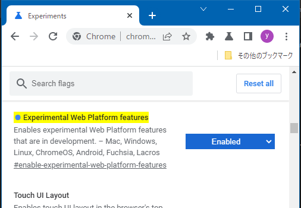

# CSS Scroll-Timeline

現在のWebサイトではスクロールに応じたアニメーションがいたるところに散りばめられています。一番ありがちな例で言うと、要素が画面に表示された時にふわっと浮き出てくる「アレ」です。フェードインと呼ばれることが多いかも知れません。

フェードインのアニメーション自体はCSSで実装可能ですが、「要素が画面に表示された時」というタイミングでアニメーションを発動させるにはJavaScriptの力を使う必要があります。具体的に言うと[Intersection Observer API](https://developer.mozilla.org/ja/docs/Web/API/Intersection_Observer_API)で要素がビューポートと交差するかを監視する、などの方法が考えられます。

しかし、これをCSSのみで実現できる[@scroll-timeline](https://drafts.csswg.org/scroll-animations/#scroll-timeline-at-rule)（以下、Scroll Timeline）が提案されています。今回の記事ではこのScroll Timelineについて学習します。

具体的には、以下のページのようなアニメーションがCSSのみで実装できるようになります。

より正確にいうならば、「スクロール量に応じてアニメーションを進行させる」ことができます。

なお、Scroll Timelineが定義されている[Scroll-linked Animations](https://drafts.csswg.org/scroll-animations/)は、まだEditor's Draftの段階であり、どのブラウザーも正式にサポートしていません。しかし、Google Chrome、Microsoft Edge、Operaではflagsを有効にすることでこの機能を実験的に使用することができます。

## 機能を有効にする

Scroll Timelineが使用できるように、まずはブラウザーで実験的な機能を有効にする必要があります。Chromeを使用している方はアドレスバーに「chrome://flags/#enable-experimental-web-platform-features」と入力して下さい。Edgeの方も「edge://flags/#enable-experimental-web-platform-features」と入力します。Operaの方はすみませんがネットで検索してみてください。

「Experimental Web Platform features」がDisabledになっていると思われますので、**Enabled**に変更します。

