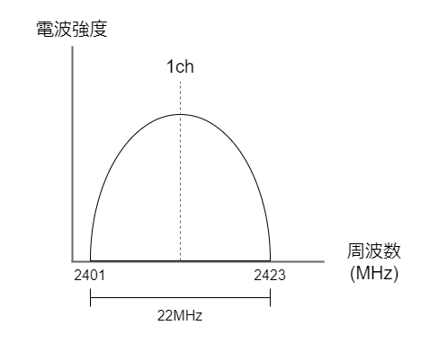
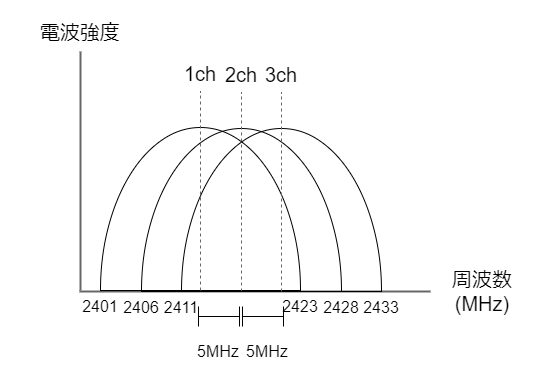

# 無線LANの基礎を学ぶ

コーディングが嫌になった時、逃げ道としてネットワークやセキュリティの勉強をしています。そういえば無線LANって表面的な事しか知らないなーって思い、改めて勉強することにしました。

## IEEE802.11とは

無線LAN界隈でよく出てくる`IEEE802.11`についての解説です。

IEEE802.11とは、技術標準化機構であるIEEEが無線LAN向けに制定した規格です。なお、IEEE802は**ネットワーク関係の規格**を定めており、IEEE802.3は皆お馴染みイーサネットについて、IEEE802.15はWPAN（例えばBluetoothもここに含まれる）について、IEEE802.1Qは知ってる人は知ってるVLANについて、といった具合です。

無線LANを対象にしているIEEE802.11はさらにいくつかの規格に分かれています。規格が制定された順番に、代表的なものを抜き出してみました。

|規格名|周波数帯|チャネル幅|理論上の最高速度|
|---|---|---|---|
|IEEE802.11|2.4GHz|22MHz|2Mbps|
|IEEE802.11b|2.4GHz|22MHz|22Mbps|
|IEEE802.11g|2.4GHz|20MHz|54Mbps|
|IEEE802.11n|2.4GHz / 5GHz|20MHz / 40MHz|600Mbps|
|IEEE802.11ac|5GHz|160MHz|6.93Gbps|
|IEEE802.11ax|2.4GHz / 5GHz|20 / 40 / 80 / 160MHz|9.6Gbps|

## チャネル

上記表にある通り、現在、無線LANは基本的に2.4GHz帯、5GHz帯のどちらかを使用しています。この周波数帯をさらに一定の周波数帯毎に細分化したものを**チャネル**といいます。通信を行う端末同士は、同じチャネルに接続している必要があります。

### IEEE802.11b

まず、IEEE802.11bを例にとって、チャネルがどのようなものなのかを見ていきましょう（他の規格も似たようなものです）。このIEEE802.11bは2.4GHzを周波数帯として利用し、1つのチャネルは**22MHz**のチャネル幅を取ります。

<aside>

現在の無線LAN環境において、IEEE802.11bはほとんど使用されていません。しかし、以降の規格のベースとして紹介します。

</aside>

IEEE802.11bは2,401MHzから2,484Mhzまでをさし、これを22MHzごとにわけると14のチャネルができることになります。表にすると以下のようになります。

|チャネル|中心周波数(MHz)|周波数帯(MHz)|
|---|---|---|
|1ch|2412|2401 - 2423|
|2ch|2417|2406 - 2428|
|3ch|2422|2411 - 2433|
|4ch|2427|2416 - 2438|
|5ch|2432|2421 - 2443|
|6ch|2437|2426 - 2448|
|7ch|2442|2431 - 2453|
|8ch|2447|2436 - 2458|
|9ch|2452|2441 - 2463|
|10ch|2457|2446 - 2468|
|11ch|2462|2451 - 2473|
|12ch|2467|2456 - 2478|
|13ch|2472|2461 - 2483|
|14ch|2484|2473 - 2495|

各チャネルは5MHzずつ離れていて、いくつかのチャネルとは重複が発生することが分ります（14chだけは12MHz離れています）。

重複が発生しないようにチャネルを選択すると、以下の4つのチャネルを利用することができます。

## 参考

[無線LAN - チャネルとは](https://www.infraexpert.com/study/wireless3.html)

[IEEE802.11ax(Wi-Fi 6/6E)のはなし｜Wireless・のおと｜サイレックス・テクノロジー株式会社](https://www.silex.jp/blog/wireless/2021/10/ieee80211axwi-fi-66e.html)

[【図解/初心者向け】無線LAN(wifi)の仕組みと基礎/原理～規格の歴史,種類,速度について～ | SEの道標](https://milestone-of-se.nesuke.com/nw-basic/wireless/wifi-summary/)

[無線LANよろず講座｜無線LANのチャンネルの割り当て方](http://musenlan.biz/blog/522/)

[クライアントマシンで無線空間のパケットキャプチャを取得する - Cisco Meraki](https://documentation.meraki.com/MR/Monitoring_and_Reporting/CapturingWirelessTraffic_from_a_Client_Machine_jp)

[IEEE802.11 無線LAN(Wi-Fi)規格 | 無線LANの仕組み | ネットワークのおべんきょしませんか？](https://www.n-study.com/wlan-detail/802-11-standard/)

[ASCII.jp：11gと11bを同じチャネルで使うと本当に干渉するのか (1/2)](https://ascii.jp/elem/000/000/562/562260/)

[無線LANのチャンネルとはどんな意味？ | 日経クロステック（xTECH）](https://xtech.nikkei.com/it/pc/article/NPC/20070619/275122/)

[WiFiのチャンネルとは？特徴や変更方法をわかりやすく解説 - FUJIログ通信](https://fuji-wifi.jp/column/?p=5881)

[電波とは | 無線通信の基礎 －無線はむずかしい？－ | TechWeb](https://techweb.rohm.co.jp/product/wireless/wireless-communication/wireless-communication-basic/37/)

[IEEE 802.11acの次は？ | IoT](http://iot-jp.com/iotsummary/iottech/wifi/ieee-802-11ac%E3%81%AE%E6%AC%A1%E3%81%AF%EF%BC%9F/.html)

[＜IEEE 802.11beとは？＞Wi-Fi 7（仮称）は30ギガ＋低遅延で5Gと相互補完 | ビジネスネットワーク.jp](https://businessnetwork.jp/Detail/tabid/65/artid/8710/Default.aspx)
