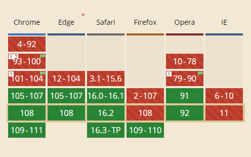

# 対応完了間近の`@container`

CSSの新しいクエリーであるContainer Query（`@container`）ですが、2023年1月現在、Firefoxを除く主要ブラウザーで使用できるようになっています。Firefoxもバージョン108からは対応されているようですので、実践投入できるタイミングも近づいてきたように思います。

ブラウザーのビューポートのサイズではなく、コンテナー（≒親要素）のサイズによって変更できます。

https://www.w3.org/TR/2022/WD-css-contain-3-20220818/