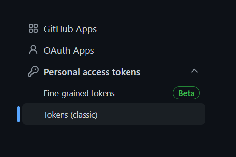

# Next.js 13を使ってみたメモ

昨年、[Next.js 13がリリースされました](https://nextjs.org/blog/next-13)。

どうやらコンポーネントからReact Hooksの`use`フックを使ってデータフェッチができるらしいのでやってみました。

具体的には、コンポーネント内でApollo Clientを使い、Github APIからコントリビューションデータを取得する、です。

やることリストは

1. WSLのUbuntu上でnodenvを使い、Next.13をインストールする
2. Apollo Clientを使い、コンポーネント内でGitHub APIからデータをフェッチする
3. Vercelにデプロイする

です。

とりあえずやってみただけなので、メモの要素が強いです。Next.jsに関係ないこともメモしています。

環境は以下の通りです。

- Ubuntu 20.08 (WSL)
- Node.js 18.0.0(nodenv)
- Next.js 13.0.6
- @apollo/client 3.7.1

## 環境構築

まずはGithubで新しいリポジトリーを作成し、Ubuntu上でクローンします。

```shell:title=Ubuntu
$ git clone https://github.com/kento-yoshidu/Next13-test.git
Cloning into 'Next13-test'...
remote: Enumerating objects: 3, done.
remote: Counting objects: 100% (3/3), done.
Unpacking objects: 100% (3/3), 600 bytes | 120.00 KiB/s, done.
remote: Total 3 (delta 0), reused 0 (delta 0), pack-reused 0
```

### nodenvでNode.jsのバージョンを指定する

恥ずかしながら、Nodenvを最近使いだしたので使い方をメモしておきます😂。

現在インストールされているバージョンは`nodenv versions`で確認できます。

```shell:title=Ubuntu
$ nodenv versions
* system (set by /home/user/.anyenv/envs/nodenv/version)
  18.0.0
```

`nodenv local <バージョン>`とすることで、`.node-version`が作成され、ローカル環境のみにNode.jsのバージョンが適用されます。

```shell:title=Ubuntu
$ nodenv local 18.0.0

$ cat .node-version
18.0.0

$ node -v
v18.0.0
```

また、`nodenv global <バージョン>`とすることで、グローバルにバージョンを適用させることができます。

```shell:title=Ubuntu
$ nodenv global 18.0.0
```

### Next.jsをインストールする

実験的な機能を含むNext.jsは`npx create-next-app@latest --experimental-app`でインストールします。コマンドを実行するとプロジェクト名やTypeScriptを使うかどうかを聞かれますので、適宜答えます。

<aside>

もしくは`yarn create next-app --experimental-app`か`pnpm create next-app --experimental-app`を実行します。

</aside>

```shell
$ npx create-next-app@latest --experimental-app
Need to install the following packages:
  create-next-app@latest
Ok to proceed? (y) y
✔ What is your project named? … next13
✔ Would you like to use TypeScript with this project? … No / Yes
✔ Would you like to use ESLint with this project? … No / Yes
Creating a new Next.js app in /home/user/workspace/next13/next13.

Using npm.

Installing dependencies:
- react
- react-dom
- next
- typescript
- @types/react
- @types/node
- @types/react-dom
- eslint
- eslint-config-next


added 251 packages, and audited 252 packages in 43s

86 packages are looking for funding
  run `npm fund` for details

found 0 vulnerabilities

Initializing project with template: app

Success! Created next13 at /home/user/workspace/next13/next13
```

フォルダー構成は以下のようになっています。`app/`の中でルーティングされるように変更されてます。



## APIを叩く準備

### Apollo Clientをインストール

```shell:title=Ubuntu
$ npm i @apollo/client

added 14 packages, and audited 266 packages in 5s

86 packages are looking for funding
  run `npm fund` for details

found 0 vulnerabilities
```

### .envを用意

## コンポーネントを作成する

`components/Contributions.tsx`を作成します。

```tsx:title=components/Contributions.tsx
const Contributions = () => (
  <h1>Contributions</h1>
)

export default Contributions
```

データは以下のようにフェッチします。


