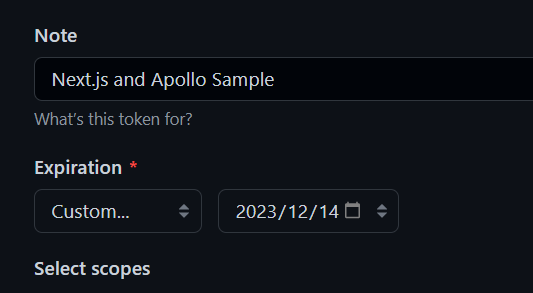
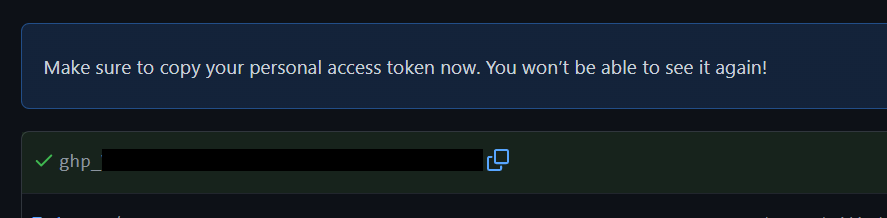

ページ下部の「Generate token」をクリックします。

例によって1度しか表示されませんので、ちゃんとコピーしておきます。

残しておいてもいいことがないので、演習が終わったら削除しましょう。再度必要になったときに再取得すればOKです。

## 環境変数の設定

ルートディレクトリーに`.env.development.local`を作成します。このファイルの中に環境変数を設定します。変数名は`NEXT_PUBLIC_GITHUB_TOKEN`とします。今回はコンポーネント（クライアント側）から環境変数を呼び出すので、`NEXT_PUBLIC`を先頭に付ける必要があります。

恐らく問題ないと思いますが、`.gitignore`に`.git.development.local`が記載されていて、間違ってGitのステージングに上げられないかを確認しておいてください。