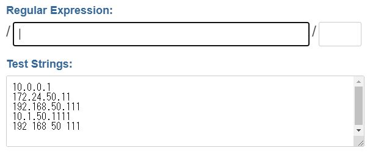
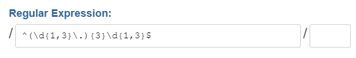
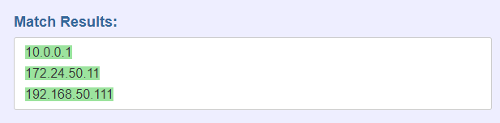

# 正規表現を覚えよう

## 正規表現に便利なWebサイト

JavaScriptのコードを書いて正規表現を勉強するのもいいですが、Webサイトを利用すればより視覚的に分かりやすく正規表現を学ぶことができます。

画面、機能ともにシンプルという理由で、このシリーズでは以下のサイトを利用します。

https://scriptular.com/

例題として、IP v4アドレスを取り上げます。

```
10.0.0.1
172.24.50.11
192.168.50.111
10.1.50.1111
192 168 50 111
```

上記のように、5つのIPアドレスっぽい文字列を用意します。しかしよく見ると、IPアドレスではないものが混じっています。上から4つ目は第4オクテットが`1111`と4桁になっています。また、上から5つ目は`.`ではなく半角スペースが使用されています。

このような文字列が数百、数千と並んでいる状況を想像してみましょう。IPアドレスとして正しいかを目視で判定していくのは無理がありますね。こんな時は正規表現を使用すれば一発です。

まずは「Test Strings:」の欄に上記の文字列を入力します。



次に「Regular Expression:」欄に以下の正規表現を入力します。

```js
^(\d{1,3}\.){3}\d{1,3}$
```



すると、「Match Results:」の欄に入力した正規表現にマッチした行だけが表示されるようになります。



<adide>

上記の正規表現は正確にIPアドレスを判定するものではありません。例えば`999.999.999.999`という文字列もマッチすると判定してしまいます。

上記の正規表現は「3桁の数字の後に`.`が続くのが3つ、その後に3桁の数字が続くものにマッチする」という内容です。例題として参考程度でお願いします。

</aside>

JavaScriptであれば以下のようなサイトが利用できます。

### regex101: build, test, and debug regex

https://regex101.com/

私はいつもこのサイトを利用しています。JavaScriptの他にも、PHP、Python、Golang、Java、.NET C#にも対応しています。


「与えられた文字列が**IP v4アドレスであるかどうか**」を簡易的に調べる正規表現を書いてみます。

<aside>

いきなりこんなことを言うものなんですが、IPアドレスであるかを完璧に判定する正規表現は難解なものになり、少なくとも入門用に取り上げるものではありません。ですのでここでは簡易的に調べる方法を紹介するのみに留まります。

</aside>


## `\d`で数値を表す

`\d`は**1個の半角数値**を表します。

「TEST STRING」に`172.168.24.111`と入力し、「REGULAR EXPRESSION」には`\d`と入力します。

すると正規表現にマッチした部分（つまり、1個の半角数字）が全て青くマークされます。

1個の半角数値ですので、`0`から`9`までの数値が全て対象になります。例えば`999.357.964.800`といった、IP v4ではない文字列でもヒットします。あくまで「`数値3個`、`.`、`数値3個`、`.`、`数値3個`、 `.`、`数値3個`」の並びにヒットする正規表現です。

## 量指定子

## 文字クラス

[Aa]なら、`A`もしくは`a`がマッチします。例えば`[Cc]lass`とすれば、`Class`と`class`のどちらにもマッチします。

これは`C`ないし`c`がひとつある場合にマッチします。`CClass`や`lass`にもマッチさせたい場合には


